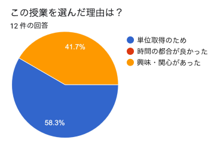
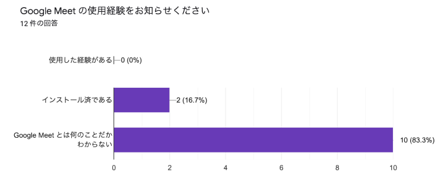
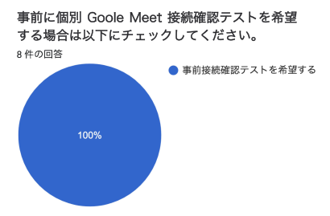
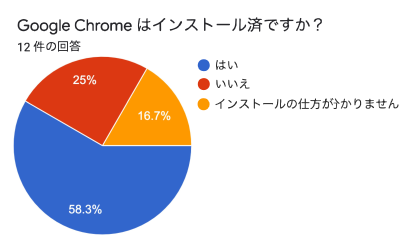
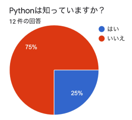
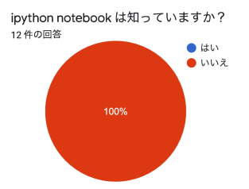
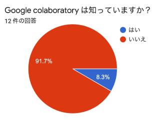

# [ディープラーニングの心理学的解釈 (心理学特講IIIA)](https://komazawa-deep-learning.github.io/)

<a href='mailto:educ0233@komazawa-u.ac.jp'>Shin Aasakawa</a>, all rights reserved. 
Date: 08/May/2020 
Appache 2.0 license 

### 授業概要
本授業では人工知能に用いられる技術の詳細を検討しながら，その心理学的意味を考えることにします。最終的な目標としては人間と機械の２つ知性はどうすれば構成可能であるかを議論するための素地を提供することを目指します。自動運転が可能となり，[囲碁の世界チャンピオンを破り](https://deepmind.com/research/alphago/)，自動翻訳の精度が向上し，スマートスピーカーが普及するなど AI 技術は毎日のように報道されています。
これらの技術はニューラルネットワークモデルに基づいています。とりわけディープラーニング(深層学習)技術は現在の人工知能の根幹をなしています。現在は第 3 次ニューラルネットワークブームと呼ばれますが 3 度のブーム
とも心理学者が火付け役でした。2014年から始まった現在のブームも心理系出身の研究者
が先導しました。加えて[ディープマインド](https://deepmind.com/){target="_blank"} の共同創設者[デミス・ハサビス](https://twitter.com/demishassabis){target="_blank"} は認知科学出です。
このように人工知能と心理学とは同じことを別の側面から理解しようとしているとさえ言
えます。このような背景を考慮すれば知的活動の解明を目標とする諸分野において心理学
学徒の貢献が期待されていると考えます。

### 授業の到達目標
深層学習(ディープラーニング)についての基礎的事項を理解することを目標とします。

### 講師紹介

 
**師匠エルマンとUCSDのキャンパスにて**

東京女子大学情報処理センター勤務。
早稲田大学在学時はピアジェの発生論的認識論に心酔する。
卒業後エルマンネットの考案者ジェフ・エルマンに師事，薫陶を受ける。
以来人間の高次認知機能をシミュレートすることを通して知的であるとはどういうことかを考えていると思っていた。
著書に [_Pythonで体験する深層学習_](http://www.coronasha.co.jp/np/isbn/9784339028515/) ([コロナ社](http://www.coronasha.co.jp/np/index.html),  2016)，[_ディープラーニング，ビッグデータ，機械学習あるいはその心理学_](https://www.shin-yo-sha.co.jp/mokuroku/books/978-4-7885-1422-5.htm) ([新曜社](https://www.shin-yo-sha.co.jp/), 2015)，_ニューラルネットワークの数理的基礎_, _脳損傷とニューラルネットワークモデル，神経心理学への適用例_ いずれも守一雄他編,[_コネクショニストモデルと心理学_](http://www.kitaohji.com/books/2219_1.html)(2001)[北大路書房](http://www.kitaohji.com/)など

### 個人的関心事
1. リカレントニューラルネットワーク
2. 発達
3. 神経心理学
4. 意味
5. マルチモーダル学習
6. 転移学習，ワンショット学習，マルチタスク学習，メタ学習

### 宣伝

- [第9回CPU大賞【書籍部門】（2018年度）発表！](http://www.computerbook.jp/archive/detail/5823){target="_blank"}
<!--- [同記事の読売新聞プレスリリース](https://yab.yomiuri.co.jp/adv/life/release/detail/00066598.html)-->

### 準備学習

人間や機械の知性に興味があることが求められます。
事前知識は必要としません。
心理学で使われている統計的推論の概要を知っていると良いとは思われますが，必要な知識では ありません。

### 履修上の留意点等

履修制限は設けません。
どなたでも履修できます。
授業中に検索したり資料を閲覧するために，可能な限り PC を持参してください。
スマートフォンでは代用が難しい場合があります。

## Q and A

1. ディープラーニング(深層学習)って何ですか？
    - 現代的なニューラルネットワークの手法で大流行しています。ほとんどの AI はこの技術を使っています。
1. 楽勝科目ですか？それともガチ科目ですか？
    - これから決めます。理想は面白い科目です。
1. 数学オンチなのですが
    - 数学を求めてはいません
1. プログラムができる必要がありますか？
    - できた方が良いですが，必要要件とはしません。
1. ノートパソコンを持ってきた方が良いですか？
    - できれればそうしてください。でもなくても構いません
1. 履修登録しないでモグることはできますか？
    - はい。問題ありません。歓迎します。
1. 就職の役に立ちますか？
    - 絶対に役立ちます！ たとえば
1. これは心理学なのでしょうか？
    - これが心理学であり，認知科学でもあり，人工知能でもあります。現代的な認識論の形です

## 教科書/テキスト

Web 上で公開予定です。各自でダウンロードするなどしてください。

## 参考書
- [ディープラーニング、ビッグデータ、機械学習 あるいはその心理学](https://www.shin-yo-sha.co.jp/mokuroku/books/978-4-7885-1422-5.htm){target="_blank"} (新曜社, 2014)
- [Python で体験する深層学習](http://www.coronasha.co.jp/np/isbn/9784339028515/){target="_blank"} (コロナ社, 2016)
- [人工知能学大事典](https://www.kyoritsu-pub.co.jp/bookdetail/9784320124202){target="_blank"} （人工知能学会編、共立出版 2017)
- [深層学習教科書 ディープラーニング G 検定(ジェネラリスト) 公式テキスト](https://www.shoeisha.co.jp/book/detail/9784798157559)（監修：日本ディープラーニング協会, 共著, 翔泳社, 2018）

## 関連企業
- [日本ディープラーニング協会](https://www.jdla.org/membership/){target="_blank"}
- [GAUSS](https://gauss-ai.jp/about/){target="_blank"}
- [Exawizards](https://exawizards.com/team/advisor){target="_blank"}
- [Starndard](https://ai-std.standard2017.com){target="_blank"}

	 =
	 =
	 =
	

## 関係する(かも知れない)科目

- 072001 / 学習・言語心理学（学習）久保 尚也先生 火曜4時限前期
- 072051 / 学習・言語心理学（言語）久保 尚也先生 火曜4時限後期
- 071501, 071601 / 心理学実験Ⅰ  火曜日 2 時限前期
- 071551, 071651 / 心理学実験Ⅱ 火曜日 2 時限後期
- 074901 / 情報処理ⅡＡ 火曜日 2 時限前期 堀内正彦先生
- 074951 / 情報処理ⅡＢ 火曜日 2 時限後期 堀内正彦先生
- 072301 / 神経・生理心理学 水曜日 3 時限 岩城達也先生
- 072401 / 知覚・認知心理学（知覚）水曜日 4時限 佐藤理晴先生
- 072451 / 知覚・認知心理学（認知）水曜日 4時限 佐藤理晴先生
- 070901 / 心理学概論Ⅰ 前期 木曜日 1時限 岩城達也先生
- 072601 / 心理学実験演習ⅠＡ 前期 木曜日 1時限 白間綾先生
- 072651 / 心理学実験演習ⅠＢ 後期 木曜日 1時限 白間綾先生
- 072801 / 心理学実験演習ⅢＡ前期 木曜日 3時限 堀直人先生
- 072851 / 心理学実験演習ⅢＢ 前期 木曜日 3時限 堀直人先生

## 評価
駒澤大学に提出したシラバスには次のように書きました

- 60% 試験
- 20% レポート
- 20% 小テスト

## ルール

授業妨害・プライバシー侵害を招く恐れのある以下のような行為を禁止します。これらは 不正行為 であり，罰せられることがあります。

- 受講者相互の ID やパスワードを受講していない他者と共有すること
- 担当教員と出席者の許可なく写真や動画等で撮影・録画・録音して，SNS などで共有すること
- 配布された資料等を担当教員の許可なく，履修者以外に再配布・共有すること

- オンライン授業中は，マイクのオン，オフをできるようにしておいてください。
授業担当者からの質問にいつでも答えられるよう準備してください。

## 事前アンケート集計

	 
	 
	 
	 
	 
	 
	 
	 

