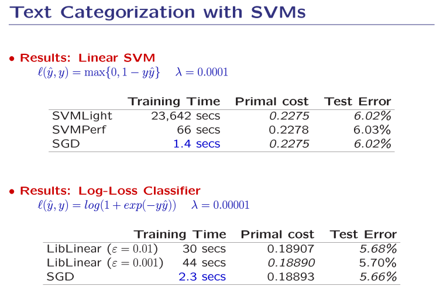

<<<<<<< HEAD
# ディープラーニングの心理学的解釈 (心理学特講IIIA)
=======
# [ディープラーニングの心理学的解釈 (心理学特講IIIA)](https://komazawa-deep-learning.github.io/2021){:target="_blank"} 
>>>>>>> 4a7765a869c2d07b7a5e3b661e5f9c7368508eef

<a href='mailto:educ0233@komazawa-u.ac.jp'>Shin Aasakawa</a>, all rights reserved. 
Date: 17/Apr/2021 
Appache 2.0 license 

# 本日のキーワード

<!--
- 訓練データ，テストデータ，検証データ
- ニューラルネットワーク neural networks
- パーセプトロン perceptron 
- 畳み込みニューラルネットワーク convolutional neural netoworks
- レティノトピー retinotopy, トノトピー tonotopy, ソマトピー somatopy, 
-->

- 固有値
- 変分法
- tSNE
- ロジスティック回帰
- シグモイド関数
- ソフトマックス関数
- 交差エントロピー cross entropy
- 確率的勾配降下法 stochastic gradient descent methods
- サポートベクトルマシン
- 多層パーセプトロン  
- 勾配降下法 gradient descent methods
<<<<<<< HEAD
<!-- 
- 誤差逆伝播法 error back propagation 
- 損失関数 loss functions, 誤差関数 error functions, 目的関数 objective functions, 目標関数 target functions
-->

<!-- # [ディープラーニングの心理学的解釈 (心理学特講IIIA)](https://komazawa-deep-learning.github.io/2021){:target="_blank"} -->

=======

<!-- 
- 誤差逆伝播法 error back propagation 
- 損失関数 loss functions, 誤差関数 error functions, 目的関数 objective functions, 目標関数 target functions

-->

>>>>>>> 4a7765a869c2d07b7a5e3b661e5f9c7368508eef
* [実習 ](https://colab.research.google.com/github/komazawa-deep-learning/komazawa-deep-learning.github.io/blob/master/notebooks/2021_0514komazawa_3mnists.ipynb){:target="_blank"}

<<<<<<< HEAD
## 一 (イチ) アルゴリズム仮説 One algorithm hypothesis
=======
### 一 (イチ) アルゴリズム仮説 One algorithm hypothesis
>>>>>>> 4a7765a869c2d07b7a5e3b661e5f9c7368508eef
Sur ら (1988) は，フェレット（西洋イタチ）の 聴覚信号と視覚信号との中継核，膝状体 で信号を入れ替える実験を行った。
すなわち，聴覚信号が視覚野へ入力され，逆に視覚信号が聴覚野への入力となるように外科手術を行った。
結果，本来聴覚信号を処理すべき聴覚野ニューロンでは，視覚刺激に応答する反応が観察され，
本来視覚信号を処理すべき視覚野ニューロンでは，聴覚刺激に応答する反応が観察された。

  

   
    
    

  実験の概略 Sur (1988) Fig. 1 
    
  
  

  

     
    

聴覚視床への実験的に誘導された網膜投影（ハッチングされた領域）および聴覚視床と聴覚皮質の接続。
手術した半球とは反対側の眼は、生き残っている背側LGN（LGd）と腹側LGN（LGv）、およびMGNの背側と腹側の区画内のパッチ（それぞれMGdとMG）に投影する。
視床の傍矢状切片を番号付きで示す。視床の傍矢状切片の 同じ動物に、一次聴覚野（Al）にHRPを注入した場合（注入部位は左上に示す）、細胞が充填される。
ドットで示されている）MG "MGdでは逆行性に、MGvでは後遺症複合体の側方分裂（P01）が行われている。MGdとMGvの多くの細胞が網膜突起帯を覆っている。 
Sur (1988) Fig. 2
    

  

  

   
  

  結果: Sur (1988) Fig. 4 
  

<<<<<<< HEAD

=======
>>>>>>> 4a7765a869c2d07b7a5e3b661e5f9c7368508eef
#### その他の文献

- Metin and Frost (1989) Visual responses of neurons in somatosensory cortex of hamsters with experimentally induced retinal projections to somatosensory thalamus
- Roe et al. (1992) Visual Projections Routed to the Auditory Pathway in Ferrets: Receptive Fields of Visual Neurons in Primary Auditory Cortex

<<<<<<< HEAD

## <a name="ema">江間先生からの情報</a>
=======
## 機械学習 2

先週は 教師あり学習として，線形回帰，教師なし学習として 主成分分析を取り上げました。
今週は，その続きです。

- 変分法 (variational method)，変分問題: 制約付き最適化。
先週は，主成分分析の解法としての固有値問題 と 力学，とりわけ，惑星の運行に関して紹介しました。
物理学における 最小作用の原理 (ウィキペディアから引用:
物理学における最大の指導原理の一つであり、電磁気学におけるマクスウェルの方程式や相対性理論におけるアインシュタイン方程式ですら、対応する作用の極小条件から導かれる。また、量子力学においても、この法則そのものは、ファインマンの経路積分の考え方によって理解できる。
) と関連します。
また，固有値問題は，量子力学における シュレディンガー方程式 ，<!-- $\hat{H}\Psi=E\Psi$ --> にも出てくる。
惑星の運行と 量子軌道に関する確率とが結びつくという，奇々怪々 な一致があります。
しかも，心理学やニューラルネットワークでも使われる。
もはや，数学を使って分析するとか，理解するとかではなく，この宇宙はすべて数学なのではないか とさえ思えてくる$\ldots$
- ロジスティック回帰: 回帰と名がつくが，分類問題を解くための手法。出力を確率と仮定して シグモイド関数 (logistic sigmoid functions) を用いる。
- シグモイド関数: $f(x) = \left( 1 + e^{-x}\right)^{-1}$ 連続量を確率的判断に変換する。すなわち 2 値 true or false, head or tail, $p$ or $1-p$ など。
ニューラルネットワークでは伝統的に用いられてきた経緯がある。
理由は，微分が極端に簡単になることが挙げられる。
駄菓子菓子，現在では ハイパータンジェント tanh や，整流線形関数 ReLU (Recutified Linear Unit) が用いられる場合が多い。
理由は，勾配消失問題 (今回は触れない) 対策のため。
- ソフトマックス関数 (softmax function): 多値分類に用いられる。物理学のボルツマン分布，エネルギー関数と式としては同一。

$$
f(x_i)=\frac{e^{x_i}}{\sum e^{x_i}}
$$

左辺 LHS の 分母 the denominator は，分配関数 partition function と呼ばれる。

- 交差エントロピー損失: エントロピー $- p\log p$ は，熱力学と情報論とで用いられる概念。熱力学の第二法則，時間の矢 に関連。情報理論では，情報量の定義。
機械学習では，分類問題の損失関数として頻用される。$-\left(t \log p + (1-t) \log(1-p)\right)$
- [次元圧縮 t-SNE](https://komazawa-deep-learning.github.io/t-SNE/){:target="_blank"} 2008 年の提案以来，よく見かけるようになった次元圧縮手法。
- サポートベクターマシン: ウラジミール・ヴァプニク(Vapnik) による 教師あり学習 (Vapnik 1999, 1998).
ディープラーニング以前に主流であった。
2 群分類で特徴を最もよく (マージン最大化) 分離する境界面決定アルゴリズム。
カーネルトリック，スラック変数の導入。線形回帰，線形判別に比べて性能が出ると考えられていた。今でも，最終層における判別に応用されることがある。
カラス=クーン=タッカー条件(KKT Karush-Kuhn-Tucker condition)を ラグランジェ未定乗項 Lagrange's multpliers 付きで解く

 
出典: scikit-learn マニュアル

- 確率的勾配降下法 SGD: stochastic gradient descent methods. Bottou ら (2007) によって導入された機械学習における学習法の工夫の一つ。
ミニバッチの導入を特徴とする。
オンライン学習とバッチ学習の中間で，学習データをランダムサンプリングして学習に用いる。
精度改善の手法ではないが，計算時間の削減に貢献。ビッグデータの使用を前提とする現代的な実用手段

- 多層パーセプトロン MLP: multi-layer perceptron: 

#### 付録 読み物
- [ジェフェリー・ヒントンのマクセル賞受賞記念講演(2016)](https://komazawa-deep-learning.github.io/Hinton_Maxwell_award/){:target="_blank"}

<!-- - [データサイエンス小史](https://komazawa-deep-learning.github.io/data_science/){:target="_blank"}
- [数式の読み方](https://komazawa-deep-learning.github.io/how_to_read_math/){:target="_blank"}
-->
- 苦い教訓
    - [Sutton のブログ，苦い教訓](https://komazawa-deep-learning.github.io/2019Sutton_Bitter_Lesson/){:target="_blank"} <!--(../2019sutton_bitter_Lesson.pdf)-->
    - オリジナル Sutton's blog [bitter lesson](http://www.incompleteideas.net/IncIdeas/BitterLesson.html){:target="_blank"}
<!--, [その和訳](2019sutton_bitter_lesson.pdf)-->

<!--
  - In computer vision, there has been a similar pattern. Early methods conceived of vision as searching for edges, or generalized cylinders, or in terms of SIFT features. But today all this is discarded. Modern deep-learning neural networks use only the notions of convolution and certain kinds of invariances, and perform much better.
  - This is a big lesson. As a field, we still have not thoroughly learned it, as we are continuing to make the same kind of mistakes. To see this, and to effectively resist it, we have to understand the appeal of these mistakes. We have to learn the bitter lesson that building in how we think we think does not work in the long run. The bitter lesson is based on the historical observations that 1) AI researchers have often tried to build knowledge into their agents, 2) this always helps in the short term, and is personally satisfying to the researcher, but 3) in the long run it plateaus and even inhibits further progress, and 4) breakthrough progress eventually arrives by an opposing approach based on scaling computation by search and learning. The eventual success is tinged with bitterness, and often incompletely digested, because it is success over a favored, human-centric approach. 
-->

#### 付録 2. <a name="ema">江間先生からの情報</a>
>>>>>>> 4a7765a869c2d07b7a5e3b661e5f9c7368508eef

* 1月人工知能学会の「AI原則から実践へ」の原文公開
人工知能学会誌vo;. 36, No.2 (2021年3月号）に掲載された原稿の原文を公開しました。日本語は有料ですが、英語は無料でご覧になれます。<https://ifi.u-tokyo.ac.jp/project-news/9750/>
海外から日本はどのようにみられているのかに加えて、「包摂性の錯覚」「罪を隠す煙幕としてのAI倫理」など実際に、AI原則を実践に落とし込むときに考慮すべき点について（若干、私自身にとって耳の痛い点も含め）紹介されています。
また今回の特集は、執筆者は全員女性となっています。

* [AINOW にインタビューも掲載していただきました](https://ainow.ai/2021/04/27/254887/){:target="_blank"}
* [IFI ツイッターでも広報しています](https://twitter.com/UTokyoIFI){:target="_blank"}
* 国連軍縮部（UNODA）とのワークショップ報告公開
	2月に行った顔認証をテーマとした学生ワークショップ報告が [日本語](https://doi.org/10.11517/jjsai.36.3_342){:target} と [英語](https://ifi.u-tokyo.ac.jp/project-news/9749/){:target="_blank"} でご覧になれます。

ワークショップで用いたシナリオなどもウェブサイトで公開しております。このような議論ができる場を増やしていきたいと思います。

* 3月フランスEHESSとの「AIと民主主義」報告書公開
  * [日本語](https://ifi.u-tokyo.ac.jp/event/9304/){:target="_blank"}
  * [英語](https://ifi.u-tokyo.ac.jp/en/event/8732/){:target="_blank"}

パリ 第 8 大学の ヌロック 教授が指摘した、AI が出す結果を事実 → 客観 → 公平とみなしてしまうことの危険性を私たちは、もっと議論していかなければならない、と思います。

* 人工知能学会倫理委員会シンポジウム
「AI 研究コミュニティのダイバーシティ＆インクルージョン」報告書では日本としても今後取り組んでいかなければならない課題が多く指摘されています。http://ai-elsi.org/archives/1144

<!-- 
- [本日の課題 ](https://github.com/komazawa-deep-learning/komazawa-deep-learning.github.io/blob/master/notebooks/2020_0522komazawa_homework.ipynb){:target="_blank"}

# クイズの答え: 

- ANN: 人工ニューラルネットワーク Artificial Neural Networks
- BNN: 生物学的ニューラルネットワーク Biological Neural Networks
- CNN: 畳み込みニューラルネットワーク Convolutional Neural Networks
- DNN: 深層ニューラルネットワーク Deep Neural Networks

# 小ネタ
- ANN, BNN, CNN, DNN は冗談です。
この分野以外では，もちろん ANN は オールナイトニッポンであったり，BNN はブルームバーグニュースネットワークだったり，
CNN はケーブルニュースネットワークだったりします。 DNN は市民権を得てきた感があるので ディープニューラルネットワークで良いでしょう

- colab に自分のためののコメントを書くために markdown の書式を覚えておいた方が良いです。(補講で少し取り上げました)
- 最先端の話をしています。画像処理が人間を超える性能を示すようになったから，最近の AI ブームがあります。
これは，第二回の授業でも取り上げました。だからこそ，この授業があります。干からびた化石のような知識を教えるつもりはありません。
<<<<<<< HEAD
-->

- [ジェフェリー・ヒントンのマクセル賞受賞記念講演(2016)](https://komazawa-deep-learning.github.io/Hinton_Maxwell_award/){:target="_blank"}
- [次元圧縮 t-SNE](https://komazawa-deep-learning.github.io/t-SNE/){:target="_blank"}

<!-- - [データサイエンス小史](https://komazawa-deep-learning.github.io/data_science/){:target="_blank"}
- [数式の読み方](https://komazawa-deep-learning.github.io/how_to_read_math/){:target="_blank"}
-->
- 苦い教訓
    - [Sutton のブログ，苦い教訓](https://komazawa-deep-learning.github.io/2019Sutton_Bitter_Lesson/){:target="_blank"} <!--(../2019sutton_bitter_Lesson.pdf)-->
    - オリジナル Sutton's blog [bitter lesson](http://www.incompleteideas.net/IncIdeas/BitterLesson.html){:target="_blank"}
<!--, [その和訳](2019sutton_bitter_lesson.pdf)-->

<!--
  - In computer vision, there has been a similar pattern. Early methods conceived of vision as searching for edges, or generalized cylinders, or in terms of SIFT features. But today all this is discarded. Modern deep-learning neural networks use only the notions of convolution and certain kinds of invariances, and perform much better.
  - This is a big lesson. As a field, we still have not thoroughly learned it, as we are continuing to make the same kind of mistakes. To see this, and to effectively resist it, we have to understand the appeal of these mistakes. We have to learn the bitter lesson that building in how we think we think does not work in the long run. The bitter lesson is based on the historical observations that 1) AI researchers have often tried to build knowledge into their agents, 2) this always helps in the short term, and is personally satisfying to the researcher, but 3) in the long run it plateaus and even inhibits further progress, and 4) breakthrough progress eventually arrives by an opposing approach based on scaling computation by search and learning. The eventual success is tinged with bitterness, and often incompletely digested, because it is success over a favored, human-centric approach. 
=======
>>>>>>> 4a7765a869c2d07b7a5e3b661e5f9c7368508eef
-->
