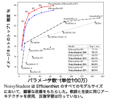
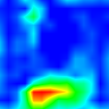
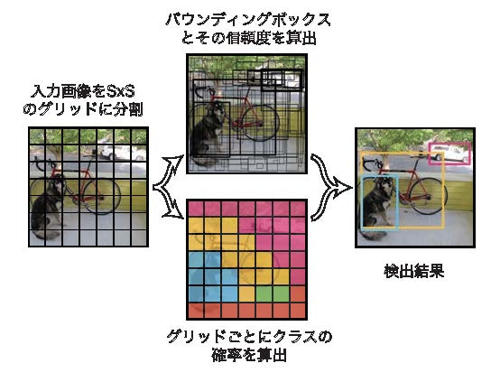
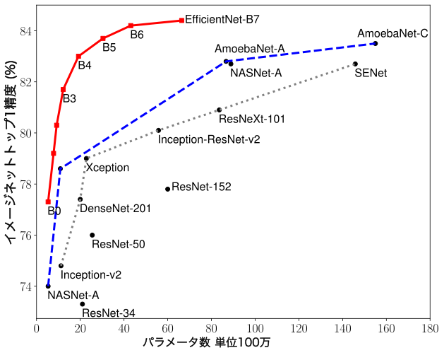
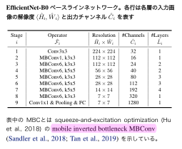

# ディープラーニングの心理学的解釈 (心理学特講IIIA)

<a href='mailto:educ0233@komazawa-u.ac.jp'>Shin Aasakawa</a>, all rights reserved. 
Date: 18/Jun/2021 
Appache 2.0 license 

# キーワード

- 自己教師あり学習 SSL: Self Supervised Learning
- 対比学習 CL: Contrastive Learning
- 転移学習 Transfer Learning
- ファインチューニング Fine Turing
- CAM: Class Associated Memory

     
    教師あり学習の SOTA (Xie 他, 2020, Fig. 2 を改変)

     
    対比学習 の SOTA (Jaiswal 他, 2020, Fig. 3 を改変)

# クラス活性化附置 CAM: Class Activation Mapping 

     
    Grad-CAM の概念図

### CAM の例 （正確には grad-CAM の例）

    
    
    
    

        左:入力画像, 中:ボクサーに対応するヒートマップ, 右:トラ猫に対応するヒートマップ
    

## 本日あまり触れない話題

- R-CNN によって，位置 where 情報と 物体 what 情報 とを多層畳み込みニューラルネットワークで表現する試みが，発展。実時間で物体の切り出しと認識とが行えるようになった。[Faster R-CNN](https://arxiv.org/pdf/1506.01497.pdf){:target="_blank"}, [YOLO](https://arxiv.org/pdf/1506.02640.pdf){:target="_blank"}, [SSD](https://arxiv.org/pdf/1512.02325.pdf){:target="_blank"},

     
    YOLO の概観

     
    EfficientNet のパラメータ数比較

     

- MobileNet, EfficientNet

- `/study/2020Tessellate-Imaging_Pytorch_Tutorial.git/E) RoadMap 5 - Data 2 - Transformations (General).ipynb`

- [PNT](https://colab.research.google.com/github/komazawa-deep-learning/komazawa-deep-learning.github.io/blob/master/2021notebooks/2021_0618pnt_transfer_learning.ipynb){:target="_blank"}
- [データ拡張](https://colab.research.google.com/github/ShinAsakawa/ShinAsakawa.github.io/blob/master/2021notebooks/2021_0617plot_transforms_demo.ipynb)

- [各画像の画面表示時に日本語キャプションを付与する準備 ](https://colab.research.google.com/github/project-ccap/ccap/blob/master/notebooks/2020importing_ccap_from_GitHub.ipynb){:target="_blank"}

- [本日の課題 ](https://colab.research.google.com/github/komazawa-deep-learning/komazawa-deep-learning.github.io/blob/master/notebooks/2020_0626homework.ipynb){:target="_blank"}

# 実習
- [word2vecの先週の再録 ](https://colab.research.google.com/github/komazawa-deep-learning/komazawa-deep-learning.github.io/blob/master/notebooks/2020_0619word2vec.ipynb){:target="_blank"}
- [BERT の注意の視覚化 ](https://colab.research.google.com/github/komazawa-deep-learning/komazawa-deep-learning.github.io/blob/master/notebooks/2020_0626BERT_head_view.ipynb){:target="_blank"}
- [日本語 BERT の実習 ](https://colab.research.google.com/github/komazawa-deep-learning/komazawa-deep-learning.github.io/blob/master/notebooks/2020_0624BERTja_test.ipynb){:target="_blank"}

## 雑談，余談

鳥の翼や羽の構造と空を飛ぶための仕組みの解明と飛行機との関係について。
鳥類や昆虫の翅と飛行機との対比は，人間の脳に宿る知性と，人工知能，あるいはニューラルネットワークモデルとの対比がなされます。
調べる限り サイエンティフィック・アメリカン に掲載された Ford と Hayes の記事が出典のようです。
この記事によれば，鳥の羽の構造の研究だけからは，飛行機は生まれなかった。飛行機を実用化するために必要な実験は「人工翼」の風洞実験でした。
飛行機の実現がもたらしたものは，空力学の理解，鳥の羽と飛行機と飛行することについての深い理解でした。
鳥の羽の解剖学は，つぎはぎ，付け足しから成る進化の産物である羽は，かえって飛行の本質を捉えにくかったと考えられます。
「鳥の羽」と「人工の翼」との関係を，「人間の脳」あるいは脳に宿る知性と「ニューラルネットワーク」に置き換えて考えれば，
人間の知性を，微に入り際に入り調べること，そこから一旦離れて，別の材料を用いた実験を行うことで，
人間と動物と機械の全てに共通する知性について深い理解が得られるだろう，と前述の Ford と Hayes は書いています。

Ford, K. and Hayes, P. (1998) On Computational Wings: Rethinking the Goals of Artificial Intelligence, Scientific American, 9(4), 79-83.

## 復習

## 0.1 デモ
- 前回できなかった [GAN のデモ TL-GAN (transparent latent-space GAN)](https://www.kaggle.com/summitkwan/tl-gan-demo){:target="_blank"}
- [漱石「こころ」冒頭部分を文字ベースリカレントニューラルネットワークで言語モデル javascript 版](https://komazawa-deep-learning.github.io/character_demo.html){:target="_blank"}
<!--- <a target="_blank" href="https://github.com/ShinAsakawa/2019cnps/blob/master/notebooks/2019cnps_SRN_simulator.ipynb">2019cnps_SRN_simulator</a>
-->
- [日本国憲法第 9 条をリカレントニューラルネットワークで理解する ](https://colab.research.google.com/github/komazawa-deep-learning/komazawa-deep-learning.github.io/blob/master/notebooks/2020_0619SRN_simulator.ipynb){:target="_blank"}
- [書画のデモ ](https://colab.research.google.com/github/komazawa-deep-learning/komazawa-deep-learning.github.io/blob/master/notebooks/2020_0619sketch_RNN.ipynb){:target="_blank"}
- [word2vecのデモ ](https://colab.research.google.com/github/komazawa-deep-learning/komazawa-deep-learning.github.io/blob/master/notebooks/2020_0619word2vec.ipynb){:target="_blank"}

<!--
- [書画のデモ](https://github.com/ShinAsakawa/2019cnps/blob/master/notebooks/2019cnps_sketch_RNN_demo.ipynb){target="_blank"}

- <a target="_blank" href="https://github.com/ShinAsakawa/2019cnps/blob/master/notebooks/2019cnps_addtion_rnn.ipynb">足し算をするリカレントニューラルネットワーク</a>
- <a target="_blank" href="https://github.com/ShinAsakawa/2019cnps/blob/master/notebooks/2019cnps_sketch_RNN_demo.ipynb">書画のデモ</a>
-->

#### Want more? Check out

# 用語集

## 非線形性
- ReLU
- Sigmoid
- Tanh
- GRU
- LSTM

## 最適化
- SGD
- Momentum
- RMSProp
- Adagrad
- Adam
- KFac

## 結合パターン
- 完全結合
- 畳込み
- Dilated
- 再帰結合
- スキップコネクト，残渣

## 損失関数
- 交差エントロピー
- 敵対学習
- 変分原理
- 最尤法
- L2

## ハイパーパラメータ
- 学習率
- 層数
- バッチサイズ
- ドロップアウト率
- 初期化
- データ拡張
- 勾配クリップ
- モーメント

---
