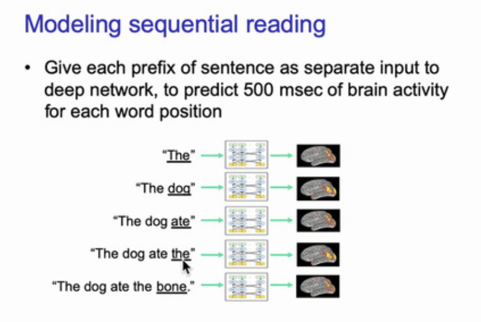

# ディープラーニングの心理学的解釈 (心理学特講IIIA)

<a href='mailto:educ0233@komazawa-u.ac.jp'>Shin Aasakawa</a>, all rights reserved. 
Date: 03/Jul/2020 
Appache 2.0 license 

    
     
    
     

第 09 回 自動翻訳, 文章要約, 転移学習, マルチモーダル学習, マルチタスク学習

<!-- 
VAE と MAML と転移学習の実際とをやろうと思う。

以下は去年の 第11回
-->

# マルチタスク学習，転移学習

- 学習したことがらを応用することは賢さの尺度でしょう

たとえば，映画[カラテキッド](https://youtu.be/DsLk6hVBE6Y)(1984)では，ミヤギ先生はダニエルさんに車のワックスがけや床掃除を教えました :-) ワックスがけや床磨きは空手の技術習得にとって必要な技能であったというオチです。

## 実習ファイル

- [マルチタスク学習2 ](https://colab.research.google.com/github/komazawa-deep-
learning/komazawa-deep-learning.github.io/blob/master/notebooks/2020_0703four_in_one_network2.ipynb){target="_blank"}
- [マルチタスク学習3 ](https://colab.research.google.com/github/komazawa-deep-
learning/komazawa-deep-learning.github.io/blob/master/notebooks/2020_0703four_in_one_network3.ipynb){target="_blank"}

    1. 画像脚注付け 
    {target="_blank"}
    2. 類義語 
    {target="_blank"}
    3. 類義画像 
    {target="_blank"}
    4. 文章からの画像検索
        - __犬__を検索 
    {target="_blank"} 
        - __笑顔の少年__ を検索 
    {target="_blank"} 

---

- [マーガレット ミッチェルによるソーシャルメディアを用いたメンタルヘルスのマルチタスク学習](http://m-mitchell.com/publications/multitask-blurb.html){target="_blank"}
    - [arXiv 論文](https://arxiv.org/abs/1712.03538){target="_blank"}
- [One neural network, many uses](https://towardsdatascience.com/one-neural-network-many-uses-image-captioning-image-search-similar-image-and-words-in-one-model-1e22080ce73d){target="_blank"}
    - [ソースコード](https://github.com/paraschopra/one-network-many-uses){target="_blank"}
    - [An Overview of Multi-Task Learning in Deep Neural Networks](http://ruder.io/multi-task/){target="_blank"}
    - [上の arXiv](https://arxiv.org/abs/1706.05098){target="_blank"}

---

### Hard parameter sharing

 
左:マルチタスク学習, 右:転移学習, いずれも Sebastuan Ruder のブログより 

---

### Soft parameter sharing
In soft parameter sharing on the other hand, each task has its own model
with its own parameters. The distance between the parameters of the model
is then regularized in order to encourage the parameters to be similar. [8]
for instance use the $l2$ norm for regularization, while [9] use the trace
norm.

- [8]: Duong, L., Cohn, T., Bird, S., & Cook, P. (2015). Low Resource Dependency Parsing: Cross-lingual Parameter Sharing in a Neural Network Parser. Proceedings of the 53rd Annual Meeting of the Association for Computational Linguistics and the 7th International Joint Conference on Natural Language Processing (Short Papers), 845–850.
- [9]: Yang, Y., & Hospedales, T. M. (2017). Trace Norm Regularised Deep Multi-Task Learning. In Workshop track - ICLR 2017. Retrieved from http://arxiv.org/abs/1606.04038

---

# Recent work on MTL for Deep Learning

### Deep Relationship Networks

__A Deep Relationship Network with shared convolutional and task-specific fully connected layers with matrix priors (Long and Wang, 2015).__

- Long, M., & Wang, J. (2015). Learning Multiple Tasks with Deep Relationship Networks. arXiv Preprint arXiv:1506.02117. Retrieved from http://arxiv.org/abs/1506.02117 ↩︎

---

### Fully-Adaptive Feature Sharing
 
__The widening procedure for fully-adaptive feature sharing (Lu et al., 2016).__

Lu, Y., Kumar, A., Zhai, S., Cheng, Y., Javidi, T., & Feris, R. (2016). Fully-adaptive Feature Sharing in Multi-Task Networks with Applications in Person Attribute Classification. Retrieved from http://arxiv.org/abs/1611.05377 

---

### Cross-stitch Networks
 
__Cross-stitch networks for two tasks (Misra et al., 2016).__

Misra, I., Shrivastava, A., Gupta, A., & Hebert, M. (2016). Cross-stitch Networks for Multi-task Learning. In Proceedings of the IEEE Conference on Computer Vision and Pattern Recognition. https://doi.org/10.1109/CVPR.2016.433 

<!--
### Low supervision

Søgaard, A., & Goldberg, Y. (2016). Deep multi-task learning with low level tasks supervised at lower layers. Proceedings of the 54th Annual Meeting of the Association for Computational Linguistics, 231–235.
-->

---

## A Joint Many-Task Model
 
__A Joint Many-Task Model (Hashimoto et al., 2016).__

---

### Weighting losses with uncertainty
 
__Uncertainty-based loss function weighting for multi-task learning (Kendall et al., 2017).__

Kendall, A., Gal, Y., & Cipolla, R. (2017). Multi-Task Learning Using Uncertainty to Weigh Losses for Scene Geometry and Semantics. Retrieved from http://arxiv.org/abs/1705.07115

---

### Sluice Networks
 
__A sluice network for two tasks (Ruder et al., 2017).__

Ruder, S., Bingel, J., Augenstein, I., & Søgaard, A. (2017). Sluice networks: Learning what to share between loosely related tasks. Retrieved from http://arxiv.org/abs/1705.08142 

