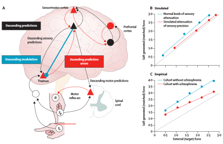

# ディープラーニングの心理学的解釈 (心理学特講IIIA)

<a href='mailto:educ0233@komazawa-u.ac.jp'>Shin Aasakawa</a>, all rights reserved. 
Date: 24/Sep/2021 
Appache 2.0 license 

# 1. 注意

- 認知心理学，生理学，などではトップダウンとボトムアップの 2 種類の注意が区別されてきた。計算論的には Crick (1984) のサーチライト仮説などにより提唱された **勝者占有回路 winner-take-all 回路** である。
- 自然言語処理 (Vaswani et al, 2017)，画像処理 (Ramachandran, 2019) や眼球運動の DeepGaze (Kummerer, 2019) などがある。

### 文献

- [⼼理学，神経科学，機械学習における注意, Lindsay, 2019](https://project-ccap.github.io/2020Lindsay_Attention_in_Psychology_Neuroscience_and_Machine_Learning.pdf){:target="_blank"}

---

### 実習

- [CAM ](https://colab.research.google.com/github/komazawa-deep-learning/komazawa-deep-learning.github.io/blob/master/2021notebooks/2021_0618CAM_demo.ipynb){:target="_blank"}
- [足し算のデモ ](https://colab.research.google.com/github/komazawa-deep-learning/komazawa-deep-learning.github.io/blob/master/2021notebooks/2021_0702RNN_binary_addtion_demo.ipynb){:target="_blank"}

## 1.1 心理学的注意

 

左: Treisman (1988) Fig.1，特徴統合理論の概念図。ボトムアップ注意
中: Wolfe (1994) Fig.2 ガイド付き探索 バージョン 2 モデル。トップダウン注意
右: Itti and Koch (1998) Fig. 1 計算モデルの実装例

## 1.2 ニューラルネットワーク的注意

### 1.2.1 CAM

 
CAM の概念図 Zhou (2016) Fig. 2 を改変

   

 
Grad-CAM の結果。Selvaraj (2016) Fig. 5 より。左: 元画像。央: ボクサー犬と判断した場合のヒートマップ。右:トラ猫と判断した場合のヒートマップ

### 1.2.2 機械翻訳 seq2seq における注意

- [Cho et. al., (2014) Learning Phrase Representations using RNN Encoder-Decoder for Statistical Machine Translation](https://arxiv.org/abs/1406.1078)
- [Sutskever et. al.,(2014) Sequence to Sequence Learning with Neural Networks](https://arxiv.org/abs/1409.3215)
- [Bahdanau et. al., (2014) Neural Machine Translation by Jointly Learning to Align and Translate](https://arxiv.org/abs/1409.0473)
- [Vinyals (2015) A Neural Conversational Model](https://arxiv.org/abs/1506.05869)

 
Bahdanau (2014) Fig.1  注意つき機械翻訳モデル

                                                                                

## 力学的エネルギー = 運動エネルギー + 位置エネルギー(ポテンシャル)

$$
E = K + U\\
E = \frac{1}{2}mv^2 + mgh
$$

- 統計物理学: 巨視的な物体，すなわち莫大な数の個別的な粒子，原子や分子，からなる物体のふるまいやっ性質を支配している特別な型の法則性を研究する学問分野

- [熱力学第一法則 エネルギー保存則](https://ja.wikipedia.org/wiki/%E3%82%A8%E3%83%8D%E3%83%AB%E3%82%AE%E3%83%BC%E4%BF%9D%E5%AD%98%E3%81%AE%E6%B3%95%E5%89%87)
- [熱力学第二法則 エントロピーは増大する](https://ja.wikipedia.org/wiki/%E7%86%B1%E5%8A%9B%E5%AD%A6%E7%AC%AC%E4%BA%8C%E6%B3%95%E5%89%87)

### エントロピー
熱力学的エントロピーと情報論的エントロピーが存在するが式は同じである。
### (熱)力学的エントロピー

### [自由エネルギー原理](./friston_FEP) 

ヘルムホルツの自由エネルギー:
\[
F = U - TS
\]

$F$ はヘルムホルツの自由エネルギー，$T$ は温度，$S$ はエントロピーである。<https://kotobank.jp/word/%E8%87%AA%E7%94%B1%E3%82%A8%E3%83%8D%E3%83%AB%E3%82%AE%E3%83%BC-76745>

- 熱力学の第一法則 エネルギー保存則
- 熱力学の第二法則 

ギブスの自由エネルギー

\[
G = F + pV
\]

ある位置 $i$ にある粒子があるとする。各位置にそれぞれ $n_i$ の粒子が存在するとする。
はおのおの区別できないものとすれば，全ての状態は何通りあるかを表す式は次式となる:

$$
W=\frac{N!}{\prod_i n_i!}
$$

エントロピーとはこの状態の数 $W$ の負の対数である. 
$$
H=\frac{1}{N}\log W=\frac{1}{N}\log N!-\frac{1}{N}\sum_i\log n_i!
$$

以下のスターリングの近似公式 ($\log N!\approx N\log N - N$) を用いると以下の式を得る

$$
H=-\lim_{N\rightarrow\infty}\sum_i\left(\frac{n_i!}{N}\right)
\log\left(\frac{n_i!}{N}\right)=-\sum_i p_i\log p_i
$$
 
$$
S = k \ln W
$$

ここで，$k$ は[ボルツマン定数](https://ja.wikipedia.org/wiki/%E3%83%9C%E3%83%AB%E3%83%84%E3%83%9E%E3%83%B3%E5%AE%9A%E6%95%B0)であり，$W$ は系の微視的な状態を表す。
一方で統計力学におけるエントロピーの定義は以下の通り:

$$
S=k\left<\ln\frac{1}{p(\omega)}\right>=-k\sum_{\omega}p(\omega)\ln p(\omega)
$$

上式中 $\left<\;\right>$ は[アンサンブル平均](https://ja.wikipedia.org/wiki/%E7%B5%B1%E8%A8%88%E9%9B%86%E5%9B%A3)と呼ばれ，巨視的に同条件下にある力学系が系を構成する分子間に相関がなければ，系は微視的にはすべての状態をとりうることから，巨視的状態において統計的に系はすべての状態をとりうることが仮定される。系の時間的平均と空間間的平均が同じであると仮定できるときその系は**エルゴード性**を有するという。
エルゴード性により時間平均と空間平均とを区別しないで(しばしば意図的に混乱させて)用いることが行われる。

## 情報量 Information Measure
<!-- Srihari slides https://cedar.buffalo.edu/~srihari/CSE574/ -->

- 離散変数 $x$ How much information is received when we observe a specific value for a discrete random ariable $x$?
- Amount of information is degree of surprise 
    - Certain means no information
    - More information when event is unlikely
- Depends on probability distribution $p(x)$, a quantity $h(x)$
- If there are two unrelated events $x$ and $y$ we want $h(x,y)=h(x)+h(y)$
- Thus we choose $h(x)=-\log_2p(x)$
    - Negative assures that information measure is positive
- Average amount of information transmitted is the expectation w.r.t $p(x)$ refered to as entropy

- 情報量: 確率変数 $x$ のサプライズ量
  - まれにしか起こらない事象が起こった場合には情報量は大きい。<strong>ニュースになる</strong>
  - 必ず起こることが起こっても情報量は小さい。<strong>ニュースにならない</strong>

$$
H(x)=-\sum_x p(x)\log_2p(x)
$$
- マイナスをつけるのは正の値にするため
サプライズ量の平均: 平均エントロピ

一方情報論的エントロピー $H$ の定義は事象 $A$ の起こる確率を $P(A)$ とすれば

$$
H(A) = - \sum_{A\in\Omega} P(A) \log P(A)
$$

確率の制約，及び，平均と分散に関する制約条件を以下のように記述:

- $\displaystyle\int p\left(x\right)\;dx =1$ : 確率
- $\displaystyle\int xp\left(x\right)\;dx =\mu$ : 平均
- $\displaystyle\int \left(x-\mu\right)^2p\left(x\right)\;dx=\sigma^2$ : 分散
- ラグランジェ乗数を使って制約条件下での最大化

$$
L(x,\lambda_1,\lambda_2,\lambda_3)=-\int p\left(x\right)\log p\left(x\right)\;dx + \lambda_1\left(\int p\left(x\right)\;dx-1\right) + \lambda_2\left(\int xp\left(x\right)\;dx-\mu\right)+\lambda_3\left(\int\left(x-\mu\right)^2p\left(x\right)\;dx-\sigma^2\right)
$$

各変数で微分して0と置き，整理: 

$$
p\left(x\right)=\exp\left(-1+\lambda_1+\lambda_2x+\lambda_3\left(x-\mu\right)^2\right)
$$

- 以上より連続量の最大エントロピーを与える確率分布はガウス分布となる

# 4. ニューラルネットワークの物理学メタファー

- **2019年度駒澤大学文学部開講科目，心理学特講 IIIA は，文化，思想，に関する議論をする科目ではありません。ましてや，文壇，言論界，などに対するいかなるメッセージも含むものではありません。**

- However, all of you must think about [ソーカル事件](https://ja.wikipedia.org/wiki/%E3%82%BD%E3%83%BC%E3%82%AB%E3%83%AB%E4%BA%8B%E4%BB%B6){:target="_blank"}, 
and [知の欺瞞](https://www.amazon.co.jp/dp/4006002610){:target="_blank"}
- ただ **騙されない** ようにしたいと願うだけです。

## 上記に対する精一杯の言い訳

- 我々の脳は数多の神経細胞から成り立っている。従って，我々の思想，行動，考え方，信念，抽象的思考，などはニューロンの働きに礎を置くと考えることができる。
- 一方，ブラーエ，ケプラー，ガリレイ，ニュートンと続く古典物理学の譜系と，物質が分子，原子，素粒子でなりたっているという

 

キッズサイエンティストより https://www2.kek.jp/kids/class/particle/class01-02.html

- たとえば，ダイエットをして 5Kg 減量に成功したという友人 A が，5g 痩せたというと**頭おかしい**と思うでしょう。鼻をかんだら 5g くらい減るでしょう。
- 同じように，健康のために毎日 5Km 走っているという友人 B が毎日 5Mm=5000Km (5 * 10^3)m 走っていると言い始めたら**頭おかしい**と思うでしょう。
- 単位が $K=1000=10^3$ 異なると別次元の話と考えないと**頭おかしい**のです。東京からインドのコルカタまでの距離がおよそ 5167Km ほどだそうです

> 統計物理学，簡単にいえば単に統計の目的は，巨視的な物体，すなわち膨大な数の個別的な粒子 --- 原子や分子 --- からなる物体のぶるまいや性質を支配している特別な型の法則を研究することである 
> ランダウ，リプシッツ，(1957) __統計物理学__

上記のような統計物理学，熱力学で議論されてきたようなミクロな系(粒子の法則)とマクロな系(物体のふるまい)のアナロジーが，神経細胞と知的活動との間でも成り立つのではないかという淡い期待。

<!-- 
## accuracy と precision
分類問題の精度の指標の一つでもある混同行列の中で正しい組み合わせのものを選べ。ここでは小数第3位以下は切り捨てている。

 

ただし，A は正解率, B は適合率, C は再現率, D は F 値とする。

1. A:$0.866$, B:$0.896$, C:$0.928$, D:$0.900$
2. A:$0.928$, B:$0.900$, C:$0.896$, D:$0.866$
3. A:$0.896$, B:$0.866$, C:$0.900$, D:$0.928$
4. A:$0.900$, B:$0.928$, C:$0.866$, D:$0.896$

### 解説:
正解は 4

1. accuracy (13+14)(13+2+1+14)
2. precision 13/(13+1)
3. recall 13/(13+2)
4. F1 (2 * precision * recall)/(precision + recall)
-->

# 計算論的精神医学: 幻の器官としての脳 (Friston, 2014)
<!-- Computational psychiatry: the brain as a phantastic organ-->

このレビューでは，精神医学に関連する計算論的神経科学の進歩について述べています。
計算論的精神医学を、研究者の野心、新たな応用分野、将来の仕事という観点からレビューする。
私たちが注目しているのは、主観的な信念や行動を形式的な（計算上の）枠組みの中に置く脳機能の理論的な定式化であり、この枠組みはシナプスのメカニズムのレベルまで神経生理学に基づいて構築することができます。
脳の機能構造を支える原理を理解することは、精神病の表現型を、その病態生理学的な背景から理解するために不可欠であると考えられる。
本研究では、能動的（ベイズ的）推論と予測的コーディングに焦点を当てます。
具体的には、ニューロン計算の基本原理を用いて、自閉症における心の理論の欠如から、統合失調症における滑らかな追跡眼球運動の異常まで、精神病理学を説明することができることを示す。
<!--
In this Review, we discuss advances in computational neuroscience that relate to psychiatry. 
We review computational psychiatry in terms of the ambitions of investigators, emerging domains of application, and future work. 
Our focus is on theoretical formulations of brain function that put subjective beliefs and behaviour within formal (computational) frameworks—frameworks that can be grounded in neurophysiology down to the level of synaptic mechanisms. 
Understanding the principles that underlie the brain’s functional architecture might be essential for an informed phenotyping of psychopathology in terms of its pathophysiological underpinnings. 
We focus on active (Bayesian) inference and predictive coding. 
Specifically, we show how basic principles of neuronal computation can be used to explain psychopathology, ranging from impoverished theory of mind in autism to abnormalities of smooth pursuit eye movements in schizophrenia. -->

- 脳機能の理論的枠組みによる定式化: 主観的信念や行動を，形式的な計算論的枠組み，すなわち神経生理学に基づくシナプス機構のレベルで捉える
- アクティブ（ベイジアン）推論と予測コーディング
- 自閉症の偏った心や統合失調症の円滑追跡眼球運動異常

 

**予測符号化を支える階層的な神経細胞のメッセージ伝達システム**

<!--**Hierarchical neuronal message passing system that underlies predictive coding**-->
ニューロンの活動は、感覚入力の原因に関する期待を符号化し、その期待が予測誤差を最小化します。
予測誤差の最小化には、大脳皮質のさまざまな階層の間で繰り返されるニューロンの相互作用が必要である。
このモデルでは、表層の錐体細胞（赤の三角）が、各レベルの期待値と、より上位の深層の錐体細胞（黒の三角）からのトップダウンの予測値を比較していることが示唆されている。
<!-- Neuronal activity encodes expectations about the causes of sensory input, and these expectations minimise prediction error. 
Minimisation relies on recurrent neuronal interactions between different levels of the cortical hierarchy. 
Within this model, the available evidence suggests that superficial pyramidal cells (red triangles) compare expectations (at each level) with top-down predictions from deep pyramidal cells (black triangles) at higher levels. -->

- (A) 単純な皮質の階層構造。
単純な皮質階層。表層の錐体細胞の神経調節やゲインコントロール（青）が、期待値をコードする深層の錐体細胞に対する相対的な影響を決定する。
- (B) 視覚系の模式図。
上行性あるいは順行性接続の起点となる推定細胞が予測誤差を伝え（赤矢印）、下行性あるいは逆行性接続（黒矢印）が予測を構築する。
予測誤差は、腹側被蓋野と黒質からの神経調節系の活動に関連する期待精度によって重み付けされる。
この例では、前頭目野が一次視覚野に予測値を送っている。しかし、前頭眼野はプロプリオセプティブの予測を錐体核に送り、その予測は眼球運動系に伝えられ、古典的な反射によって運動を引き起こす。
ここでは、視覚野への下降予測が従属放電を構成する。
トップダウンの予測は、ボトムアップの予測エラーと相互に作用し、予測が感覚情報によって制約されることを保証する。
プロプリオセプティヴ・プレディクション・エラーの解決は、古典的反射の平衡状態やセットポイントを動的にリセットすることで、（身体の状態に関する）下降予測が運動を引き起こすことを可能にするため、特に重要である。
<!-- 
- (A) A simple cortical hierarchy with ascending
prediction errors and descending predictions. Neuromodulatory gating or gain control (blue) of superficial pyramidal cells determines their relative influence on deep pyramidal cells encoding expectations. 
- (B) Schematic example that shows the visual system. 
Putative cells of origin of ascending or forward connections convey prediction errors (red arrows) and descending or backward connections (black arrows) construct predictions. 
The prediction errors are weighted by their expected precision, which is associated with the activity of neuromodulatory systems—here, projections from ventral tegmental area and substantia nigra. 
In this example, the frontal eye fields send predictions to the primary visual cortex. However, the frontal eye fields also send proprioceptive predictions to pontine nuclei, which are passed to the oculomotor system to cause movement through classic reflexes. 
Here descending predictions to the visual cortex constitute corollary discharge. 
Every top-down prediction is reciprocated with a bottom-up prediction error to ensure predictions are constrained by sensory information. 
The resolution of proprioceptive prediction error is particularly important because it enables descending predictions (about the state of the body) to cause movement by dynamically resetting the equilibrium or set point of classic refl exes. 
-->

 

**強制マッチング・イリュージョンにおける予測的コーディング・モデル**

- (A) 妄想とフォースマッチング錯視の失敗を精度の異常という観点からシミュレートするために用いた予測符号化モデルの模式図を示す。
体性感覚と固有感覚の予測誤差は視床で生成されるが、隠れた原因（力）に関する期待と予測誤差は感覚運動野と前頭前野にある。
能動的推論の下では、自己受容的予測は脊髄に下り、古典的な反射アークを介してα運動ニューロン（自己受容的予測エラーユニット）からの出力を誘発する。
図1のように、赤の接続は上昇する予測エラーを、黒の接続は下降する予測を仲介する。
青色の接続は、感覚の減衰を媒介する下行性の神経調節（例：NMDA受容体）効果を示す。
- (B) 強制マッチングのシミュレーションを、隠れた原因についての事前の信念によって誘発される自己生成力の異なるレベルで繰り返した結果。
通常の感覚減衰レベルでは、内部でマッチングされた力は外部で生成された力よりも高かった。
統合失調症の患者のデータは、感覚の精度を減衰させ、階層の高いところで予測誤差の精度を上げることでシミュレーションされた。
その結果、内部で発生した力（赤）をより正確に認識することができた。
- (C) 対照群と統合失調症患者のコホートから得られた力覚マッチング課題の同等のデータ。文献37から引用した。-->
<!--
**Predictive coding model in the force-matching illusion**

- (A) Shows a schematic of the predictive coding model used to simulate delusions and failure of the force-matching illusion in terms of aberrant precision.
Somatosensory and proprioceptive prediction errors are generated by the thalamus, whereas the expectations and prediction errors about hidden causes (forces) are in sensorimotor and prefrontal cortex. 
Under active inference, proprioceptive predictions descend to the spinal cord and elicit output from alpha motor neurons (proprioceptive prediction-error units) via a classic reflex arc. 
As in figure 1, red connections mediate ascending prediction errors and black connections mediate descending predictions. 
The blue connection denotes descending neuromodulatory (eg, NMDA receptor) effects that mediate sensory attenuation. 

- (B) The results of a force-matching simulation that was repeated under different levels of self-generated force induced by prior beliefs about hidden causes. 
For normal levels of sensory attenuation, the internally matched force was higher than was the externally generated force. Data from patients with schizophrenia were simulated by attenuating sensory precision and increasing the precision of prediction errors at higher levels of the hierarchy. 
This resulted in a more accurate perception of internally generated force (red). 

- (C) Equivalent data from the force-matching task from controls and a cohort of patients with schizophrenia. Adapted from references 37. -->

