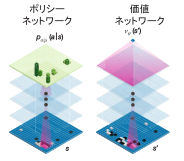
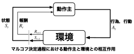
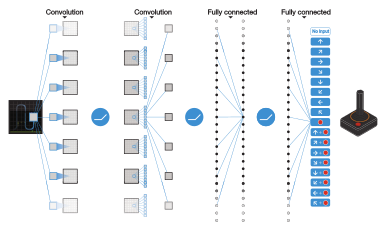
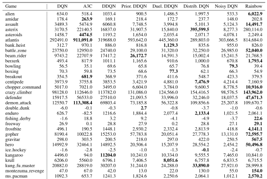

# ディープラーニングの心理学的解釈 (心理学特講IIIA)

<div align='right'>
<a href='mailto:educ0233@komazawa-u.ac.jp'>Shin Aasakawa</a>, all rights reserved.<br>
Date: 01/Oct/2021<br/>
Appache 2.0 license<br/>
</div>

<!-- 第 16 回 精神医学(統合失調症, 強迫神経症, 依存症, 幻覚幻聴), 神経心理学(意味痴呆, 相貌失認, 失語, 失行) -->

# 第 16 回 強化学習, 予測報酬誤差, ゲームAI, 経済学


<center>


<br/>
AlphaGo の模式図，原著論文より

<br/>
AlphaGoZero のセルフプレイ，原著論文より
</center>

<!--
<https://medium.com/tensorflow/deep-reinforcement-learning-playing-cartpole-through-asynchronous-advantage-actor-critic-a3c-7eab2eea5296>

<https://gist.github.com/ruippeixotog/cde7cae770e72916e209b915521bb18f>

- 強化学習のデモ
```bash
# for Reinforcement Learning
cd ~/study/2018karpathy_reinforcejs.git
open index.html
```
-->

## 実習ファイル

- [ランダム探索  ](https://colab.research.google.com/github/ShinAsakawa/2019komazawa/blob/master/notebooks/2019komazawa_rl_ogawa_2_2_maze_random.ipynb){target="_blank"} 
- [方策勾配法  ](https://colab.research.google.com/github/ShinAsakawa/2019komazawa/blob/master/notebooks/2019komazawa_rl_ogawa_2_3_policygradient.ipynb){target="_blank"} 
- [SARSA  ](https://colab.research.google.com/github/ShinAsakawa/2019komazawa/blob/master/notebooks/2019komazawa_rl_ogawa_2_5_Sarsa.ipynb){target="_blank"} 
- [Q学習  ](https://colab.research.google.com/github/ShinAsakawa/2019komazawa/blob/master/notebooks/2019komazawa_rl_ogawa_2_6_Qlearning.ipynb){target="_blank"} 
- [REINFORCE.js](reinforcejs/index.html){target="_blank"}

<!-- https://github.com/ShinAsakawa/2019komazawa/blob/master/notebooks/2019komazawa_rl_ogawa_2_2_maze_random.ipynb)-->
<!--(https://github.com/ShinAsakawa/2019komazawa/blob/master/notebooks/2019komazawa_rl_ogawa_2_3_policygradient.ipynb)-->
<!--(https://github.com/ShinAsakawa/2019komazawa/blob/master/notebooks/2019komazawa_rl_ogawa_2_5_Sarsa.ipynb)-->
<!--(https://github.com/ShinAsakawa/2019komazawa/blob/master/notebooks/2019komazawa_rl_ogawa_2_6_Qlearning.ipynb)-->

以下のデモは，[OpenAI](https://openai.com/) 提供の強化学習環境 [gym](https://gym.openai.com/)
を用いています。

- [倒立振子 (cartpole) ](https://colab.research.google.com/github/komazawa-deep-learning/komazawa-deep-learning.github.io/blob/master/notebooks/2020_0716Gym_cartpole_rendering.ipynb){target="_blank"}

Colaboratory 上で gym を 動作させるためには [StarAI の開発したレンダリング環境](https://star-ai.github.io/Rendering-OpenAi-Gym-in-Colaboratory/)
が必要です。

<!--
使うと環境構築は楽です。ただし -->

<!--
```python
import gym
env = gym.make('CartPole-v0')
env.reset()
for _ in range(1000):
    env.render()
    env.step(env.action_space.sample()) # take a random action
```

[cartpole 問題](https://www.youtube.com/watch?v=J7E6_my3CHk)を解いてみました

```bash 
cd ~/study/2019tensorflow_models.git/research/a3c_blogpost
# python a3c_cartpole.py --train
python a3c_cartpole.py --algorithm=random --max-eps=4000
```
## The Animal-AI Olympics

<http://animalaiolympics.com/>

<div>
<video style="width:84%" src='./assets/Animal-AI Olympics Preview.mp4' controls >
</div>

## Unity Obstacle Tower Challenge

<https://www.aicrowd.com/challenges/unity-obstacle-tower-challenge>

<div>
<video style="width:84%" src='./assets/Unity Obstacle Tower Challenge.mp4' controls >
</div>

-->

# 強化学習，条件付けの古典

- [パブロフ](https://en.wikipedia.org/wiki/Ivan_Pavlov) (Ivan Petrovich Pavlov; 1849/Sep/14-1936/Feb/27)古典的条件づけ 1904 年ノーベル医学生理学賞
- [スキナー](https://en.wikipedia.org/wiki/B._F._Skinner) (Burrhus Frederic Skinner; 1904/Mar/20-1990/Aug/18) 道具的条件付け， オペラント条件づけ，[スキナー箱, Skinner(1938) Fig.1, page 39 より](./assets/1938Skinner_Fig1_skinnerBOX.jpg)
- [Sutton](http://incompleteideas.net/) and [Barto](http://www-anw.cs.umass.edu/~barto/) の強化学習 [初版 1998年](http://incompleteideas.net/book/first/the-book.html), [第2版 2018年](http://incompleteideas.net/book/the-book-2nd.html), [初版は翻訳あり](https://www.amazon.co.jp/dp/4627826613/)，第2版は pdf ファイルで[ダウンロード可能](http://incompleteideas.net/book/bookdraft2017nov5.pdf)

<center>


<a href="https://www.nobelprize.org/prizes/medicine/1904/pavlov/biographical/">Ian Pavlov</a>&nbsp;&nbsp;

<a href="https://www.bfskinner.org/archives/photos/">Burrhus Frederic Skinner</a>&nbsp;&nbsp;

<a href="http://incompleteideas.net/">Richard S. Sutton,</a>&nbsp;&nbsp;

<a href="https://people.cs.umass.edu/~barto/">Andrew G. Barto</a>
</center>


# 強化学習とは何か？

<center>

<br>
<p align="center" style="width:74%">
Sutton & Barto (2018) Fig. 3.2 を改変
</p>
</center>


強化学習という言葉は古い言葉ですが機械学習の文脈では，
環境とその環境におかれた動作主（エージェントと言ったり，ロボットシステムだったりします）が，
環境と相互作用しながらより良い行動を形成するためのモデルです。
動作主は，環境から受け取った現在の状態を分析して，
次にとるべき行動を選択します。このとき将来に渡って報酬が最大となるような行動を学習する手法の一つです。

2015 年には，Google傘下のデープマインドというスタートアップチームが開発した囲碁プログラムAlphaGoがプロ棋士のイ・セドル氏に勝利し話題になりました。
AlphaGo は強化学習を基本技術の一つとして用いています。


1. [強化学習(1): 基礎](rl01_elements.pdf)
2. [強化学習(2): エージェントと環境](rl02_agentAndEnv.pdf)
3. [強化学習(3): 目標と報酬](rl03_goalAndReward.pdf)
4. [強化学習(4): マルコフ決定過程](rl04_mdp.pdf)
5. [強化学習(5): 価値反復，方策反復](rl05_vi.pdf)
6. [強化学習(6): ](rl06_advanced.pdf)
6. [強化学習(7): ](rl07_robotics.pdf)

- エージェントと環境，マルコフ決定過程 MDP，POMDP，効用関数，ベルマン方程式，探索と利用のジレンマ，SARSA:
- 価値，方策，Q 学習，モデルベース対モデルフリー，アクター=クリティック:
- 深層 Q 学習:

- ゲーム AI へ (AlphaGo，AlphaGoZero，OpenAI five):
- セルフプレイ:
- 最近の発展 A3C，Rainbow，RDT，World model:

<!--
### 方策，報酬，価値観数，(環境)モデル

- $s,s'$: 状態 state
- $a$: 行動，行為 action
- $r$: 報酬 reward
- $t$: 時間 (離散時間 $t=1,2,\ldots,T$)
- $p(s',r\vert s, a)$: 状態 $s$ で行為 $a$ を行ったとき，報酬 $r$ を受け取って 状態 $s'$ に遷移する確率
- $p(s'\vert s, a)$: 状態 $s$ で行為 $a$ を行った場合，状態 $s'$ へ遷移する確率
- $r(s,a)$: 状態 $s$ で行為 $a$ を行った場合の即時報酬 immediate reward の期待値
- $r(s,a,s')$: 行為 $a$ を行った場合状態が $s$ から $s'$ へ変化したときの即時報酬の期待値
- $v_\pi(s)$: 方策 $\pi$ での状態 $s$ の価値 (期待報酬)
- $v_*(s)$: 最適方策化での状態 $s$ の価値
- $q_\pi(s,a)$: 方策 $\pi$ のもとで状態 $s$ で行為 $a$ をおこなた場合の価値
- $q_*(a)$: 行動 $a$ を行った場合の期待報酬(真の報酬) <!-- true value (expected reward) of action $a$-->

<!--
- $Q_t(a)$: 時刻 $t$ での $q_*(a)$ の期待値 <!-- qestimate at time $t$ of $q_*(a)$
- $N_t(a)$: 時刻 $t$ で行為 $a$ を行った回数 <!-- number of times action $a$ has been selected up prior to time $t$
- $H_t(a$) 時刻 $t$ で行為 $a$ を行う傾向(選好 preference) <!--learned preference for selecting action a at time $t$
- $\pi_t(a)$: 時刻 $t$ で行為 $a$ を選択する確率 <!-- probability of selecting action a at time $t$
- $R_t$: $\pi_t$ が与えられた場合，時刻 $t$ における の期待報酬 <!--estimate at time $t$ of the expected reward given $\pi_t$
--->


## 複雑な状況をどう理解して解決するのか？

- 強化学習というニューラルネットワークモデルがあるわけではない
- 動的で複雑な環境に対処 $\rightarrow$ **強化学習** + DL $\rightarrow$ 一般人工知能への礎

- DQN ATARIのビデオゲーム, [https://www.nature.com/articles/nature14236](https://www.nature.com/articles/nature14236)
- AlphaGo 囲碁, [https://www.nature.com/articles/nature16961](https://www.nature.com/articles/nature16961)
- AlphaGoZero 囲碁, [https://www.nature.com/articles/nature24270](https://www.nature.com/articles/nature24270)

# Deep Q Network

<center>
  <br/>
DQNの模式図, 原著論文より
</center>

<!-- 
- [ギャラガ1](../assets/MOV_0013s.mp4)
- [ギャラガ2](../assets/MOV_0071s.mp4)
-->

- **Q 学習** Q learning に DNN を採用
- CNN が LeNet, @1998LeCun そうであったように，強化学習 RL も昔からの技術 @Sutton_and_Barto1998
- ではなぜ，今になって囲碁や自動運転に応用できるようになったのか？ 
  - $\Rightarrow$ コンピュータの能力, データ規模，アルゴリズムの改良, エコシステム(ArXiv, Linux, Git, ROS, AMT, TensorFlow) 
  
<!--
# 強化学習

- 強化学習 $\Rightarrow$ 意思決定
  - **エージェント** agent が **行動**(行為) action をする
  - 行動によって **状態** が変化する
  - **環境** から与えられる **報酬** によって**目標**が決定
- 深層学習: $\Rightarrow$ 表現，表象
  - 教師信号として目標が与えられる
  - 目標を達成するために外部状況の **表現** を獲得

<center>
<font size="+2" color="Green">強化学習 + 深層学習 = 人工知能</font>
</center>

  - 強化学習 $\Rightarrow$ 目標の設定
  - 深層学習 $\Rightarrow$ 内部表象の獲得機構を提供

# 用語の整理

- 教師信号なし **報酬信号** reward signal
- 遅延フィードバック

- **価値** Value
- **行為** Action
- **状態** State
- TD 学習
  - **Sarsa**
  - **Q 学習**
  - **アクタークリティック**
- 報酬 $R_t$: **スカラ値**
  - 時刻 $t$ でエージェントのとった行動を評価する指標
  - エージェントは**累積報酬** cumulative reward の最大化する
  - 報酬仮説: **目標は累積期待報酬の最大化として記述可能**
-->


## YouTube 上でのデモ動画
- ブロック崩し: [https://www.youtube.com/watch?v=V1eYniJ0Rnk](https://www.youtube.com/watch?v=V1eYniJ0Rnk){target="_blank"}
- スペースインベーダー: [https://www.youtube.com/watch?v=W2CAghUiofY](https://www.youtube.com/watch?v=W2CAghUiofY){target="_blank"}

<!--- packman: [https://www.youtube.com/watch?v=r3pb-ZDEKVg](https://www.youtube.com/watch?v=r3pb-ZDEKVg)
- OpenMind selfplay: [https://www.youtube.com/watch?v=OBcjhp4KSgQ](https://www.youtube.com/watch?v=OBcjhp4KSgQ)
-->

- DQN の動画 スペースインベーダー

<center>

<div>
<video style="width:33%" controls src="../assets/2015Mnih_DQN-Nature_Video1.mp4" type="video/mp4" ><br>
</div>
</center>

- DQN の動画 ブロック崩し

<center>

<div>
<video style="width:33%" controls src="../assets/2015Mnih_DQN-Nature_Video2.mp4" type="video/mp4" >
</div>
</center>

## DQN 結果

<center>

</br>
</center>

<!-- ## なぜ DQN には難しいのか？

<center>
<div>
<video style="width:74%" controls src="../assets/Montezuma.mp4" type="video/mp4" /></br>
**Montezuma**
</div>
</center>

<center>
<video style="width:74%" controls src="../assets/PrivateEye.mp4" type="video/mp4" /></br>
**Private Eye**
</center>

<center>
<video width="39%" autoplay loop markdown="0" controls muted>
  <source src="./assets/Montezuma.mp4">
</video>
<video width="39%" autoplay loop markdown="0" controls muted>
  <source src="./assets/privateEye.mp4">
</video>
 -->

## 人間にはできて強化学習には難しいこと

- Montenzuma's Revenge の動画 [https://www.youtube.com/watch?v=Klxxg9JM5tY](https://www.youtube.com/watch?v=Klxxg9JM5tY){target="_blank"}
- Private Eys の動画 [https://www.youtube.com/watch?v=OfyS-Wj1M78](https://www.youtube.com/watch?v=OfyS-Wj1M78){target="_blank"}

<!---
## エージェントと環境

- At each step $t$ the agent:
  - Executes action $A_t$
  - Receives observation $O_t$
  - Receives scalar reward $R_t$
- The environment:
  - Receives action $A_t$
  - Emits observation $O_{t+1}$
  - Emits scalar reward $R_{t+1}$
- $t$ increments at env. step
-->

<!--
- **エージェント**: 学習と意思決定を行う主体
  1. **行動** action **$A_t$** を行い
  1. 環境の **観察** observation **$O_t$** を行う
  1. 環境からスカラ値の **報酬** reward **$R_t$** を受け取る
- **環境**: エージェント外部の全て
  1. エージェントから **行為** $A_t$ を受け取り
  1. エージェントに **観察** $O_{t+1}$ を与え
  1. エージェントへ **報酬** $R_{t+1}$ を与える

## エージェントの要素

- **方策** Policy
- **価値関数** Value function
- **モデル** エージェントが持つ環境の表象

## 方策 policy

- **方策** : エージェントの行為
- 決定論的方策: $a=\pi(S)$
- 確率論的方策: $\pi(a|s)=p(A_{t=a}|S_{t=s})$

## 価値関数
- 将来の報酬予測
- 状態評価(良/悪)
- 行為の選択
$$
v_\pi(S)=\mathbb{E}_\pi\left\{R_{t+1}+\gamma R_{t+2} + \gamma^2R_{t+3}+\ldots|S_{t=s}\right\}
$$

## 強化学習のモデル
- 価値ベース
  - 方策:なし
  - 価値関数:あり
- 方策ベース
  - 方策:あり
  - 価値関数:なし
- アクター=クリティック Actor Critic
  - 方策: あり
  - 価値関数: あり

- モデルフリー
  - 方策，価値関数: あり
  - モデル: なし
- モデルベース
  - 方策，価値関数: あり
  - モデル: あり

## 探索と利用のジレンマ Exploration and exploitaion dilemma
- 過去の経験から，一番良いと思う行動ばかりをしていると，さらに良い選択肢を見つけ出すことができない **探索不足**
- 更に良い選択肢ばかり探していると過去の経験が活かせない **過去の経験の利用不足**

## 目標，収益，報酬

- エージェントの目標は累積報酬を最大化すること (報酬仮説)
  - **報酬仮説** Reward Hypothesis
  - 目標: 期待報酬の最大化

- 時刻 $t$ における報酬 $R_t$ : **スカラ値**
- 時刻 $t$ におけるエージェント行為の評価

## 逐次的意思決定 Sequential Decision Making
- 目標 Goal: 総収益を最大化する行動を選択すること
- 行為，行動 Actions は長期的結果
- 収益は遅延することも有る
- 直近の報酬を選ぶよりも，長期的な報酬を考えた方が良い場合がある 


## 収益 Return
- **収益** return $G_t$: 割引付き収益 
$$
G_t=R_{t+1}+\gamma R_{t+2}+\ldots=\sum_{k=0}^{\infty}\gamma^k R_{t+k+1} 
$$

- 割引率 The discount $\gamma\in\left\{0,1\right\}$ : 現時点から見た将来の報酬を計算するため

- **遅延報酬** delayed reward の評価
- $0$ に近ければ __近視眼的__ 評価
- $1$ に近ければ __将来を見通した__ 評価

## 価値関数 Value Function

- **状態価値関数 $v$ ** と **行動価値関数 $q$ **

- **価値関数** $v(s)$: gives the long-term value of state $s$
- **状態価値関数** $v(s)$ of an MRP is the expected return starting from state $s$
$$
v(s)=\mathbb{E}\left\{G_t|S_{t=2}\right\}
$$

- **状態価値関数** state-value function: 
$$
v_\pi(s)=\mathbb{E}_\pi\left\{G_t|S_{t=s}\right\}
$$

# ベルマン期待期待 Bellman Expectation Equation
- **状態価値関数** : 即時報酬と後続状態の割引付き報酬の和に分解できる

$$
v_\pi(s)=\mathbb{E}_\pi\left\{R_{t+1}+\gamma v_\pi(S_{t+1}|S_t=s)\right\}
$$

- **行動価値関数** action-value function:
$$
q_\pi(s,a)=\mathbb{E}_\pi\left\{G_t|S_{t}=s,A_{t}=a\right\}
$$

- **行動価値関数** 同じく分解可能 The action-value function can similarly be decomposed,
$$
q_\pi(s,a)=\mathbb{E}_\pi\left\{R_{t+1}+\gamma q_\pi(S_{t+1},A_{t+1})|S_{t}=s,A_{t}=a\right\}
$$


## 最適価値関数 Optimal Value Function
- 最適状態価値関数 
$$
v_{*}(s) = \max_{\pi} v_{\pi}(s)
$$
- 最適行動価値関数
$$
q_{*}(s,a)=\max q_{\pi}(s,a)
$$

- ベルマン方程式 一般に非線形になるので難しい
-->

<!--
- No closed form solution (in general)
- Many iterative solution methods
- 幾つかの解法:
  - 価値反復
  - 方策反復
  - Q 学習
  - sarsa
-->
 
<!--
  - Value Iteration
  - Policy Iteration
  - Q-learning
  - Sarsa
-->

<!--
# Markov Reward Process
A Markov reward process is a Markov chain with values.

- A Markov Reward Process is a tuple $<S,P,R,\gamma>$
  - $S$ is a finite set of states
  - $P$ is a state transition probability matrix,
  - $P_{ss'}=P\of{S_{t+1}=s'\given{S_t=s}}$
  - $R$ is a reward function, $R_s=\mathbb{E}\BRc{R_{t+1}\given{S_t=s}}$
  - $\gamma$ is a discount factor

# Bellman Equation for MRPs
The value function can be decomposed into two parts:
  - immediate reward $R_{t+1}$
  - discounted value of successor state $\gamma v\of{S_{t+1}}$

$$
\begin{array}{lll}
v\of{s}&=&\mathbb{E}\BRc{G_t\given{S_t=s}}\\
&=&\mathbb{E}\BRc{R_{t+1}+\gamma R_{t+2}+\gamma^2R_{t+3}+\ldots\given{S_{t}=s}}\\
&=&\mathbb{E}\BRc{R_{t+1}+\gamma\Brc{R_{t+2}+\gamma R_{t+3}+\ldots}\given{S_{t}=s}}\\
&=&\mathbb{E}\BRc{R_{t+1}+\gamma G_{t+1}\given{S_{t}=s}}\\
&=&\mathbb{E}\BRc{R_{t+1}+\gamma v\of{S_{t+1}\given{S_{t}=s}}}
\end{array}
$$

# Bellman Equation for MRPs

$$
v\of{s}=\mathbb{E}\BRc{R_{t+1}+\gamma v\of{S_{t+1}}\given{S_t=s}}
$$


$$
v\of{s}=R_s +\gamma\sum_{s'\in S} P_{ss'}v\of{s'}
$$

# Solving the Bellman Equation
- The Bellman equation is a linear equation
- It can be solved directly:
$$
\begin{array}{lll}
v &=& R +\gamma Pv\\ 
\Brc{I - \gamma P}v &=& R\\
v &=& \Brc{I-\gamma P}^{-1}R
\end{array}
$$

- Computational complexity is $O(n^3)$ for $n$ states
- Direct solution only possible for small MRPs
- There are many iterative methods for large MRPs, e.g.
  - Dynamic programming
  - Monte-Carlo evaluation
  - Temporal-Difference learning
-->


<!-- # 価値関数 Value Function -->
<!-- - 将来の報酬予測の関数 -->
<!--   - ある状態である行動を起こすとどれほどの報酬が得られるか -->
<!-- - **Q-値関数** Q-value function : 総期待報酬を得る関数<\!--gives expected total reward-\-> -->
<!--   - 方策 $\pi$ のもとで -->
<!--   - 状態 $s$ で行動 $a$ を行ったとき -->
<!-- $$ -->
<!--   Q^\pi\of{s,a}=\mathbb{E}\BRc{r_{t+1}+\gamma r_{t+2}+\gamma^2 r_{t+3}+\ldots\given{s,a}} -->
<!-- $$   -->

<!--
# 最適価値関数 Optimal Value Functions
- 最大の価値を与える関数
$$
Q^*(s,a)=\max_{\pi}Q^\pi(s,a)=Q^{\pi^*}(s,a)
$$
- 最適価値関数 $Q^*$ が得られれば最適方策 $\pi^*$ を求めることができる
$$
\pi^*(s)=\operatorname{argmax}_aQ^*(s,a)
$$

- 全ての意思決定における最適価値:
$$
\begin{array}{lll}
Q^*(s,a)&=&r_{t+1}+\gamma\max_{a_{t+1}}r_{t+2}+\gamma^2\max_{a_{t+2}}r_{t+3}+\ldots\\
           &=&r_{t+1}+\gamma\max_{a_{t+1}}Q^*(s_{t+1},a_{t+1})
\end{array}
$$
-->

<!-- from sliver (2016) icml lecture -->
<!--
- **ベルマン方程式** Bellman equation:
$$
Q^*(s,a)=\mathbb{E}_{s'}\left\{r+\gamma\max_{a'}Q^*(s',a')|s,a\right\}.
$$
-->

<!--
# 報酬(収益) Rewards
- 時刻 $t$ における報酬 $R_t$ : **スカラ値**
- 時刻 $t$ におけるエージェント行為の評価Indicates how well agent is doing at step $t$

# Sequential Decision Making
- 目標 Goal: select actions to maximise total future reward
- 行為 Actions はmay have long term consequences
- 収益は遅延することも有る
- 直近の報酬を選ぶよりも，長期的な報酬を考えた方が良い場合がある It may be better to sacrifice immediate reward to gain more long-term reward-
- Examples:
  - A financial investment (may take months to mature)
  - Refuelling a helicopter (might prevent a crash in several hours)
  - Blocking opponent moves (might help winning chances many moves from now)
-->

---

<center>
<div>
<br>
<strong>すでに結果が古いのですが Rainbow の性能</strong>

<br>
<strong>すでに結果が古いのですが Rainbow の性能</strong>
</div>
</center>

---

- カルパシーのブログ [http://karpathy.github.io/2016/05/31/rl/](http://karpathy.github.io/2016/05/31/rl/)


第 13 回 精神医学(統合失調症, 強迫神経症, 依存症, 幻覚幻聴) <!--, 神経心理学(意味痴呆, 相貌失認, 失語, 失行)-->

 ## 実習

 - [変分自己符号化モデル ](https://colab.research.google.com/github/komazawa-deep-
learning/komazawa-deep-learning.github.io/blob/master/notebooks/2020_0724vae.ipynb){:target="_blank"}

<!--- 謝辞: 最後まで来てくださった皆様に感謝いたします-->

## 参考文献

- [感情とはそもそも何なのか](https://www.amazon.co.jp/dp/4623083721){:target="_blank"}，乾 敏郎, ミネルヴァ書房，2018
- [計算論的精神医学](https://www.amazon.co.jp/dp/432625131X){:target="_blank"}, 国里，片平，沖村，山下, 勁草書房, 2019

## 資料

- [真のAIへの鍵を握る天才神経科学者](https://www.wired.com/story/karl-friston-free-energy-principle-artificial-intelligence/){:target="_blank"}
- [YouTube](https://youtu.be/RXTizOtvsE8){:target="_blank"}


(自由エネルギーの最小化) = (予測誤差を最小化するように信念を書き換え予測を最適化)+(予測誤差)を最小化するような行動をとる)

(自由エネルギー) = (内部エネルギー)-(エントロピー)

乾(2018, p. 134)


# ニューラルネットワークの物理学メタファー

- 2019年度駒澤大学文学部開講科目，心理学特講 IIIA は，**文化，思想，に関する議論をする科目ではありません。
ましてや，文壇，言論界，などに対するいかなるメッセージも含むものではありません。**
- 駄菓子菓子，以下の出来事については考慮する必要があると考えます: [ソーカル事件](https://ja.wikipedia.org/wiki/%E3%82%BD%E3%83%BC%E3%82%AB%E3%83%AB%E4%BA%8B%E4%BB%B6){:target="_blank"}, 
and [知の欺瞞](https://www.amazon.co.jp/dp/4006002610){:target="_blank"}
- ただ **騙されない** ようにしたいと願うだけです。

---

## 上記に対する精一杯の言い訳

- 我々の脳は数多の神経細胞から成り立っている。従って，我々の思想，行動，考え方，信念，抽象的思考，などはニューロンの働きに礎を置くと考えることができる。
- 一方，ブラーエ，ケプラー，ガリレイ，ニュートンと続く古典物理学の譜系と，物質が分子，原子，素粒子でなりたっているという

<center>
<a href="https://www2.kek.jp/kids/class/particle/class01-02.html" img="https://www2.kek.jp/kids/class/particle/img/class-1-2-2.jpg" style="width:49%" align="left"></a>
キッズサイエンティストより https://www2.kek.jp/kids/class/particle/class01-02.html
</center>

- たとえば，ダイエットをして 5Kg 減量に成功したという友人 A が，5g 痩せたというと**頭おかしい**と思うでしょう。鼻をかんだら 5g くらい減るでしょう。
- 同じように，健康のために毎日 5Km 走っているという友人 B が毎日 5Mm=5000Km (5 * 10^3)m 走っていると言い始めたら**頭おかしい**と思うでしょう。
- 単位が $K=1000=10^3$ 異なると別次元の話と考えないと**頭おかしい**のです。東京からインドのコルカタまでの距離がおよそ 5167Km ほどだそうです

> 統計物理学，簡単にいえば単に統計の目的は，巨視的な物体，すなわち膨大な数の個別的な粒子 --- 原子や分子 --- からなる物体のぶるまいや性質を支配している特
別な型の法則を研究することである<br>
> ランダウ，リプシッツ，(1957) __統計物理学__

上記のような統計物理学，熱力学で議論されてきたようなミクロな系(粒子の法則)とマクロな系(物体のふるまい)のアナロジーが，神経細胞と知的活動との間でも成り立
つのではないかという<font color="pink">淡い期待</font>。

# 計算論的精神医学: 幻の器官としての脳 (Friston, 2014)
<!-- Computational psychiatry: the brain as a phantastic organ-->

<!--In this Review, we discuss advances in computational neuroscience that
relate to psychiatry. We review computational psychiatry in terms of the
ambitions of investigators, emerging domains of application, and future
work. Our focus is on theoretical formulations of brain function that put
subjective beliefs and behaviour within formal (computational)
frameworks—frameworks that can be grounded in neurophysiology down to the
level of synaptic mechanisms. Understanding the principles that underlie
the brain’s functional architecture might be essential for an informed
phenotyping of psychopathology in terms of its pathophysiological
underpinnings. We focus on active (Bayesian) inference and predictive
coding. Specifically, we show how basic principles of neuronal computation
can be used to explain psychopathology, ranging from impoverished theory of
mind in autism to abnormalities of smooth pursuit eye movements in
schizophrenia.-->

- 脳機能の理論的枠組みによる定式化: 主観的信念や行動を，形式的な計算論的枠組み，すなわち神経生理学に基づくシナプス機構のレベルで捉える
- アクティブ（ベイジアン）推論と予測コーディング
- 自閉症の偏った心や統合失調症の円滑追跡眼球運動異常

<center>
</br>
<p align="center" style="width:74%">
<!--**Hierarchical neuronal message passing system that underlies predictive coding**-->
予測符号化を支える階層的ニューロン間のメッセージ送受信システム
</p> 
<p align="left" style="width:74%">
<!-- Neuronal activity encodes expectations about the causes of sensory input,
and these expectations minimise prediction error. Minimisation relies on
recurrent neuronal interactions between different levels of the cortical
hierarchy. Within this model, the available evidence suggests that
superficial pyramidal cells (red triangles) compare expectations (at each
level) with top-down predictions from deep pyramidal cells (black
triangles) at higher levels. 
-->
神経細胞の活動は、感覚入力の原因についての期待をコード化している。
この神経活動における期待は予測誤差を最小化しようとする。
この最小化は，皮質階層の異なるレベル間でのニューロンの再帰的な相互作用に依存している。
このモデルでは，表層の錐体細胞（赤い三角形）が，より高いレベルの深層の錐体細胞（黒い三角形）からのトップダウン予測と，
各レベルでの予測を比較していることが示されている。
</p> 

<!--
<p align="left" style="width:74%">
- (A) A simple cortical hierarchy with ascending
prediction errors and descending predictions. Neuromodulatory gating or
gain control (blue) of superficial pyramidal cells determines their
relative influence on deep pyramidal cells encoding expectations. 
</p> 
<p align="left" style="width:74%">
- (B) Schematic example that shows the visual system. Putative cells of
origin of ascending or forward connections convey prediction errors (red
arrows) and descending or backward connections (black arrows) construct
predictions. The prediction errors are weighted by their expected
precision, which is associated with the activity of neuromodulatory
systems—here, projections from ventral tegmental area and substantia
nigra. In this example, the frontal eye fields send predictions to the
primary visual cortex. However, the frontal eye fields also send
proprioceptive predictions to pontine nuclei, which are passed to the
oculomotor system to cause movement through classic reflexes. Here
descending predictions to the visual cortex constitute corollary
discharge. Every top-down prediction is reciprocated with a bottom-up
prediction error to ensure predictions are constrained by sensory
information. The resolution of proprioceptive prediction error is
particularly important because it enables descending predictions (about the
state of the body) to cause movement by dynamically resetting the
equilibrium or set point of classic refl exes.  
</p> -->
</center>

<center>
<br/>
<p align="center" style="width:74%">
<!-- **Predictive coding model in the force-matching illusion** -->
強制マッチング錯視の予測符号化モデル
</p> 

<!--
<p align="left" style="width:74%">
- (A) Shows a schematic of the predictive coding model used to simulate delusions and failure of the force-matching illusion in terms of aberrant precisi
on.
Somatosensory and proprioceptive prediction errors are generated by the thalamus, whereas the expectations and prediction errors about hidden causes
(forces) are in sensorimotor and prefrontal cortex. Under active inference, proprioceptive predictions descend to the spinal cord and elicit output from 
alpha
motor neurons (proprioceptive prediction-error units) via a classic reflex arc. As in figure 1, red connections mediate ascending prediction errors and b
lack
connections mediate descending predictions. The blue connection denotes descending neuromodulatory (eg, NMDA receptor) effects that mediate sensory
attenuation. 
</p> 

<p align="left" style="width:74%">
- (B) The results of a force-matching simulation that was repeated under different levels of self-generated force induced by prior beliefs about
hidden causes. For normal levels of sensory attenuation, the internally matched force was higher than was the externally generated force. Data from patie
nts
with schizophrenia were simulated by attenuating sensory precision and increasing the precision of prediction errors at higher levels of the hierarchy. T
his
resulted in a more accurate perception of internally generated force (red). (C) Equivalent data from the force-matching task from controls and a cohort o
f
patients with schizophrenia. Adapted from references 37.
</p>-->
</center>

---

フリストンの言う自由エネルギーとは，ヘルムホルツの自由エネルギーを脳神経系に当てはめた仮説。

<p align="center">
力学的エネルギー = 運動エネルギー + 位置エネルギー(ポテンシャル)
</p>

<!-- $$
E = K + U\\
E = \frac{1}{2}mv^2 + mgh
$$

- 統計物理学: 巨視的な物体，すなわち莫大な数の個別的な粒子，原子や分子，からなる物体のふるまいやっ性質を支配している特別な型の法則性を研究する学問分野

- [熱力学第一法則 エネルギー保存則](https://ja.wikipedia.org/wiki/%E3%82%A8%E3%83%8D%E3%83%AB%E3%82%AE%E3%83%BC%E4%BF%9D%E5%AD%98%E3%81%AE%E6%B3%95%E5%89
%87)
- [熱力学第二法則 エントロピーは増大する](https://ja.wikipedia.org/wiki/%E7%86%B1%E5%8A%9B%E5%AD%A6%E7%AC%AC%E4%BA%8C%E6%B3%95%E5%89%87)

## エントロピー
熱力学的エントロピーと情報論的エントロピーが存在するが式は同じである。
## (熱)力学的エントロピー
 -->
<!--
ある位置 $i$ にある粒子があるとする。各位置にそれぞれ $n_i$ の粒子が存在するとする。
はおのおの区別できないものとすれば，全ての状態は何通りあるかを表す式は次式となる:

$$
W=\frac{N!}{\prod_i n_i!}
$$

エントロピーとはこの状態の数 $W$ の負の対数である. 
$$
H=\frac{1}{N}\log W=\frac{1}{N}\log N!-\frac{1}{N}\sum_i\log n_i!
$$

以下のスターリングの近似公式 ($\log N!\approx N\log N - N$) を用いると以下の式を得る

$$
H=-\lim_{N\rightarrow\infty}\sum_i\left(\frac{n_i!}{N}\right)
\log\left(\frac{n_i!}{N}\right)=-\sum_i p_i\log p_i
$$
 
$$
S = k \ln W
$$

ここで，$k$ は[ボルツマン定数](https://ja.wikipedia.org/wiki/%E3%83%9C%E3%83%AB%E3%83%84%E3%83%9E%E3%83%B3%E5%AE%9A%E6%95%B0)であり，$W$ は系の微視的な状
態を表す。
一方で統計力学におけるエントロピーの定義は以下の通り:

$$
S=k\left<\ln\frac{1}{p(\omega)}\right>=-k\sum_{\omega}p(\omega)\ln p(\omega)
$$

上式中 $\left<\;\right>$ は[アンサンブル平均](https://ja.wikipedia.org/wiki/%E7%B5%B1%E8%A8%88%E9%9B%86%E5%9B%A3)と呼ばれ，巨視的に同条件下にある力学系が
系を構成する分子間に相関がなければ，系は微視的にはすべての状態をとりうることから，巨視的状態において統計的に系はすべての状態をとりうることが仮定される。
系の時間的平均と空間間的平均が同じであると仮定できるときその系は**エルゴード性**を有するという。
エルゴード性により時間平均と空間平均とを区別しないで(しばしば意図的に混乱させて)用いることが行われる。
-->

<!--
## 情報量 Information Measure
Srihari slides https://cedar.buffalo.edu/~srihari/CSE574/

- 離散変数 $x How much information is received when we observe a specific value for a discrete random ariable $x$?
- Amount of information is degree of surprise 
    - Certain means no information
    - More information when event is unlikely
- Depends on probability distribution $p\of{x}$, a quantity $h\of{x}$
- If there are two unrelated events $x$ and $y$ we want $h\of{x,y}=h\of{x}+h\of{y}$
- Thus we choose $h\of{x}=-\log_2p\of{x}$
    - Negative assures that information measure is positive
- Average amount of information transmitted is the expectation w.r.t $p\of{x}$ refered to as entropy

- 情報量: 確率変数 $x$ のサプライズ量
  - まれにしか起こらない事象が起こった場合には情報量は大きい。<strong>ニュースになる</strong>
  - 必ず起こることが起こっても情報量は小さい。<strong>ニュースにならない</strong>

$$
H\of{x}=-\sum_x p\of{x}\log_2p\of{x}
$$
- マイナスをつけるのは正の値にするため
サプライズ量の平均: 平均エントロピ


一方情報論的エントロピー $H$ の定義は事象 $A$ の起こる確率を $P(A)$ とすれば

$$
H(A) = - \sum_{A\in\Omega} P(A) \log P(A)
$$


確率の制約，及び，平均と分散に関する制約条件を以下のように記述:

- $\displaystyle\int p\left(x\right)\;dx =1$ : 確率
- $\displaystyle\int xp\left(x\right)\;dx =\mu$ : 平均
- $\displaystyle\int \left(x-\mu\right)^2p\left(x\right)\;dx=\sigma^2$ : 分散
- ラグランジェ乗数を使って制約条件下での最大化

$$
L(x,\lambda_1,\lambda_2,\lambda_3)=-\int p\left(x\right)\log p\left(x\right)\;dx + \lambda_1\left(\int p\left(x\right)\;dx-1\right) + \lambda_2\left(\int
 xp\left(x\right)\;dx-\mu\right)+\lambda_3\left(\int\left(x-\mu\right)^2p\left(x\right)\;dx-\sigma^2\right)
$$

各変数で微分して0と置き，整理: 

$$
p\left(x\right)=\exp\left(-1+\lambda_1+\lambda_2x+\lambda_3\left(x-\mu\right)^2\right)
$$

- 以上より連続量の最大エントロピーを与える確率分布はガウス分布となる

-->

- [自由エネルギー原理](./friston_FEP)<br>

ヘルムホルツの自由エネルギー:
\[
F = U - TS
\]

$F$ はヘルムホルツの自由エネルギー，$T$ は温度，$S$ はエントロピー。
<!-- <https://kotobank.jp/word/%E8%87%AA%E7%94%B1%E3%82%A8%E3%83%8D%E3%83%AB%E3%82%AE%E3%83%BC-76745>
-->

- 熱力学の第一法則 エネルギー保存則
- 熱力学の第二法則 

ギブスの自由エネルギー

\[
G = F + pV
\]


<!--
__from The free-energy principle: a rough guide to the brain?(Fristion, 2009)__
-->

## フリストンを理解するための用語集 (Fristion, 2009) より
<!-- ## Glossary -->

<!-- - Kullback-Leibler divergence: information divergence, information gain, cross or relative entropy is a non-commutative measure of the difference between two probability distributions.-->

- カルバック-ライブラー (Kullback-Leibler) ダイバージェンス (divergence): 2 つの確率分布間の差の非可換的な尺度

<!-- - Bayesian surprise: a measure of salience based on the divergence between the recognition and prior densities. It measures the information in the data that can be recognised. -->

- ベイジアンサプライズ：認識確率と事前確率の間のダイバージェンスに基づく顕在性の測度。認識できるデータ内の情報を計量している。

<!-- - Conditional density: or posterior density is the probability distribution of causes or model parameters, given some data; i.e., a probabilistic mapping from observed data to causes. -->

- 条件付き確率密度: または事後確率。あるデータが与えられた場合の，原因またはモデルパラメータの確率分布。観察されたデータから原因への確率的なマッピング

<!-- - Empirical priors: priors that are induced by hierarchical models; they provide constraints on the recognition density is the usual way but depend on the data. -->

- 経験的事前確率: 階層モデルから導出される推定値。データに依存して認識確率への制約を与える

<!-- - Entropy: the average surprise of outcomes sampled from a probability distribution or density. A density with low entropy means, on average, the outcome is relatively predictable. -->

- エントロピー: 確率の高いデータからサンプリングされた結果の平均的な驚き度合いを表す確率分布。エントロピーの低い密度とはが比較的予測可能であることを示している。

- Ergodic: a process is ergodic if its long term time-average converges to its ensemble average. Ergodic processes that evolve for a long time forget their initial states.

- エルゴード性: あるプロセスは，その長期的な時間平均がそのプロセスのアンサンブル平均に等しいことを表す。<!--長時間に渡って進展するエルゴード性とはするエルゴディックプロセスは、自分の 初期状態。-->

<!-- - Free-energy: an information theory measure that bounds (is greater than) the surprise on sampling some data, given a generative model. -->

- 自由エネルギー: 情報理論上の尺度。その下限は 生成モデルが与えられたとき，データをサンプリングした際の驚き度合い。

<!-- - Generalised coordinates: of motion cover the value of a variable, its motion, acceleration, jerk and higher orders of motion. 
A point in generalised coordinates corresponds to a path or trajectory over time.

- 一般化された座標：運動の変数の値、その運動をカバーしています。加速度、ジャーク、高次の運動。一般化された 座標は、時間の経過に伴う経路や軌跡に対応しています。
-->

<!-- - Generative model: or forward model is a probabilistic mapping from causes to observed consequences (data). It is usually specified in terms of the likelihood of getting some data given their causes (parameters of a model) and priors on the parameters. -->

- 生成モデル：または順行モデルは原因から 観察された結果(データ)を推論する。生成モデルは通常，尤度 と事前確率が与えられた際に，データを得るためのパラメータによって記述される。

<!-- - Gradient descent: an optimisation scheme that finds a minimum of a function by changing its arguments in proportion to the negative of the gradient of the function at the current value. -->

- 勾配降下法: 関数の最小値を求める最適化手法の一つ。 負の勾配に比例して引数を更新すること最適値を探索する手法。

<!-- - Helmholtz machine: device or scheme that uses a generative model to furnish a recognition density. They learn hidden structure in data by optimising the parameters of generative models. -->

- ヘルムホルツマシン: 生成モデルを使用して 認識密度を学習するモデル。データの潜在構造を学習する

<!-- - Prior: the probability distribution or density on the causes of data that encode beliefs about those causes prior to observing the data. -->

- 事前確率: エンコードするデータの原因に関する確率分布。データを観察する前に，それらの原因についての信念。

- Recognition density: or approximating conditional density is an approximate probability distribution of the causes of data. It is the product of inference or inverting a generative model.

- 認識確率: または近似条件つき確率。データの原因の近似的確率分布。推論または生成モデルの反転の産物

<!-- - Stochastic: the successive states of stochastic processes are governed by random effects. -->

<!-- - 確率的：確率過程の連続した状態はランダム効果によって支配される。 -->

<!-- - Sufficient statistics: quantities which are sufficient to parameterise a probability density (e.g., mean and covariance of a Gaussian density).  -->

- 十分統計量： 確率密度をパラメータ化するのに十分な量

<!-- - Surprise: or self-information is the negative log-probability of an outcome. An improbable outcome is therefore surprising. -->

- サプライズ: または自己情報量。結果の負の対数確率。予測された結果があり得ない場合の量 <!--の したがって、ありえない結果は驚くべきことである。-->


## フリストンの自由エネルギーとは
<!--## Box 1
 Free-energy is a function of a recognition density and sensory input. 
It comprises two terms; the energy expected under this density and its entropy. 
The energy is simply the surprise about the joint occurrence of sensory input $y$ and its causes $\vartheta$.  
The free-energy depends on two densities; one that generates sensory samples and their causes, $p(y,\vartheta)$ and a recognition density on the causes, $q(\vartheta,\mu)$.  
This density is specified by its sufficient statistics, $\mu$, which we assume are encoded by the brain. 
This means free-energy induces a generative model $m$ for any system and a recognition density over the causes or parameters of that model. 
Given the functional form of these densities, the free energy can always be evaluated because it is a function of sensory input and the sufficient statistics. 
The free-energy principle states that all quantities that can change (sufficient statistics, $\mu$ and action, $\alpha$) minimise free-energy (Figure 1).
 -->

自由エネルギーとは，認識確率と感覚入力との関数である。
自由エネルギーは，認識確率の下で期待されるエネルギーとそのエントロピーの２つの項からなる。
エネルギーは，感覚入力 $y$ とその原因 $Vartheta$ の共起確率に関するサプライズである。 
自由エネルギーは、感覚サンプルとその原因を生成する密度 $p(y,\vartheta)$ と，その原因を認識する密度 $q(\vartheta,\mu)$ の２つの密度に依存する。 
この認識確率は，その十分な統計量である $\mu$ によって規定される。
これは脳によってコード化されていると仮定される。
このことは，自由エネルギーが，任意のシステムの生成モデル $m$ と，そのモデルの原因やパラメータの認識確率密度を誘導することを意味する。
これらの密度の関数形が与えられれば，自由エネルギーは感覚入力と十分な統計量の関数であるため，常に評価することが可能である。
自由エネルギーの原理は，変化することができるすべての量 (十分統計量 $\mu$ と行動 $\alpha$) が，自由エネルギーを最小化することを主張している.
 　<!--述べています(図1)。-->

<!--
## Optimising sufficient statistics
It is easy to show that optimizing the recognition density renders it the conditional density on environmental causes, given the sensory data.

This can be seen by expressing the free-energy as surprise $-\ln p(y\vert m)$ plus a **[Kullback Leibler** divergence between the recognition and conditional densities.  Because this divergence is always positive, minimising free-energy makes the recognition density an approximation to the true posterior probability.  This means the system implicitly infers or represents the causes of its sensory samples in a Bayes optimal fashion. 
At the same time, the free-energy becomes a tight bound on surprise, which is minimised through action.

## Optimising action
Acting on the environment by minimising free-energy through action enforces a sampling of sensory data that is consistent with the current representation. 
This can be seen with a second rearrangement of the free-energy as a mixture of accuracy and complexity. 
Crucially, action can only affect accuracy. This means the brain will reconfigure its sensory epithelia to sample inputs that are predicted by its representations; in other words, to minimise prediction error.

<center>
</br>

<p align="left" style="width:79%">
Upper panel: schematic detailing the quantities that define free-energy. 
These include states of the brain $\mu$ and quantities describing exchange with the environment; 
sensory input  $y=g(\vartheta,a)+z$ and action $\alpha$ that changes the way the environment is sampled. 
The environment is described by equations of motion, $\dot{\vartheta}=f(\vartheta,\alpha)+w$ which specify the dynamics of environmental causes $\vartheta$.  
Brain states and action both change to minimise free-energy, which is a function of sensory input and a probabilistic representation (recognition density) $q(\vartheta,\mu)$ encoded by $\mu$. 
</p>

<p align="left" style="width:79%">
Lower panel: alternative expressions for the free-energy that show what its minimisation entails. 
For action, free-energy can only be suppressed by increasing the accuracy of sensory data (i.e. selectively sampling data that are predicted by the representation). 
Conversely, optimising brain states make the representation an approximate conditional density on the causes of sensory input. 
This optimisation makes the free-energy bound on surprise tighter and enables action to avoid surprising sensory encounters.
</p>
</center>


## box 2

Generative models in the brain: to suppress free-energy one needs a probabilistic generative model of how the sensorium is caused. 
These models $p(y,\vartheta)=p(y\vert\vartheta)p(\vartheta) entail the likelihood, p(y\vert\vartheta)$ of getting some data, $y$, given their causes $\vartheta\supset\left\{x(t),\theta,\lambda\right}$ and prior beliefs $p(\vartheta)$. 
The models employed by the brain have to explain a world with complex dynamics on continuous states. 
Hierarchical dynamic models provide a general form and specify sensory data as a mixture of predictions (based on causes) and random effects:

$$
y(t) = g(x^{(1)},v^{(1)},\theta^{(1)})+z^{(1)}\\
x^{(1)} = f(x^{(1)},v^{(1)},\theta^{(1)})+w^{(1)}\\
\vdots\\
v^{(i-1)}=g(x^{(i)},v^{(i)},\theta^{(i)})+z^{(i)}\\
x^{(i)} = f(x^{(i)},v^{(i)},\theta^{(i)})+w^{(i)}\\
\vdots\\
v^{(m)}=n+z^{(m+1)}
$$

$$
\left[\begin{array}{l}
z^{(i)}\\
w^{(i)}
\end{array}
\right]
\sim N\left(0,\prod\left(\lambda^{(i)}\right)^{-1}\right)
$$


Here (Equation I), $g^{(i)}$ and $f^{(i)}$ are continuous nonlinear functions of (hidden and causal) states, parameterised by $\theta^{(i)}$. 
Independent random fluctuations $z(t)^{(i)}$ and $w(t)^{(i)}$ have the role of observation noise at the first level and state-noise at higher levels. 
Causal states ðtÞðiÞ link levels, whereas hidden states xðtÞðiÞ link dynamics over time and endow the model with memory. 
In hierarchical form, the output of one level acts as an input to the next. 
Top-down causes can enter the equations nonlinearly to produce quite complicated generalised convolutions of high-level causes with ‘deep’ (hierarchical) structure.

### Hierarchies and empirical priors
Gaussian assumptions about the fluctuations specify the
likelihood. Similarly, Gaussian assumptions about state-noise furnish
empirical priors in terms of predicted motion. These assumptions are
encoded by their or precision, $\prod(\lambda)$, which depends on precision
parameters $\lambda$. The conditional independence of the fluctuations
means that these models have a Markov property over levels, which
simplifies the architecture of attending inference schemes. In short; a
hierarchical form allows models to construct their own priors. This feature
is central to many inference procedures, ranging from mixed-effects
analyses in classical statistics to automatic relevance determination in
machine learning.

### Recognition dynamics
Given a generative model it is relatively easy to compute the free-energy
and derivatives with respect to the sufficient statistics. This enables one
to write down recognition dynamics in terms of a gradient descent on the
free-energy F or its path-integral, A (Action). Note that only
time-dependent representations (i.e. expected states) minimise free-energy;
all the others minimise Action. This means the recognition dynamics for
states reduce to first-order differential equations of motion (evidence
accumulation schemes). However, the dynamics for parameters (syntactic
efficacy) and precisions (synaptic gain) are second-order and driven by
terms that them-selves accumulate gradients (synaptic traces or tags). Box
3 shows the form of recognition dynamics, under hierarchical dynamic models
(Figure I).

<center>
<br>

<p align="left" style="width:74%"> The sufficient statistics representing a
hierarchical dynamic model of the world and their recognition dynamics
under the free-energy principle. The recognition density is encoded in
terms of its sufficient statistics;
$\mu\supset\left\{\mu^{x},\mu^{v},\mu^{\theta},\mu^{\lambda}\right\}$.
These representations or statistics change to minimise free-energy or its
path-integral (i.e. Action, A). Here, we consider three sorts of
representations pertaining to the states; $\{x,v\}$, parameters; $\theta$
and precisions; $\lambda$ of a hierarchical dynamic model. We suppose these
are encoded by neural activity, synaptic connectivity and gain
respectively. Crucially, the optimisation of any one representation depends
on the others. The differential equations associated with this partition
represent a gradient descent on free-energy and correspond to (i)
perceptual inference on states of the world (i.e. optimising synaptic
activity); (ii) perceptual learning of the parameters underlying causal
regularities (i.e. optimising synaptic efficacy) and (iii) attention or
optimising the expected precision of states in the face of random
fluctuations and uncertainty (i.e. optimising synaptic gain).  </p>
</center>

## box 3
### Recognition dynamics and prediction error
If we assume that pre-synaptic activity encodes the conditional expectation of states, then a gradient descent on free-energy prescribes neuronal dynamic
s entailed by perception. Under the Laplace assump-tion (Table 2), these recognition dynamics can be expressed compactly in terms prediction errors e(i) 
on the causal states and motion of hidden states. The ensuing equations suggest two neuronal populations that exchange messages; causal or hidden ‘stateunits’ whose activity encodes the expected or predicted state and ‘error-units’ encoding precision-weighted prediction error (Figure I).

### Hierarchical message passing
Under hierarchical models, error-units receive messages from the states in the same level and the level above; whereas state-units are driven by error-un
its in the same level and the level below. Crucially, inference requires only the error from the lower level jðiÞ ¼ PðiÞeðiÞ ¼ eðiÞ <F4><80><80jðiÞ and the level in question, jðiþ1Þ. These provide bottom-up and lateral messages that drive conditional expectations m(i) towards better predictto explain away prediction error. These top-down and lateral predictions correspond to g(i) and f (i). This is the essence of recurrent message passing b
etween hierarchical levels that sup-presses free-energy or prediction error. This scheme suggests that

connections between error and state-units are reciprocal; the only connections that link levels are forward connections conveying prediction error to sta
te-units and reciprocal backward connections that mediate predictions

### Functional asymmetries
We can identify error-units with superficial pyramidal cells because the only messages that are passed up the hierarchy are prediction errors and superfi
cial pyramidal cells originate forward connec-tions in the brain. This is useful because these cells are primarily responsible for electroencephalographi
c (EEG) signals. Similarly, the only messages that are passed down the hierarchy are the predictions from state-units. The sources of backward connection
s are deep pyramidal cells and one might deduce that these encode the expected causes of sensory states [20]. Crucially, state-units receive a linear mix
ture of prediction error. This is what is observed physiologically; bottom-up driving inputs elicit obligatory responses that do not depend on other bott
om-up inputs. The prediction error depends on predictions conveyed by backward connections. These embody nonlinearities in the generative model. Again, t
his is entirely consistent with the modulatory character-istics of backward connections.

<center>
</br>

<p align="left" style="width:74%">
Schematic detailing the neuronal architectures that might encode a density on the states of a hierarchical dynamic model. This shows the speculative cell
s of origin of forward driving connections that convey prediction error from a lower area to a higher area and the backward connections that construct pr
edictions [11,20]. These predictions try to explain away prediction error in lower levels. In this scheme, the sources of forward and backward connection
s are superficial and deep pyramidal cells, respectively. The equations represent a gradient descent on free-energy under the hierarchical dynamic models
 of Box 2 (see Ref. [19] for details). State-units are in black and error-units in red. Here, neuronal populations are deployed hierarchically within thr
ee cortical areas (or macro-columns). Within each area, the cells are shown in relation to cortical layers: supra-granular (SG) granular (L4) and infra-g
ranular (IG) layers. In this figure, subscripts denote derivatives.
</p>

</center>

---

__The free-energy principle: a unified brain theory? (Friston, 2010)__ より

The figure shows the dependencies among the quantities that define free
energy. These include the internal states of the brain $\mu(t)$ and
quantities describing its exchange with the environment: sensory signals
(and their motion) 

$$
\widetilde{s}(t)=\left[s,s',s'',\ldots\right]^\top
$$

plus
action $a(t)$. The environment is described by equations of motion, which
specify the trajectory of its hidden states. The causes

$$
\vartheta\supset\left\{\widetilde{x},\vartheta,\gamma\right\}
$$

of sensory input comprise hidden states $x(t)$, parameters $\vartheta$ and
precisions $\gamma$ controlling the amplitude of the random fluctuations

$$
\widetilde{z}\left(t\right)
$$

and 

$$
\widetilde{w}(t).
$$

Internal brain states and action minimize free energy
$F\left(\widetilde{s},\mu\right)$, which is a function of sensory input and
a probabilistic representation $q(\vartheta\vert\mu)$ of its causes. This
representation is called the recognition density and is encoded by internal
states $\mu$.

<center>

</center>

The free energy depends on two probability densities: the recognition
density $q(\vartheta\vert\mu)$ and one that generates sensory samples and
their causes, $p\left(\widetilde{s},\theta\vert m\right)$. The latter
represents a probabilistic generative model (denoted by $m$), the form of
which is entailed by the agent or brain.  The figure below provides
alternative expressions for the free energy to show what its minimization
entails: action can reduce free energy only by increasing accuracy (that
is, selectively sampling data that are predicted). Conversely, optimizing
brain states makes the representation an approximate conditional density on
the causes of sensory input. This enables action to avoid surprising
sensory encounters. A more formal description is provided below.

<center>

</center>

## Optimizing the sufficient statistics (representations)
Optimizing the recognition density makes it a posterior or conditional
density on the causes of sensory data: this can be seen by expressing the
free energy as surprise $–\ln p(\widetilde{s}\vert m)$ plus a
**Kullback-Leibler** divergence between the recognition and conditional
densities (encoded by the ‘internal states’ in the figure). Because this
difference is always positive, minimizing free energy makes the recognition
density an approximate posterior probability. This means the agent
implicitly infers or represents the causes of its sensory samples in a
Bayes-optimal fashion. At the same time, the free energy becomes a tight
bound on surprise, which is minimized through action.

## Optimizing action
Acting on the environment by minimizing free energy enforces a sampling of
sensory data that is consistent with the current representation. This can
be seen with a second rearrangement of the free energy as a mixture of
accuracy and complexity. Crucially, action can only affect accuracy
(encoded by the ‘external states’ in the figure). This means that the
brain will reconfigure its sensory epithelia to sample inputs that are
predicted by the recognition density — in other words, to minimize
prediction error.

-->

## 変分自己符号化モデル

- [説明文](vae_from2020gtext.pdf)

(自由エネルギーの最小化) = (予測誤差を最小化するように信念を書き換え予測を最適化)+(予測誤差)を最小化するような行動をとる)

(自由エネルギー) = (内部エネルギー)-(エントロピー)

乾(2018, p. 134)

---


# ニューラルネットワークの物理学メタファー

- **2019年度駒澤大学文学部開講科目，心理学特講 IIIA は，文化，思想，に関する議論をする科目ではありません。ましてや，文壇，言論界，などに対するいかなるメッセージも含むものではありません。**

- However, all of you must think about [ソーカル事件](https://ja.wikipedia.org/wiki/%E3%82%BD%E3%83%BC%E3%82%AB%E3%83%AB%E4%BA%8B%E4%BB%B6){:target="_blank"}, 
and [知の欺瞞](https://www.amazon.co.jp/dp/4006002610){:target="_blank"}
- ただ **騙されない** ようにしたいと願うだけです。

## 上記に対する精一杯の言い訳

- 我々の脳は数多の神経細胞から成り立っている。従って，我々の思想，行動，考え方，信念，抽象的思考，などはニューロンの働きに礎を置くと考えることができる。
- 一方，ブラーエ，ケプラー，ガリレイ，ニュートンと続く古典物理学の譜系と，物質が分子，原子，素粒子でなりたっているという

<center>

<br>
<p align="left" style="width:49%">
キッズサイエンティストより https://www2.kek.jp/kids/class/particle/class01-02.html
</p>
</center>

- たとえば，ダイエットをして 5Kg 減量に成功したという友人 A が，5g 痩せたというと**頭おかしい**と思うでしょう。鼻をかんだら 5g くらい減るでしょう。
- 同じように，健康のために毎日 5Km 走っているという友人 B が毎日 5Mm=5000Km (5 * 10^3)m 走っていると言い始めたら**頭おかしい**と思うでしょう。
- 単位が $K=1000=10^3$ 異なると別次元の話と考えないと**頭おかしい**のです。東京からインドのコルカタまでの距離がおよそ 5167Km ほどだそうです

> 統計物理学，簡単にいえば単に統計の目的は，巨視的な物体，すなわち膨大な数の個別的な粒子 --- 原子や分子 --- からなる物体のぶるまいや性質を支配している特別な型の法則を研究することである<br>
> ランダウ，リプシッツ，(1957) __統計物理学__

上記のような統計物理学，熱力学で議論されてきたようなミクロな系(粒子の法則)とマクロな系(物体のふるまい)のアナロジーが，神経細胞と知的活動との間でも成り立つのではないかという<font color="pink">淡い期待</font>。


## accuracy と precision
分類問題の精度の指標の一つでもある混同行列の中で正しい組み合わせのものを選べ 。ここでは小数第3位以下は切り捨てている。

<br/>

ただし，A は正解率, B は適合率, C は再現率, D は F 値とする。

1. A:$0.866$, B:$0.896$, C:$0.928$, D:$0.900$
2. A:$0.928$, B:$0.900$, C:$0.896$, D:$0.866$
3. A:$0.896$, B:$0.866$, C:$0.900$, D:$0.928$
4. A:$0.900$, B:$0.928$, C:$0.866$, D:$0.896$

### 解説:
正解は 4

1. accuracy (13+14)(13+2+1+14)
2. precision 13/(13+1)
3. recall 13/(13+2)
4. F1 (2 * precision * recall)/(precision + recall)

# 計算論的精神医学: 幻の器官としての脳 (Friston, 2014)
<!-- Computational psychiatry: the brain as a phantastic organ-->

<!--In this Review, we discuss advances in computational neuroscience that
relate to psychiatry. We review computational psychiatry in terms of the
ambitions of investigators, emerging domains of application, and future
work. Our focus is on theoretical formulations of brain function that put
subjective beliefs and behaviour within formal (computational)
frameworks—frameworks that can be grounded in neurophysiology down to the
level of synaptic mechanisms. Understanding the principles that underlie
the brain’s functional architecture might be essential for an informed
phenotyping of psychopathology in terms of its pathophysiological
underpinnings. We focus on active (Bayesian) inference and predictive
coding. Specifically, we show how basic principles of neuronal computation
can be used to explain psychopathology, ranging from impoverished theory of
mind in autism to abnormalities of smooth pursuit eye movements in
schizophrenia.-->

- 脳機能の理論的枠組みによる定式化: 主観的信念や行動を，形式的な計算論的枠組み，すなわち神経生理学に基づくシナプス機構のレベルで捉える
- アクティブ（ベイジアン）推論と予測コーディング
- 自閉症の偏った心や統合失調症の円滑追跡眼球運動異常

<center>
</br>
<p align="center" style="width:74%">
**Hierarchical neuronal message passing system that underlies predictive coding**
</p> 
<p align="left" style="width:74%">
Neuronal activity encodes expectations about the causes of sensory input,
and these expectations minimise prediction error. Minimisation relies on
recurrent neuronal interactions between different levels of the cortical
hierarchy. Within this model, the available evidence suggests that
superficial pyramidal cells (red triangles) compare expectations (at each
level) with top-down predictions from deep pyramidal cells (black
triangles) at higher levels. 
</p> 

<!--
<p align="left" style="width:74%">
- (A) A simple cortical hierarchy with ascending
prediction errors and descending predictions. Neuromodulatory gating or
gain control (blue) of superficial pyramidal cells determines their
relative influence on deep pyramidal cells encoding expectations. 
</p> 
<p align="left" style="width:74%">
- (B) Schematic example that shows the visual system. Putative cells of
origin of ascending or forward connections convey prediction errors (red
arrows) and descending or backward connections (black arrows) construct
predictions. The prediction errors are weighted by their expected
precision, which is associated with the activity of neuromodulatory
systems—here, projections from ventral tegmental area and substantia
nigra. In this example, the frontal eye fields send predictions to the
primary visual cortex. However, the frontal eye fields also send
proprioceptive predictions to pontine nuclei, which are passed to the
oculomotor system to cause movement through classic reflexes. Here
descending predictions to the visual cortex constitute corollary
discharge. Every top-down prediction is reciprocated with a bottom-up
prediction error to ensure predictions are constrained by sensory
information. The resolution of proprioceptive prediction error is
particularly important because it enables descending predictions (about the
state of the body) to cause movement by dynamically resetting the
equilibrium or set point of classic refl exes.  
</p> -->
</center>

<center>
</br>
<p align="center" style="width:74%">
**Predictive coding model in the force-matching illusion**
</p> 

<!--
<p align="left" style="width:74%">
- (A) Shows a schematic of the predictive coding model used to simulate delusions and failure of the force-matching illusion in terms of aberrant precision.
Somatosensory and proprioceptive prediction errors are generated by the thalamus, whereas the expectations and prediction errors about hidden causes
(forces) are in sensorimotor and prefrontal cortex. Under active inference, proprioceptive predictions descend to the spinal cord and elicit output from alpha
motor neurons (proprioceptive prediction-error units) via a classic reflex arc. As in figure 1, red connections mediate ascending prediction errors and black
connections mediate descending predictions. The blue connection denotes descending neuromodulatory (eg, NMDA receptor) effects that mediate sensory
attenuation. 
</p> 

<p align="left" style="width:74%">
- (B) The results of a force-matching simulation that was repeated under different levels of self-generated force induced by prior beliefs about
hidden causes. For normal levels of sensory attenuation, the internally matched force was higher than was the externally generated force. Data from patients
with schizophrenia were simulated by attenuating sensory precision and increasing the precision of prediction errors at higher levels of the hierarchy. This
resulted in a more accurate perception of internally generated force (red). (C) Equivalent data from the force-matching task from controls and a cohort of
patients with schizophrenia. Adapted from references 37.
</p>-->
</center>

---

<p align="center">
力学的エネルギー = 運動エネルギー + 位置エネルギー(ポテンシャル)
</p>

$$
E = K + U\\
E = \frac{1}{2}mv^2 + mgh
$$

- 統計物理学: 巨視的な物体，すなわち莫大な数の個別的な粒子，原子や分子，からなる物体のふるまいやっ性質を支配している特別な型の法則性を研究する学問分野

- [熱力学第一法則 エネルギー保存則](https://ja.wikipedia.org/wiki/%E3%82%A8%E3%83%8D%E3%83%AB%E3%82%AE%E3%83%BC%E4%BF%9D%E5%AD%98%E3%81%AE%E6%B3%95%E5%89%87)
- [熱力学第二法則 エントロピーは増大する](https://ja.wikipedia.org/wiki/%E7%86%B1%E5%8A%9B%E5%AD%A6%E7%AC%AC%E4%BA%8C%E6%B3%95%E5%89%87)

## エントロピー
熱力学的エントロピーと情報論的エントロピーが存在するが式は同じである。
## (熱)力学的エントロピー

<!--
ある位置 $i$ にある粒子があるとする。各位置にそれぞれ $n_i$ の粒子が存在するとする。
はおのおの区別できないものとすれば，全ての状態は何通りあるかを表す式は次式となる:

$$
W=\frac{N!}{\prod_i n_i!}
$$

エントロピーとはこの状態の数 $W$ の負の対数である. 
$$
H=\frac{1}{N}\log W=\frac{1}{N}\log N!-\frac{1}{N}\sum_i\log n_i!
$$

以下のスターリングの近似公式 ($\log N!\approx N\log N - N$) を用いると以下の式を得る

$$
H=-\lim_{N\rightarrow\infty}\sum_i\left(\frac{n_i!}{N}\right)
\log\left(\frac{n_i!}{N}\right)=-\sum_i p_i\log p_i
$$
 
$$
S = k \ln W
$$

ここで，$k$ は[ボルツマン定数](https://ja.wikipedia.org/wiki/%E3%83%9C%E3%83%AB%E3%83%84%E3%83%9E%E3%83%B3%E5%AE%9A%E6%95%B0)であり，$W$ は系の微視的な状態を表す。
一方で統計力学におけるエントロピーの定義は以下の通り:

$$
S=k\left<\ln\frac{1}{p(\omega)}\right>=-k\sum_{\omega}p(\omega)\ln p(\omega)
$$

上式中 $\left<\;\right>$ は[アンサンブル平均](https://ja.wikipedia.org/wiki/%E7%B5%B1%E8%A8%88%E9%9B%86%E5%9B%A3)と呼ばれ，巨視的に同条件下にある力学系が系を構成する分子間に相関がなければ，系は微視的にはすべての状態をとりうることから，巨視的状態において統計的に系はすべての状態をとりうることが仮定される。系の時間的平均と空間間的平均が同じであると仮定できるときその系は**エルゴード性**を有するという。
エルゴード性により時間平均と空間平均とを区別しないで(しばしば意図的に混乱させて)用いることが行われる。
-->

<!--
## 情報量 Information Measure
Srihari slides https://cedar.buffalo.edu/~srihari/CSE574/

- 離散変数 $x How much information is received when we observe a specific value for a discrete random ariable $x$?
- Amount of information is degree of surprise 
    - Certain means no information
    - More information when event is unlikely
- Depends on probability distribution $p\of{x}$, a quantity $h\of{x}$
- If there are two unrelated events $x$ and $y$ we want $h\of{x,y}=h\of{x}+h\of{y}$
- Thus we choose $h\of{x}=-\log_2p\of{x}$
    - Negative assures that information measure is positive
- Average amount of information transmitted is the expectation w.r.t $p\of{x}$ refered to as entropy

- 情報量: 確率変数 $x$ のサプライズ量
  - まれにしか起こらない事象が起こった場合には情報量は大きい。<strong>ニュースになる</strong>
  - 必ず起こることが起こっても情報量は小さい。<strong>ニュースにならない</strong>

$$
H\of{x}=-\sum_x p\of{x}\log_2p\of{x}
$$
- マイナスをつけるのは正の値にするため
サプライズ量の平均: 平均エントロピ


一方情報論的エントロピー $H$ の定義は事象 $A$ の起こる確率を $P(A)$ とすれば

$$
H(A) = - \sum_{A\in\Omega} P(A) \log P(A)
$$


確率の制約，及び，平均と分散に関する制約条件を以下のように記述:

- $\displaystyle\int p\left(x\right)\;dx =1$ : 確率
- $\displaystyle\int xp\left(x\right)\;dx =\mu$ : 平均
- $\displaystyle\int \left(x-\mu\right)^2p\left(x\right)\;dx=\sigma^2$ : 分散
- ラグランジェ乗数を使って制約条件下での最大化

$$
L(x,\lambda_1,\lambda_2,\lambda_3)=-\int p\left(x\right)\log p\left(x\right)\;dx + \lambda_1\left(\int p\left(x\right)\;dx-1\right) + \lambda_2\left(\int xp\left(x\right)\;dx-\mu\right)+\lambda_3\left(\int\left(x-\mu\right)^2p\left(x\right)\;dx-\sigma^2\right)
$$

各変数で微分して0と置き，整理: 

$$
p\left(x\right)=\exp\left(-1+\lambda_1+\lambda_2x+\lambda_3\left(x-\mu\right)^2\right)
$$

- 以上より連続量の最大エントロピーを与える確率分布はガウス分布となる

-->

- [自由エネルギー原理](./friston_FEP)<br>

ヘルムホルツの自由エネルギー:
\[
F = U - TS
\]

$F$ はヘルムホルツの自由エネルギー，$T$ は温度，$S$ はエントロピーである。<https://kotobank.jp/word/%E8%87%AA%E7%94%B1%E3%82%A8%E3%83%8D%E3%83%AB%E3%82%AE%E3%83%BC-76745>

- 熱力学の第一法則 エネルギー保存則
- 熱力学の第二法則 

ギブスの自由エネルギー

\[
G = F + pV
\]

<!--
__from The free-energy principle: a rough guide to the brain?(Fristion, 2009)__

## Glossary
- [Kullback-Leibler] divergence: information divergence, information gain, cross
or relative entropy is a non-commutative measure of the difference between
two probability distributions.
- Bayesian surprise: a measure of salience based on the divergence between the
recognition and prior densities. It measures the information in the data that can
be recognised.
- Conditional density: or posterior density is the probability distribution of
causes or model parameters, given some data; i.e., a probabilistic mapping
from observed data to causes.
- Empirical priors: priors that are induced by hierarchical models; they provide
constraints on the recognition density is the usual way but depend on the data.
- Entropy: the average surprise of outcomes sampled from a probability
distribution or density. A density with low entropy means, on average, the
outcome is relatively predictable.
- Ergodic: a process is ergodic if its long term time-average converges to its
ensemble average. Ergodic processes that evolve for a long time forget their
initial states.
- Free-energy: an information theory measure that bounds (is greater than) the
surprise on sampling some data, given a generative model.
- Generalised coordinates: of motion cover the value of a variable, its motion,
acceleration, jerk and higher orders of motion. A point in generalised
coordinates corresponds to a path or trajectory over time.
- Generative model: or forward model is a probabilistic mapping from causes to
observed consequences (data). It is usually specified in terms of the likelihood
of getting some data given their causes (parameters of a model) and priors on
the parameters
- Gradient descent: an optimisation scheme that finds a minimum of a function
by changing its arguments in proportion to the negative of the gradient of the
function at the current value.
- Helmholtz machine: device or scheme that uses a generative model to furnish
a recognition density. They learn hidden structure in data by optimising the
parameters of generative models.
- Prior: the probability distribution or density on the causes of data that encode
beliefs about those causes prior to observing the data.
- Recognition density: or approximating conditional density is an approximate
probability distribution of the causes of data. It is the product of inference or
inverting a generative model.
- Stochastic: the successive states of stochastic processes are governed by
random effects.
- Sufficient statistics: quantities which are sufficient to parameterise a
probability density (e.g., mean and covariance of a Gaussian density).
Surprise: or self-information is the negative log-probability of an outcome. An
improbable outcome is therefore surprising.

## Box 1
Free-energy is a function of a recognition density and sensory input. It
comprises two terms; the energy expected under this density and its
entropy. The energy is simply the surprise about the joint occurrence of
sensory input $y$ and its causes $\vartheta$.  The free-energy depends on
two densities; one that generates sensory samples and their causes,
$p(y,\vartheta)$ and a recognition density on the causes,
$q(\vartheta,\mu)$.  This density is specified by its sufficient
statistics, $\mu$, which we assume are encoded by the brain.  This means
free-energy induces a generative model $m$ for any system and a recognition
density over the causes or parameters of that model.  Given the functional
form of these densities, the free energy can always be evaluated because it
is a function of sensory input and the sufficient statistics. The
free-energy principle states that all quantities that can change
(sufficient statistics, $\mu$ and action, $\alpha$) minimise free-energy
(Figure 1).

## Optimising sufficient statistics
It is easy to show that optimizing the recognition density renders it the
conditional density on environmental causes, given the sensory data.

This can be seen by expressing the free-energy as surprise $-\ln p(y\vert
m)$ plus a **[Kullback Leibler** divergence between the recognition and
conditional densities.  Because this divergence is always positive,
minimising free-energy makes the recognition density an approximation to
the true posterior probability.  This means the system implicitly infers or
represents the causes of its sensory samples in a Bayes optimal fashion. At
the same time, the free-energy becomes a tight bound on surprise, which is
minimised through action.

## Optimising action
Acting on the environment by minimising free-energy through action enforces
a sampling of sensory data that is consistent with the current
representation. This can be seen with a second rearrangement of the
free-energy as a mixture of accuracy and complexity. Crucially, action can
only affect accuracy. This means the brain will reconfigure its sensory
epithelia to sample inputs that are predicted by its representations; in
other words, to minimise prediction error.

<center>
</br>

<p align="left" style="width:79%">
Upper panel: schematic detailing the quantities that define
free-energy. These include states of the brain $\mu$ and quantities
describing exchange with the environment; sensory input
$y=g(\vartheta,a)+z$ and action $\alpha$ that changes the way the
environment is sampled. The environment is described by equations of
motion, $\dot{\vartheta}=f(\vartheta,\alpha)+w$ which specify the dynamics
of environmental causes $\vartheta$.  Brain states and action both change
to minimise free-energy, which is a function of sensory input and a
probabilistic representation (recognition density) $q(\vartheta,\mu)$ encoded by
$\mu$. 
</p>
<p align="left" style="width:79%">
Lower panel: alternative expressions for the free-energy that show what its
minimisation entails. For action, free-energy can only be suppressed by
increasing the accuracy of sensory data (i.e. selectively sampling data
that are predicted by the representation). Conversely, optimising brain
states make the representation an approximate conditional density on the
causes of sensory input. This optimisation makes the free-energy bound on
surprise tighter and enables action to avoid surprising sensory encounters.
</p>
</center>


## box 2

Generative models in the brain: to suppress free-energy one needs a
probabilistic generative model of how the sensorium is caused. These models
$p(y,\vartheta)=p(y\vert\vartheta)p(\vartheta) entail the likelihood,
p(y\vert\vartheta)$ of getting some data, $y$, given their causes
$\vartheta\supset\left\{x(t),\theta,\lambda\right}$ and prior beliefs
$p(\vartheta)$. The models employed by the brain have to explain a world
with complex dynamics on continuous states. Hierarchical dynamic models
provide a general form and specify sensory data as a mixture of predictions
(based on causes) and random effects:

$$
y(t) = g(x^{(1)},v^{(1)},\theta^{(1)})+z^{(1)}\\
x^{(1)} = f(x^{(1)},v^{(1)},\theta^{(1)})+w^{(1)}\\
\vdots\\
v^{(i-1)}=g(x^{(i)},v^{(i)},\theta^{(i)})+z^{(i)}\\
x^{(i)} = f(x^{(i)},v^{(i)},\theta^{(i)})+w^{(i)}\\
\vdots\\
v^{(m)}=n+z^{(m+1)}
$$

$$
\left[\begin{array}{l}
z^{(i)}\\
w^{(i)}
\end{array}
\right]
\sim N\left(0,\prod\left(\lambda^{(i)}\right)^{-1}\right)
$$


Here (Equation I), $g^{(i)}$ and $f^{(i)}$ are continuous nonlinear
functions of (hidden and causal) states, parameterised by
$\theta^{(i)}$. Independent random fluctuations $z(t)^{(i)}$ and
$w(t)^{(i)}$ have the role of observation noise at the first level and
state-noise at higher levels. Causal states ðtÞðiÞ link levels, whereas
hidden states xðtÞðiÞ link dynamics over time and endow the model with
memory. In hierarchical form, the output of one level acts as an input to
the next. Top-down causes can enter the equations nonlinearly to produce
quite complicated generalised convolutions of high-level causes with
‘deep’ (hierarchical) structure.

### Hierarchies and empirical priors
Gaussian assumptions about the fluctuations specify the
likelihood. Similarly, Gaussian assumptions about state-noise furnish
empirical priors in terms of predicted motion. These assumptions are
encoded by their or precision, $\prod(\lambda)$, which depends on precision
parameters $\lambda$. The conditional independence of the fluctuations
means that these models have a Markov property over levels, which
simplifies the architecture of attending inference schemes. In short; a
hierarchical form allows models to construct their own priors. This feature
is central to many inference procedures, ranging from mixed-effects
analyses in classical statistics to automatic relevance determination in
machine learning.

### Recognition dynamics
Given a generative model it is relatively easy to compute the free-energy
and derivatives with respect to the sufficient statistics. This enables one
to write down recognition dynamics in terms of a gradient descent on the
free-energy F or its path-integral, A (Action). Note that only
time-dependent representations (i.e. expected states) minimise free-energy;
all the others minimise Action. This means the recognition dynamics for
states reduce to first-order differential equations of motion (evidence
accumulation schemes). However, the dynamics for parameters (syntactic
efficacy) and precisions (synaptic gain) are second-order and driven by
terms that them-selves accumulate gradients (synaptic traces or tags). Box
3 shows the form of recognition dynamics, under hierarchical dynamic models
(Figure I).

<center>
<br>

<p align="left" style="width:74%"> The sufficient statistics representing a
hierarchical dynamic model of the world and their recognition dynamics
under the free-energy principle. The recognition density is encoded in
terms of its sufficient statistics;
$\mu\supset\left\{\mu^{x},\mu^{v},\mu^{\theta},\mu^{\lambda}\right\}$.
These representations or statistics change to minimise free-energy or its
path-integral (i.e. Action, A). Here, we consider three sorts of
representations pertaining to the states; $\{x,v\}$, parameters; $\theta$
and precisions; $\lambda$ of a hierarchical dynamic model. We suppose these
are encoded by neural activity, synaptic connectivity and gain
respectively. Crucially, the optimisation of any one representation depends
on the others. The differential equations associated with this partition
represent a gradient descent on free-energy and correspond to (i)
perceptual inference on states of the world (i.e. optimising synaptic
activity); (ii) perceptual learning of the parameters underlying causal
regularities (i.e. optimising synaptic efficacy) and (iii) attention or
optimising the expected precision of states in the face of random
fluctuations and uncertainty (i.e. optimising synaptic gain).  </p>
</center>

## box 3
### Recognition dynamics and prediction error
If we assume that pre-synaptic activity encodes the conditional expectation of states, then a gradient descent on free-energy prescribes neuronal dynamics entailed by perception. Under the Laplace assump-tion (Table 2), these recognition dynamics can be expressed compactly in terms prediction errors e(i) on the causal states and motion of hidden states. The ensuing equations suggest two neuronal populations that exchange messages; causal or hidden ‘state-units’ whose activity encodes the expected or predicted state and ‘error-units’ encoding precision-weighted prediction error (Figure I).

### Hierarchical message passing
Under hierarchical models, error-units receive messages from the states in the same level and the level above; whereas state-units are driven by error-units in the same level and the level below. Crucially, inference requires only the error from the lower level jðiÞ ¼ PðiÞeðiÞ ¼ eðiÞ 􀀀 LðiÞjðiÞ and the level in question, jðiþ1Þ. These provide bottom-up and lateral messages that drive conditional expectations m(i) towards better predictions to explain away prediction error. These top-down and lateral predictions correspond to g(i) and f (i). This is the essence of recurrent message passing between hierarchical levels that sup-presses free-energy or prediction error. This scheme suggests that

connections between error and state-units are reciprocal; the only connections that link levels are forward connections conveying prediction error to state-units and reciprocal backward connections that mediate predictions

### Functional asymmetries
We can identify error-units with superficial pyramidal cells because the only messages that are passed up the hierarchy are prediction errors and superficial pyramidal cells originate forward connec-tions in the brain. This is useful because these cells are primarily responsible for electroencephalographic (EEG) signals. Similarly, the only messages that are passed down the hierarchy are the predictions from state-units. The sources of backward connections are deep pyramidal cells and one might deduce that these encode the expected causes of sensory states [20]. Crucially, state-units receive a linear mixture of prediction error. This is what is observed physiologically; bottom-up driving inputs elicit obligatory responses that do not depend on other bottom-up inputs. The prediction error depends on predictions conveyed by backward connections. These embody nonlinearities in the generative model. Again, this is entirely consistent with the modulatory character-istics of backward connections.

<center>
</br>

<p align="left" style="width:74%">
Schematic detailing the neuronal architectures that might encode a density on the states of a hierarchical dynamic model. This shows the speculative cells of origin of forward driving connections that convey prediction error from a lower area to a higher area and the backward connections that construct predictions [11,20]. These predictions try to explain away prediction error in lower levels. In this scheme, the sources of forward and backward connections are superficial and deep pyramidal cells, respectively. The equations represent a gradient descent on free-energy under the hierarchical dynamic models of Box 2 (see Ref. [19] for details). State-units are in black and error-units in red. Here, neuronal populations are deployed hierarchically within three cortical areas (or macro-columns). Within each area, the cells are shown in relation to cortical layers: supra-granular (SG) granular (L4) and infra-granular (IG) layers. In this figure, subscripts denote derivatives.
</p>

</center>

---

__The free-energy principle: a unified brain theory? (Friston, 2010)__ より

The figure shows the dependencies among the quantities that define free
energy. These include the internal states of the brain $\mu(t)$ and
quantities describing its exchange with the environment: sensory signals
(and their motion) 

$$
\widetilde{s}(t)=\left[s,s',s'',\ldots\right]^\top
$$

plus
action $a(t)$. The environment is described by equations of motion, which
specify the trajectory of its hidden states. The causes

$$
\vartheta\supset\left\{\widetilde{x},\vartheta,\gamma\right\}
$$

of sensory input comprise hidden states $x(t)$, parameters $\vartheta$ and
precisions $\gamma$ controlling the amplitude of the random fluctuations

$$
\widetilde{z}\left(t\right)
$$

and 

$$
\widetilde{w}(t).
$$

Internal brain states and action minimize free energy
$F\left(\widetilde{s},\mu\right)$, which is a function of sensory input and
a probabilistic representation $q(\vartheta\vert\mu)$ of its causes. This
representation is called the recognition density and is encoded by internal
states $\mu$.

<center>

</center>

The free energy depends on two probability densities: the recognition
density $q(\vartheta\vert\mu)$ and one that generates sensory samples and
their causes, $p\left(\widetilde{s},\theta\vert m\right)$. The latter
represents a probabilistic generative model (denoted by $m$), the form of
which is entailed by the agent or brain.  The figure below provides
alternative expressions for the free energy to show what its minimization
entails: action can reduce free energy only by increasing accuracy (that
is, selectively sampling data that are predicted). Conversely, optimizing
brain states makes the representation an approximate conditional density on
the causes of sensory input. This enables action to avoid surprising
sensory encounters. A more formal description is provided below.

<center>

</center>

## Optimizing the sufficient statistics (representations)
Optimizing the recognition density makes it a posterior or conditional
density on the causes of sensory data: this can be seen by expressing the
free energy as surprise $–\ln p(\widetilde{s}\vert m)$ plus a
**Kullback-Leibler** divergence between the recognition and conditional
densities (encoded by the ‘internal states’ in the figure). Because this
difference is always positive, minimizing free energy makes the recognition
density an approximate posterior probability. This means the agent
implicitly infers or represents the causes of its sensory samples in a
Bayes-optimal fashion. At the same time, the free energy becomes a tight
bound on surprise, which is minimized through action.

## Optimizing action
Acting on the environment by minimizing free energy enforces a sampling of
sensory data that is consistent with the current representation. This can
be seen with a second rearrangement of the free energy as a mixture of
accuracy and complexity. Crucially, action can only affect accuracy
(encoded by the ‘external states’ in the figure). This means that the
brain will reconfigure its sensory epithelia to sample inputs that are
predicted by the recognition density — in other words, to minimize
prediction error.

-->
