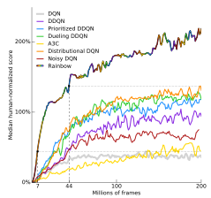
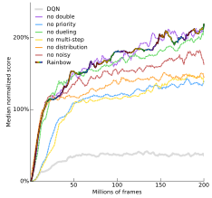

# ディープラーニングの心理学的解釈 (心理学特講IIIA)

<a href='mailto:educ0233@komazawa-u.ac.jp'>Shin Aasakawa</a>, all rights reserved. 
Date: 12/Nov/2021 
Appache 2.0 license 

# 第 21 回 強化学習 3

# 資料

* [TD (時間差)学習, SARSA, 期待 SARSA, Q 学習 と Python 実装](https://colab.research.google.com/github/komazawa-deep-learning/komazawa-deep-learning.github.io/blob/master/2021notebooks/2021_1105Sarsa_Q_learning_expected_sarsa.ipynb)

* [REINFORCE.js](https://komazawa-deep-learning.github.io/reinforcejs/)

<!-- ## 実習ファイル

- [ランダム探索  ](https://colab.research.google.com/github/ShinAsakawa/2019komazawa/blob/master/notebooks/2019komazawa_rl_ogawa_2_2_maze_random.ipynb)
- [方策勾配法  ](https://colab.research.google.com/github/ShinAsakawa/2019komazawa/blob/master/notebooks/2019komazawa_rl_ogawa_2_3_policygradient.ipynb)
- [SARSA  ](https://colab.research.google.com/github/ShinAsakawa/2019komazawa/blob/master/notebooks/2019komazawa_rl_ogawa_2_5_Sarsa.ipynb)
- [Q学習  ](https://colab.research.google.com/github/ShinAsakawa/2019komazawa/blob/master/notebooks/2019komazawa_rl_ogawa_2_6_Qlearning.ipynb)
-->

<!-- https://github.com/ShinAsakawa/2019komazawa/blob/master/notebooks/2019komazawa_rl_ogawa_2_2_maze_random.ipynb)-->
<!--(https://github.com/ShinAsakawa/2019komazawa/blob/master/notebooks/2019komazawa_rl_ogawa_2_3_policygradient.ipynb)-->
<!--(https://github.com/ShinAsakawa/2019komazawa/blob/master/notebooks/2019komazawa_rl_ogawa_2_5_Sarsa.ipynb)-->
<!--(https://github.com/ShinAsakawa/2019komazawa/blob/master/notebooks/2019komazawa_rl_ogawa_2_6_Qlearning.ipynb)-->

# RAINBOW

 
出典: @2018Hessel_Rainbow 左は各アルゴリズム単体の成績，右はアブレーション (ablation:廃止) 実験による性能低下

DDQN: 二重DQN，prioritized DQN 優先DQN，Dueling DQN 決闘DQN，A3C 非同期アドバンテージ，アクタークリティック,
Distributional DQN 分散DQN，Noisy DQN

# 個別のゲームタイトル

 

出典: Hassel+2018 <!--[@2018Hessel_Rainbow]--> の付録より

| Game               |  DQN|     A3C     |   DDQN | Prior. DDQN | Duel. DDQN | Distrib. DQN | Noisy DQN | Rainbow  |
|:------------------:|-----:|-----------:|-------:|------------:|-----------:|-------------:|----------:|----------:|
| ブロック崩し        |354.5 |**681.9**    |  368.9| 371.6       |      411.6 |        548.7 |   423.3   | 379.5    |
|モンテズーマの復習 | 47.0 |    67.0     |   42.0|        13.0 |       22.0 |        130.0 |     55.0  | **154.0**|
|プライベートアイ   |207.9 | 206.9       | -575.5|  179.0      |      292.6 |     5,717.5  |**5,955.4**| 1,704.4  |
|スペースインベーダー  |1293.8| **15,730.5**| 2628.7| 9,063.0     |    5,993.1 |      6,368.6 |   1,697.2 | 12,629.0 |

Human starts の評価: 訓練中に最高得点を獲得したエージェント・スナップショットから 200 回のテスト・エピソードで平均化した全ゲームの生得点。
DQN, A3C, DDQN, Dueling DDQN, Prioritized DDQN については，公表された得点を掲載。Distributional DQN と Rainbow については，著者自身によるエージェントの評価。
<!--
Human Starts evaluation regime: Raw scores across all games, averaged over 200 testing episodes, from the agent snapshot that obtained the highest score during training. 
We report the published scores for DQN, A3C, DDQN, Dueling DDQN, and Prioritized DDQN. For Distributional DQN and Rainbow we report our own evaluations of the agents.
-->

|             Game |        DQN  |   DDQN  | Prior. DDQN |    Duel. DDQN | Distrib. DQN |  Noisy DQN |  Rainbow |
|:----------------:|------------:|---------:|------------:|-------------:|-------------:|-----------:|---------:|
| ブロック崩し  |     385.5  |     418.5 |       381.5 |      345.3 |     **612.5**  |      459.1 |    417.5 |
| モンテズーマの復習 |       0.0 |       0.0 |         0.0 |        0.0 |          367.0 |        0.0 |   **384.0**|
| プライベートアイ |     146.7 |     129.7 |       200.0 |      103.0 |  **15,172.9**  |    3,966.0 |    4,234.0 |
| スペースインベーダー |    1692.3 |    2525.5 |     7,696.9 |    6,427.3 |        6,869.1 |    2,145.5 |  **18,789.0**|

No-op starts 

No-op starts の評価: 訓練中に最高得点を得たエージェント・スナップショットから 200 回のテスト・エピソードで平均化した全ゲームの生得点。
DQN, DDQN, Dueling DDQN, Prioritized DDQN については，公表されている得点。Distributional DQN と Rainbow については，著者自身によるエージェントの評価。
A3C については，論文では no-ops 体制での得点が報告されていないため，掲載していない。
<!--
No-op starts evaluation regime: Raw scores across all games, averaged over 200 testing episodes, from the agent snapshot that obtained the highest score during training. 
We report the published scores for DQN, DDQN, Dueling DDQN, and Prioritized DDQN. For Distributional DQN and Rainbow we report our own evaluations of the agents. A3C is not listed since the paper did not report the scores for the no-ops regime.
-->

<!-- 
- 価値を $V$ で表せば， $V = \pi(s)$ あるいは $V = Q(s,a)$ である。あるいは $Q(a\vert s) = p(a\vert s)$ と書けば，条件付き確率の表記法ににて，状況 $s$ において，行為 $a$ を行った場合の価値のようにも表記することがある。
- $Q$ が $\theta$ をパラメータとするニューラルネットワークで表されているとすると，以下のように表記すれば，ニューラルネットワークにおける学習と同一の表記となる

$$
\Delta\theta = \alpha\nabla J(\theta) = \frac{\partial}{\partial \theta}J(\theta)
$$

$$
\Delta\theta = \alpha\nabla_\theta \pi(s) = \alpha\nabla \pi(s;\theta) = \frac{\partial}{\partial \theta}\pi(s;\theta)
$$
-->

# 復習

エージェントと環境

- **環境** は **エージェント** に **観測** $S_t$ を与える。各離散時間ステップ $t=0,1,2\ldots$ において エージェントは **行動** $A_t$ を選択して応答
- 環境は次の報酬 $R_{t+1}$, 割引 $\gamma_{t+1}$, 状態 $S_{t+1}$ を与える。
この相互作用は，**マルコフ決定過程 (Markov Decision Process, or MDP)** $\left< \mathcal{S},\mathcal{A},T,r,\gamma \right>$ として定式化される。
$\mathcal{A}$ は有限の行動集合 $T(s,a,s')=P\left[S_{t+1}=s'\mid S_t=s,A_t=a\right]$ は(確率的な)遷移関数である。
- $R(s,a) = \mathbb{E}[R_{t+1} \mid S_t=s, A_t=a]$ は報酬関数、$\gamma\in [0,1]$ は割引係数である。
- エピソード終了時に $\gamma_t=0$ となる場合を除き MDP は一定の エピソード的 であるが、アルゴリズムは一般的な形式で表現される。

* 各離散的な時間ステップ $t=0, 1, 2\ldots$ において，環境はエージェントに観測値 $S_{t}$ を与え， エージェントは行動 $A_{t}$ を選択して応答し，次に環境は次の報酬 $R_{t+1}$，割引 $\gamma_{t+1}$，状態$S_{t+1}$ を与える。
<!-- * この相互作用はマルコフ決定過程 (Markov Decision Process, MDP) として形式化され、$\left< \mathcal{S}, \mathcal{A}, T, r, \gamma \right>$ というタプルになる。
$T(s, a, s') = P[S_{t+1}=s'\mid S_{t}=s,A_{t}=a]$ は (確率的)遷移関数 $r(s,a)= \mathbb{E}\[R_{t+1} \mid S_{t}=s, A_{t}=a]$ は報酬関数，$\gamma \in \[0,1\]$ は割引率である。
実験では MDP はエピソード終了時に $\gamma_{t}=0$ となる以外は，定数 $\gamma_{t}=\gamma$ のエピソディックなものとしますが，アルゴリズムは一般的な形式で表されます。
-->

<!-- 
At each discrete time step $t=0, 1, 2\ldots$, the environment provides the agent with an observation $S_t$, the agent responds by selecting an action $A_t$, and then the environment provides the next reward $R_{t+1}$, discount $\gamma_{t+1}$, and state $S_{t+1}$. 
This interaction is formalized as a マルコフ決定過程 (Markov Decision Process, or MDP), which is a tuple $\left< \mathcal{S}, \mathcal{A}, T, r, \gamma \right>$, where $\mathcal{S}$ is a finite set of states, $\mathcal{A}$ is a finite set of actions, $T(s, a, s') = P[S_{t+1}=s'\mid S_t=s,A_t=a]$ is the (stochastic) transition function, $r(s,a) = \mathbb{E}[R_{t+1} \mid S_t=s, A_t=a]$ is the reward function, and $\gamma \in [0,1]$ is a discount factor. In our experiments MDPs will be episodic with a constant $\gamma_{t}=\gamma$, except on episode termination where $\gamma_{t}=0$, but the algorithms are expressed in the general form. 
-->

- エージェントの 行動選択は 各状態に対する行動の確率分布を定義した方策 $\pi$ で与えられる。
- 時刻 $t$ で遭遇した状態 $S_t$ から 割引後のリターン $G_t=\sum_{k=0}^{\infty}\gamma_{t}^{(k)} R_{t+k+1}$ を定義する。エージェントが収集した将来の報酬の割引合計を表す。
ここで、将来の報酬 $k$ ステップの割引は、それまでの割引の積で与えられ $\gamma_t^{(k)} = \prod_{i=1}^{k}\gamma_{t+i}$  エージェントは、良い政策を見つけることによって、期待されるディスカウントされたリターンを最大化することを目的とする。

<!--
On the agent side, action selection is given by a policy $\pi$ that defines a probability distribution over actions for each state. From the state $S_t$ encountered at time $t$, we define the discounted return $G_t =\sum_{k=0}^{\infty} {\gamma_t^{(k)} R_{t+k+1}}$ as the discounted sum of future rewards collected by the agent, where the discount for a reward $k$ steps in the future is given by the product of discounts before that time, $\gamma_t^{(k)} = \prod_{i=1}^{k} \gamma_{t+i}$. An agent aims to maximize the expected discounted return by finding a good policy.
-->

- **方針(ポリシー)** は 直接学習されてもよいし，他の学習された量の関数として構築されてもよい。
- 価値に基づく強化学習では，エージェントは，与えられた状態 $v^{\pi}(s)=E_{\pi}\left[G_t| S_t=s\right]$ または，
状態-行動のペア 
$q^{\pi}(s,a)=E_{\pi} [G_t\mid S_{t}=s, A_{t} =a ]$ から，方針(ポリシー) $\pi$ 
に従うとき，期待される割引されたリターン，または，価値の推定値を学習する。
- 状態-行動関数から新しい方針(ポリシー) を導出する一般的な方法は，行動値に対して $\epsilon$-貪欲に行動することである。
これは，確率 $(1-\epsilon)$ で最も高い値の行動(Greedy) を取り，それ以外は確率 $\epsilon$ で一様にランダムに行動することに相当。
この種の方策は 「探索」を導入するために使用される：
- 現在の推定値に応じて，最適でない行動をランダムに選択することによって，エージェントは，適切なときに推定値を発見し，修正することができる。
- 主な制限は，将来に向けた代替行動コースを発見することが困難であることである。

<!-- The policy may be learned directly, or it may be constructed as a function of some other learned quantities. In value-based reinforcement learning, the agent learns an estimate of the expected discounted return, or value, when following a policy $\pi$ starting from a given state, $v^\pi(s)=E_\pi[G_t| S_t =s]$, or state-action pair, $q^\pi(s,a) = E_\pi[G_t|S_t=s, A_t =a]$. A common way of deriving a new policy from a state-action value function is to act $\epsilon$-greedily with respect to the action values. This corresponds to taking the action with the highest value (the \textit{greedy} action) with probability $(1-\epsilon)$, and to otherwise act uniformly at random with probability $\epsilon$. Policies of this kind are used to introduce a form of \textit{exploration}: by randomly selecting actions that are sub-optimal according to its current estimates, the agent can discover and correct its estimates when appropriate. The main limitation is that it is difficult to discover alternative courses of action that extend far into the future; this has motivated research on more directed forms of exploration. -->

- **動作主** (エージェント) は，**環境** あるいは **外界**から，**状態** $s$ と**報酬** $r$ とを受け取る。逆に言えば，環境 は 動作主 に対して，状態 と 報酬 とを提供する
- 動作主 は 環境 に働きかけて，環境と相互作用して，動作主の報酬を最大化しようとする。
このときの報酬は，方向性を持たない値 スカラ である。
たとえば，犬など動物の躾，調教を行う場面を考える。飼い主は，動物に対して，褒めるか叱るか，のいずれかを行う。
これがスカラ値に相当する。すなわち，どの行動が，どのように良かったのか，あるいは，何がイケナイから罰を受けたのかは，教えない。
動物の場合，言葉が通じないので内容については伝達しようがない。 
躾を受ける側の動物が，報酬（あるいは罰）を受け取ることで，行動を変容させる。

- 方策 (ポリシー) : $\pi(s)$  状況，あるいは 状態 を $s$ で表す。
$s$ における（あるいは取りうる）価値を表す ポリシーの頭文字 $p$ を使わず，対応するギリシャアルファベット $\pi$ を使うのは，確率を表す $p$ との混乱を避ける意味もある。
- 行動，あるいは 行為 を $a$ で表す。
- Q 行動価値関数: 状況 $s$ において，行為 $a$ を行う際に得られる価値を $Q(s,a)$ と表記する。

- 最適行動価値 optimal Q values $Q^{* }$ (キュースターと発音)

$$
Q^{* }(s,a)=\mathbb{E}_{s'}\left[r+\gamma\max_{a'} Q(s',a')^{* }\mid s,a\right]
$$

上式 RHS を $r+\gamma\max_{a'} Q(s',a')^{* }$ を教師信号として扱う

平均 2 乗誤差 (MSE)

$$
\ell =\left(r+\gamma\max_{a'} Q(s',a')^{* }- Q(s,a)\right)^{2}
$$

# REINFORCE: Monte Carlo Policy Gradient

@2018SuttonBartoRL chapt 13.3

 -->

<!-- # アタリのゲームによるランキング

- [Atari Games on Atari 2600 Freeway](https://paperswithcode.com/sota/atari-games-on-atari-2600-freeway)

 

-->

ただし，Q 学習では不安定であった。DQN では， **経験再生** を用いることで，系列間相関と，教師信号の安定性を解決

# 二重 DQN (Double DQN)

[@2015Hasselt_doubleDQN]

最大の Q を求めるときに，自身の Q の計算が入っている，これを 2 つの Q 関数を並行して用いることで解消。

<!--
#### 分散優先体験リプレイ (Distributed Priooritized replay (APE-X))
@2016Schaul_prioritized_replay;@2018Horgan_APE-X
-->

<!-- 
#### 逆強化学習 (Inverse RL) 
@1998Russell_inverse_reinforcement_learning;@2000NgRussell_InverseRL

逆とは，価値の推定
-->

Q 学習の際に，Q を最大にする行動を使って，Q の値を更新することが行われる。
具体的な更新式の核心部分は以下のとおり:

$$
R_{t+1} + \gamma Q\left(S_{t+1},\arg\max_a Q\left(S_{t+1},a\right)\right).
$$

Q を評価する際に，内部で Q を評価している。Q の評価が不当になる可能性があるので，Q の評価と更新とを別々の Q 関数を用意して，公平性を保証する

# 優先的経験再生 Prioritized replay. 

<!-- DQN samples uniformly from the replay buffer. Ideally, we want to sample more frequently those transitions from which there is much to learn. 
As a proxy for learning potential, prioritized experience replay (Schaul et al. 2015) samples transitions with probability ptrelative to the last encountered absolute TD error:
 -->

- DQN では 再生バッファから一様にサンプリングする。
- 理想的には 学習すべきことが多い遷移をより頻繁にサンプリングしたい
- そこで **優先的経験再生** (Schaul+2015) では 最後に遭遇した誤差が大きな系列を優先的にサンプリング 

$$
p_t\propto \left|
R_{t+1}+\gamma_{t+1}\max_{a'} Q(s_{t+1},a') - Q(s_t,a_t)
\right|^\omega
$$

$\omega$ はハイパーパラメータで，$\omega=0.5$ 

# 決闘ネットワーク (Dueling Network) 
@2016Wang_dueling。 Q 関数（⾏動価値）を価値関数と⾏動との差 (アドバンテージ) として分岐したニューラルネットワークで表現

 
ドュエリング(決闘) ネットワークの模式図 (Wang+2016)

<!-- 
決闘ネットワークは，価値ベースの RL のために設計されたニューラルネットワークアーキテクチャ。
これは，価値ストリームとアドバンテージストリームという 2 つの計算ストリームを特徴としており，畳み込み符号化器を共有し，特別な集計装置 (アグリゲータ)によってマージされます (Wang et al. 2016)。
これは，アクション値の以下の因数分解に対応しています。
The dueling network is a neural network architecture designed for value based RL. 
It features two streams of computation, the value and advantage streams, sharing a convolutional encoder, and merged by a special aggregator (Wang et al. 2016). 
This corresponds to the following factorization of action values:
-->

$$
Q(s,a) = v(s) + a(s,a) - \frac{\sum_{a'}a(s,a')}{N_{\text{行動}}}
$$

# A3C 

### アクタークリティック actor critic

- AC: アクター（行為者） Actor と クリティック (Critic) 批評家。アクターは方策（ポリシー）の改善を行い，クリティックは価値の更新を行う。Q 学習は，アクターとクリティックの両者を含む。
- アドバンテージ: $Q(s,a) - V(s)$ Q の引数は 状態と行為との２つから，報酬を定義，一方 価値関数とは 状況 から報酬を定義なので，この差をアドバンテージと呼ぶ

- Asyncronous Advantage Actor Critic

- A3C とは，アドバンテージ付きの DQN を非同期更新したもの

<!-- #### 逆強化学習 Inverse Reinforcement Learning

@2000NgRussell_InverseRL

観察された行動から報酬関数を推測する。
-->

<!-- 
# マルチステップ強化学習 (Multi-step RL)

@Sutton_and_Barto1998 DQNでは1-stepの報酬を⽤いて、教師データを作成しているが、これをn-stepに拡張することで、学習が促進される場合がある
 -->

# 分散 DQN あるいはカテゴリカル DQN とも呼ばれる (Categorical DQN)

@2017Bellemare_C51

<!-- 
We can learn to approximate the distribution of returns instead of the expected return. 

Recently Bellemare, Dabney, and Munos (2017) proposed to model such distributions with probability masses placed on a discrete support z, where z is a vector with $N_{\text{atoms}}\in\matcal{N}^{+}\text{atoms}$, defined by $z^i = v_{\min} + (i-1)\frac{v_{\max}-v_{\min}}{V_{\text{atom}}-1}$. 
The approximating distribution dt attime t is defined on this support, with the probability mass pi(St;At) on each atom i, such that dt = (z; p(St;At)).
The goal is to update such that this distribution closely matches the actual distribution of returns.
-->

期待報酬を離散値ではなく，N 分割したヒストグラムとして表現，

# ノイズネットワーク (Noisy networks)

@2018Fortunato_noisy_networks

<!--
#### 優先体験レプレイ (Prioritized Experience Replay)

- DQN では Experience Reply の活⽤が学習の効率化に寄与していた。
- それは，経験をランダムにサンプルすることで i.i.d. に近づく，および 学習に有⽤なレアな経験の再利⽤性を⾼める。
だが，経験をストアするためには⼤きな記憶領域が必要。
再⽣する記憶には、学習を促進するものとそうではないものがあるはずで，importance sampling によって悪影響を緩和
-->

<!-- 
The limitations of exploring using $\epsilon$-greedy policies are clear in games such as Montezuma’s Revenge, where many actions must be executed to collect the first reward.
Noisy Nets (Fortunato et al. 2017) propose a noisy linear layer that combines a deterministic and noisy stream,
-->

 イプシロン 貪欲 ($\epsilon$-グリーディ) な探索を用いる時の効率の悪さを乱数を加えることで軽減。
 経験を保持するためには⼤きな記憶領域が必要。
 <!--再⽣する記憶には、学習を促進するものとそうではないものがあるはずで，importance samplingによって悪影響を緩和-->
 例えば，モンテズーマの復讐では，鍵を探し出して，その鍵を使って局面を打開するまでに要するエピソードの長さから，最初に報酬を得られるまでのエピソード系列が長いので，探索行動の効率が悪い。

# 非同期 強化学習

- 非同期更新については省略します。ですが，複数のエージェントを同時に実行し，その結果を束ねることで性能の改善が見込まれます。下図を見てください。

- A3C, [Gorila](Massively Parallel Methods for Deep Reinforcement Learning), [IMPALA](https://arxiv.org/abs/1802.01561), [APE-X](https://arxiv.org/abs/1803.00933), [NGU](https://arxiv.org/abs/2002.06038) (Never Give Up!)

- [Never Give Up ICLR 2020 デモビデオ](https://sites.google.com/view/nguiclr2020)

<!-- 
- モンテズーマ・リベンジ オンライン版 <https://www.retrogames.cz/play_124-Atari2600.php>

<video width="15%" autoplay loop markdown="0" controls muted>
<source src="assets/openai_atari-reset_git_monte_video.mp4">
</video> 
出典: モンテズーマの復讐の解<https://github.com/openai/atari-reset>

-->

# まとめ

- RAINBOW とは，複数の改善手法の全部乗せ。(RAINBOW = DDQN + Prioritized DDQN + Dueling DQN + A3C + Distributional DQN + Noisy DQN)
- アブレーションによる評価から，複数の手法が同時に性能向上に関与している
- 非同期更新 GORILA, APE-X, R2D2, NGU

<!-- 

## APE-X 
@2018Horgan_APE-X

## TRPO (Trust Region Policy Optimization)
@2015Schulman_trpo

## IMPALA
<https://deepmind.com/blog/impala-scalable-distributed-deeprl-dmlab-30/>

#### TPRO と PPO
- source: <https://blog.syundo.org/post/20171204-reinforcement-learning-natural-policy-gradient-trpo-ppo/>
- さらに，上のトップ: <https://blog.syundo.org/post/20180115-reinforcement-learning/>

##### TRPO 

最適化計算における更新ステップの計算に KL ダイバージェンスによる制約を加えたものが TRPO (Trust Region Policy Optimization) である。
この方法は、を KL ダイバージェンスで拘束しているため、近似的には自然勾配法と同様の手法となる。
TRPO は方策勾配法に限らず、モデルなし学習においても利用することができるが、以下では方策勾配法と組み合わせることを前提に述べる。

さて、$\theta$ でパラメタライズされた方策  $\pi_\theta(a\vert s)$ がある場合、方策勾配が

$$
\hat{g} = \mathbb{E}_\pi\left[ \nabla_\theta \log\pi_\theta(a\vert s)A^{\pi}(s,a)\right]
$$
 
であった。これは、以下の値 $L_\theta$ の微分値である。 

$$
L_\theta(\theta)=\mathbb{E}_\pi\left[\log \pi_\theta(a\vert s)A^{\pi}(s,a)\right]
$$
 
このとき、更新のステップを制限するために、以下のようにKLダイバージェンスで制約を課して最大化を行う。

$$
\text{maximize}_{x} L_{\theta_{\text{old}}}(\theta)
$$

$$
\text{subject to } D_{KL}(\theta_{\text{old}},\theta)\le\delta
$$
 
ここで、 $\theta_{\text{old}}$ は $\pi_\theta$ におけるパラメタ $\theta$ の前の値である。
また、$D_{KL}$ は確率分布 $\pi_\theta$ と $\pi_{\theta_{\text{old}}}$ の間の KL ダイバージェンスであり、 $D_{KL}\max(\theta_{\text{old}},\theta)$ は任意のパラメタの組み合わせに対して、KLダイバージェンスを計算したときの最大値を表す。

実用的には組み合わせが膨大になり、最大値を求めるのは難しいため、制約はヒューリスティックに以下のように平均値で代用する。
$$
\text{maximize}_x L_{\theta_{\text{old}}}(\theta)$$
$$

$$
\text{subject to} D_{KL}^{\max}(\theta_{\text{old}},\theta) \le \delta
$$
 
ここで、 $\bar{D}_{KL}(\theta_{\text{old}},\theta)=\mathbb{E}_{s\sim p}\left[D_{KL}(\pi_\theta(\cdot\vert s),\pi_{\theta_2}(\cdot\vert s)\right]$ である。

ただし、制約において問題を解くのは簡単ではないので、以下のようにソフト制約を使う形に書き下す。

$$
\text{maximize}_x \mathbb{E}_\pi\left[L_{\theta_{\text{old}}}(\theta)-\beta\bar{D}_{KL}(\theta_{\text{old}},\theta)\right]
$$
 
以上が、TRPO の概要である。
-->

<!-- 
##### PPO 

PPO (Proximal Policy Optimization) は方策の目標値をクリッピングすることで、おおまかに方策の更新を制約する方法である。
TRPO では KL ダイバージェンスを制約として利用していたが、PPO では、目的関数を以下の $L^{\text{clip}}$ として、勾配を求める。

$$
L^{\text{CLIP}}(\theta) = \hat{\mathbb{E}}_t\left[\min(r_t(\theta)\hat{A}_t,\text{clip}(r(\theta),1-\epsilon,1+\epsilon)\hat{A}_t)\right]
$$
 
ここで、$r_t(\theta)$ は確率の比率であり、

$$
r_t(\theta) = \frac{\pi_\theta(s_t,a_t)}{\pi_{\theta_{\text{old}}}(s_t,a_t)}
$$

である。また、$\text{clip}(r(\theta), 1−\epsilon, 1+\epsilon)$ は $r(\theta)$ が $1−\epsilon} あるいは $1+\epsilon$ を超過しないように制限する関数である。
$\text{clip}(r(\theta), 1−\epsilon , 1+\epsilon)^At$ の グラフと、$L^{\text{CLIP}}$ を以下に示す(John Schulmanらより引用)。
 -->

