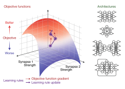
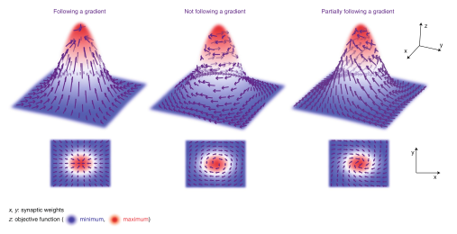
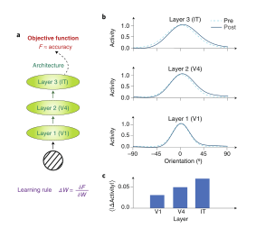
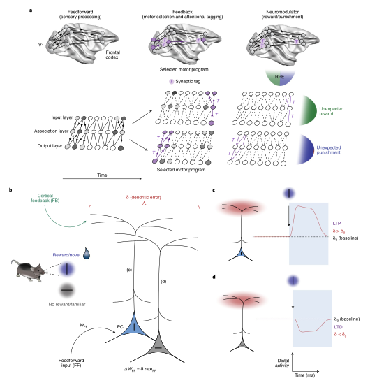

- title: A deep learning framework for neuroscience
- author: Blake A. Richards, Timothy P. Lillicrap, Philippe Beaudoin, Yoshua Bengio, Rafal Bogacz, Amelia Christensen, Claudia Clopath, Rui Ponte Costa, Archy de Berker, Surya Ganguli, Colleen J. Gillon, Danijar Hafner, Adam Kepecs, Nikolaus Kriegeskorte, Peter Latham, Grace W. Lindsay, Kenneth D. Miller, Richard Naud, Christopher C. Pack, Panayiota Poirazi, Pieter Roelfsema, Joao Sacramento, Andrew Saxe, Benjamin Scellier, Anna C. Schapiro, Walter Senn, Greg Wayne, Daniel Yamins, Friedemann Zenke, Joel Zylberberg, Denis Therien, Konrad P. Kording.
- year: 2019
- journal: Nature Neuroscience
- pages: 1761-1770

- abstract:
システム神経科学は、知覚、認知、運動などのさまざまなタスクを脳がどのように実行しているかを説明しようとするものである。
一方、人工知能は、解決しなければならない課題に基づいて計算システムを設計しようとするものである。
人工ニューラルネットワークでは、目的関数、学習規則、アーキテクチャの 3 つの要素が設計で指定されます。
脳にインスパイアされたアーキテクチャを利用した深層学習の成功に伴い、これらの 3 つの設計要素は、複雑な人工学習システムのモデル化、エンジニアリング、最適化の方法の中心となってきています。
ここでは、これらの構成要素にもっと焦点を当てることが、システム神経科学にも役立つと主張する。
この最適化ベースのフレームワークが、神経科学における理論的・実験的な進歩をどのように促すかについて、例を挙げて説明する。システム神経科学に対するこのような原則的な視点が、より迅速な進歩をもたらすことになると考えている。
<!-- Systems neuroscience seeks explanations for how the brain implements a wide variety of perceptual, cognitive and motor tasks.
Conversely, artificial intelligence attempts to design computational systems based on the tasks they will have to solve. 
In artificial neural networks, the three components specified by design are the objective functions, the learning rules and the architectures. 
With the growing success of deep learning, which utilizes brain-inspired architectures, these three designed components have increasingly become central to how we model, engineer and optimize complex artificial learning systems. 
Here we argue that a greater focus on these components would also benefit systems neuroscience. 
We give examples of how this optimizationbased framework can drive theoretical and experimental progress in neuroscience. 
We contend that this principled perspective on systems neuroscience will help to generate more rapid progress.
-->

大きな技術的進歩により, 脳を大規模に観察・操作したり, 複雑な行動を定量化したりする能力に革命が起きている (1,2)。
では, これらのデータをどのように活用して脳のモデルを構築していけばよいの？
システム神経科学の古典的な枠組みが構築された当時は, 小さなニューロンセットからしか記録できまかった。
この枠組みでは, 研究者は神経活動を観察し, 個々のニューロンが何を計算しているかについての理論を構築し, 次にニューロンがどのように操作を組み合わせているかについての回路レベルの理論を組み立てる。
この方法は, 単純な計算には有効である。
例えば, 中枢パターン発生器がリズミカルな動きを制御する仕組み(3), 前庭眼反射が視線の安定化を促進する仕組み(4), 網膜が動きを計算する仕組み(5) などがわかっている。
しかし, この古典的な枠組みは, 何千ものニューロンの記録や, 説明したいと考えているすべての行動に対応できるのだろうか？
おそらく, 新皮質や海馬のように, 多数の機能を実行する大規模な神経回路では, 古典的なアプローチはあまり成功していないのではないだろうか。
このような回路では, 簡潔にまとめるのが難しい反応特性を持つニューロンがよく見つかる (6,7)。
<!-- Major technical advances are revolutionizing our ability to observe and manipulate brains at a large scale and to quantify complex behaviors(1,2). 
How should we use this data to develop models of the brain? When the classical framework for systems neuroscience was developed, we could only record from small sets of neurons. 
In this framework, a researcher observes neural activity, develops a theory of what individual neurons compute, then assembles a circuit-level theory of how the neurons combine their operations. 
This approach has worked well for simple computations.
For example, we know how central pattern generators control rhythmic movements(3), how the vestibulo-ocular reflex promotes gaze stabilization4 and how the retina computes motion(5). 
But can this classical framework scale up to recordings of thousands of neurons and all of the behaviors that we may wish to account for? 
Arguably, we have not had as much success with the classical approach in large neural circuits that perform a multitude of functions, like the neocortex or hippocampus. 
In such circuits, researchers often find neurons with response properties that are difficult to summarize in a succinct manner(6,7). -->

古典的な枠組みでは限界があるため, 実験の進歩を生かすためには新しいアプローチが必要である。
神経科学と人工知能 (AI) の間の相互作用から, 有望なフレームワークが生まれつつある (8-10)。
機械学習の代表的な手法として深層学習が登場したことで, 人工ニューラルネットワーク (ANN) が見直されている。
ANN は 実際のニューロンの統合および活性化の特性を 大まかに模倣した単純化されたユニットを用いて, 神経計算をモデル化するものである (11)。
ユニットは, 非常に単純化された線形演算から, 複数のコンパートメントやスパイクなどを含む比較的複雑なモデルまで, さまざまな抽象度で実装される (11-14)。
重要なのは, ANN が実行する特定の計算は, 設計するのではなく, 学習するということである (15)。
<!-- The limitations of the classical framework suggest that new approaches are needed to take advantage of experimental advances.
A promising framework is emerging from the interactions between neuroscience and artificial intelligence (AI) (8–10). 
The rise of deep learning as a leading machine-learning method invites us to revisit artificial neural networks (ANNs). 
At their core, ANNs model neural computation using simplified units that loosely mimic the integration and activation properties of real neurons(11). 
Units are implemented with varying degrees of abstraction, ranging from highly simplified linear operations to relatively complex models with multiple compartments, spikes, and so on(11–14). 
Importantly, the specific computations performed by ANNs are not designed, but learned(15). -->

すなわち, 学習目標は, 最大化または最小化されるべき目的関数 (または損失関数) として表される。
シナプスの重みの更新として表現される学習規則のセット。
そして, 情報を流すための経路や接続として表現される ネットワークアーキテクチャである (図1) (15)。
このフレームワークでは, 計算がどのように実行されるかを要約するのではなく, どのような目的関数, 学習規則, アーキテクチャがその計算の学習を可能にするかを要約している。
<!-- However, human design still plays a role in determining three essential components in ANNs: the learning goal, expressed as an objective function (or loss function) to be maximized or minimized;
a set of learning rules, expressed as synaptic weight updates; 
and the network architecture, expressed as the pathways and connections for information flow (Fig. 1)(15). 
Within this framework, we do not seek to summarize how a computation is performed, but we do summarize what objective functions, learning rules and architectures would enable learning of that computation.
-->

 

図 1.
ANN 設計の 3 つの核となる要素。
ANN を設計するとき ネットワークが実行する特定の計算を作るのではなく 以下の 3 つの要素を指定する。
**目的関数** は タスクにおけるネットワークのパフォーマンスを定量化する。
学習は 目的関数を最大化または最小化するシナプスの重みを見つける。
**学習規則** は シナプスの重みを更新するためのレシピを提供する。
これにより 目的関数の明示的な勾配に従わなくても 目的関数を上昇させることができる。
**アーキテクチャ** は ネットワーク内のユニットの配置を指定し, 情報の流れや, ネットワークが学習可能な計算, 不可能な計算を決定する。
<!-- The three core components of ANN design. 
When designing ANNs, researchers do not craft the specific computations performed by the network. 
Instead they specify these three components. 
Objective functions quantify the performance of the network on a task, and learning involves finding synaptic weights that maximize or minimize the objective function.
(Often, these are referred to as ‘loss’ or ‘cost’ functions.) Learning rules provide a recipe for updating the synaptic weights. 
This can lead to ascent of the objective, even if the explicit gradient of the objective function isn’t followed. 
Architectures specify the arrangement of units in the network and determine the flow of information, as well as the computations that are or are not possible for the network to learn.
-->

	

深層学習は, 古くからある ANN のアイデアをリブランディングしたものと考えられる(11)。
深層 ANN は, フィードフォワードまたは時間経過によるリカレントの複数の層を持つ。
「層」は 生物の脳の特定の層というよりも, 脳の領域に類似していると考えるのが最適である (16, 17)。
深層学習とは, 特に, 階層化された ANN をエンド・ツー・エンドで学習することである。
階層の各層の可塑性が学習目標に寄与するようにする(15)。
これには、「信用割り当て問題」(Box 1) の解決が必要である (18, 19)。
近年 深層学習の進歩は 必要な計算を効率的に処理できる GPU (Graphics Processing Unit) を使用して, より大きなデータセットで学習された, より大きな ANN を使用することによってもたらされた。
このような開発により, 画像(20) , 音声(21)の分類と生成, 言語処理と翻訳(22), 触覚と把持(23), ナビゲーション(24), 感覚の予測(25), ゲームプレイ(26),  推論(27)など, 多くの新しい問題に対するソリューションが生み出されている。
<!-- Deep learning can be seen as a rebranding of long-standing ANN ideas(11). 
Deep ANNs possess multiple layers, either feedforward or recurrent over time. 
The ‘layers’ are best thought of as being analogous to brain regions, rather than as specific laminae in biological brains(16,17). 
‘Deep’ learning specifically refers to training hierarchical ANNs in an end-to-end manner, such that plasticity in each layer of the hierarchy contributes to the learning goals15, which requires a solution to the ‘credit assignment problem’ (Box 1)(18,19). 
In recent years, progress in deep learning has come from the use of bigger ANNs, trained with bigger datasets using graphics processing units (GPUs) that can efficiently handle the required computations. 
Such developments have produced solutions for many new problems, including image(20) and speech(21) classification and generation, language processing and translation(22), haptics and grasping(23), navigation(24), sensory prediction(25), game playing(26) and reasoning(27).
-->

最近の多くの知見は, 深層学習が脳の理論に役立つことを示唆している。
まず, 深層ANN は, 霊長類の知覚システムにおける表現変換を, 場合によっては忠実に模倣することができ(17, 28), それによって神経活動を操作することができることが示されている(29)。
第二に, グリッドセル(24), 形状同調(30), 時間的受容野(31), 錯視(32), モデルベース推論(33) など, 多くのよく知られた行動および神経生理学的現象が, 動物が解決したものと同様の課題で訓練された深層 ANN で現れることが示されている。
第三に, 多くのモデリング研究により, 典型的な誤差逆伝播アルゴリズム (backpropagation-of-error algorithm) の力を模倣できる学習アルゴリズムなどのエンド・ツー・エンドの学習規則の見かけ上の生物学的非現実性が実証されている。
of-errorアルゴリズム（backprop）を模倣した学習アルゴリズムなど、エンド・ツー・エンドの学習規則は、一見すると生物学的にはあり得ないことが明らかになりました (図 2 および 囲み記事 1)。
細胞や細胞内の電気生理, 抑制性微小回路, スパイクのタイミングのパターン, 短期的な可塑性, フィードバック接続などについて比較的簡単な仮定を置くことで, 生物学的システムが深層 ANN におけるバックプロップのような学習を近似的に行うことができる (12, 14, 34-39)。
したがって, ANN に基づく脳のモデルは, これまで考えられていたほど非現実的なものではないかもしれないし, 同時に, 多くの神経生物学的データを説明することができると思われる。
<!-- 
Many recent findings suggest that deep learning can inform our theories of the brain. 
First, it has been shown that deep ANNs can mimic, closely in some cases, the representational transformations in primate perceptual systems(17,28) and thereby can be leveraged to manipulate neural activity(29). 
Second, many well-known behavioral and neurophysiological phenomena, including grid cells(24), shape tuning(30), temporal receptive fields(31), visual illusions(32) and apparent model-based reasoning(33), have been shown to emerge in deep ANNs trained on tasks similar to those solved by animals. 
Third, many modeling studies have demonstrated that the apparent biological implausibility of end-to-end learning rules, such as learning algorithms that can mimic the power of the canonical backpropagation-
of-error algorithm (backprop) (Fig. 2 and Box 1), is overstated.
Relatively simple assumptions about cellular and subcellular electrophysiology, inhibitory microcircuits, patterns of spike timing, short-term plasticity and feedback connections can enable biological systems to approximate backprop-like learning in deep ANNs(12,14,34–39). 
Hence, ANN-based models of the brain may not be as unrealistic as previously thought, and simultaneously, they appear to explain a lot of neurobiological data. -->

 

図 2.
学習則のバイアスとバリアンス。
多くの学習則は, 明示的に勾配ベースでなくても, 目的関数の勾配の推定値を提供する。
しかし, 他の推定器と同様に, これらの学習規則は, 勾配の推定値に様々な程度の分散や偏りを示す可能性がある。
ここでは, 提案されている生物学的に妥当な学習規則のいくつかが, 誤差逆伝播法 と比較して どの程度のバイアスとバリアンスを持つかを大まかに説明する。
ここで重要なのは, 多くの学習規則の正確なバイアスとバリアンス の特性は不明であり, これは単なるスケッチに過ぎない。
例えば, 対照的なヘブ学習則, 予測コーディング(35), 樹状突起エラー学習(14), 回帰不連続計画(RDD)(91), 注意喚起強化学習 (AGREL)(37) については, その場所をクエスチョンマークで示している。
その他, バックプロパゲーション, フィードバック・アライメント(36), ノード/ウェイト摂動 (92) については, それらの既知の相対的位置を示している。
<!-- Bias and variance in learning rules. 
Many learning rules provide an estimate of the gradient of an objective function, even if they are not explicitly gradient-based. 
However, as with any estimator, these learning rules can exhibit different degrees of variance and bias in their estimates of the gradient. 
Here we provide a rough illustration of how much bias and variance some of the proposed biologically plausible learning rules may have relative to backprop. 
It is important to note that the exact bias and variance properties of many of the learning rules are unknown, and this is just a sketch. 
As such, for some of the learning rules shown here, for example, contrastive Hebbian learning, predictive coding(35), dendritic error learning(14), regression discontinuity design (RDD)(91) and attention-gated
reinforcement learning (AGREL)(37), we have indicated their location with a question mark. 
For others, namely backpropagation, feedback alignment(36) and node/weight perturbation92, we show their known relative positions. -->

	

囲み記事 1.
学習と単位割り当て問題。
学習の自然な定義は 「性能を向上させるシステムへの変更」である。
目的関数 $F(W)$ があるとしよう。
これは、現在のシナプスの重みの $N$ 次元ベクトル $W$ が与えられたときに, システムが現在どれだけうまく機能しているかを測定する。
もしシナプスの重みが $W$ から $W+\Delta W$ に変化した場合, パフォーマンスの変化は $\Delta F= F(W + \Delta W) - F(W)$ となる。
$W$ に小さな変化を与え, $F$ が局所的に滑らかであれば $\Delta F$ は重みの変化と勾配の内積でほぼ与えられる(41)。	
<!-- Learning and the credit assignment problem A natural definition of learning is ‘a change to a system that improves its performance’. 
Suppose we have an objective function, F(W), which measures how well a system is currently performing, given the N-dimensional vector of its current synaptic weights, W. 
If the synaptic weights change from W to W + ΔW, then the change in performance is ΔF = F(W + ΔW) − F(W).
If we make small changes to W and F is locally smooth, then ΔF is given approximately by the inner product between the weight change and the gradient(41),	
 -->
$$
\Delta F\approx \Delta W^{\top}\cdot \Delta_w F(W)
$$

ここで, $\Delta W F(W)$ は $W$ に関する $F$ の勾配であり, $\top$ は転置を示す。
改善された性能を保証したい, つまり, $\Delta F\ge 0$ を保証したいとする。
このとき, $W$ の局所的な変化がすべて同じ改善につながる $(N-1)$ 次元の多様性があることがわかっている。
どれを選べば良いのか？
勾配ベースのアルゴリズムは, 「そのステップサイズで最大の改善が得られる方向に小さなステップを踏みたい」という直観に基づいている。
勾配は目的の最も急な方向を指しているので, 小さなステップサイズ $\eta$, 勾配の倍数 $\Delta WF$ を選択すれば, そのステップサイズで可能な限りの改善を行うことができる。
したがって 次のようになる:
<!-- where ∇WF(W) is the gradient of F with respect to W and T indicates the transpose. 
Suppose we want to guarantee improved performance, i.e., we want to ensure ΔF ≥ 0. 
We know that there is an (N – 1)-dimensional manifold of local changes in W that all lead to the same improvement. 
Which one should we choose? 
Gradient-based algorithms derive from the intuition that we want to take small steps in the direction that gives us the greatest level of improvement for that step size. 
The gradient points in the steepest direction of the objective, so if we choose a small step size, η, times the gradient ∇WF, then we will improve as much as possible for that step size. 
Thus, we have 
-->
$$
\Delta F \approx \eta \Delta_W F(W)^{\top} \cdot \Delta_W F(W) \ge 0
$$

つまり 目的関数値は, ステップごとに ($\eta$ が小さい場合), 勾配ベクトルの長さに応じて増加する。
<!-- In other words, the objective function value increases with every step (when η is small) according to the length of the gradient vector.
-->

信用割り当ての概念は, 与えられたニューロンやシナプスが与えられた結果に対してどれだけの 「信用」や「不平」 を得るべきかを決定する問題を意味する。
より具体的には $\Delta F\ge0$ を確実にするために, システムの各パラメータ (例えば 各シナプスの重み) をどのように変化させるべきかを決定する方法である。
最も単純な形では 信用割り当て問題は, 複雑なネットワークにおいて 信用を割り当てることの難しさを意味する。
目的関数の勾配 $\Delta F(W)$ を使って重みを更新することは ANN の単位割り当て問題を解決する優れた手段であることが証明されている。
システム神経科学が直面している問題は 脳も勾配法のようなもので近似しているのかということである。
<!-- The concept of credit assignment refers to the problem of determining how much ‘credit’ or ‘blame’ a given neuron or synapse should get for a given outcome. 
More specifically, it is a way of determining how each parameter in the system (for example, each synaptic weight) should change to ensure that ΔF ≥ 0. 
In its simplest form, the credit assignment problem refers to the difficulty of assigning credit in complex networks. 
Updating weights using the gradient of the objective function, ∇WF(W), has proven to be an excellent means of solving the credit assignment problem in ANNs. 
A question that systems neuroscience faces is whether the brain also approximates something like gradient based methods.
-->

深層 ANN の勾配を計算する最も一般的な方法は 誤差逆伝播法 (15) である。
誤差逆伝播法は，合成関数の微分則 (連鎖法則) を用いて, 出力から逆方向に勾配を再帰的に計算するものである (11)。
しかし, 誤差逆伝播法は, フィードバックの重みが対称であるとか, 情報の前後の受け渡しが明確であるなど, 生物学的にはありえない仮定に基づいている(14)。
誤差逆伝播法に限らず, 多くの学習アルゴリズムが勾配の推定値を提供しており, それらの中には誤差逆伝播法の生物学的にありえない仮定の影響を受けないものもある (12,14,34-38,91,93,94)。
<!-- The most common method for calculating gradients in deep ANNs is backprop(15). 
It uses the chain rule to recursively calculate gradients backwards from the output(11). 
But backprop rests on biologically implausible assumptions, such as symmetric feedback weights and distinct forward and backward passes of information(14). 
Many different learning algorithms, not just backprop, can provide estimates of a gradient, and some of these do not suffer from backprop’s biological implausibility(12,14,34–38,91,93,94).
-->

しかし, アルゴリズムはそのバイアスとバリアンスの特性に違いがある (図2)(36,92)。
報酬によってシナプスの重みのランダムな変化を強化する weight/node 摂動法 のようなアルゴリズムは, 勾配に沿った経路の分散が大きい(92)。
勾配情報を伝えるためにランダムなフィードバック重みを用いるアルゴリズムは, 高いバイアスを持つ (36, 95)。
生物学的な現実性を維持しつつ, アルゴリズムのバイアスやバリアンスを最小化するための様々な提案がなされている (37,38)。
<!-- However, algorithms differ in their variance and bias properties (Fig. 2)(36,92). 
Algorithms such as weight/node perturbation, which reinforce random changes in synaptic weights through rewards, have high variance in their path along the gradient(92).
Algorithms that use random feedback weights to communicate gradient information have high bias(36,95). 
Various proposals have been made to minimize bias and variance in algorithms while maintaining their biological realism(37,38).
-->

こうした動きを受けて, システム神経科学のための深層学習にインスパイアされたフレームワークを検討するのに適した時期に来ている (8, 19, 40)。
ANN の基盤となる主要な原理については理解が進んでおり, これらの洞察が一般的に適用されると考える理論的な理由もある (41, 42)。
同時に, 大規模な神経集団を監視・操作できるようになったことで, 深層学習に関する文献から得られた仮説を検証する新しい方法が生まれている。
ここでは, 現代のシステム神経科学のための深層学習フレームワークの骨格を説明する。
<!-- With these developments, it is the right time to consider a deeplearning-inspired framework for systems neuroscience(8,19,40). 
We have a growing understanding of the key principles that underlie ANNs, and there are theoretical reasons to believe that these insights apply generally(41,42). 
Concomitantly, our ability to monitor and manipulate large neural populations opens the door to new ways of testing hypotheses derived from the deep learning literature.
Here we sketch the scaffolding of a deep learning framework for modern systems neuroscience.
-->

# 「課題セット」を用いた人工ニューラルネットワークおよび脳 の学習の制約
<!-- # Constraining learning in artificial neural networks and the brain with ‘task sets’-->
「ノーフリーランチ定理」は, どんな学習アルゴリズムも, 起こりうるすべての問題でうまく機能することはできないということを大まかに示した (43)。
そこで, 21 世紀最初の 10 年間の ANN 研究者たちは, AI は 「...ほとんどの動物が難なくこなすことのできる, 知覚や制御, さらには... 長期的な予測, 推論, 計画,（コミュニケーション）などの一連のタスクに主眼を置くべきだ」 と主張した (44)。
この一連の課題 「AI セット」と呼ばれており, 人間や動物と同様の能力を持つコンピュータを構築することに焦点を当てていることが, AI タスク をコンピュータサイエンス の他のタスクと区別している点である(44) (なお, ここで言う 「タスク」 とは, 教師なしのものも含めて, あらゆる計算を広く指している)。
<!-- The ‘No Free Lunch Theorems’ demonstrated broadly that no learning algorithm can perform well on all possible problems(43).
ANN researchers in the first decade of the 21st century thus argued that AI should be primarily concerned with the set of tasks that “...most animals can perform effortlessly, such as perception and control, as well as ... long-term prediction, reasoning, planning, and [communication]”(44). 
This set of tasks has been termed the ‘AI Set’, and the focus on building computers with capabilities that are similar to those of humans and animals is what distinguishes AI tasks from other tasks in computer science(44) (note that the word ‘tasks’ here refers broadly to any computation, including those that are unsupervised.)
-->

深層学習が成功した理由の多くは AI セットでの学習を考慮したことにある (15, 44)。
特定のタスクを学習するのに適した ANN を設計することは 「帰納的バイアス」 を取り入れることの一例である (囲み記事 2)。
これは、ある最適化問題の解の性質についての仮定を意味する。
深層学習がうまく機能しているのは, AIセット(15, 45), 特に階層型アーキテクチャに適切な帰納的バイアスを使用していることが一因である。
例えば、画像は、エッジから、エッジの単純な組み合わせ, オブジェクトを形成するより大きな構成まで, 複雑さを増す特徴の階層的なセットに構成することで, うまく説明できる。
言語もまた, 音素が単語に, 単語が文章に, 文章が物語にと, 階層的に構成されていると考えることができる。
しかし, 深層学習では, 人の手によるエンジニアリングを排除し, システムが計算する機能が学習中に現れるようにする (15)。
このように, 深層学習は, 計算能力の向上だけに依存しているとか, 「白紙の状態」 で知能を発揮するという通説があるが, 深層学習の成功の多くは, 有用な帰納バイアス と 創発的な計算のバランスから生まれたものであり, 大人の脳を支える自然と育成の融合に呼応するものである。
<!-- Much of the success of deep learning can be attributed to the consideration given to learning in the AI Set(15,44). 
Designing ANNs that are well-suited to learn specific tasks is an example of incorporating ‘inductive biases’ (Box 2): 
assumptions that one makes about the nature of the solutions to a given optimization problem. 
Deep learning works so well, in part, because it uses appropriate inductive biases for the AI Set(15,45), particularly hierarchical architectures.
For example, images can be well described by composing them into a hierarchical set of increasingly complex features: from edges to simple combinations of edges to larger configurations that form objects.
Language too can be considered a hierarchical construction, with phonemes assembled into words, words into sentences, sentences into narratives. 
However, deep learning also eschews hand-engineering, allowing the function computed by the system to emerge during learning(15). 
Thus, despite the common belief that deep learning relies solely on increases in computational power, or that it represents a ‘blank slate’ approach to intelligence, many of the successes of deep learning have grown out of a balance between useful inductive biases and emergent computation, echoing the blend of nature and nurture which underpins the adult brain.
-->

囲み記事 2. 機能バイアスとは何か？ <!--What are inductive biases?-->

解決しなければならない問題の種類についての事前知識があれば, 学習はより簡単になる (43)。
帰納バイアスは, そのような事前知識を最適化システムに埋め込むための手段である。
このような帰納バイアスは, 一般的なもの (階層など) もあれば, 特殊なもの( 畳み込みなど) もある。
重要なのは, 脳内に存在する帰納バイアスは, 地球上の生活という広い文脈 (例えば, 食料, 水, シェルター などを得る必要のある 3 次元世界での生活) と, 特定の生態系ニッチにおける動物の適応度 を高めるために, 進化によって形成されたものである。

* **説明の簡便性**: 世界を理解しようとするとき オッカムのカミソリ (96) で示されているように, 単純な説明が好まれることがある。
ベイジアンフレームワークや, スパース表現 (59) のような他のメカニズムを用いて, ANN に組み込むことができる。
* **物体永続性**: 世界は時空間的に一定の物体に整理されている。
感覚空間での一貫した動きを仮定した表現を学習することで, ANN にこれを組み込むことができる(97)。
* **視覚変換不変性**: 視覚特徴は その場所に関わらず同じ意味を持つ傾向がある。
これは 畳み込み演算を用いて ANN に組み込むことができる(98)。
* **焦点化注意**: システムに入ってくる情報の中には 他の情報よりも重要なものがある。これを ANN に注目メカニズムで組み込むことができる(99)。	
<!-- Learning is easier when we have prior knowledge about the kind of problems that we will have to solve(43). 
Inductive biases are a means of embedding such prior knowledge into an optimization system. 
Such inductive biases may be generic (such as hierarchy) or specific (such as convolutions). 
Importantly, the inductive biases that exist in the brain will have been shaped by evolution to increase an animal’s fitness in both the broad context of life on Earth (for example, life in a three-dimensional world where one needs to obtain food, water, shelter, etc.), and in specific ecological niches. 
Examples of inductive biases are: Simple explanations: When attempting to make sense of the world, simple explanations may be preferred, as articulated by Occam’s razor(96). 
We can build this into ANNs using either Bayesian frameworks or by other mechanisms, such as sparse representations(59).
Object permanence: The world is organized into objects, which are spatiotemporally constant. 
We can build this into ANNs by learning representations that assume consistent movement in sensory space(97).
Visual translation invariance: A visual feature tends to have the same meaning regardless of its location. We can build this into ANNs using convolution operations(98).
Focused attention: Some aspects of the information coming into a system are more important than others. 
We can build this into ANNs through attention mechanisms(99).-->

同様に, 神経科学者は, ある種の生物が実行するために進化した行動やタスクに注目する。
このタスクセットは, 完全ではないにしても, AIセット と重なる部分がある。
研究者は 特定の種の 「脳のセット」  (その種の生存と繁殖にとって重要なタスク) を考慮することで, 学習の鍵となる可能性が最も高い機能に焦点を当てることができる。
例えば AIセット に有用な帰納バイアスを持つ ANN デザインに注目するなど, 純粋な白紙の状態から出発することが, 現代の ANN の成功の鍵であったように, 深層学習の開発にもそれが重要になると考えられる。
システム神経科学のための深層学習フレームワークの開発には, 与えられた動物が適切な脳セットでどのようにタスクを解決するかに焦点を当てることが重要であると考えている。
<!-- Similarly, neuroscientists focus on the behaviors or tasks that a species evolved to perform. 
This set of tasks overlaps with the AI Set, though possibly not completely, since different species have evolved strong inductive biases for their ecological niches. 
By considering this ‘Brain Set’ for specific species—the tasks that are important for survival and reproduction for that species—researchers can focus on the features most likely to be key to learning. 
Just as departing from a pure blank slate was the key to the success of modern ANNs —e.g., by focusing on ANN designs with inductive biases that are useful for the AI Set — so we suspect that it will also
be crucial to the development of a deep learning framework for systems neuroscience to focus on how a given animal might solve tasks in its appropriate Brain Set.
-->

また, 深層学習における帰納バイアスの重要性を認識することは, 既存の誤解を解くことにもつながる。
深層ネットワークは, 大量のデータに依存するため, 脳とは異なると考えられがちである。
しかし (i) 多くの生物種, 特に人間は, 大量の経験的データを用いてゆっくりと発達すること, 
(ii) 深層ネットワークは, 優れた帰納的バイアスを備えていれば, データ量の少ない体制でもうまく機能すること, は注目に値する(46)。
例えば, 深層ネットワークは, 学習方法を素早く学ぶことができる (47)。
脳の場合, このような帰納バイアスを獲得する手段の一つとして 進化が考えられる (48, 49)。
<!-- Recognizing the importance of inductive biases in deep learning also helps address some existing misconceptions. 
Deep networks are often considered different from brains because they depend on large amounts of data. 
However, it is worth noting that (i) many species, especially humans, develop slowly with large quantities of experiential data and (ii) deep networks can work well in low-data regimes if they have good inductive biases(46). 
For example, deep networks can learn how to learn quickly(47). 
In the case of brains, evolution could be one means by which such inductive biases are acquired(48, 49).
-->

# 脳の深層学習の枠組みの 3 つの主要要素 
<!-- # The three core components of a deep learning framework for the brain-->
深層学習は, 人間の設計と自動学習を組み合わせて課題を解決するものである。
設計とは, 計算内容 (ANN の具体的な入出力関数) ではなく, 3 つの要素で構成される。
設計は 計算 (ANN の具体的な入出力関数) ではなく, (i) 目的関数, (ii) 学習則, (iii) アーキテクチャの 3 つの要素で構成される (図1)。
「目的関数」は, 学習システムの目標を記述するものである。
目的関数は, ニューラルネットワークのシナプスの重みと受け取るデータの関数だが, 特定のタスクやデータセットを参照せずに定義することができる。
例えば, 機械学習でよく使われる 交差エントロピー目的関数は, ImageNet データセット における犬種の区別から, ツイートの感情分類まで, あらゆる分類課題の成績を計算する手段を規定している。
脳に対して提案されている具体的な目的関数については 以下で説明する (50-53)。
「学習則」は, モデルのパラメータがどのように更新されるかを記述するものである。
ANN では一般的に, これらの学習則は目的関数を改善するために使用される。
学習則は, 教師あり学習 (エージェントが模倣すべきターゲットを明示的に受け取る) だけでなく, 教師なし学習 (エージェントが何の指示もなしに学習しなければならない) や強化学習システム (エージェントが報酬や罰だけを使って学習しなければならない) にも当てはまります。
最後に 「アーキテクチャ」とは ANN のユニットがどのように配置され, どのような演算を行うことができるかを示すものである。
例えば, 畳み込みネットワークでは, 同じ受容野を入力の空間的範囲に渡って繰り返し適用するという接続パターンが採用されている。
<!-- Deep learning combines human design with automatic learning to solve a task. 
The design comprises not the computations (i.e., the specific input–output functions of the ANNs), but three components: (i) objective functions, (ii) learning rules and (iii) architectures (Fig. 1). 
‘Objective functions’ describe the goals of the learning system. 
They are functions of the synaptic weights of a neural network and the data it receives, but they can be defined without making reference to a specific task or dataset. 
For example, the cross-entropy objective function, which is common in machine learning, specifies a means of calculating performance on any categorization task, from distinguishing different breeds of dog in the ImageNet dataset to classifying the sentiment behind a tweet. 
We will return to some of the specific objective functions proposed for the brain below(50–53). 
‘Learning rules’ describe how the parameters in a model are updated. 
In ANNs, these rules are generally used to improve on the objective function. 
Notably, this is true not only for supervised learning (in which an agent receives an explicit target to mimic), but also for unsupervised learning (in which an agent must learn without any instruction) and reinforcement learning systems (in which an agent must learn using only rewards or punishments).
Finally, ‘architectures’ describe how the units in an ANN are arranged and what operations they can perform. 
For example, convolutional networks impose a connectivity pattern whereby the same receptive fields are applied repeatedly over the spatial extent of an input.
-->

なぜ多くの AI 研究者は, 特定の計算機を設計するのではなく, 目的関数や学習ルール, アーキテクチャに注目しているのだろうか。
それは, 現実世界の問題を解決するためには, この方法が最も扱いやすいと考えられているからである。
もともと AI の実務家は, 初歩的な計算をつなぎ合わせることで知的システムを手で設計できると考えていた(54)。 
AI セットでの結果は圧倒的なものであった(11)。
現在では, 複雑な問題をあらかじめ設計された計算 (例えば, 手作りの機能) で解決することは, 通常, 難しすぎて実際には実行できないことが明らかになっている。
これに対して, 目的関数, アーキテクチャ, 学習則 を指定することはうまくいく。
<!-- Why do so many AI researchers now focus on objective functions, learning rules and architectures instead of designing specific computations? 
The short answer is that this appears to be the most tractable way to solve real-world problems. 
Originally, AI practitioners believed that intelligent systems could be hand-designed by piecing together elementary computations(54), but results on the AI Set were underwhelming(11). 
It now seems clear that solving complex problems with predesigned computations (for example, handcrafted features) is usually too difficult and practically unworkable.
In contrast, specifying objective functions, architectures and learning rules works well.
-->

しかし, 高次元データで学習した大規模な ANN では, 計算結果の解釈が難しいという難点がある。
ニューラルネットワーク は数行のコードで構築でき, ANN の各ユニットに対して, 刺激に対する反応や行動との関係を決める方程式を指定することができる。
しかし, 学習後のネットワークは, ネットワークが学習した内容を集約した数百万個の重みによって特徴づけられており, このようなシステムを少数のパラメータだけで記述する方法は, 言葉では想像できない(55)。
<!-- There is, though, a drawback: the computations that emerge in large-scale ANNs trained on high-dimensional datasets can be difficult to interpret. 
We can construct a neural network in a few lines of code, and for each unit in an ANN we can specify the equations that determine their responses to stimuli or relationships to behavior.
However, after training, a network is characterized by millions of weights that collectively encode what the network has learned, and it is hard to imagine how we could describe such a system with only a small number of parameters, let alone in words(55).
-->

このような複雑性を考慮することは, 神経科学にとって有益である。
数十個のニューロンからなる小さな回路であれば, 個々の神経の反応や計算のコンパクトなモデルを構築することができるかもしれない (つまり, 少数の自由なパラメータや単語を使って通信できるモデルを開発することができる) (3-5)。
しかし, 動物が多くの AI セット問題を解いていることを考えると, 脳は ANN が使う解法と同じくらい複雑な解法を使っていると考えられる。
このことから, 神経の反応がなぜそうなるのかを説明する規範的な枠組みは, 神経の反応を, 目的関数, 学習則, アーキテクチャの相互作用の結果として現れるものと見なすことで得られるのではないだろうか。
このような枠組みがあれば, 実際に神経反応をうまく予測する ANN モデルを訓練することができる (29)。
もちろん, そのような ANN モデルは, 何百万, 何十億, あるいは何兆もの自由パラメータを含む非コンパクトなものになる可能性が高く, 言葉ではほとんど説明できない。
したがって, 我々が主張したいのは, コンパクトなモデルで神経反応を予測できるかどうかではなく, コンパクトな枠組みで神経反応の出現を説明できるかどうかである。
<!-- Such considerations of complexity are informative for neuroscience. 
For small circuits comprising only tens of neurons, it may be possible to build compact models of individual neural responses and computations (i.e., to develop models that can be communicated using a small number of free parameters or words)(3–5). 
But considering that animals are solving many AI Set problems, it is likely that the brain uses solutions that are as complex as the solutions used by ANNs. 
This suggests that a normative framework explaining why neural responses are as they are might be best obtained by viewing neural responses as an emergent consequence of the interplay between objective functions, learning rules and architecture. 
With such a framework in hand, one could then train ANN models that do, in fact, predict neural responses well(29). 
Of course, those ANN models would likely be non-compact, involving millions, billions or even trillions of free parameters, and being nigh indescribable with words.
Hence, our claim is not that we could ever hope to predict neural responses with a compact model, but rather that we could explain the emergence of neural responses within a compact framework.
-->

A question that naturally arises is whether the environment, or data, that an animal encounters should be a fourth essential component for neuroscience. Determining the Brain Set for an animal necessarily involves consideration of its evolutionary and ontogenic milieu. 
Efforts to efficiently describe naturalistic stimuli and identify ethologically relevant behaviors are crucial to neuroscience and have shaped many aspects of nervous systems. 
However, the core issue we are addressing in this Perspective is how to develop models of complex, hierarchical brain circuits, so we view the environment as a crucial consideration to anchor the core components, but not as one of the components itself.

Once the appropriate Brain Set has been identified, the first question is: what is the architecture of the circuits? This involves descriptions of the cell types and their connectivity (micro-, meso- and
macroscopic). 
Thus, uncontroversially, we propose that circuit-level descriptions of the brain are a crucial topic for systems neuroscientists.
Thanks to modern techniques for circuit tracing and genetic lineage determination, rapid progress is being made(56,57). 
But, to reiterate, we would argue that understanding the architecture is not sufficient for understanding the circuit; rather, it should be complemented by knowledge of learning rules and objective functions.

Many neuroscientists recognize the importance of learning rules and architecture. 
But identifying the objective functions that have shaped the brain, either during learning or evolution, is less common. 
Unlike architectures and learning rules, objective functions may not be directly observable in the brain (Fig. 3). 
Nonetheless, we can define them mathematically and without making reference to a specific environment or task. 
For example, predictive coding models minimize an objective function known as the description length, which measures how much information is required to encode sensory data using the neural representations. 
Several other objective functions have been proposed for the brain (Box 3). 
In this Perspective, we are not advocating for any of these specific objective functions in the brain, as we are articulating a framework, not a model. 
One of our key claims is that, even though we must infer them, objective functions are an attainable part of a complete theory of how the architectures or learning rules help to achieve a computational goal.

 

図 3. Learning rules that don’t follow gradients. 
Learning should ultimately lead to some form of improvement that could be measured with an objective function. 
But not all synaptic plasticity rules need to follow a gradient. 
Here we illustrate this idea by showing three different hypothetical learning rules, characterized as vector fields in synaptic weight space. 
The x and y dimensions correspond to synaptic weights, and the z dimension corresponds to an objective function. 
Any vector field can be decomposed into a gradient and the directions orthogonal to it. 
On the left is a plasticity rule that adheres to the gradient of an objective function, directly bringing the system up to the maximum. 
In the middle is a plasticity rule that is orthogonal to the gradient and, as such, never brings the system closer to the maximum. 
On the right is a learning rule that only partially follows the gradient, bringing the system toward the maximum, but indirectly. 
Theoretically, any of these situations may hold in the brain, though learning goals would only be met in the cases where the gradient is fully or partially followed (left and right).

囲み記事 3. Are there objective functions for brains?

Animals clearly have some baseline objective functions. 
For example, homeostasis minimizes an objective function corresponding to the difference between a physiological variable (like blood oxygen levels) and a set-point for that variable. 
Given the centrality of homeostasis to physiology, objective functions are arguably something that the brain must be concerned with.

However, some readers may doubt whether the sort of objective functions used in machine learning are relevant to the brain. 
For example, the cross-entropy objective function used in ANNs trained on categorization tasks is unlikely to be used in the brain, since it requires specification of the correct category
for each sensory input. 
Other objective functions are more ecologically plausible, though. 
Examples include the descriptionlength objective function used in predictive coding models(50), the log-probability of action sequences scaled by the reward they have produced (used in reinforcement learning to maximize rewards)(51), increases in mutual information with the environment(100) and empowerment(52,53), which measures the degree of control an agent has in their environment. 
These objective functions can all be specified mathematically for the brain without worrying about specific datasets, tasks or environments.

There are, however, real challenges in tying objective functions to empirical and theoretical models in neuroscience.
Many potential plasticity rules may not follow the gradient of any objective function at all, or only follow it partially (Fig. 3). 
This apparently complicates our problems, and makes it impossible to guarantee that objective functions are always involved in neural plasticity. 
As well, the brain likely optimizes multiple objective functions(40), some of which we may in fact learn (i.e. we may ‘learn to learn’; for example, humans learn how to learn new board games) and some of which may have been optimized over the course of evolution rather than in an individual animal (i.e., reflexes or reproductive behavior).

Despite these complexities, we believe that consideration of objective functions is critical for systems neuroscience. 
After all, we know that biological variables, such as dopamine release, meaningfully relate to objective functions from reinforcement learning(64). 
In addition, although many potential learning rules may not directly follow the gradient of the objective function, they would still lead to an improvement in that objective function. 
Here identifying an objective function allows us to establish whether a change in the phenotype of a neural circuit should be considered a form of learning. 
If things don’t ‘get better’ according to some metric, how can we refer to any phenotypic plasticity as ‘learning’ as opposed to just ‘changes’?

This optimization framework has an added benefit: as with ANNs, the architectures, learning rules and objective functions of the brain are likely relatively simple and compact, at least in comparison to the list of computations performed by individual neurons(58).
The reason is that these three components must presumably be conveyed to offspring through a limited information bottleneck, i.e., the genome (which may not have sufficient capacity to fully specify the wiring of large vertebrate brains48). 
In contrast, the environment in which we live can convey vast amounts of complex and changing information that dwarf the capacity of the genome.

Since the responses of individual neurons are shaped by the environment, their computations should reflect this massive information source. 
We can see evidence of this in the ubiquity of neurons in the brain that have high entropy in their activity and that do not exhibit easy-to-describe correlations with the multitude of stimuli and behaviors that experimentalists have explored to date(6,7).
To clarify our claim, we are suggesting that identifying a normative explanation using the three components may be a fruitful way to go on to develop better, non-compact models of the response properties of neurons in a circuit, as shown by recent studies that use task-optimized deep ANNs to determine the optimal stimuli for activating specific neurons(29). 
As an analogy, the theory of evolution by natural selection provides a compact explanation for why species emerge as they do, one which can be stated in relatively few words. 
This compact explanation of the emergence of species can then be used to develop more complex, non-compact models of the phylogeny of specific species. 
Our suggestion is that normative explanations based on the three components could provide similar high-level theories for generating our lower-level models of neural responses and that this would bring us one step closer to the form of ‘understanding’ that many scientists seek.

It is worth recognizing that researchers have long postulated objective functions and plasticity rules to explain the function of neural circuits(59–62). 
Many of them, however, have sidestepped the question of hierarchical credit assignment, which is key to deep learning(15). 
There are clear experimental success stories too, including work on predictive coding(31,63), reinforcement learning(64,65) and hierarchical sensory processing(17,28). 
Thus, the optimization-based framework that we articulate here can, and has, operated alongside studies of individual neuron response properties. 
But we believe that we will see even greater success if a framework focused on the three core components is adopted more widely.

# Architectures, learning rules and objective functions in the wet lab

How can the framework articulated here engage with experimental work? 
One way to make progress is to build working models using the three core components, then compare the models with the brain.
Such models should ideally check out on all levels: (i) they should solve the complex tasks from the Brain Set under consideration, (ii) they should be informed by our knowledge of anatomy and plasticity, and (iii) they should reproduce the representations and changes in representation we observe in brains (Fig. 4). 
Of course, checking each of these criteria will be non-trivial. 
It may require many new experimental paradigms. Checking that a model can solve a given task is relatively straightforward, but representational and anatomical matches are not straightforward to establish, and this is an area of active research(66,67). 
Luckily, the modularity of the optimization framework allows researchers to attempt to study each of the three components in isolation.

 

図 4. Comparing deep ANN models and the brain. 

One way to assess the three components simultaneously is to compare experimental data with changes in representations in deep ANNs that incorporate all three components. 

* a, For example, we could use a deep ANN with a hierarchical architecture, trained with an objective function for maximizing rewards that are delivered when it successfully discriminates grating orientations,
and a gradient-based, end-to-end learning rule. 
* b, When examining the orientation tuning of the populations in different layers of the hierarchy, such models can make predictions. For instance, the model may predict that the largest changes in tuning should occur higher in the cortical hierarchy (top), with smaller changes in the middle, for example, in V4 (middle) and the smallest changes occurring low in the hierarchy, for example, in V1 (bottom). 
* c, This leads to experimentally testable predictions about the average magnitude of changes in neural activity that should be observed experimentally when an animal is learning.

# Empirical studies of architecture in the brain
To be able to identify the architecture that defines the inductive biases of the brain, we need to continue performing experiments that explore neuroanatomy at the circuit level. 
To really frame neuroanatomy within an optimization framework, we must also be able to identify what information is available to a circuit, including where signals about action outcomes may come from. Ultimately, we want to be able to relate these aspects of anatomy to concrete biological markers that guide the developmental processes responsible for learning.

There is considerable experimental effort already underway toward describing the anatomy of the nervous system. 
We are using a range of imaging techniques to quantify the anatomy and development of circuits(57,68). 
Extensive work is also conducted in mapping out the projections of neural circuits with cell-type-specificity(56). 
Research attempting to map out the hierarchy of the brain has long existed69, but several groups are now probing which parts of deep ANN hierarchies may best reflect which brain areas(17,70). 
For example, representations in striate cortex (as measured, for example, by dissimilarity matrices) better match early layers of a deep ANN, while those in inferotemporal cortex better match later layers(8,71). 
This strain of work also involves optimizing the architecture of deep ANNs so that they provide a closer fit to representation dynamics in the brain, for example, by exploring different recurrent connectivity motifs66. Confronted with a bewildering set of anatomical observations that have been and will be made, theories and frameworks that place anatomy in a framework alongside objective functions and learning rules offer a way to zero in on those features with the most explanatory power.

# Empirical studies of learning rules in the brain

There is a long tradition in neuroscience of studying synaptic plasticity rules. 
Yet these studies have rarely explored how credit assignment may occur. 
However, as we discussed above (Box 1), credit assignment is key to learning in ANNs and may be in the brain as well. 
Thankfully, top-down feedback and neuromodulatory systems have become the focus of recent studies of synaptic plasticity(72–76).
This has allowed some concrete proposals, for example, as to how apical dendrites may be involved in credit assignment(12,14) or how top-down attention mechanisms combined with neuromodulators may solve the credit assignment problem(37,38) (Fig. 5). 
We may also be able to look at changes in representations and infer the plasticity rules from those observations(77). 
It is important for experimentalists to measure neural responses both during and after an animal has reached stable performance, so as to capture how representations evolve during learning. 
Work on learning rules with an eye to credit assignment is producing a finer-grained understanding of the myriad of factors that affect plasticity(78).

 

図 5. Biological models of credit assignment. 
* (a), Attention-based models of credit assignment(37,38) propose that the credit assignment problem is solved by the brain using attention and neuromodulatory signals. 
According to these models, sensory processing is largely feedforward in early stages, then feedback ‘tags’ neurons and synapses for credit, and reward prediction errors (RPE) determine the direction of plastic changes. 
This is illustrated at the bottom, where circles indicate neurons and the gray tone indicates their level of activity. 
These models predict that the neurons responsible for activating a particular output unit will be tagged (T) by attentional feedback. 
Then, if a positive RPE is received, the synapses should potentiate. In contrast, if a negative RPE is received, the synapses should depress. 
This provides an estimate of a gradient for a category-based objective function. b–d, Dendritic models of credit assignment(12,14) propose that gradient signals are carried by ‘dendritic error’ (δ) signals in the apical dendrites of pyramidal neurons. 
* (b) According to these models, feedforward weight updates are determined by a combination of feedforward inputs and δ. In an experiment where two different stimuli are presented and only one is reinforced, this leads to specific predictions. 
* (c) If a neuron is tuned toward a stimulus that is reinforced, then reinforcement should lead to an increase in apical activity. 
* (d) In contrast, if a neuron is tuned to an unreinforced stimulus, its apical activity should decrease when reinforcement is received.

# Empirical studies of objective functions in the brain

In some cases, the objective functions being optimized by the brain may be represented directly in neural signals that we can monitor and record. 
In other cases, objective functions may only exist implicitly with respect to the plasticity rules that govern synaptic updates. 
Normative concepts, such as optimal control, are applicable(80), and evolutionary ideas can inform our thinking. 
More specifically, ethology may provide guidance81 as to which functions it would be useful for animals to optimize, giving us a meaningful intuitive space in which to think about objective functions. 

There is a long-standing literature trying to relate experimental data to objective functions. 
This starts with theoretical work relating known plasticity rules to potential objective functions. 
For example, there are studies that attempt to estimate objective functions by comparing neural activity observed experimentally with the neural activity of ANNs trained on natural scenes(59,82). 
There are also pproaches that use inverse reinforcement learning to identify what a system optimizes(83). 
Moreover, one could argue that we can get a handle on objective functions by looking for correlations between representational geometries optimized for a given objective and real neural representational geometries(28,84). 
Another newly emerging approach asks what an animal’s circuits can optimize when controlling a brain–computer interface device85. 
Thus, a growing literature, which builds on previous work80, helps us explore objective functions in the brain.

# Caveats and concerns

One may argue that a focus on architectures, learning rules and objective functions, combined with a move away from studying the coding properties of neurons, loses much of what we have learned so far, such as orientation selectivity, frequency tuning and spatial tuning (place cells, grid cells). 
However, our proposed framework is heavily informed by this knowledge. Convolutional ANNs directly emerged from the observation of complex cells in the visual system(86).
Moreover, tuning curves are often measured in the context of learning experiments, and changes in tuning inform us about learning rules and objective functions.

In a similar vein, a lot of computational neuroscience has emphasized models of the dynamics of neural activity(87), which has not been a major theme in our discussion. 
As such, one might worry that our framework fails to connect with this past literature. 
However, the framework we articulate here does not preclude consideration of dynamics. 
A focus on dynamics may equally be repurposed for making inferences about architectures, learning rules and objective functions, which have long been a feature of models of neural dynamics(49,88).

Another common objection to the relevance of deep learning for neuroscience is that many behaviors that animals engage in appear to require relatively little learning(48). 
However, such innate behavior was indeed ‘learned’, only on evolutionary timescales. 
Hardwired behavior is, arguably, best described as strong inductive biases, since even prewired behaviors can be modified by learning (for example, horses still get better at running after birth). 
Hence, even when a neural circuit engages in only moderate amounts of learning, an optimization framework can help us model its operations(48).

The framework that we have laid out here makes the optimization of objective functions central to models of the brain. 
But a comprehensive theory of any brain likely requires attention to other constraints unrelated to any form of objective function optimization. 
For example, many aspects of physiology are determined by phylogenetic constraints that may be holdovers from evolutionary ancestors. 
While these constraints are undoubtedly crucial for our models in neuroscience, we believe that it is the optimization of objective functions within these constraints that produces the rich diversity of neural circuitry and behavior that we observe in the brain.

Some of us, who are inclined to a bottom-up approach to understanding the brain, worry that attempts to posit objective functions or learning rules for the brain may be premature, needing far more details of brain operation than we currently possess. 
Nonetheless, scientific questions necessarily are posed within some framework of thought. 
Importantly, we are not calling for abandoning bottom-up explanations. 
Instead, we hope that important new experimental questions will emerge from the framework suggested by ANNs (Fig. 5).

Finally, some researchers are concerned by the large number of parameters in deep ANNs, seeing them as a violation of Occam’s razor and merely an overfitting to data. 
Interestingly, recent work in AI shows that the behavior of massively over-parameterized learning systems can be counterintuitive: there appear to be intrinsic mathematical properties of over-parameterized learning systems that enable good generalization(42,89). 
Since the brain itself apparently contains a massive number of potential parameters to adapt (for example, synaptic connections, dendritic ion channel densities, etc.), one might argue that the large number of parameters in deep ANNs actually makes them even more appropriate models of the brain.

# Conclusion

Much of systems neuroscience has attempted to formulate succinct statements about the function of individual neurons in the brain.
This approach has been successful at explaining some (relatively small) circuits and certain hard-wired behaviors. 
However, there is reason to believe that this approach will need to be complemented by other insights if we are to develop good models of plastic circuits with thousands, millions or billions of neurons. 
There is, unfortunately, no guarantee that the function of individual neurons in the CNS can be compressed down to a human-interpretable, verbally articulable form. 
Given that we currently have no good means of distilling the function of individual units in deep ANNs into words, and given that real brains are likely more, not less, complex, we suggest that systems neuroscience would benefit from focusing on the kinds of models that have been successful in ANN research programs, i.e., models grounded in the three essential components.

Current theories in systems neuroscience are beautiful and insightful, but we believe that they could benefit from a cohesive framework founded in optimization. 
For example, local plasticity rules, such as Hebbian mechanisms, explain a great deal of biological data. 
But to achieve good performance on complex tasks, Hebbian rules must be designed with objective functions and architectures in mind(34,90). 
Similarly, other researchers have, for good reason, pointed out the benefits of the inductive biases used by the brain(48). 
However, inductive biases are not on their own sufficient to solve complex tasks, like those contained in the AI Set or various Brain Sets. 
To solve these difficult problems, inductive biases must be paired with learning and credit assignment. 
If, as we have argued, the set of tasks that an animal can solve are an essential consideration for neuroscience, then it is critical to build models that can actually solve these tasks.

Inevitably, both bottom-up descriptive work and top-down theoretical work will be required to make progress in systems neuroscience.
It is important, though, to start with the right kind of top-down theoretical framing. 
Given the ability of modern machine learning to solve problems in the AI Set and numerous Brain Sets, it will be fruitful to guide the top-down framework of systems neuroscience research with machine learning insights. 
If we consider research data within the framework provided by this mindset and focus our attention on the three essential components identified here, we believe we can develop theories of the brain that will reap the full benefits of the current technological revolution in neuroscience.

