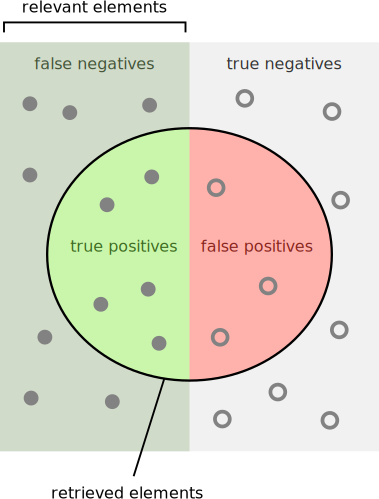
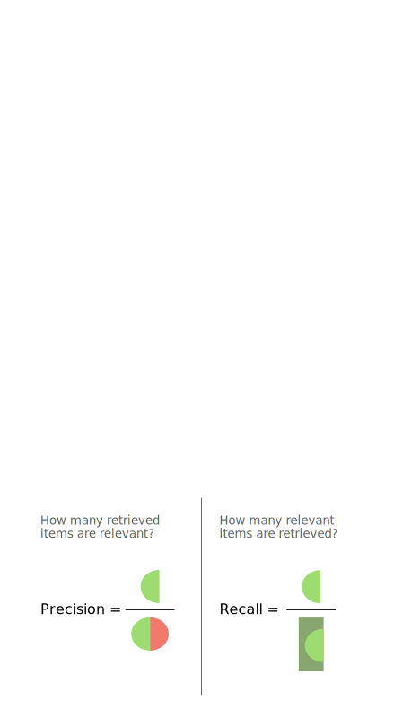
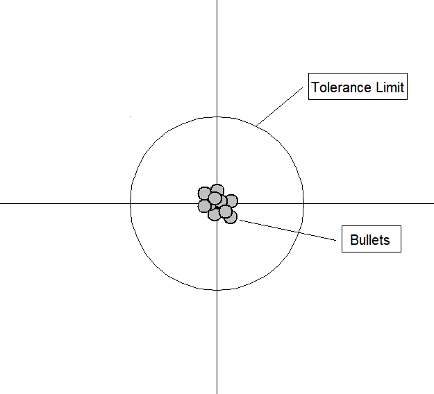

<link href="/css/asamarkdown.css" rel="stylesheet">

$$
\newcommand{\mb}[1]{\mathbf{#1}}
\newcommand{\Brc}[1]{\left(#1\right)}
\newcommand{\Rank}{\text{rank}\;}
\newcommand{\Hat}[1]{\widehat{#1}}
\newcommand{\Prj}[1]{\mb{#1}\Brc{\mb{#1}^{\top}\mb{#1}}^{-1}\mb{#1}^{\top}}
\newcommand{\RegP}[2]{\Brc{\mb{#1}^{\top}\mb{#1}}^{-1}\mb{#1}^{\top}\mb{#2}}
\newcommand{\NSQ}[1]{\left|\mb{#1}\right|^2}
\newcommand{\Norm}[1]{\left|#1\right|}
\newcommand{\IP}[2]{\left({#1}\cdot{#2}\right)}
\newcommand{\Bar}[1]{\overline{\;#1\;}}
$$

<strong>人工知能 I</strong>  

<a href="mailto:educ0233@komazawa-u.ac.jp">Shin Aasakawa</a>, all rights reserved. 
Date: 31/May/2024 
Appache 2.0 license 

<!-- ## 心理統計法標準カリキュラム作成小委員会からのお知らせ

* [ベシスタ到達度確認テスト共通化プロジェクト](https://sites.google.com/view/jpa-psychometrics/jpa-basic-stat-drill){:target="_blank"}

<!-- 当委員会では，現在，心理統計法の「ベシスタ」シラバスに準拠したオリジナルの到達度確認テストをWebブラウザ上で作成できるツールの β 版テスターを募集しています。
ベシスタすなわち Basic Statistics は，基本的な統計手法を用いた心理学論文の内容を理解することを到達目標とする心理統計法の入門科目です。
大学の講義や実習科目で心理統計法を講じる機会があり，この到達度確認テストをご自身で作成・活用してみたいという方は，こちらのページをお読みの上，フォームからご登録ください。
ツールの URL をご案内します。
https://sites.google.com/view/jpa-psychometrics/jpa-basic-stat-drill -->

||統計モデル | 機械学習モデル |
|:---|:---|:---|
|解釈可能性|明示的な数学的定式化と仮定により，高い解釈可能性を提供| 解釈可能性に欠ける。とりわけ複雑なモデル，アンサンブルモデルやカーネルマシンなど|
|特徴工学| 領域固有の知識や前提条件に基づく，手作業の (経験に基づく) 特徴工学が要求される| 生データから自動的に特徴を学習。手作業による特徴工学の過程を削減|
|季節性の扱い|季節変動 ARIMA や季節変動分解などの手法を用いて季節変動パターンを効果的に捉えることが可能| フーリエ変換や季節埋め込み技法を用いて季節変動を扱う|
|予測精度|データが統計学的仮定とパタンに従うのであれば，良好な精度が得られる|複雑な非線形性に基づき，パターン，潜在的には高い精度が得られる|
|外れ値の取り扱い|外れ値に敏感である。移動平均法あるいは指数平準法を用いた場合|決定木やランダムフォレストなどの手法では，外れ値に対して頑健|
|時系列成分|トレンド，雑音分解などの，時系列成分を構成| 時系列成分を処理可能だが，付加的な前処理やモデルの調整を必要となる場合がある|

## ソフトマックス関数とシグモイド関数との関係

$x$ と $y$ と二つの選択肢を，$x$ か $x$ でないか，であるとすれば以下となる:

$$
\frac{e^{x}}{e^{x}+e^{y}} = \frac{1}{1+e^{-(x-y)}}
$$

$x$ と $y$ との二変数によるソフトマックス関数で，$x$ が起こる確率だけを考える。
このとき $y$ は $x$ ではない確率とみなすことができる場合，$x-y>0$ であれば $\sigma(x)>0.5$ となり，$x-y<0$ であれば $\sigma(x)<0.5$ となる。

## ロジスティック回帰で用いられるシグモイド関数

通常の回帰式は，複数の変数 $x_i$ に対して，それぞれ重み $w_i$ を掛けて総和を計算する: $y=w_1x_1 + w_2x_2 +\cdots+w_nx_n+b$.
例えば，Fisher のアヤメのデータでは，ガクの幅と長さ，花弁の幅と長さを $x_i, i\in[1..4]$ として，次式を考える:

$$
y = w_1x_1 + w_2x_2 + w_3x_3 + w_4x_4+b.
$$

このとき，4 つの変数 $x_i$ に対して，対応する重み $w_i$ をかけ合わせることになるので，データベクトル $\mb{x}$ と重みベクトル $\mb{w}$ との内積 $\left(\mb{x}\cdot\mb{w}\right)$ と考えることもできる。
そうすると，ロジスティック回帰とは，入力データベクトルと重みベクトルとのなす角が 90 度より小さければ正の値を出力し，90 度より大きければ，負の値を出力すると考えることが可能である。

このように考えれば，入力データを正と負とに分類するためのベクトルを探す機械学習手法であるとみなすことができる。

## 損失関数

誤差関数，目的関数とも呼ばれる。

* 最小自乗損失
* 交差エントロピー損失

## 自動微分

## 精度・正解率(Accuracy), 適合率(Precision), 再現率(Recall)

source: `https://en.wikipedia.org/wiki/Precision_and_recall`

* [What's the difference between accuracy and precision? - Matt Anticole](https://youtu.be/hRAFPdDppzs)

精度と正確さは、観測誤差の2つの尺度である。
正確さとは、与えられた一連の測定値（観測値または読み取り値）が、その真の値にどれだけ近いかを示す。
精度とは、測定値がどれだけ互いに近いかである。
言い換えれば
Precision は、ランダム誤差（統計的ばらつきの尺度）の記述である。
Accuracy は，ISO によって次の 2 つの定義がある[1]。
より一般的には，系統誤差（与えられた中心傾向の尺度の統計的偏りの尺度）の記述である。
精度が低いと，結果と真の値との間に差が生じる。
この二次的な尺度は，ISO では真度（trueness）と呼ばれる。
両タイプの観測誤差（無作為誤差と系統誤差）の組み合わせであるため、高 accuracy 精度は高 precisionと高 trueness の両方を必要とする。
上記の「正確さ accuracy」の最初の，より一般的な定義では，この概念は「正確さ precision」とは独立しているため，特定のデータ集合は，正確であるとも，正確であるとも，その両方であるとも，あるいはそのどちらでもないとも言える。
より簡単に言えば，同じ量を繰り返し測定した統計的なサンプルまたはデータ点の集合が与えられた場合，そのサンプルまたは集合は，その平均が測定された量の真の値に近い場合，正確であると言うことができ，一方，その集合は、その標準偏差が比較的小さい場合，正確であると言うことができる。
<!-- Accuracy and precision are two measures of observational error.
Accuracy is how close a given set of measurements (observations or readings) are to their true value.
Precision is how close the measurements are to each other.
In other words:
Precision is a description of random errors (a measure of statistical variability).
Accuracy has two definitions, per ISO:[1].
More commonly, a description of systematic errors (a measure of statistical bias of a given measure of central tendency).
Low accuracy causes a difference between a result and a true value.
This secondary measure is referred to as trueness by ISO.2.
A combination of both types of observational error (random and systematic), so high accuracy requires both high precision and high trueness.
In the first, more common definition of "accuracy" above, the concept is independent of "precision", so a particular set of data can be said to be accurate, precise, both, or neither.
In simpler terms, given a statistical sample or set of data points from repeated measurements of the same quantity, the sample or set can be said to be accurate if their average is close to the true value of the quantity being measured, while the set can be said to be precise if their standard deviation is relatively small. -->

心理測定学や心理物理学では，accuracy 正確性という用語は妥当性 validity や定常誤差 constant error と同じ意味で使われる。
Precision (精度) は信頼性 (reliability) と変動誤差 (variable error) の同義語である。
測定器や心理検査の妥当性は，実験や行動との相関によって確立される。
信頼性 (reliability) は，さまざまな統計的手法によって確立される。
古典的には，Cronbach の alpha のような内部一貫性 internal consistency 検査によって，関連する質問のセットが関連する回答を持っていることを確認し，次に参照集団と対象集団の間でそれらの関連する質問を比較する。
<!-- In psychometrics and psychophysics, the term accuracy is interchangeably used with validity and constant error.
Precision is asynonym for reliability and variable error.
The validity of a measurement instrument or psychological test is established through experiment or correlation with behavior.
Reliability is established with a variety of statistical techniques, classically through an internal consistency test like Cronbach's alpha to ensure sets of related questions have related responses, and then comparison of those related question between reference and target population. -->

### Cronbach の alpha

#### Prerequisites for using Cronbach's alpha

信頼性係数として Cronbach の alpha を用いるには、以下の条件を満たす必要がある：[17][18]。
<!-- To use Cronbach's alpha as a reliability coefficient, the following conditions must be met:[17][18]-->

* データが正規分布で線形である[ii]；
* 比較された検査または測定が本質的にタウ等価である；
* 測定値の誤差が独立である。

<!--* The data is normally distributed and linear[ii];
* The compared tests or measures are essentially tau-equivalent;
* Errors in the measurements are independent. -->

#### 式と計算<!-- #### Formula and calculation-->

Cronbach の alpha は，各尺度項目から得点を取り，各観察値の合計得点と相関させることによって計算される。
得られた相関は，すべての個別項目得点の分散と比較される。
Cronbach の alpha は，尺度の質問または項目数，項目の対間の平均共分散，および測定された合計得点の全体的な分散の関数として最もよく理解される[19][8]。
<!--
Cronbach's alpha is calculated by taking a score from each scale item and correlating it with the total score for each observation.
The resulting correlations are then compared with the variance for all individual item scores.
Cronbach's alpha is best understood as a function of the number of questions or items in a measure, the average covariance between pairs of items, and the overall variance of the total measured score.[19][8] -->

* $$\displaystyle \alpha ={k \over k-1}\left(1-{\sum _{i=1}^{k}\sigma _{y_{i}}^{2} \over \sigma _{y}^{2}}\right)$$
* $k$ represents the number of items in the measure $\sigma _{y_{i}}^{2}$ the variance associated with each item i
* $\sigma _{y}^{2}$ the variance associated with the total scores $\left(y=\sum _{i=1}^{k}y_{i}\right)$

Alternatively, it can be calculated through the following formula:[20]

$\displaystyle \alpha ={k{\bar {c}} \over {\bar {v}}+(k-1){\bar {c}}}$

where,

* $\bar{v}$ represents the average variance
* $\bar{c}$ represents the average inter-item covariance.

### [Bias variance tradeoff](https://en.wikipedia.org/wiki/Bias%E2%80%93variance_tradeoff){:target="_blank"}

統計学や機械学習において，バイアスと分散のトレードオフは，モデルの複雑さと予測精度 (accuracy)，そしてモデルの訓練に使われなかった未知のデータに対してどの程度予測できるかの関係を表す。
一般に，モデル内の調整可能なパラメータの数を増やすと，モデルはより柔軟になり，訓練データセットによりよく適合できるようになる。
その結果，誤差やバイアスが小さくなる。
しかし，より柔軟なモデルの場合，新しい訓練データセットを作成するために標本を採取するたびに，モデルの適合度に大きなばらつきが生じる傾向がある。
これは，モデルの推定パラメータに大きな分散があることを意味する。
<!-- In statistics and machine learning, the bias–variance tradeoff describes the relationship between a model's complexity, the accuracy of its predictions, and how well it can make predictions on previously unseen data that were not used to train the model.
In general, as we increase the number of tunable parameters in a model, it becomes more flexible, and can better fit a training data set.
It is said to have lower error, or bias. However, for more flexible models, there will tend to be greater variance to the model fit each time we take a set of samples to create a new training data set.
It is said that there is greater variance in the model's estimated parameters.-->

バイアス-分散のジレンマまたはバイアス-分散問題とは，教師あり学習アルゴリズムが学習セットを超えて汎化することを妨げる，これら 2 つの誤差の原因を同時に最小化しようとする際の葛藤である[1][2]。
<!--The bias–variance dilemma or bias–variance problem is the conflict in trying to simultaneously minimize these two sources of error that prevent supervised learning algorithms from generalizing beyond their training set:[1][2] -->

* バイアス誤差は、学習アルゴリズムにおける誤った仮定による誤差。
高いバイアスは，アルゴリズムが特徴と目標出力の間の関連する関係を見逃してしまう (アンダーフィッティング) 原因となる。
*  分散は，学習セットの小さな変動に対する感度から生じる誤差。
分散が大きいと，アルゴリズムが学習データ中のランダムな雑音をモデル化してしまう (オーバーフィッティング) 可能性がある。

<!-- * The bias error is an error from erroneous assumptions in the learning algorithm.
High bias can cause an algorithm to miss the relevant relations between features and target outputs (underfitting).
* The variance is an error from sensitivity to small fluctuations in the training set.
High variance may result from an algorithm modeling the random noise in the training data (overfitting).-->

バイアス-分散分解は，学習アルゴリズムが特定の問題に関して期待する汎化誤差を，バイアス，分散，そして問題自体のノイズに起因する irreducible 誤差と呼ばれる量の 3 項の和として分析する方法である.
<!--The bias–variance decomposition is a way of analyzing a learning algorithm's expected generalization error with respect to a particular problem as a sum of three terms, the bias, variance, and a quantity called the irreducible error, resulting from noise in the problem itself. -->

left to right:
* High bias, low variance,
* High bias, high variance,
* Low bias, low variance
* Low bias, high variance

The bias–variance tradeoff is a central problem in supervised learning.
Ideally, one wants to choose a model that both accurately captures the regularities in its training data, but also generalizes well to unseen data.
Unfortunately, it is typically impossible to do both simultaneously.
High-variance learning methods may be able to represent their training set well but are at risk of overfitting to noisy or unrepresentative training data.
In contrast, algorithms with high bias typically produce simpler models that may fail to capture important regularities (i.e. underfit) in the data.

It is an often made fallacy[3][4] to assume that complex models must have high variance.
High variance models are "complex" in some sense, but the reverse needs not be true.[5]
In addition, one has to be careful how to define complexity.
In particular, the number of parameters used to describe the model is a poor measure of complexity.
This is illustrated by an example adapted from:[6]
The model $\displaystyle f_{a,b}(x)=a\sin(bx)$ has only two parameters ($a,b$) but it can interpolate any number of points by oscillating with a high enough frequency, resulting in both a high bias and high variance.

An analogy can be made to the relationship between accuracy and precision.
Accuracy is a description of bias and can intuitively be improved by selecting from only local information.
Consequently, a sample will appear accurate (i.e. have low bias) under the aforementioned selection conditions, but may result in underfitting.
In other words, test data may not agree as closely with training data, which would indicate imprecision and therefore inflated variance.
A graphical example would be a straight line fit to data exhibiting quadratic behavior overall.
Precision is a description of variance and generally can only be improved by selecting information from a comparatively larger space.
The option to select many data points over a broad sample space is the ideal condition for any analysis.
However, intrinsic constraints (whether physical, theoretical, computational, etc.) will always play a limiting role.
The limiting case where only a finite number of data points are selected over a broad sample space may result in improved precision and lower variance overall, but may also result in an overreliance on the training data (overfitting).
This means that test data would also not agree as closely with the training data, but in this case the reason is inaccuracy or high bias.
To borrow from the previous example, the graphical representation would appear as a high-order polynomial fit to the same data exhibiting quadratic behavior.
Note that error in each case is measured the same way, but the reason ascribed to the error is different depending on the balance between bias and variance.
To mitigate how much information is used from neighboring observations, a model can be smoothed via explicit regularization, such as shrinkage.

| |予測値 True | 予測値 False |
|:---:|:---:|:---:|
|真の値 True | True Positive (TP)| False Negative (FN)|
|真の値 False| False Positive (FP)| True Negative (TN)|

* [https://towardsdatascience.com/data-science-performance-metrics-for-everyone-4d68f4859eef](https://towardsdatascience.com/data-science-performance-metrics-for-everyone-4d68f4859eef){:target="_blank"}

## [The Beautiful Applications of Calculus in Real Life](https://ali.medium.com/the-beautiful-applications-of-calculus-in-real-life-952a8371319e)

思い起こせば Richard Feynman が信じていた真実から記事を始めた。
Feynman にとって「微積分は神が語る言語である。」
この主張に対して，Feynman は神を信じていなかったと反論する人もいるかもしれない。
しかし，Stenven Strogatz は Yale 大学での講義 「微積分の美」の中で，なぜ Feynman がこのような主張をしたのかを見事に説明している。
<!-- As you recall, I started the article with a truth that Richard Feynman believed in.
To Feynman, “calculus is the language in which God speaks.”
Some of you may refute this claim by saying that Feynman didn’t believe in God.
However, Steven Strogatz explains brilliantly why Feynman made this claim in his “The Beauty of Calculus” lecture at Yale University. -->

Harman Wouk は受賞歴のある作家である。
彼は一般に歴史小説を書いている。
彼は第二次世界大戦についての非常に詳細な小説を書きたいと考えている。
マンハッタン計画の結果である原子爆弾が，戦争の結末を決めることになる。
そのため，Harman Wouk はマンハッタン計画に携わった当時まだ若かった科学者，Richard Feynman に話を聞きたいという。
現代で最も有名な科学者の一人が Richard Feynman だからだ。
楽しい会話の後，Feynman は Wouk に微積分を知っているかと尋ねる。
Wouk が否定的な返事をすると「習ったほうがいい。神が話す言語なのだから」と Feynman は言う。
<!-- Harman Wouk is an award-winning writer.
He generally writes historical novels.
He wants to write a very detailed novel about World War II.
The result of the Manhattan Project, the atomic bomb, would determine the war’s end.
That is why Herman Wouk wants to speak with the then-young scientist who worked on the Manhattan Project, Richard Feynman.
That is because one of the most well-known scientists of the modern era is Richard Feynman.
After a pleasant conversation, Feynman asks Wouk if he knows calculus.
When Wouk gives a negative response, “You had better learn it; it’s the language God talks,” says Feynman. -->

ハーマン・ウークは信者であり、ファインマンの言うとおりにした。
彼は微積分を学ぶために個人教師を雇い、高校に入学して基礎から学ぼうとした。
その後、彼は 「The Language God Talks」という宗教と科学についての本を書いた。
その著書の中にこんなくだりがある：
<!-- Herman Wouk was a believer and did as Feynman said. He hired a private teacher to learn calculus, and he wanted to enroll in a high school and learn from the basics.
Afterward, he wrote a book about religion and science called “The Language God Talks.”
In his book, this paragraph is written: -->

私は大学の書店で新入生のテキストを手に取り，ざっと目を通した。
大学時代を人文科学で過ごした私のような数学の無知を助けてくれるようなテキストに出会えることを期待していた。
<!-- I picked up and skimmed freshman texts in college bookstores, hoping to come across one that might help a mathematical ignoramus like me, who had spent his college year in the humanities — Herman Wouk, The Language God Talks, p.6 -->

Feynman も，単に会話のためにこのようなことを言ったわけではない。
彼以前の多くの著名な科学者たちも，この真理に気づいていた。
例えば，Newton は空に浮かぶ月がなぜ地球に落ちてこないのか不思議に思っていた。
彼のラテン語も英語もそれを説明するには不十分だった。
微積分を学んだ後，彼は奇跡的な状況を微分方程式を使って人類に明確に説明した。
Newton の後，数学者と物理学者は微積分を使って段階的に現代世界を構築していった。
<!-- Feynman didn’t just say this for the sake of conversation, either.
Many recognized scientists before him were also aware of this truth.
For example, Newton wondered why the Moon in the sky didn’t fall to Earth. He had some things in mind but could never explain them; neither his Latin nor his English was enough to explain them.
After learning calculus, he explained the miraculous situation to humanity in explicit detail using differential equations.
After Newton, mathematicians and physicists constructed the modern world step-by-step using calculus. -->

# [科学におけるモデル wikipedia より](https://en.wikipedia.org/wiki/Scientific_modelling)

科学的モデリングとは、世界の特定の部分や特徴を理解、定義、定量化、視覚化、シミュレーションしやすくするために、経験的な対象、現象、物理的プロセスを表すモデルを作り出す活動である。
現実世界の状況に関連する側面を選択・特定し、それらの特徴を持つシステムを再現するモデルを開発する必要がある。
よりよく理解するための概念モデル，運用するための操作(運用)モデル，定量化するための数学モデル，シミュレーションするための計算モデル，対象を視覚化するためのグラフィカルモデルなど，さま
ざまなタイプのモデルが，さまざまな目的のために使用される。
<!-- Scientific modelling is an activity that produces models representing empirical objects, phenomena, and physical processes, to make a particular part or feature of the world easier to understand, define, quantify, visualize, or simulate.
It requires selecting and identifying relevant aspects of a situation in the real world and then developing a model to replicate a system with those features.
Different types of models may be used for different purposes, such as conceptual models to better understand, operational models to operationalize, mathematical models to quantify, computational models to simulate, and graphical models to visualize the subject.-->

モデルは，多くの科学分野にとって不可欠かつ切り離せないものであり，各分野は，特定のタイプのモデルについて独自の考えを持っている[1][2]。
以下は John von Neumann の言葉である[3]。
<!--Modelling is an essential and inseparable part of many scientific disciplines, each of which has its own ideas about specific types of modelling.[1][2]
The following was said by John von Neumann.[3] -->

...科学は説明しようとはしないし，解釈しようともしない，科学は主にモデルを作る。
モデルによって，観察された現象を、言葉による解釈を加えて，観察された現象を記述する数学的構成を意味する。
このような数学的構成が正当化されるのは，それが機能すると期待されているからに他ならない。
<!-- ... the sciences do not try to explain, they hardly even try to interpret, they mainly make models.
By a model is meant a mathematical construct which, with the addition of certain verbal interpretations, describes observed phenomena.
The justification of such a mathematical construct is solely and precisely that it is expected to work—that is, correctly to describe phenomena from a reasonably wide area. -->

1. Cartwright, Nancy. 1983. How the Laws of Physics Lie. Oxford University Press
2. Hacking, Ian. 1983. Representing and Intervening. Introductory Topics in the Philosophy of Natural Science. Cambridge University Press
3. von Neumann, J. (1995), 数理科学の方法 "Method in the physical sciences", in Bródy F., Vámos, T. (editors), The Neumann Compendium, World Scientific, p. 628; previously published in The Unity of Knowledge, edited by L. Leary (1955), pp. 157-164, and also in John von Neumann Collected Works, edited by A. Taub, Volume VI, pp. 491-498.

また，科学教育，科学哲学，システム論、知識の可視化などの分野においても，科学的モデリング[4]への注目が高まっている。
あらゆる種類の専門的な科学的モデリングに関する手法，技法，メタ理論のコレクションが増えつつある。
<!-- There is also an increasing attention to scientific modelling[4] in fields such as science education,[5] philosophy of science, systems theory, and knowledge visualization.
There is a growing collection of methods, techniques and meta-theory about all kinds of specialized scientific modelling. -->

## Overview

科学モデルは，経験的な対象，現象，物理的プロセスを論理的かつ客観的な方法で表現しようとするものである。
すべてのモデルはシミュラクラであり，つまり，近似であるにもかかわらず，非常に有用な現実の単純化された反映である[6]。
モデルの構築と論争は，科学的事業の基本である。
完全で真の表現は不可能かもしれないが，科学的な議論では，例えば季節予報のための気候モデルとしてどちらがより正確かなど，与えられた課題に対してどちらがより優れたモデルであるかがしばしば議論される。
<!-- A scientific model seeks to represent empirical objects, phenomena, and physical processes in a logical and objective way.
All models are in simulacra, that is, simplified reflections of reality that, despite being approximations, can be extremely useful.[6]
Building and disputing models is fundamental to the scientific enterprise.
Complete and true representation may be impossible, but scientific debate often concerns which is the better model for a given task, e.g., which is the more accurate climate model for seasonal forecasting.[7] -->

経験科学の原理を形式化する試みは、論理学者が論理学の原理を公理化するのと同じように、解釈を用いて現実をモデル化する。
このような試みの目的は、現実に見出されるものに反する理論的帰結を生み出さないような形式的システムを構築することである。
このような形式的システムから引き出される予測やその他の記述は、これらの科学的モデルが真である限りにおいてのみ、現実世界を映し出したり写し出したりする[8][9]。
<!-- Attempts to formalize the principles of the empirical sciences use an interpretation to model reality, in the same way logicians axiomatize the principles of logic.
The aim of these attempts is to construct a formal system that will not produce theoretical consequences that are contrary to what is found in reality.
Predictions or other statements drawn from such a formal system mirror or map the real world only insofar as these scientific models are true.[8][9] -->

科学者にとってモデルは，人間の思考プロセスを増幅させることができる方法でもある[10]。
例えば，ソフトウェアでレンダリングされたモデルは，科学者が計算能力を活用して，表現されている実体，現象，プロセスについてシミュレーションし，視覚化し，操作し，直感を得ることを可能にする。
このようなコンピュータ・モデルはイン・シリコである。
その他の科学的モデルには，in vivo（実験用ラットのような生体モデル）と in vitro（組織培養のようなガラス器具内）がある[11]。
<!-- For the scientist, a model is also a way in which the human thought processes can be amplified.[10]
For instance, models that are rendered in software allow scientists to leverage computational power to simulate, visualize, manipulate and gain intuition about the entity, phenomenon, or process being represented.
Such computer models are in silico.
Other types of scientific models are in vivo (living models, such as laboratory rats) and in vitro (in glassware, such as tissue culture).[11] -->

## Basics

### 直接測定や実験の代用としてのモデル化<!-- ### Modelling as a substitute for direct measurement and experimentation-->

モデルは通常，科学者が結果を直接測定できるような実験条件を作り出すことが不可能か，非現実的な場合に使用される。
管理された条件下での結果の直接測定（「科学的方法」参照）は、モデルによる結果の推定よりも常に信頼性が高い。
<!--Models are typically used when it is either impossible or impractical to create experimental conditions in which scientists can directly measure outcomes.
Direct measurement of outcomes under controlled conditions (see Scientific method) will always be more reliable than modeled estimates of outcomes. -->

モデリングとシミュレーションにおいて，モデルとは，物理的，法的，認知的な制約によって形成された，課題駆動型の，現実認識の目的意識的な単純化と抽象化である[12]。
課題駆動型であるのは，モデルが特定の疑問や課題を念頭に置いて捉えられるからである。
単純化では，課題にとって重要でない既知の実体や観測された実体，およびそれらの関係をすべて除外する。
抽象化は，重要ではあるが，関心のある対象と同じ詳細さでは必要ない情報を集約する。
単純化も抽象化も，意図的に行われる。
しかし，それらは現実の認識に基づいて行われる。
この認識は，物理的な制約を伴うため，それ自体がすでにモデルである。
また，現在の道具や方法で合法的に観察できるものには制約があり，現在の理論で説明できるものには認知上の制約がある。
このモデルは，概念，その動作，およびそれらの関係の非公式な形式から構成され，しばしば概念モデルと呼ばれる。
モデルを実行するためには，コンピュータ・シミュレーションとして実装する必要がある。
これには，数値的近似やヒューリスティックの使用など，より多くの選択肢が必要となる[13]。
このような認識論的・計算論的制約があるにもかかわらず，シミュレーションは，理論構築，シミュレーション，、実験という科学的手法の3本目の柱として認識されている[14]。
<!-- Within modeling and simulation, a model is a task-driven, purposeful simplification and abstraction of a perception of reality, shaped by physical, legal, and cognitive constraints.[12]
It is task-driven because a model is captured with a certain question or task in mind.
Simplifications leave all the known and observed entities and their relation out that are not important for the task.
Abstraction aggregates information that is important but not needed in the same detail as the object of interest.
Both activities, simplification, and abstraction, are done purposefully.
However, they are done based on a perception of reality.
This perception is already a model in itself, as it comes with a physical constraint.
There are also constraints on what we are able to legally observe with our current tools and methods, and cognitive constraints that limit what we are able to explain with our current theories.
This model comprises the concepts, their behavior, and their relations informal form and is often referred to as a conceptual model.
In order to execute the model, it needs to be implemented as a computer simulation.
This requires more choices, such as numerical approximations or the use of heuristics.[13]
Despite all these epistemological and computational constraints, simulation has been recognized as the third pillar of scientific methods: theory building, simulation, and experimentation.[14] -->

### シミュレーション<!-- ### Simulation-->

シミュレーションは、モデルを実装する方法であり、モデルが複雑すぎて解析解が得られない場合によく用いられる。
定常状態シミュレーションは、ある瞬間のシステムに関する情報を提供する（そのような状態が存在する場合、通常は平衡状態）。
動的シミュレーションは、経時的な情報を提供する。
シミュレーションは、特定の物体や現象がどのように振る舞うかを示す。
このようなシミュレーションは、実世界のシステムや概念をモデルで表現できる場合に、テスト、分析、トレーニングに役立つ[15]。
<!--A simulation is a way to implement the model, often employed when the model is too complex for the analytical solution.
A steady-state simulation provides information about the system at a specific instant in time (usually at equilibrium, if such a state exists).
A dynamic simulation provides information over time.
A simulation shows how a particular object or phenomenon will behave.
Such a simulation can be useful for testing, analysis, or training in those cases where real-world systems or concepts can be represented by models.[15] -->

### 構造<!-- ### Structure-->

構造とは、実体のパターンや関係の認識、観察、性質、安定性をカバーする基本的で、時に無形の概念である。
子供が雪の結晶を言葉で説明することから、磁場の特性の詳細な科学的分析に至るまで、構造という概念は、科学、哲学、芸術におけるほとんどすべての探求と発見の様式の本質的な基盤である[16]。
<!-- Structure is a fundamental and sometimes intangible notion covering the recognition, observation, nature, and stability of patterns and relationships of entities.
From a child's verbal description of a snowflake, to the detailed scientific analysis of the properties of magnetic fields, the concept of structure is an essential foundation of nearly every mode of inquiry and discovery in science, philosophy, and art.[16] -->

### システム<!-- ### Systems -->

システムとは，統合された全体を形成する，相互作用する，あるいは相互依存する実体の集合であり，現実のものであれ抽象的なものであれ，である。
一般に，システムとは，要素だけでは得られない結果を共に生み出すことのできる，異なる要素の構成体または集合体である[17]。
「統合された全体」の概念は，集合の要素と他の要素との関係とは区別され，集合の要素と関係レジームの一部ではない要素との関係を形成する，関係の集合を具現化するシステムという観点から述べることもできる。
システムモデルには 2 つのタイプがある：
<!-- A system is a set of interacting or interdependent entities, real or abstract, forming an integrated whole.
In general, a system is a construct or collection of different elements that together can produce results not obtainable by the elements alone.[17]
The concept of an 'integrated whole' can also be stated in terms of a system embodying a set of relationships which are differentiated from relationships of the set to other elements, and form relationships between an element of the set and elements not a part of the relational regime.
There are two types of system models: -->

1) 離散型では，変数が個別の時点で瞬間的に変化する、
2) 状態変数が時間に対して連続的に変化する連続的なものである[18]。

<!-- 1) discrete in which the variables change instantaneously at separate points in time and,
2) continuous where the state variables change continuously with respect to time.[18] -->

### モデルの生成<!-- ### Generating a model-->

モデル化とは、ある現象の概念的な表現としてモデルを生成する処理過程のことである。
一般に，モデルは問題の現象のいくつかの側面だけを扱う。
そして，同じ現象の 2 つのモデルは本質的に異なるかもしれない。
つまり，両者の違いは単純な構成要素の名前の変更以上のものである。
<!-- Modelling is the process of generating a model as a conceptual representation of some phenomenon.
Typically a model will deal with only some aspects of the phenomenon in question, and two models of the same phenomenon may be essentially different—that is to say, that the differences between them comprise more than just a simple renaming of components. -->

このような違いは，モデルのエンドユーザの要求が異なるためであったり，モデラー間の概念的または美的な違いや，モデリングプロセス中に行われた偶発的な決定によるものであったりする。
モデルの構造に影響を与える可能性のある考慮事項としては，縮小オントロジーに対するモデラーの好み，統計モデル対決定論モデル，離散時間対連続時間などに関する好みなどがある。
いずれにせよ，モデルのユーザーは，ある用途におけるモデルの妥当性に関連する仮定を理解する必要がある。
<!-- Such differences may be due to differing requirements of the model's end users, or to conceptual or aesthetic differences among the modelers and to contingent decisions made during the modelling process.
Considerations that may influence the structure of a model might be the modeler's preference for a reduced ontology, preferences regarding statistical models versus deterministic models, discrete versus continuous time, etc.
In any case, users of a model need to understand the assumptions made that are pertinent to its validity for a given use. -->

モデルの構築には抽象化が必要である。
仮定は，モデルの適用領域を特定するためにモデリングに用いられる。
例えば，特殊相対性理論は慣性参照枠を仮定している。
この仮定は，一般相対性理論によって文脈化され，さらに説明された。
モデルは，その仮定が有効であれば正確な予測を行い，仮定が成り立たなければ正確な予測を行わない。
このような仮定はしばしば，古い理論が新しい理論に引き継がれる際のポイントになる（一般相対性理論は非慣性参照枠でも機能する）。
<!-- Building a model requires abstraction.
Assumptions are used in modelling in order to specify the domain of application of the model.
For example, the special theory of relativity assumes an inertial frame of reference.
This assumption was contextualized and further explained by the general theory of relativity.
A model makes accurate predictions when its assumptions are valid, and might well not make accurate predictions when its assumptions do not hold.
Such assumptions are often the point with which older theories are succeeded by new ones (the general theory of relativity works in non-inertial reference frames as well). -->

### Evaluating a model

See also: Models of scientific inquiry § Choice of a theory

モデルは、何よりもまず経験的データとの整合性によって評価される。再現可能な観測結果と矛盾するモデルは、修正されるか否定されなければならない。
モデルを修正する一つの方法は、そのモデルが高い妥当性を持つとされる領域を限定することである。
その一例がニュートン物理学である。ニュートン物理学は、宇宙の非常に小さく、非常に速く、非常に巨大な現象を除いては、非常に有用である。
しかし、モデルが有効であると認められるためには、経験的データとの適合だけでは不十分である。モデルを評価する上で重要な要素には以下が含まれる[要出典]。
<!-- A model is evaluated first and foremost by its consistency to empirical data; any model inconsistent with reproducible observations must be modified or rejected.
One way to modify the model is by restricting the domain over which it is credited with having high validity.
A case in point is Newtonian physics, which is highly useful except for the very small, the very fast, and the very massive phenomena of the universe.
However, a fit to empirical data alone is not sufficient for a model to be accepted as valid. Factors important in evaluating a model include:[citation needed]-->

### 過去の観測を説明する能力<!-- ### Ability to explain past observations -->

将来の観測を予測する能力
使用コスト（特に他のモデルとの組み合わせにおいて
反証可能性（モデルの信頼度の推定を可能にする
単純さ，あるいは美的魅力
人々は効用関数を用いてモデルの評価を定量化しようとするかもしれない。
<!-- Ability to predict future observations
Cost of use, especially in combination with other models
Refutability, enabling estimation of the degree of confidence in the model
Simplicity, or even aesthetic appeal
People may attempt to quantify the evaluation of a model using a utility function. -->

### 視覚化<!-- ### Visualization -->

可視化とは、メッセージを伝えるために画像、図、アニメーションを作成する技法のことである。
視覚的なイメージによる視覚化は、人間の夜明け以来、抽象的なアイデアと具体的なアイデアの両方を伝える効果的な方法であった。
歴史上の例としては、洞窟画、エジプトの象形文字、ギリシアの幾何学、レオナルド・ダ・ヴィンチの工学的・科学的目的のための革新的な技術的描画方法などがある。
<!--Visualization is any technique for creating images, diagrams, or animations to communicate a message.
Visualization through visual imagery has been an effective way to communicate both abstract and concrete ideas since the dawn of man.
Examples from history include cave paintings, Egyptian hieroglyphs, Greek geometry, and Leonardo da Vinci's revolutionary methods of technical drawing for engineering and scientific purposes. -->

### スペースマッピング<!-- ### Space mapping-->

スペース・マッピングとは、「準グローバル」モデリング定式化を用い て、複雑さの異なる「粗い」（理想的または低忠実度）モデルと「細かい」 （実用的または高忠実度）モデルを結びつける方法論のことである。
工学的最適化において、スペースマッピングは、非常に高速な粗いモデルと、それに関連する計算コストの高い細かいモデルとのアライメント（対応付け）を行い、細かいモデルの直接的で高価な最適化を回避する。
アライメントプロセスは、「マッピングされた」粗いモデル（サロゲートモデル）を繰り返し改良する。
<!--Space mapping refers to a methodology that employs a "quasi-global" modelling formulation to link companion "coarse" (ideal or low-fidelity) with "fine" (practical or high-fidelity) models of different complexities.
In engineering optimization, space mapping aligns (maps) a very fast coarse model with its related expensive-to-compute fine model so as to avoid direct expensive optimization of the fine model.
The alignment process iteratively refines a "mapped" coarse model (surrogate model). -->

### [Stanford Encyclopedia of Philosophy](https://plato.stanford.edu/entries/models-science/)

モデルは多くの科学的文脈において中心的な重要性を持つ。
宇宙論におけるインフレーション・モデル、地球気候の一般循環モデル，DNA の二重らせんモデル，生物学における進化モデル，社会科学におけるエージェント・ベース・モデル，市場の一般均衡モデルなど，それぞれの領域におけるモデルの重要性は，その一例である（本エントリーの最後にある「その他のインターネット・リソース」の節には，これらのモデルについて論じたオンライン・リソースへのリンクが含まれている）。
科学者たちは，モデルの構築，検証，比較，修正に膨大な時間を費やし，多くのジャーナルがモデルの解釈とその意味するところの議論に費やされている。
<!-- Models are of central importance in many scientific contexts.
The centrality of models such as inflationary models in cosmology, general-circulation models of the global climate, the double-helix model of DNA, evolutionary models in biology, agent-based models in the social sciences, and general-equilibrium models of markets in their respective domains is a case in point (the Other Internet Resources section at the end of this entry contains links to online resources that discuss these models).
Scientists spend significant amounts of time building, testing, comparing, and revising models, and much journal space is dedicated to interpreting and discussing the implications of models. -->

その結果，モデルは哲学者の注目を集めるようになり，科学的モデリングの様々な側面に関する膨大な文献が存在するようになった。
哲学がモデルと関わってきた具体的な成果として，哲学文献の中で認識されているモデルの種類が急増したことが挙げられる。
探索モデル，現象学的モデル，計算モデル，発展モデル，説明モデル，貧困モデル，テストモデル，理想化モデル，理論モデル，スケールモデル，発見的モデル，戯画モデル，探索モデル，教訓モデル，空想モデル，最小モデル，玩具モデル，想像モデル，数学モデル，機械論モデル，代用モデル，象徴モデル，形式モデル，アナログモデル，道具的モデルなどが，モデルを分類するために用いられる概念の一部である。
一見するとその多さに圧倒されるが，これらの概念がモデルに関連して生じるさまざまな問題に関係していることを認識することで，コントロールすることができる。
モデルは意味論 semantics（モデルは表現するとすればどのように表現するのか），存在論 ontology （モデルとはどのようなものなのか），認識論 epistemology（モデルを使ってどのように学び、説明するのか），そしてもちろん科学哲学の他の領域においても問題を提起している。
<!-- As a result, models have attracted philosophers’ attention and there are now sizable bodies of literature about various aspects of scientific modeling.
A tangible result of philosophical engagement with models is a proliferation of model types recognized in the philosophical literature.
Probing models, phenomenological models, computational models, developmental models, explanatory models, impoverished models, testing models, idealized models, theoretical models, scale models, heuristic models, caricature models, exploratory models, didactic models, fantasy models, minimal models, toy models, imaginary models, mathematical models, mechanistic models, substitute models, iconic models, formal models, analogue models, and instrumental models are but some of the notions that are used to categorize models.
While at first glance this abundance is overwhelming, it can be brought under control by recognizing that these notions pertain to different problems that arise in connection with models.
Models raise questions in semantics (how, if at all, do models represent?), ontology (what kind of things are models?), epistemology (how do we learn and explain with models?), and, of course, in other domains within philosophy of science. -->

## 議論

## モデルって何？

- 現象の抽象化, 簡略化，単純化
    1. 概念モデル
    1. 数理モデル
    1. グラフィカルモデル: e.g. ボックスアンドアローモデル
    4. see wikipedia.en scientific_modeling

- モデル の目的: 既知の事実や知識に基いて，現象の特定の部分や特徴を，理解，記述，規定，定量化，視覚化，模倣すること。

- 現象を理解を促すために，概念，操作，定量化，を行うために
    * 概念モデル
    * 数理モデル
    * グラフィカルモデル
などを用いる。科学にとって モデル化 は不可欠

https://en.wikipedia.org/wiki/Scientific_modelling

科学的モデリングは科学的活動であり，その目的は，世界の特定の部分や特徴を，既存の一般的に受け入れられている知識に照らし合わせることによって，理解，定義，定量化，視覚化，シミュレーションを容易にすることである。
そのためには，現実世界の状況に関連する側面を選択・特定し，理解を深めるための概念モデル，合理化を図るための操作モデル，定量化を図るための数学モデル，対象を視覚化するための図解モデルなど，目的に応じてさまざまなタイプのモデルを使い分ける必要がある。
モデリングは，多くの科学分野にとって必要不可欠なものであり，切っても切り離せないものである。

<!-- Scientific modeling is a scientific activity, the aim of which is to make a particular part or feature of the world easier to understand, define, quantify, visualize, or simulate by referencing it to existing and usual ly commonly accepted knowledge.
It requires selecting and identifying relevant aspects of a situation in the real world and then using different types of models for different aims, such as conceptual models to better understand, operational models to perationalise, mathematical models to quantify, and graphical models to visual ize the subject.
Modelling is an essential and inseparable part of many scientific disciplines have their own ideas about specific types of modelling. -->

`https://xkcd.com/1425/`

<!--  -->

現在の言語情報処理モデルの趨勢は Chomsky の思い描いた方向には進んでいない(ように見える)。
心理学史を紐解けば，スキナーを批判して行動主義心理学を終わらせる功績が特筆される。
その結果，言語は生得的であるとのラジカルな立場をとることになったのは御存知の通りである。
