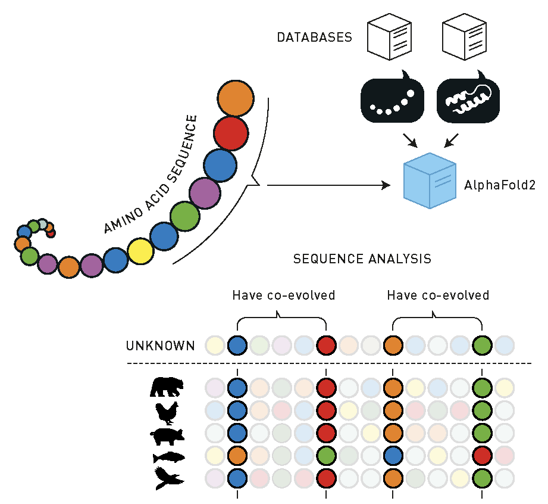
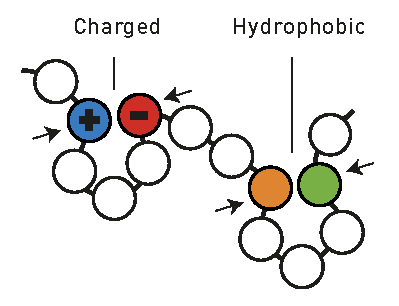
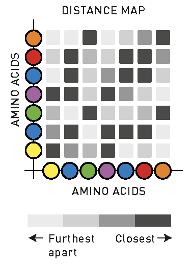
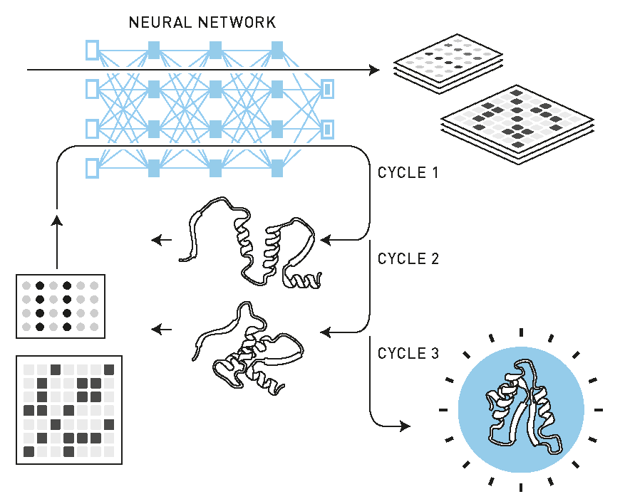

# 計算タンパク質設計とタンパク質構造予測<!-- # Computational Protein Design and Protein Structure Prediction -->

The Royal Swedish Academy of Sciences has decided to award David Baker, Demis Hassabis and John Jumper the Nobel Prize in Chemistry 2024, for computational protein design and protein structure prediction.

## はじめに<!-- ## Introduction-->

約65年前、X線結晶構造解析法によって初めてタンパク質の三次元（3D）構造が決定された。(1,2) 
それ以来、科学者たちはポリペプチド鎖がどのようにして明確な複雑な3Dパターンに折りたたまれるのかということに魅了されてきた。
また、タンパク質の機能は、まさにこれらの特定の構造によってもたらされる。
したがって、タンパク質の 3D 構造を予測する能力があれば、その機能や生化学的特性も予測できることが明らかになった。
1972年 Christian Anfinsen は、タンパク質の3D構造は基本的にポリペプチド鎖のアミノ酸配列によって符号化されているという画期的な発見により、ノーベル化学賞を受賞した。
つまり、タンパク質が可逆的に変性した場合、常に同じ 3D 構造に再折り畳まれることを発見したのである。(3) 
この発見により、一次アミノ酸配列から直接 3D 構造を予測するという、長年の科学的探求が導かれた。
この問題は非常に重要であると考えられており、ノーベル賞受賞者である Venki Ramakrishnan は「生物学における 50 年来の壮大な挑戦」と表現している。(4)
<!--The first three-dimensional (3D) structures of proteins were determined by X-ray crystallography about 65 years ago.(1,2) 
Ever since, scientists have been fascinated by how the polypeptide chains fold themselves up into well-defined and complex 3D patterns. 
It is also precisely these specific structures that confer proteins their function. 
It thus became clear that the ability to predict the 3D structure of a protein would enable prediction also of its function and biochemical properties.
In 1972, Christian Anfinsen was awarded the Nobel Prize in Chemistry for the remarkable finding that protein 3D structures were basically encoded by the sequence of amino acids in the polypeptide chain. 
That is, he found that if a protein is reversibly denatured, it would always refold into the same 3D conformation.(3) 
This finding led to the long scientific quest of predicting 3D structures directly from the primary amino acid sequence. 
The problem is considered so important that Nobel Prize Laureate Venki Ramakrishnan has described it as a “50-year-old grand challenge in biology”.(4) -->

実験的手法によるタンパク質の構造決定には多大な労力を要する。注目すべきは、公共データベースに登録されているDNA配列の数が現在30億に迫り、これまでに生物で特定されたタンパク質の配列の数が2億を超えているにもかかわらず、タンパク質データバンク(5)には、対応するタンパク質の 3D 構造のうち、わずかその一部 (約 20 万) しか登録されていないことだ。
そのため、アミノ酸配列から直接タンパク質の構造を予測できるようになることは、大きな成果となるだろう。
<!-- Determining protein structures by experimental means is labour intensive. It is noteworthy that while the number of DNA sequences in public databases is now close to 3 billion, and the number of protein sequences that have so far been identified in organisms is over 200 million, the Protein Data Bank5 still contains only a small fraction of the corresponding 3D protein structures (~200 000). 
To be able to predict protein structures directly from the amino acid sequence would thus be a major achievement. -->

ここで問題となるのは、理論的に可能なタンパク質のコンフォメーションの数が実に天文学的な数になるということだ。
Cyrus Levinthal は、この数を推定し、いわゆる「Levinthal のパラドックス」と名付けた。(6)
これは、100 アミノ酸残基タンパク質の可能なコンフォメーションの数として、10 の 47 乗のオーダーになるという形でよく言及される。
したがって、必然的な結論は、タンパク質はこれらのすべてのコンフォメーションをランダムに探索して折りたたまれるのではなく、偏りのある折りたたみ経路によって折りたたまれるということである。(6,7)
<!-- The problem here is that the number of theoretically possible conformations of a protein is truly astronomical. 
Cyrus Levinthal estimated this number and gave name to what is called “Levinthal’s paradox”.6 It is often stated in terms of the number of possible conformations for a 100-amino-acid residue protein, which would be on the order of 1047. 
Hence, the inevitable conclusion is that proteins do not fold by means of a random search of all these conformations, but by biased folding pathways.(6,7) -->

実際のタンパク質の折りたたみ過程の研究は、それ自体が非常に大きな科学分野であり、実験と理論計算の両面から長年にわたってかなりの進歩を遂げてきた。
しかし、アミノ酸配列からタンパク質の構造を予測することは、折りたたみ過程の最終的な安定構造が究極の目標であるという点で、異なる問題である。
<!-- Study of the actual protein folding process is a very large scientific subject area in itself and has made considerable progress over the years, both by experimental work and theoretical calculations. 
However, predicting protein structures from sequence is a different problem where the final stable structure of the folding process is the ultimate goal.-->

構造予測の問題は、別の方法でも定式化できる。アミノ酸配列から特定の折りたたみパターンが得られるかを問う方法である。
この問いは、タンパク質設計の核心をなすもので、この分野では、目標とする構造を想定し、その構造を生み出す配列を計算手段によって特定する。
<!-- The structure prediction problem can also be formulated in another way, where one instead asks what amino acid sequences would yield a certain folding pattern. 
This question is at the heart of protein design, a field where a target structure is envisaged and then sequences that would yield this structure are identified by computational means. -->

今年のノーベル化学賞は、この 2 つの問題、すなわち配列からの構造予測と構造からの配列予測の両方を解決する決定的な進歩を称えるものであり、その影響は実に大きい。
ほとんどの単量体タンパク質の構造は、現在では高い精度で予測することができ、何億もの構造からなる大規模なデータベースが作成された。
これにより、生化学および生物学の研究に多大な影響がもたらされている。
同様に、自然界には存在しないまったく新しいタンパク質の構造も、コンピュータ設計によって作成することが可能となり、さまざまなバイオテクノロジーや生物医学の応用に利用されている。
<!--This year’s Nobel Prize in Chemistry recognizes decisive breakthroughs in solving both of these problems – structure prediction from sequence and sequence prediction from structure – and the implications are truly profound. 
Most monomeric protein structures can now be predicted with high fidelity, and large databases of hundreds of millions of structures have thus been created, with huge impact on biochemical and biological research. 
Likewise, completely new protein structures, not found in nature, can now be created by computational design and used in various biotechnological and biomedical applications. -->

### 背景<!-- ### Background-->

最初のタンパク質の構造が決定された後、タンパク質の三次元（3D）構造には、α-ヘリックスやβ-シートなどの繰り返し現れる規則正しい、いわゆる二次構造要素が含まれていることがすぐに認識された。これらの方向と積み重ね、および接続ループ領域が、実際の三次トポロジーを定義する（図1）。
実際、α-ヘリカルポリペプチドパターンは、1951年に Linus Pauling によって予測されていた。(8) 
そのため、アミノ酸配列からタンパク質の構造を予測しようとする初期の試みでは、三次構造よりも二次構造の予測に重点が置かれていた。
<!--After determination of the first protein structures, it was immediately recognized that protein tertiary (3D) structures contain recurring regular so-called secondary structure elements, such as α-helices and β-sheets, the orientation and packing of which, together with connecting loop regions, define the actual tertiary topology (Figure 1). 
In fact, the α-helical polypeptide pattern was predicted by Linus Pauling as early as 1951.(8) 
The earliest attempts to predict protein structure from amino acid sequence therefore focused on secondary structure prediction, rather than tertiary. -->

**図 1. タンパク質の構造の階層。** 
**一次構造**：DNA の塩基トリプレットの対応する配列によって決定されるアミノ酸配列。
**二次構造**：α-ヘリックスと β-シートの規則正しい幾何学パターンの形成。
**三次構造**：ポリペプチド鎖の詳細な三次元形状。
**四次構造**：複数のポリペプチド鎖またはサブユニットの結合。
<!-- Figure 1. Hierarchy of protein structure. 
Primary: the amino acid sequence that is determined by the corresponding sequence of DNA base triplets. 
Secondary: formation of regular geometric patterns of α-helices and β-sheets. 
Tertiary: the detailed 3D shape of the polypeptide chain. 
Quaternary: the association of several polypeptide chains or subunits. -->

したがって、1974年にChouとFasmanは、立体構造が既知の15種類のタンパク質のデータセットを使用して、タンパク質のα-へリックスまたはβ-シート領域に存在する20種類すべての天然アミノ酸の傾向を決定した。
異なる鎖断片の平均α-確率とβ-確率を計算することで、彼らはポリペプチド鎖の二次構造を予測することができた。(9)
<!-- Hence, in 1974, Chou and Fasman used a dataset of 15 proteins with known conformation to determine propensities for all 20 natural amino acids to be found in either α-helical or β-sheet regions of proteins. 
By calculating the average α- and β-probabilities of different chain fragments, they could thus predict the secondary structure of a polypeptide chain.(9) -->

しかし、このアプローチに基づく予測は、あまり正確ではないことが判明した。
これは主に、アミノ酸の一次構造（一次元配列）だけでなく、三次構造を確立するためには三次の立体相互作用も重要であるという事実によるものである。
当時、Protein Data Bank に実験的に決定された構造の総数は非常に少なく（数百）、1990 年代までこの水準にとどまっていた。
この時期は、タンパク質結晶学におけるいくつかの進歩により、データベースが本格的に成長し始めた時期であった (図 2)。(10)
<!-- The predictions based on this approach, however, turned out not to be very accurate. 
This is mainly due to the fact that 3D tertiary interactions also are important for establishing the secondary structure, and not just the one-dimensional (1D) sequence of amino acids (primary structure). 
At that time, the total number of experimentally determined structures in the Protein Data Bank was also very modest (a few hundred), and it remained at this level until the 1990s, when the database really started to grow due to several advances in protein crystallography (Figure 2).(10) -->

Figure 2. Time evolution of the number of experimentally determined protein structures deposited in the Protein Data Bank.

# [How does AlphaFold2 work?](/https://www.nobelprize.org/uploads/2024/11/fig2_ke_en_24-5.pdf)

AlphaFold2 の開発の一環として、この AI モデルは既知のアミノ酸配列とタンパク質の構造をすべて学習している。
<!-- As part of AlphaFold2’s development, the AI model has been trained on all the known amino acid sequences and determined protein structures.-->

1. データ入力とデータベース検索<!-- 1. DATA ENTRY AND DATABASE SEARCHES -->

構造が不明なアミノ酸配列が AlphaFold2 に入力されると、同様のアミノ酸配列とタンパク質の構造をデータベースから検索する。
<!-- An amino acid sequence with unknown structure is fed into AlphaFold2, which searches databases for similar amino acid sequences and protein structures. -->

2. 配列分析<!--2. SEQUENCE ANALYSIS-->

AI モデルは、異なる種から得られた類似のアミノ酸配列をすべて整列させ、進化の過程で保存された部分を調査する。
<!-- The AI model aligns all the similar amino acid sequences – often from different species – and investigates which parts have been preserved during evolution. -->

次のステップでは、AlphaFold2 は、3 次元のタンパク質構造において、どのアミノ酸が互いに相互作用し得るかを探索する。
相互作用するアミノ酸は共進化する。
一方が帯電していれば、もう一方は反対の電荷を持つため、互いに引きつけ合う。
一方が撥水性（疎水性）のアミノ酸に置き換われば、もう一方も疎水性になる。
<!--In the next step, AlphaFold2 explores which amino acids could interact with each other in the three dimensional protein structure. 
Interacting amino acids co-evolve. 
If one is charged, the other has the opposite charge, so they are attracted to each other. 
If one is replaced by a water repellent (hydrophobic) amino acid, the other also becomes hydrophobic. -->

この分析を使用して、AlphaFold2 は構造におけるアミノ酸同士の距離を推定する距離地図を生成する。
<!-- Using this analysis, AlphaFold2 produces a distance map that estimates how close amino acids are to each other in the structure. -->

3. AI による分析<!-- 3. AI ANALYSIS-->

反復過程を使用して、AlphaFold2 は配列分析と距離地図を改良する。
AI モデルは、注目すべき重要な要素を特定する能力に優れた Transformer と呼ばれるニューラルネットワークを使用する。ステップ 1 で発見された場合、他のタンパク質の構造に関するデータも利用される。
<!--Using an iterative process, AlphaFold2 refines the sequence analysis and distance map. 
The AI model uses neural networks called transformers, which have a great capacity to identify important elements to focus on. Data about other protein structures – if they were found in step 1 – is also utilised. -->

4. 仮説構造<!-- 4. HYPOTHETICAL STRUCTURE-->

AlphaFold2 は、すべてのアミノ酸のパズルを組み立て、仮説のタンパク質構造を生成するための経路をテストする。
これをステップ 3 で再実行する。
3サイクル後、AlphaFold2 は特定の構造に到達する。
AI モデルは、この構造の異なる部分が現実に対応する確率を計算する。
<!--AlphaFold2 puts together a puzzle of all the amino acids and tests pathways to produce a hypothetical protein structure. 
This is re-run through step 3. 
After three cycles, AlphaFold2 arrives at a particular structure. 
The AI model calculates the probability that different parts of this structure correspond to reality. -->