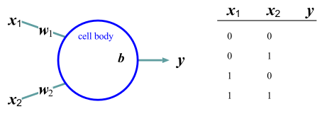
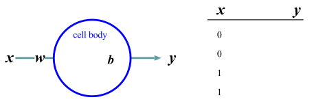

<link href="/css/asamarkdown.css" rel="stylesheet">

<strong> 人工知能 I および II</strong>  

<a href='mailto:educ0233@komazawa-u.ac.jp'>Shin Aasakawa</a>, all rights reserved. 
Date: 13/Jun/2025 
Appache 2.0 license 

* [課題提出用フォルダ ](https://drive.google.com/drive/folders/18KGP8mWCPFgsR9SfwAFiyUQCtgrZSzza?usp=drive_link){:target="_blank"}

# 第 8 回

## キーワード

* 誤差逆伝播法 back propagation
* 勾配降下法 gradient descent method  (ブラインド ハイカー アナロジー)
* 学習率
<!-- * モーメンタム -->
* 勾配消失問題 gradient vanishing problem，勾配爆発問題 gradient explosion problem,
* 誤差関数, 損失関数，目的関数，勾配降下法。
<!-- * 信用割当問題 -->
<!-- * 勝者占有回路 -->
<!-- * ワンホットベクトル-->
<!--* 単語埋め込み-->
* [ソフトマックス関数 ](https://colab.research.google.com/github/komazawa-deep-learning/komazawa-deep-learning.github.io/blob/master/2023notebooks/2023_0512softmax.ipynb){:target="_blank"}

<!-- One hot vector,
word embeddings,
winners-take-all (winner takes it all) circuit.
ちはやふる -->

<!-- ## クイズ

* ML Machiine Learning, Mailing list, Maximum Likelihood
* SGD
* learning ratio
* pdf: probalility density function, portable document format

One hot vector,
word embeddings,
winners-take-all (winner takes it all) circuit.
ちはやふる -->

### 実習ファイル

* [最小コードの排他的論理和  ](https://colab.research.google.com/github/komazawa-deep-learning/komazawa-deep-learning.github.io/blob/master/notebooks/220komazawa_miniumXOR.ipynb){:target="_blank"}
* [3 層パーセプトロンと確率的勾配降下法のデモ ](https://colab.research.google.com/github/ShinAsakawa/ShinAsakawa.github.io/blob/master/notebooks/2021_0521mlp_Adam_SGD.ipynb){:target="_blank"}

* [ソフトマックス関数解題 ](https://colab.research.google.com/github/ShinAsakawa/ShinAsakawa.github.io/blob/master/2022notebooks/2022_1107softmax.ipynb){:target="_blank"}
また，ソフトマックス関数は，エネルギー関数とみなすことも可能である。

* [画像認識 PyTorch の基礎編 AlexNet ](https://colab.research.google.com/github/komazawa-deep-learning/komazawa-deep-learning.github.io/blob/master/notebooks/2020_0515komazawa_step_by_step_CNN_Pytorch.ipynb){:target="_blank"}
* [ステップ・バイ・ステップで画像認識の基礎 ](https://colab.research.google.com/github/komazawa-deep-learning/komazawa-deep-learning.github.io/blob/master/notebooks/2020_0515komazawa_step_by_step_CNN_Pytorch.ipynb){:target="_blank"}

* [ニューラルネットワークモデルの定義 ](https://colab.research.google.com/github/komazawa-deep-learning/komazawa-deep-learning.github.io/blob/master/2022notebooks/2022_1028komazawa_neural_networks_primer.ipynb){:target="_blank"}
* [3 層パーセプトロンと確率的勾配降下法のデモ ](https://colab.research.google.com/github/ShinAsakawa/2015corona/blob/master/2021notebooks/2021_0521mlp_Adam_SGD.ipynb){:target="_blank"}
* [ccap 資料初心者のためのニューラルネットワーク ](https://colab.research.google.com/github/project-ccap/project-ccap.github.io/blob/master/2022notebooks/2022_0418ccap_neural_networks_for_primer.ipynb){:target="_blank"} 

<!-- * [三夕の歌  ](https://colab.research.google.com/github/ShinAsakawa/ShinAsakawa.github.io/blob/master/2022notebooks/2022_0925RNN_3twilight_poetries.ipynb)
* [足し算モデル ](https://colab.research.google.com/github/ShinAsakawa/2019cnps/blob/master/notebooks/2019cnps_addtion_rnn.ipynb)
 -->
<!-- * [word2vec 実習 ](https://colab.research.google.com/github/komazawa-deep-learning/komazawa-deep-learning.github.io/blob/master/notebooks/2020_0619word2vec.ipynb) -->

<!-- - [SRN のデモ ](https://colab.research.google.com/github/komazawa-deep-learning/komazawa-deep-learning.github.io/blob/master/2021notebooks/2021_0702rnn_demo.ipynb)
- [足し算のデモ ](https://colab.research.google.com/github/komazawa-deep-learning/komazawa-deep-learning.github.io/blob/master/2021notebooks/2021_0702RNN_binary_addtion_demo.ipynb) - [足し算のデモ keras 版 ](https://colab.research.google.com/github/ShinAsakawa/2019cnps/blob/master/notebooks/2019cnps_addtion_rnn.ipynb)-->

<!-- - [Bahdanau and Loung attentions ](https://colab.research.google.com/github/komazawa-deep-learning/komazawa-deep-learning.github.io/blob/master/2021notebooks/2021_1022Two_attentions_additive_and_multiplicative_Seq2seq.ipynb)
* [Attention is all you need ](https://colab.research.google.com/github/komazawa-deep-learning/komazawa-deep-learning.github.io/blob/master/2021notebooks/2021_1022The_Annotated_%22Attention_is_All_You_Need%22.ipynb) -->

<!--
* [注意つき翻訳モデル ](https://colab.research.google.com/github/komazawa-deep-learning/komazawa-deep-learning.github.io/blob/master/2021notebooks/2021_1008seq2seq_attention_demo.ipynb)
* [バニラ風味 注意なし翻訳モデル ](https://colab.research.google.com/github/komazawa-deep-learning/komazawa-deep-learning.github.io/blob/master/2021notebooks/2021_1003vanilla_seq2seq2.ipynb) -->

<!-- * [GPT-3 を使って，自発話のシミュレーション ](https://colab.research.google.com/github/ShinAsakawa/ShinAsakawa.github.io/blob/master/2022notebooks/2022_0719japanese_gpt_1b.ipynb)
* [T5 による，文章穴埋め問題  ](https://colab.research.google.com/github/ShinAsakawa/ShinAsakawa.github.io/blob/master/2022notebooks/2022_0918T5_demo_filling_blank_question.ipynb)
* [Seq2seq モデル による翻訳デモ 注意付きリカレントニューラルネットワーク ](https://colab.research.google.com/github/komazawa-deep-learning/komazawa-deep-learning.github.io/blob/master/2021notebooks/2021_1008seq2seq_attention_demo.ipynb)
* [BERT の微調整実習 ](https://colab.research.google.com/github/ShinAsakawa/ShinAsakawa.github.io/blob/master/2022notebooks/2022_0623BERT_SNOW_training.ipynb) -->

<!-- - [足し算のデモ ](https://colab.research.google.com/github/komazawa-deep-learning/komazawa-deep-learning.github.io/blob/master/2021notebooks/2021_0702RNN_binary_addtion_demo.ipynb){:target="_blank"}
* [CNN 畳み込み層の可視化 ](https://colab.research.google.com/github/ShinAsakawa/ShinAsakawa.github.io/blob/master/2022notebooks/2022_1024CNN_layer_visualization.ipynb){:target="_blank"}
* [各画像の画面表示時に日本語キャプションを付与する準備 ](https://colab.research.google.com/github/project-ccap/ccap/blob/master/notebooks/2020importing_ccap_from_GitHub.ipynb){:target="_blank"}
* [EfficientNet のパラメータ実習 ](https://colab.research.google.com/drive/1QpKBHsBR5yvEOz2M-pKCUpliDh1XXplS){:target="_blank"}
* [データ拡張 ](https://colab.research.google.com/github/ShinAsakawa/ShinAsakawa.github.io/blob/master/2021notebooks/2021_0617plot_transforms_demo.ipynb) -->

<!-- - [TLPA 絵画命名検査 ](https://colab.research.google.com/github/project-ccap/project-ccap.github.io/blob/master/notebooks/2020_0724transfer_learning_tlpa_mnasnet.ipynb){:target="_blank"} -->
<!-- - [TLPA & SALA 絵画命名検査 ](https://colab.research.google.com/github/komazawa-deep-learning/komazawa-deep-learning.github.io/blob/master/2021notebooks/2021_0618pnt_transfer_learning.ipynb){:target="_blank"} -->

<!-- - [フィラデルフィア絵画命名検査課題 PNT を転移学習 ](https://colab.research.google.com/github/ShinAsakawa/ShinAsakawa.github.io/blob/master/2023notebooks/2020_0720tlpa_sala_resnet18.ipynb){:target="_blank"}
- [データ拡張 ](https://colab.research.google.com/github/ShinAsakawa/ShinAsakawa.github.io/blob/master/2021notebooks/2021_0617plot_transforms_demo.ipynb){:target="_blank"} -->

<!-- - [CAM 実習 ](https://colab.research.google.com/github/komazawa-deep-learning/komazawa-deep-learning.github.io/blob/master/2021notebooks/2021_0618CAM_demo.ipynb){:target="_blank"} -->

<!-- - [各画像の画面表示時に日本語キャプションを付与する準備 ](https://colab.research.google.com/github/project-ccap/ccap/blob/master/notebooks/2020importing_ccap_from_GitHub.ipynb){:target="_blank"}-->
<!-- - [EfficientNet のパラメータ実習 ](https://colab.research.google.com/drive/1QpKBHsBR5yvEOz2M-pKCUpliDh1XXplS) -->

## デモ

- [グーグルによるニューラルネットワークの遊び場 (プレイグランド)](https://project-ccap.github.io/tensorflow-playground/){:target="_blank"}

## 知能のコンピュータアナロジー

知能をコンピュータに擬 (なぞら) えることは，初期の AI は，コンピュータ黎明期でもあったこともあり，多くの人間を惹きつけた。
例えば，哲学者 Foder は「人間の心は脳のハードウェア上で動くプログラムである」と主張した。
プログラムであるならば，別のハードウェアにインストールすれば動作することを意味し，人工知能研究にとって重要な考え方であった。
また，同じハードウェアに異なるソフトウェアをインストールすれば，異なるプログラムが動作する。
<!-- Patricia Churchland  は 「猫についてはどうか？」 と質問した。
フォダーは自信たっぷりにこう答えた「猫の脳が猫のプログラムを動かしているのだ。」 -->
この脳を単なるハードウェアとして無視し，プログラムに集中する **「機能主義」** が正当化されてきた。

ところが脳は，状況が異なる。
上に書いたとおりコンピュータでは，同じハードウェアで異なるソフトウェアを動かすことができるが，脳では，ハードウェアとソフトウェアを分離することが難しく，また，まったく同じ脳は 2 つ存在しない。
人間が，新しいことを学習するときには，脳のハードウェアが修正されていると考えることができる。
そのため，神経細胞同士がどのようにつながっているかを再構築し，その通信内容を記録することで，自然が発見したアルゴリズムを解明することができる。

脳は多くの相互作用するアルゴリズムから作られていると考える研究者もいる ([Navlakha2018](https://www.wired.com/story/why-animal-extinction-is-crippling-computer-science/))。
脳は，互いに調整可能，適応可能な神経細胞 (ニューロン) ですべて作られているため，
各部分アルゴリズムを統合して一つにする問題は，神経細胞間の調整に委ねられている。<!-- これは，多様なネットワークアーキテクチャの構築と統合が急速に進んでいることに反映されている。 -->
これに対して，異なる規則や記号で設計された視覚モジュール，運動制御モジュール，計画モジュールなどのモジュールを統合して大規模な系を構築することは問題であった。
<!-- Navlakha, S. (2018). Why animal extinction is crippling computer science. Wired (September 19). https://www.wired.com/story/why-animal-extinction-is-crippling-computer-science/ -->
<!-- The computer metaphor for intelligence was an attractive garden path.
I once was at a talk given by Jerry Fodor, a philosopher of science, who claimed that the human mind was a program that ran on the brain’s hardware.
Patricia Churchland asked, “What about cats?” “Yes,” Fodor replied confidently.
“The cat brain is running the cat program.”
This argument was used to justify functionalism—the view that we can ignore the brain as mere hardware and focus on the program.
Unlike digital computers, where the same hardware can run different software programs, the hardware in brains is the software, and no two brains are identical.
As we learn new things, we are modifying our hardware.
This is why the algorithms that nature discovered can be uncovered by reconstructing how neurons are connected with each other and recording what they communicate.
Although brains are built from many interacting algorithms (Navlakha2018), the problem of integrating subsystems is alleviated because they are all built with neurons that can adapt to each other.
This is reflected in the rapid progress that has been made in building and integrating diverse network architectures.
In contrast, integrating modules such as a vision module, a motor control module, and a planning module designed with different rules and symbols to build large-scale systems was problematic. -->

## パーセプトロン perceptrons

現代の機械学習の種は AI の黎明期にはすでに蒔かれていた。
Frank Rosenblatt のパーセプトロン (1961) は，単層の **重み勾配降下法** を使って，例からの入力を分類することを学習した。

++++
 
<!--   -->
左: フランク・ローゼンブラット (Frank Rosenblatt)。
右: パーセプトロンの模式図 ミンスキーとパパート「パーセプトロン」より
<!--   -->

**コネクショニスト connectionist** の研究コミュニティが，確率的な二値ニューロンの多層ネットワークの学習アルゴリズムを発明し(Ackley+1985)，決定論的な実数値ニューロンの **誤差逆伝播法 (バックプロパゲーション)** アルゴリズムを再発見してニューラルネットワークに適用するまで (Rumelhart+1986)，さらに 24 年かかった。
当時は，視覚や音声のような難しい問題の学習を進めるのに，どれだけのコンピュータパワーが必要なのかが分かっていなかった。
それから 30 年以上が経ち，今ではどれだけのコンピューティングパワーが必要なのかが分かっている。
この計算資源の進化により，**大規模言語モデル LLM (Large Language Model)** が構築され，近年の話題 chatGPT などにつながっている。
<!-- 驚いたのは，人間の知能の宝庫といわれる言語が，これほどまでに進歩したことである。 -->
<!--The seeds of modern machine learning were already being sown at the dawn of AI.
Frank Rosenblatt’s perceptron (1961) learned to categorize inputs from examples using gradient descent on a single layer of weights.
It would take another 24 years before the connectionist research community invented a learning algorithm for multilayer networks of stochastic binary neurons (Ackley+1985) and rediscovered the backpropagation algorithm for deterministic, real-valued neurons and applied them to neural networks (Rumelhart+1986).
What was not known back then was how much computer power it would take to make progress with learning on difficult problems like vision and speech.
A third of a century later, we now know how much computing power is needed.
The surprise was how much progress has been made with language, thought to be the crown jewel of human intelligence.-->

<!-- ### バイアス，(偏り，偏見，一般論，常識)
従来の AI で論理的推論を重視したのも見当違いだった。
数学者が習得している論理的なステップの系列をエミュレートする方法を学ぶには，多くの訓練が必要だ。
抽象的な推論課題に関する明示的な訓練がなければ，人間は身近な環境でより効果的に論理的な結論に達することができ，LLM でも同じバイアスが観察されている [Dasgupta+2022](https://arXiv.org/abs/2207.07051/)。
TD-ギャモンや AlphaGo が示した創造性は，深層学習皮質モデルだけで生じたものではなく，手続き学習の一種である強化学習と連動していた。
強化学習は，報酬予測誤差を表す神経調節物質であるドーパミンによって，我々の大脳基底核で実施される (図 5参照)。
我々はドーパミンの信号に意識的にアクセスすることはできないが，モチベーションに強力な影響を与え，すべての依存性薬物はドーパミンの活性を操作することで機能する(Sejnowski2019)。
<!-- The emphasis on logical reasoning in traditional AI was also misguided.
Learning how to emulate sequences of logical steps, which mathematicians have mastered, requires a lot of training.Without explicit training on abstract reasoning tasks, humans can more effectively reach logical conclusions in familiar settings, and the same bias has been observed in LLMs (Dasgupta+2022).
The creativity that TD-Gammon and AlphaGo exhibited did not arise from the deep learning cortical model alone, but in conjunction with reinforcement learning, a form of procedural learning.
Reinforcement learning is implemented in our basal ganglia by dopamine, a neuromodulator that represents reward prediction error (see Figure 5).
We do not have conscious access to dopamine signals, but they have a powerful impact on our motivation, and all addictive drugs work by manipulating dopamine activity (Sejnowski2019). -->

# ニューロンのモデル

ニューロンが振動数符号化法のみを利用している --- すなわちニューラルネットワークにおけるすべての情報はニューロンの発火頻度によって伝達される --- ことを仮定する。
すなわち，このニューロンに到達する信号を単位時間あたりで等しく貢献するものと考える。
このような記述の仕方は integrate--and--fire (積分発火) モデルと呼ばれる。

一つのニューロンの振る舞いは，n 個のニューロンから入力を受け取って出力を計算する多入力，1 出力の情報処理素子である (下図 1)。

$n$ 個の入力信号を $x_1, x_2, \cdots, x_n$ とし、$i$ 番目の軸索に信号が与えられたとき、この信号 1 単位によって変化する膜電位の量をシナプス荷重(または結合荷重, 結合強度とも呼ばれる) といい $w_i$ と表記する。
抑制性のシナプス結合については $w_i < 0$, 興奮性の結合については $w_i > 0$ である。
このニューロンのしきい値を $h$, 膜電位の変化を $u$, 出力信号を $z$ とする。

 
<!--  
 -->
ニューロンの模式図 wikipedia より

<!-- 

 
<!--  
形式ニューロン

 -->

 

図 形式ニューロン

出力信号 $z$ は次式で表される:

$$ z=f(\mu)=f\left(\sum_{i=1}^{n}w_{i}x_{i}-h\right).\tag{1} $$

$f(\mu)$ は出力関数であり、$0\le f(\mu)\le1$ の連続量を許す場合や、0 または 1 の値しかとらない場合などがある。
連想記憶などを扱うときなどは $-1\le f(\mu)\le 1$ とする場合もある。

- 上図で，$f$ がなければ，$z=\sum wx - h$ となり，回帰と同じである。
- すなわちニューラルネットワークのもっとも簡単な形は，統計学の用語では，**回帰 regression** である。
- 統計学においては，回帰，この場合，線形回帰になる，にかかわる変数 $x_{i}$
- 回帰の中を複雑にしていくことで，データに適合させようとする努力が，データサイエンスであり，機械学習であり，ニューラルネットワークであると言える。

## マッカロック・ピッツの形式ニューロン

信号入力の荷重和
$$ \mu = \sum_{i=1}^{n}w_{i}x_{i},\tag{2} $$
に対して、出力 $z$ は $u$ がしきい値 $h$ を越えたときに $1$, そうでなければ 0 を出力するモデルのことをマッカロックとピッツの形式ニューロン (formal neuron) と呼ぶ。
マッカロック・ピッツの形式ニューロンは神経細胞の振る舞いを記述するもっとも古く、単純な神経細胞のモデルであるが、現在でも用いられることがある。

$$
z = \left\{ \begin{array}{ll}
 1, & \mbox{$u > 0$ のとき} \\
 0, & \mbox{それ以外}
 \end{array}\right.
$$

とすればマッカロック・ピッツのモデルは次式で表すことができる

$$ z=\mathbb{1}\left(\sum_{i=1}^nw_ix_i -h\right)\tag{3} $$

式中の $\mathbb{1}$ は数字ではなく 上式で表される関数の意味である。
このモデルは、単一ニューロンのモデルとしてではなく、ひとまとまりのニューロン群の動作を示すモデルとしても用いることがある。

<!--
### 出力が連続関数の場合

時間 $t$ における入力信号は $x_i(t)$ は $i$ 番目のシナプスの興奮伝達の時間 $t$ 付近での平均ととらえることができる。
すると、最高頻度の出力を 1, 最低(興奮無し)を 0 と規格化できると考えて $0\le f(\mu) \le1$ とする。
入出力関係は $f$ を用いて

$$ z = f(\mu) = f\left(\sum w_ix_i(t)-h\right)\tag{4} $$

のように表現される。
このモデルは、ニューロン集団の平均活動率ととらえることもできる。

良く用いられる出力関数 $f$ の形としては、$\mu = \sum w_ix_i -h$ として、

$$ f(\mu) = \frac{1}{1+e^{-\mu}},\tag{5} $$

や

$$ f(\mu) = \tanh(\mu)\tag{6}, $$

ただし $\mu = \sum w_{i}x_{i} -h$ などが使われることが多い。
(5) 式および (6) 式は、入力信号の重みつき荷重和 $\mu$ としてニューロンの活動が定まることを示している。
後述するバックプロパゲーション則で必要となるので、$\mu$ の微小な変化がニューロンの活動どのような影響を与えるか調べるために (5) 式 および (6) 式 を $\mu$ で微分することを考える。

$$ f(x) = \frac{1}{1+e^{-x}}, $$

を $x$ について微分すると

$$ \frac{df}{dx} = f(x)\left(1- f(x)\right) $$

$$ f(x) = \tanh{x} = \frac{e^{x}-e^{-x}}{e^{x}+e^{-x}} $$

を $x$ について微分すると

$$ \frac{df}{dx} =
1 - \tanh^2x = 1 - \left(f(x)\right)^2 $$

$\tanh$ は双曲線関数である。

以降では表記を簡単にするために線形数学の表記、すなわちベクトルと行列による表記方法を導入する。
$n$ 個の入力信号の組 $\left(x_1, x_2, \cdots, x_n\right)$ をまとめて $\mathbf{x}$ のようにボールド体で表す。本章では一貫してベクトル表記には小文字のボールド体を，行列には大文字のボールド体を用いることにする。
例えば $n$ 個の入力信号の組 $(x_1, x_2, \cdots, x_n)=\mathbf{x}$ に対して，同数の結合荷重 $\left(w_1, w_2, \cdots, w_n\right)=\mathbf{w}$ が存在するので，加算記号 $\sum$ を使って表現していた任意のニューロンへの全入力 $\mu=\sum w_{i}x_{i}$ はベクトルの内積を用いて $\mu=(\mathbf{w}\cdot\mathbf{x})$ と表現される。

なお，横一行のベクトルを行ベクトル，縦一列のベクトルを列ベクトルと呼ぶことがある。
ここでは行ベクトルと混乱しないように，必要に応じて列ベクトルを表現する際には $\{x_1, x_2, \cdots, x_n\}^{\top}=\mathbf{x}$ とベクトルの肩に $\top$ を使って表現することもある。

そして，これらをベクトル表現や行列表現で表せば，表記も簡単になり，行列の演算法則を活用することもできる。
そのため，ニューラルネットワークに関する文献でも行列表現が用いられることが多い。

図のような単純な 2 層の回路を例に説明する。

 
ネットワークの行列表現

わかりやすいように図と対応させながら，対応する行列表現とシグマ記号による表記を併記するので，よく理解した上で先に読み進んでいただきたい。
なお，どうしても行列表現にはなじめないという読者は，行列表現の箇所だけをとばして読んでもある程度はわかるよう記述するつもりである。

それでは，まず図 4 のような単純な 2 層のネットワークを例に説明しよう。
図には、３つの入力素子 (ユニットと呼ばれることもある)
と ２ つの出力素子の活性値（ニューロンの膜電位に相当する）

$x_{1}, x_{2}, x_{3}$ と $y_{1}, y_{2}$，および入力素子と出力素子の結合強度を表す $w_{11}, w_{12}, \cdots, w_{32}$ が示されている。
これらの記号をベクトル $\mathbf{x}$, $\mathbf{y}$ と行列 $\mathbf{w}$ を使って表すと $\mathbf{y}=\mathbf{Wx}$ となる。

図\ref{fig:matrix-notation.eps}の場合、ベクトルと行列の各要素を書き下せば、
$$
\left(\begin{array}{l}y_{1}\\
y_2\\
\end{array}\right)
=\left(
\begin{array}{lll}
w_{11}&w_{12}&w_{13}\\
w_{21}&w_{22}&w_{23}
\end{array}
\right)
\left(
\begin{array}{l}
x_1\\
x_2\\
x_3\\
\end{array}
\right)
$$
のようになる。　　

行列の積は、左側の行列の $i$ 行目の各要素と右側の行列（ベクトルは１列の行列でもある）の $i$ 列目の各要素とを掛け合わせて合計することなので、以下のような、加算記号を用いた表記と同じである。

$$
\begin{array}{lllll}
y_1 &=& w_{11}x_1 + w_{12}x_2 + w_{13}x_3 &=&\sum_i w_{1i} x_i\\
y_2 &=& w_{21}x_1 + w_{22}x_2 + w_{23}x_3 &=&\sum_i w_{2i} x_i\\
\end{array}
$$

これを、$m$ 個の入力ユニットと $n$ 個の出力ユニットの場合に一般化すれば、
以下のようになる。

単純な 2 層のネットワークを考える。
$i$ 番目の出力層の各ニューロンの膜電位 $y_i,(i=1,2,\cdots,n)$ をまとめて $\mathbf{y}$ とベクトル表現し、同様に入力層も $\mathbf{x}$ とする。
ニューロン $x_{j}$ から ニューロン $y_{i}$ へのシナプス結合強度を $w_{ij}$ と表現すれば、入力層から出力層への関係は

$$
\left(\begin{array}{l}
y_1 \\ y_2 \\ \vdots \\ y_n \end{array}\right)  =
\left(\begin{array}{llll}
w_{11} & w_{12} & \cdots & w_{1m} \\
w_{21} & w_{22} & \cdots & w_{2m} \\
\vdots &        & \ddots & \vdots \\
w_{n1} & w_{n2} & \cdots & w_{nm}
\end{array}\right)
\left(\begin{array}{l}
x_1 \\ x_2 \\ \vdots \\ x_m \end{array}\right) \\
\mathbf{y} = \mathbf{Wx}
$$

と表現できる。
しきい値の扱いについては、常に 1 を出力する仮想的なニューロン$x_0=1$を
考えて $W$ に組み込むことも可能である。

実際の出力は $\mathbf{y}$ の各要素に対して

$$ f(y) = \frac{1}{1+e^{-y}}, $$

のような非線型変換を施すことがある。

階層型のネットワークにとっては上式，非線型変換が本質的な役割を果たす。
なぜならば、こうした非線形変換がなされない場合には、ネットワークの構造が何層になったとしても、この単純なシナプス結合強度を表す行列を
$\mathbf{W}_{i}$ ($i=1,\cdots, p$) としたとき、$\mathbf{W} = \prod_{i=1}^p \mathbf{W}_{i}$ と置くことによって本質的には 1 層のネットワークと等価になるからである。

$$ \mathbf{y} = \mathbf{W}_{p}\mathbf{W}_{p-1}\cdots\mathbf{W}_{1}\mathbf{y}=\left(\prod_{i=1}^p\mathbf{W}_{i}\right)\mathbf{y}. $$

 

  -->

# ニューラルネットワークって何？

ニューラルネットワーク (神経回路網 neural networks) とは，神経細胞 (ニューロン) の結合 (ネットワーク) のことです。

クイズのようなダジャレのような話ですが，ANN, BNN, CNN, DNN という省略形で呼ばれています。

* ANN: 人工ニューラルネットワーク
* BNN: 生物学的ニューラルネットワーク
* CNN: 畳み込みニューラルネットワーク。アメリカ合衆国のケーブルテレビの名称でもある。
* DNN: ディープニューラルネットワーク

広義には ニューロンを基本計算単位とした情報処理モデルであると言えます。
**計算** という言葉は，算術演算を意味しません。脳の働き，さまざまな心の作用はすべて 計算である との立場です。
すなわち，我々の知的活動，心的状態は，ニューロンを基本構成単位とする ネットワーク働きとして説明されるという、心，あるいは 脳を理解するためのパラダイム一般をニューラルネットワーク，
あるいは，心 （精神） の計算理論と呼びます。

現在までのところ，ニューラルネットワーク研究では，脳の血流 （とその異常，障害），神経伝達物質の代謝 (とその異常，障害) ，と言った側面にまで
及んでいるわけではありません。

神経細胞は，人間を含む動物が持っていますが，人工ニューラルネットワーク (ANN) では，コンピュータ上で，ニューロンの働きを模倣することにより，複雑な課題を解くことを目指し，
場合によっては，人間以上の性能を示すまでになっています。

ANN は 生物学的ニューラルネットワーク (BNN) にヒントを得て作成されました。
ですが，現在の ANN は BNN に比べて極端な単純化を行った並列情報処理モデルです。

たとえば，スパイキングモデルは計算機科学の分野では重要な位置を占めています。
スパイキングモデルでは 樹状突起による計算や 各ニューロン内の他のプロセス（Gallistel & King, 2011) あるいは，異なるタイプのニューロンからの関与を考慮しているとは言えません。

通常 ANN では ニューロンの空間構造は プログラミング可能な形で抽象化されています。
ニューロンのスパイク出力はスパイク率のような実数としてモデル化されています。
<!--このレートは、静的な非線形性を介して入力される活性化の加重和としてモデル化されます。-->
このように単純化されているにもかかわらず，ニューラルネットワークは脳の情報処理を理解するための最も重要な方法の 1 つとなっています。

おそらく，この方法が主流になると予想しています。

実際のニューロンの活動を調べる 神経科学 と 人間の 知的活動を 材料とする 認知科学 との橋渡しをする 理論モデルとして 中心的な役割を果たすことになると予想します。

逆にこれ以外の方法で，心の理解がありえるのだろうか？

### 多入力一出力という単純化

$$
y=sign\left(\sum_{i=1}^{N}w_ix_i+b\right)
$$

<!-- ## パーセプトロンの学習 -->

<!-- $$
\mathbf{w}\leftarrow\mathbf{w}+\left(y-\hat{y}\right)\mathbf{x}
$$ -->

<!-- パーセプトロン perceptron は 3 層の階層型ネットワークでそれぞれ S(sensory layer), A(associative layer), R(response layer) と呼ぶ。
$S\rightarrow A \rightarrow R$ のうち パーセプトロンの本質的な部分は $A\rightarrow R$ の間の学習にある。

入力パターンに $P^+$ と $P^-$ とがある。
パーセプトロンは $P^+$ が入力されたとき $1$, $P^-$ のとき $0$ を出力する機械である。
出力層 ($R$) の $i$ 番目のニューロンへの入力(膜電位の変化) $u_i$ は

$$\tag{eq1}
u_{i} = \sum_{j} w_{ij}x_{j} - \theta_{i} = \left(w\right)_{i}\cdot\left(x\right)_{i}-\theta_{i}.
$$

ここで中間層 ($A$) の $j$ 番目のニューロンの出力 $y_i$ とこのニューロンとの結合係数を $w_{ij}$，しきい値を $\theta_i$ とした。
このニューロンの出力$y_i$(活動電位、スパイク)は、

$$
y_i = \lceil u_i\rceil
\qquad\left\{
\begin{array}{ll}
 1 & \mbox{if $u_i \ge 0$,}\\
 0 & \mbox{otherwize}
\end{array} \right.
$$

$$
y=sign\left(\sum_{i=1}^Nw_ix_i+b\right)
$$

と表される。

式 (\label{eq1}) の意味を理解するために以下の図を参照

Minsky and Papert はパーセプトロンのベクトル表示について悲観的な考え方を持っているようですが、ここでは理解のしやすさを優先します。

$$
\mathbf{w}\rightarrow\mathbf{w}+\left(y-\hat{y}\right)\mathbf{x}
$$ -->

## 論理回路の設計

基本的な論理回路と簡単な記憶回路を神経回路網で構成する方法を考えてみます。
シリコンウェハ上に構成される論理回路をニューロン素子でも実現できることを示し以下に引用したウィーナーの言葉を裏付ける根拠を示すことにします。

## AND (論理積)回路

2 入力 1 出力の回路において、2 つの入力が共に真であるときのみ真を出力し、
そうでなければ偽となる論理演算である論理積 (AND) を考えます。
論理積は引数を 2 つとる演算であり、
出力を $y$ とすれば $y = f(x_1, x_2)$ のように書くことができます。
$x_1$, $x_2$ ともに 1 または 0 の値をとるものとすれば、
$y$ が 1 であるためには $x_1 = 1$ かつ $x_2 = 1$ でなければなりません

|y  |$x_1$ |$x_2$|
|:--|:-----|:-----|
|0  |   0  |  0|
| 0 |    0 |  1|
| 0 |    1 |   0|
| 1 |    1 |   1|

## OR (論理和)回路

<!-- 

{#fig:formal_proto1 style="width:69%"}

 -->

## NOT (否定)回路

<!-- 

{#fig:formal_one style="width:69%"}

 -->

## 排他的論理和 (XOR) 回路

<!-- 

{#fig:xor style="width:49%"}

{#fig:xor-graph style="width:29%"}

 -->

### PDP book (1986) chapter 8 Figure 2

<!--

{#fig:1986PDP_Fig2 style="width:39%"}

 -->

---

#### 内部表象

<!-- 

{#fig:1986PDP_Fig2 style="width:39%"}

 -->

おそらく人類史上初，哲学的な意味ではなく内部表象が計算可能になった

---

#### 排他的論理和の別解

<!-- 

{#fig:xor-w-direct style="width:49%"}

-->

|$A$|$B$|$\neg{A}$|$\neg B$|$A\mapsto B$|$B\mapsto A$|$\neg B\mapsto \neg A$|
|:--:|:--:|:------:|:------:|:----------:|:----------:|:-------------------:|
|1  | 1 | 0 | 0 | 1 | 1 | 1 |
|1  | 0 | 0 | 1 | 0 | 1 | 0 |
|0  | 1 | 1 | 0 | 1 | 0 | 1 |
|0  | 0 | 1 | 1 | 1 | 1 | 1 |

## 簡単な記憶回路 フリップフラップ回路

AND 素子と NOT 素子とを繋いで簡単な記憶回路を作ることができる

図で各素子は $1$ か $0$ かを値として取りうる **形式ニューロン** だとする。
今、入力 $x$ と入力 $y$ とが共に $1$ であれば $A=1$, $B=0$ あるいは $A=0$, $B=1$ のときだけこの回路は安定である。

ここで $x=0$, $y=1$ とすると $A=0$, $B=1$ の状態になり、 $x=1$, $y=0$ とすると $A=1$, $B=0$ の状態になる。
しかも、この状態は $x=y=1$ に入力を戻しても保存される。
これは $1$ ビットの記憶回路でありフリップフラップ回路 (flip-flop circuit) と呼ばれる。

このことは AND と NOT を実現できる神経回路素子があれば記憶回路を作ることができることを示している。
しかも工学的に実現されている回路と完全に等価である。
フリップフロップ回路を何個かまとめてレジスタ (register) と呼ぶ。
市販されている PC の CPU の性能を指して 64 ビットマシンと呼ぶのは、このレジスタの大きさ(記憶装置への基本的な入出力単位の基本でもある)による。

一般にコンピュータの速度はこのフリップフラップ回路が安定するまでの時間に依存します。
なぜなら、コンピュータの基本動作は原理的に、上述のフリップフラップ回路が安定するのを待って、次の命令をレジスタに読み込むことの繰り返しだからである。

###  `TensorFlow` と `PyTorch` の関係と，授業ではなぜ `PyTorch` を用いるのかの理由

- [Stackoverflow の言語トレンド](https://insights.stackoverflow.com/trends?tags=python%2Cjavascript%2Cjava%2Cc%23%2Cphp%2Cc%2B%2B){:target="_blank"}
- [TensorFlow と PyTorch の人気比較](http://horace.io/pytorch-vs-tensorflow/){:target="_blank"} -->
- [TensorFlow と PyTorch の人気比較](https://thegradient.pub/state-of-ml-frameworks-2019-pytorch-dominates-research-tensorflow-dominates-industry/){:target="_blank"}
- [Google トレンド](https://trends.google.com/trends/explore?q=pytorch,keras,tensorflow){:target="_blank"}

<!--## ローゼンブラット Rosenblatt のパーセプトロン

 -->

<!--$$
\mathbf{w}\leftarrow\mathbf{w}+\left(y-\hat{y}\right)\mathbf{x}
$$-->

1. [ディープラーニング概説, 2015, LeCun, Bengio, Hinton, Nature](https://komazawa-deep-learning.github.io/2021/2015LeCun_Bengio_Hinton_NatureDeepReview.pdf){:target="_blank"}
1. [ゴール駆動型深層学習モデルを用いた感覚皮質の理解 Yamins(2016) Nature](https://project-ccap.github.io/2016YaminsDiCarlo_Using_goal-driven_deep_learning_models_to_understand_sensory_cortex.pdf){:target="_blank"}
1. [ディープラーニングレビュー Storrs ら, 2019, Neural Network Models and Deep Learning, 2019](https://komazawa-deep-learning.github.io/2021/2019Storrs_Golan_Kriegeskorte_Neural_network_models_and_deep_learning.pdf){:target="_blank"}
1. [深層学習と脳の情報処理レビュー Kriegestorte, 2015, Deep Neural Networks: A New Framework for Modeling Biological Vision and Brain Information Processing](2015Kriegeskorte_Deep_Neural_Networks-A_New_Framework_for_Modeling_Biological_Vision_and_Brain_Information_Processing.pdf){:target="_blank"}
1. [生物の視覚と脳の情報処理をモデル化する新しい枠組み Kriegeskorte, Deep Neural Networks: A New Framework for Modeling Biological Vision and Brain Information Processing, 2015](https://project-ccap.github.io/2015Kriegeskorte_Deep_Neural_Networks-A_New_Framework_for_Modeling_Biological_Vision_and_Brain_Information_Processing.pdf){:target="_blank"}
1. [計算論的認知神経科学 Kriegeskorte and Douglas, 2018, Cognitive computational neuroscience](https://project-ccap.github.io/2018Kriegeskorte_Douglas_Cognitive_Computational_Neuroscience.pdf){:target="_blank"}
1. [視覚系の畳み込みニューラルネットワークモデル，過去現在未来 Lindsay, 2020, Convolutional Neural Networks as a Model of the Visual System: Past, Present, and Future](https://project-ccap.github.io/2020Lindsay_Convolutional_Neural_Networks_as_a_Model_of_the_Visual_System_Past_Present_and_Future.pdf){:target="_blank"}

# ソフトマックス関数

## ゲートとして

#### 図 ゲートの概念図
ゲートが開いているときは，感覚入力は作業記憶を更新できるが，閉じているときはそれができない。
このため，妨害刺激など無関連情報が以前に記憶した情報の維持を妨げるのを防ぐことができる。
O'Reilly (2006) より

