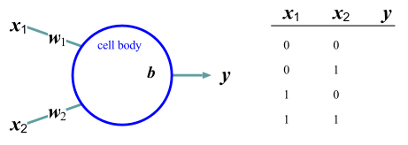
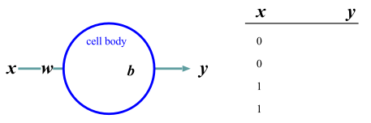

<link href="/css/asamarkdown.css" rel="stylesheet">

<strong>ディープラーニングの心理学的解釈</strong>  

<a href='mailto:educ0233@komazawa-u.ac.jp'>Shin Aasakawa</a>, all rights reserved. 
Date: 20/Jun/2025 
Appache 2.0 license 

* [Which chat AI has the best translation capabilities? The number one spot goes to a surprising one!](https://youtu.be/k4HxwEJewIM)

* [課題提出用フォルダ ](https://drive.google.com/drive/u/5/folders/1PbM65pDtkZz_eHsNgHhUHTfvqmR2xr2r){:target="_blank"}

# 第 9 回

## キーワード

* 誤差逆伝播法 back propagation
* 勾配降下法 gradient descent method  (ブラインド ハイカー アナロジー)
* 学習率
<!-- * モーメンタム -->
* 勾配消失問題 gradient vanishing problem，勾配爆発問題 gradient explosion problem,
* 誤差関数, 損失関数，目的関数，勾配降下法。 
* 信用割当問題
* 勝者占有回路
<!-- * ワンホットベクトル-->
<!--* 単語埋め込み -->
* [ソフトマックス関数 ](https://colab.research.google.com/github/komazawa-deep-learning/komazawa-deep-learning.github.io/blob/master/2023notebooks/2023_0512softmax.ipynb){:target="_blank"}

<!-- One hot vector,
word embeddings,
winners-take-all (winner takes it all) circuit.
ちはやふる -->

<!-- ## クイズ

* ML Machiine Learning, Mailing list, Maximum Likelihood
* SGD
* learning ratio
* pdf: probalility density function, portable document format

One hot vector,
word embeddings,
winners-take-all (winner takes it all) circuit.
ちはやふる -->

## デモ

- [グーグルによるニューラルネットワークの遊び場 (プレイグランド)](https://project-ccap.github.io/tensorflow-playground/){:target="_blank"}
<!-- * [ニューラルネットワークで遊んでみよう](https://komazawa-deep-learning.github.io/tensorflow-playground/#activation=tanh&batchSize=10&dataset=circle&regDataset=reg-plane&learningRate=0.03&regularizationRate=0&noise=0&networkShape=4,2&seed=0.98055&showTestData=false&discretize=false&percTrainData=50&x=true&y=true&xTimesY=false&xSquared=false&ySquared=false&cosX=false&sinX=false&cosY=false&sinY=false&collectStats=false&problem=classification&initZero=false&hideText=false){:target="_blank"} -->

### 実習ファイル

<!-- * [最小コードの排他的論理和  ](https://colab.research.google.com/github/komazawa-deep-learning/komazawa-deep-learning.github.io/blob/master/notebooks/220komazawa_miniumXOR.ipynb){:target="_blank"} -->
* [実習 オーバーフィッティング，アンダーフィッテング ](https://colab.research.google.com/github/ShinAsakawa/ShinAsakawa.github.io/blob/master/notebooks/2020Sight_Visit_polynomilal_fittings_demo.ipynb){:target="_blank"}
* [3 層パーセプトロンと確率的勾配降下法のデモ ](https://colab.research.google.com/github/ShinAsakawa/ShinAsakawa.github.io/blob/master/notebooks/2021_0521mlp_Adam_SGD.ipynb){:target="_blank"}
* [W vs. WO PyTorch, ccap 資料初心者のためのニューラルネットワーク ](https://colab.research.google.com/github/project-ccap/project-ccap.github.io/blob/master/2022notebooks/2022_0418ccap_neural_networks_for_primer.ipynb){:target="_blank"} 
* [ソフトマックス関数解題 ](https://colab.research.google.com/github/ShinAsakawa/ShinAsakawa.github.io/blob/master/2022notebooks/2022_1107softmax.ipynb){:target="_blank"}
また，ソフトマックス関数は，エネルギー関数とみなすことも可能である。

* [ニューラルネットワークモデルの定義 ](https://colab.research.google.com/github/komazawa-deep-learning/komazawa-deep-learning.github.io/blob/master/2022notebooks/2022_1028komazawa_neural_networks_primer.ipynb){:target="_blank"}

<!-- * [画像認識 PyTorch の基礎編 AlexNet ](https://colab.research.google.com/github/komazawa-deep-learning/komazawa-deep-learning.github.io/blob/master/notebooks/2020_0515komazawa_step_by_step_CNN_Pytorch.ipynb){:target="_blank"}
* [ステップ・バイ・ステップで画像認識の基礎 ](https://colab.research.google.com/github/komazawa-deep-learning/komazawa-deep-learning.github.io/blob/master/notebooks/2020_0515komazawa_step_by_step_CNN_Pytorch.ipynb){:target="_blank"} -->

## 参考

* [ベイズ学習](/2023cogpsy/2023_1124bayes){:target="_blank"}
* [最適化](/2023cogpsy/2023_1124optimizations){:target="_blank"}

### 多層ニューラルネットワーク

時間 $t$ における入力信号は $x_i(t)$ は $i$ 番目のシナプスの興奮伝達の時間 $t$ 付近での平均ととらえることができる。
すると、最高頻度の出力を 1, 最低(興奮無し)を 0 と規格化できると考えて $0\le f(\mu) \le1$ とする。
入出力関係は $f$ を用いて

$$ z = f(\mu) = f\left(\sum w_ix_i(t)-h\right)\tag{4} $$

のように表現される。
このモデルは、ニューロン集団の平均活動率ととらえることもできる。

良く用いられる出力関数 $f$ の形としては、$\mu = \sum w_ix_i -h$ として、

$$ f(\mu) = \frac{1}{1+e^{-\mu}},\tag{5} $$

や

$$ f(\mu) = \tanh(\mu)\tag{6}, $$

ただし $\mu = \sum w_{i}x_{i} -h$ などが使われることが多い。
(5) 式および (6) 式は、入力信号の重みつき荷重和 $\mu$ としてニューロンの活動が定まることを示している。
後述するバックプロパゲーション則で必要となるので、$\mu$ の微小な変化がニューロンの活動どのような影響を与えるか調べるために (5) 式 および (6) 式 を $\mu$ で微分することを考える。

$$ f(x) = \frac{1}{1+e^{-x}}, $$

を $x$ について微分すると

$$ \frac{df}{dx} = f(x)\left(1- f(x)\right) $$

$$ f(x) = \tanh{x} = \frac{e^{x}-e^{-x}}{e^{x}+e^{-x}} $$

を $x$ について微分すると

$$ \frac{df}{dx} =
1 - \tanh^2x = 1 - \left(f(x)\right)^2 $$

$\tanh$ は双曲線関数である。

以降では表記を簡単にするために線形数学の表記、すなわちベクトルと行列による表記方法を導入する。
$n$ 個の入力信号の組 $\left(x_1, x_2, \cdots, x_n\right)$ をまとめて $\mathbf{x}$ のようにボールド体で表す。本章では一貫してベクトル表記には小文字のボールド体を，行列には大文字のボールド体を用いることにする。
例えば $n$ 個の入力信号の組 $(x_1, x_2, \cdots, x_n)=\mathbf{x}$ に対して，同数の結合荷重 $\left(w_1, w_2, \cdots, w_n\right)=\mathbf{w}$ が存在するので，加算記号 $\sum$ を使って表現していた任意のニューロンへの全入力 $\mu=\sum w_{i}x_{i}$ はベクトルの内積を用いて $\mu=(\mathbf{w}\cdot\mathbf{x})$ と表現される。

なお，横一行のベクトルを行ベクトル，縦一列のベクトルを列ベクトルと呼ぶことがある。
ここでは行ベクトルと混乱しないように，必要に応じて列ベクトルを表現する際には $\{x_1, x_2, \cdots, x_n\}^{\top}=\mathbf{x}$ とベクトルの肩に $\top$ を使って表現することもある。

そして，これらをベクトル表現や行列表現で表せば，表記も簡単になり，行列の演算法則を活用することもできる。
そのため，ニューラルネットワークに関する文献でも行列表現が用いられることが多い。

図のような単純な 2 層の回路を例に説明する。

 
ネットワークの行列表現

わかりやすいように図と対応させながら，対応する行列表現とシグマ記号による表記を併記するので，よく理解した上で先に読み進んでいただきたい。
なお，どうしても行列表現にはなじめないという読者は，行列表現の箇所だけをとばして読んでもある程度はわかるよう記述するつもりである。

それでは，まず図 4 のような単純な 2 層のネットワークを例に説明しよう。
図には、３つの入力素子 (ユニットと呼ばれることもある)
と ２ つの出力素子の活性値（ニューロンの膜電位に相当する）

$x_{1}, x_{2}, x_{3}$ と $y_{1}, y_{2}$，および入力素子と出力素子の結合強度を表す $w_{11}, w_{12}, \cdots, w_{32}$ が示されている。
これらの記号をベクトル $\mathbf{x}$, $\mathbf{y}$ と行列 $\mathbf{w}$ を使って表すと $\mathbf{y}=\mathbf{Wx}$ となる。

図\ref{fig:matrix-notation.eps}の場合、ベクトルと行列の各要素を書き下せば、
$$
\left(\begin{array}{l}y_{1}\\
y_2\\
\end{array}\right)
=\left(
\begin{array}{lll}
w_{11}&w_{12}&w_{13}\\
w_{21}&w_{22}&w_{23}
\end{array}
\right)
\left(
\begin{array}{l}
x_1\\
x_2\\
x_3\\
\end{array}
\right)
$$
のようになる。　　

行列の積は、左側の行列の $i$ 行目の各要素と右側の行列（ベクトルは１列の行列でもある）の $i$ 列目の各要素とを掛け合わせて合計することなので、以下のような、加算記号を用いた表記と同じである。

$$
\begin{array}{lllll}
y_1 &=& w_{11}x_1 + w_{12}x_2 + w_{13}x_3 &=&\sum_i w_{1i} x_i\\
y_2 &=& w_{21}x_1 + w_{22}x_2 + w_{23}x_3 &=&\sum_i w_{2i} x_i\\
\end{array}
$$

これを、$m$ 個の入力ユニットと $n$ 個の出力ユニットの場合に一般化すれば、
以下のようになる。

単純な 2 層のネットワークを考える。
$i$ 番目の出力層の各ニューロンの膜電位 $y_i,(i=1,2,\cdots,n)$ をまとめて $\mathbf{y}$ とベクトル表現し、同様に入力層も $\mathbf{x}$ とする。
ニューロン $x_{j}$ から ニューロン $y_{i}$ へのシナプス結合強度を $w_{ij}$ と表現すれば、入力層から出力層への関係は

$$
\left(\begin{array}{l}
y_1 \\ y_2 \\ \vdots \\ y_n \end{array}\right)  =
\left(\begin{array}{llll}
w_{11} & w_{12} & \cdots & w_{1m} \\
w_{21} & w_{22} & \cdots & w_{2m} \\
\vdots &        & \ddots & \vdots \\
w_{n1} & w_{n2} & \cdots & w_{nm}
\end{array}\right)
\left(\begin{array}{l}
x_1 \\ x_2 \\ \vdots \\ x_m \end{array}\right) \\
\mathbf{y} = \mathbf{Wx}
$$

と表現できる。
しきい値の扱いについては、常に 1 を出力する仮想的なニューロン $x_0=1$ を考えて $W$ に組み込むことも可能である。

実際の出力は $\mathbf{y}$ の各要素に対して

$$
f(y)=\frac{1}{1+e^{-y}}, 
$$

のような非線型変換を施す。

階層型のネットワークにとっては上式，非線型変換が本質的な役割を果たす。
なぜならば、こうした非線形変換がなされない場合には、ネットワークの構造が何層になったとしても、この単純なシナプス結合強度を表す行列を $$\mathbf{W}_{i},i=1,\ldots,p$$ としたとき、$$\mathbf{W}=\prod_{i=1}^{p}\mathbf{W}_{i}$$ と置くことによって本質的には 1 層のネットワークと等価になるからである。

$$
\mathbf{y} = \mathbf{W}_{p}\mathbf{W}_{p-1}\cdots\mathbf{W}_{1}\mathbf{y}=\left(\prod_{i=1}^p\mathbf{W}_{i}\right)\mathbf{y}. 
$$

<!--  

  -->

<!-- 
## パーセプトロンの学習

$$
\mathbf{w}\leftarrow\mathbf{w}+\left(y-\hat{y}\right)\mathbf{x}
$$

パーセプトロン perceptron は 3 層の階層型ネットワークでそれぞれ S(sensory layer), A(associative layer), R(response layer) と呼ぶ。
$S\rightarrow A \rightarrow R$ のうち パーセプトロンの本質的な部分は $A\rightarrow R$ の間の学習にある。

入力パターンに $P^+$ と $P^-$ とがある。
パーセプトロンは $P^+$ が入力されたとき $1$, $P^-$ のとき $0$ を出力する機械である。
出力層 ($R$) の $i$ 番目のニューロンへの入力(膜電位の変化) $u_i$ は

$$\tag{eq1}
u_{i} = \sum_{j} w_{ij}x_{j} - \theta_{i} = \left(w\right)_{i}\cdot\left(x\right)_{i}-\theta_{i}.
$$

ここで中間層 ($A$) の $j$ 番目のニューロンの出力 $y_i$ とこのニューロンとの結合係数を $w_{ij}$，しきい値を $\theta_i$ とした。
このニューロンの出力$y_i$(活動電位、スパイク)は、

$$
y_i = \lceil u_i\rceil
\qquad\left\{
\begin{array}{ll}
 1 & \mbox{if $u_i \ge 0$,}\\
 0 & \mbox{otherwize}
\end{array} \right.
$$

$$
y=sign\left(\sum_{i=1}^Nw_ix_i+b\right)
$$

と表される。

式 (\label{eq1}) の意味を理解するために以下の図を参照

Minsky and Papert はパーセプトロンのベクトル表示について悲観的な考え方を持っているようですが、ここでは理解のしやすさを優先します。

$$
\mathbf{w}\rightarrow\mathbf{w}+\left(y-\hat{y}\right)\mathbf{x}
$$

## 論理回路の設計

基本的な論理回路と簡単な記憶回路を神経回路網で構成する方法を考えてみます。
シリコンウェハ上に構成される論理回路をニューロン素子でも実現できることを示し以下に引用したウィーナーの言葉を裏付ける根拠を示すことにします。

## AND (論理積)回路

2 入力 1 出力の回路において、2 つの入力が共に真であるときのみ真を出力し、
そうでなければ偽となる論理演算である論理積 (AND) を考えます。
論理積は引数を 2 つとる演算であり、
出力を $y$ とすれば $y = f(x_1, x_2)$ のように書くことができます。
$x_1$, $x_2$ ともに 1 または 0 の値をとるものとすれば、
$y$ が 1 であるためには $x_1 = 1$ かつ $x_2 = 1$ でなければなりません

|y  |$x_1$ |$x_2$|
|:--|:-----|:-----|
|0  |   0  |  0|
| 0 |    0 |  1|
| 0 |    1 |   0|
| 1 |    1 |   1|

## OR (論理和)回路

<!-- 

{#fig:formal_proto1 style="width:69%"}

 -->

<!-- ## NOT (否定)回路

<!-- 

{#fig:formal_one style="width:69%"}

 

-->

## 排他的論理和 (XOR) 回路

<!-- 

{#fig:xor style="width:49%"}

{#fig:xor-graph style="width:29%"}

 -->

### PDP book (1986) chapter 8 Figure 2

<!--

{#fig:1986PDP_Fig2 style="width:39%"}

 -->

---

#### 内部表象

<!-- 

{#fig:1986PDP_Fig2 style="width:39%"}

 -->

おそらく人類史上初，哲学的な意味ではなく内部表象が計算可能になった

---

#### 排他的論理和の別解

<!-- 

{#fig:xor-w-direct style="width:49%"}

-->

|$A$|$B$|$\neg{A}$|$\neg B$|$A\mapsto B$|$B\mapsto A$|$\neg B\mapsto \neg A$|
|:--:|:--:|:------:|:------:|:----------:|:----------:|:-------------------:|
|1  | 1 | 0 | 0 | 1 | 1 | 1 |
|1  | 0 | 0 | 1 | 0 | 1 | 0 |
|0  | 1 | 1 | 0 | 1 | 0 | 1 |
|0  | 0 | 1 | 1 | 1 | 1 | 1 |

## 簡単な記憶回路 フリップフラップ回路

AND 素子と NOT 素子とを繋いで簡単な記憶回路を作ることができる

図で各素子は $1$ か $0$ かを値として取りうる **形式ニューロン** だとする。
今、入力 $x$ と入力 $y$ とが共に $1$ であれば $A=1$, $B=0$ あるいは $A=0$, $B=1$ のときだけこの回路は安定である。

ここで $x=0$, $y=1$ とすると $A=0$, $B=1$ の状態になり、 $x=1$, $y=0$ とすると $A=1$, $B=0$ の状態になる。
しかも、この状態は $x=y=1$ に入力を戻しても保存される。
これは $1$ ビットの記憶回路でありフリップフラップ回路 (flip-flop circuit) と呼ばれる。

このことは AND と NOT を実現できる神経回路素子があれば記憶回路を作ることができることを示している。
しかも工学的に実現されている回路と完全に等価である。
フリップフロップ回路を何個かまとめてレジスタ (register) と呼ぶ。
市販されている PC の CPU の性能を指して 64 ビットマシンと呼ぶのは、このレジスタの大きさ(記憶装置への基本的な入出力単位の基本でもある)による。

一般にコンピュータの速度はこのフリップフラップ回路が安定するまでの時間に依存します。
なぜなら、コンピュータの基本動作は原理的に、上述のフリップフラップ回路が安定するのを待って、次の命令をレジスタに読み込むことの繰り返しだからである。

###  `TensorFlow` と `PyTorch` の関係と，授業ではなぜ `PyTorch` を用いるのかの理由

- [Stackoverflow の言語トレンド](https://insights.stackoverflow.com/trends?tags=python%2Cjavascript%2Cjava%2Cc%23%2Cphp%2Cc%2B%2B){:target="_blank"}
- [TensorFlow と PyTorch の人気比較](https://thegradient.pub/state-of-ml-frameworks-2019-pytorch-dominates-research-tensorflow-dominates-industry/){:target="_blank"}
- [Google トレンド](https://trends.google.com/trends/explore?q=pytorch,keras,tensorflow){:target="_blank"}

<!-- - [TensorFlow と PyTorch の人気比較](http://horace.io/pytorch-vs-tensorflow/){:target="_blank"}  -->

1. [ディープラーニング概説, 2015, LeCun, Bengio, Hinton, Nature](https://komazawa-deep-learning.github.io/2021/2015LeCun_Bengio_Hinton_NatureDeepReview.pdf){:target="_blank"}
1. [ゴール駆動型深層学習モデルを用いた感覚皮質の理解 Yamins(2016) Nature](https://project-ccap.github.io/2016YaminsDiCarlo_Using_goal-driven_deep_learning_models_to_understand_sensory_cortex.pdf){:target="_blank"}
1. [ディープラーニングレビュー Storrs ら, 2019, Neural Network Models and Deep Learning, 2019](https://komazawa-deep-learning.github.io/2021/2019Storrs_Golan_Kriegeskorte_Neural_network_models_and_deep_learning.pdf){:target="_blank"}
1. [深層学習と脳の情報処理レビュー Kriegestorte, 2015, Deep Neural Networks: A New Framework for Modeling Biological Vision and Brain Information Processing](2015Kriegeskorte_Deep_Neural_Networks-A_New_Framework_for_Modeling_Biological_Vision_and_Brain_Information_Processing.pdf){:target="_blank"}
1. [生物の視覚と脳の情報処理をモデル化する新しい枠組み Kriegeskorte, Deep Neural Networks: A New Framework for Modeling Biological Vision and Brain Information Processing, 2015](https://project-ccap.github.io/2015Kriegeskorte_Deep_Neural_Networks-A_New_Framework_for_Modeling_Biological_Vision_and_Brain_Information_Processing.pdf){:target="_blank"}
1. [計算論的認知神経科学 Kriegeskorte and Douglas, 2018, Cognitive computational neuroscience](https://project-ccap.github.io/2018Kriegeskorte_Douglas_Cognitive_Computational_Neuroscience.pdf){:target="_blank"}
1. [視覚系の畳み込みニューラルネットワークモデル，過去現在未来 Lindsay, 2020, Convolutional Neural Networks as a Model of the Visual System: Past, Present, and Future](https://project-ccap.github.io/2020Lindsay_Convolutional_Neural_Networks_as_a_Model_of_the_Visual_System_Past_Present_and_Future.pdf){:target="_blank"}

# ソフトマックス関数

## ゲートとして

#### 図 ゲートの概念図
ゲートが開いているときは，感覚入力は作業記憶を更新できるが，閉じているときはそれができない。
このため，妨害刺激など無関連情報が以前に記憶した情報の維持を妨げるのを防ぐことができる。
O'Reilly (2006) より

## ニューラルネットワークと機械学習とのコスト関数 (損失関数，誤差関数) の類似

 

図 1. 従来のニューラルネットワークと脳のようなニューラルネットワークの設計の違い。

* **(A)** 従来の深層学習では，教師あり学習は外部から供給されたラベル付きデータに基づいて行われる。
* **(B)** 脳では，ネットワークの教師付き学習は，誤差信号に対する勾配降下によって行うことができるが，この誤差信号は内部で生成されたコスト関数から発生する必要がある。
これらのコスト関数は，遺伝と学習の両方によって指定された神経モジュールによって計算される。
内部で生成されたコスト関数は，より複雑な学習のブートストラップに使われるヒューリスティックスを作り出す。
例えば，顔を認識する領域は，まず線の上に 2 つの点があることのような単純なヒューリスティックスを使って顔を検出するように訓練され，その後，教師なし学習と社会的報酬処理に関連する他の脳領域からの誤差信号から生じる表現を使って，顕著な表情を識別するようにさらに訓練されるかもしれない。
* **(C)** 皮質深層ネットワークの内部で生成されたコスト関数と誤差駆動型訓練は，いくつかの特殊な系を含むより大きなアーキテクチャの一部を形成している。
ここでは，訓練可能な皮質領域をフィードフォワード神経回路網として図式化しているが，LSTM や他のタイプのリカレントネットワークの方がより正確なアナロジーかもしれない， 適応と恒常的可塑性，タイミング依存的可塑性，直接的電気接続，過渡的シナプス・ダイナミクス，興奮性／抑制性のバランス，自発的振動活動，軸索伝導遅延 (Izhikevich2006) など，多くの神経細胞やネットワークの特性が，このようなネットワークが何をどのように学習するかに影響を与えるだろう。

<!-- FIGURE 1.
Putative differences between conventional and brain-like neural network designs.
(A) In conventional deep learning, supervised training is based on externally-supplied, labeled data.
(B) In the brain, supervised training of networks can still occur via gradient descent on an error signal, but this error signal must arise from internally generated cost functions.
These cost functions are themselves computed by neural modules specified by both genetics and learning.
Internally generated cost functions create heuristics that are used to bootstrap more complex learning.
For example, an area which recognizes faces might first be trained to detect faces using simple heuristics, like the presence of two dots above a line, and then further trained to discriminate salient facial expressions using representations arising from unsupervised learning and error signals from other brain areas related to social reward processing.
(C) Internally generated cost functions and error-driven training of cortical deep networks form part of a larger architecture containing several specialized systems.
Although the trainable cortical areas are schematized as feedforward neural networks here, LSTMs or other types of recurrent networks may be a more accurate analogy, and many neuronal and network properties such as spiking, dendritic computation, neuromodulation, adaptation and homeostatic plasticity, timing-dependent plasticity, direct electrical connections, transient synaptic dynamics, excitatory/inhibitory balance, spontaneous oscillatory activity, axonal conduction delays (Izhikevich2006) and others, will influence what and how such networks learn. -->

