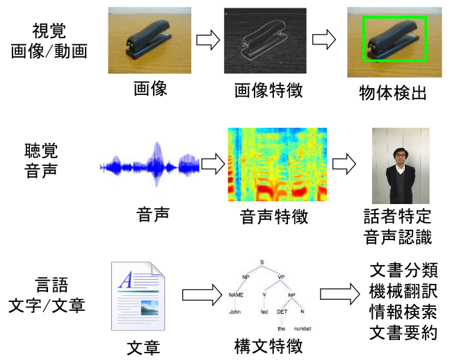
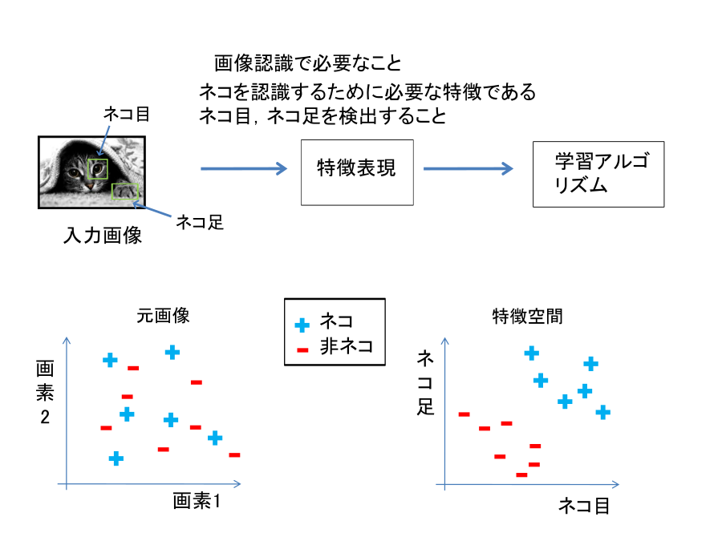

<link href="/css/asamarkdown.css" rel="stylesheet">

<div align='right'>
<a href='mailto:educ0233@komazawa-u.ac.jp'>Shin Aasakawa</a>, all rights reserved.<br>
Date: 05/Jun/2026<br/>
Appache 2.0 license<br/><br/>
</div>


来週 06 月 12 日は休講です。

* [課題提出用フォルダ](https://drive.google.com/drive/u/6/folders/1BPJY2Wk5leRvX7WHpUoit-QS8rLNvEWR){:target="_blank"}
<!-- * [実習ファイル 最短の XOR シミュレーション ](https://colab.research.google.com/github/komazawa-deep-learning/komazawa-deep-learning.github.io/blob/master/2026notebooks/2026miniumXOR.ipynb){:target="_blank"} -->

<!-- https://colab.research.google.com/github/komazawa-deep-learning/komazawa-deep-learning.github.io/blob/master/2026notebooks/2026ai_lect07.ipynb){:target="_blank"} -->

## デモ

- [グーグルによるニューラルネットワークの遊び場 (プレイグランド)](https://project-ccap.github.io/tensorflow-playground/){:target="_blank"}

### 実習ファイル

* [ResNet 実習 ](https://colab.research.google.com/github/komazawa-deep-learning/komazawa-deep-learning.github.io/blob/master/2022notebooks/2022_0603ResNet_with_Olivetti_faces_.ipynb){:target="_blank"}
* [ニューラルネットワークモデルの定義 ](https://colab.research.google.com/github/komazawa-deep-learning/komazawa-deep-learning.github.io/blob/master/2022notebooks/2022_1028komazawa_neural_networks_primer.ipynb){:target="_blank"}
* [3 層パーセプトロンと確率的勾配降下法のデモ ](https://colab.research.google.com/github/ShinAsakawa/2015corona/blob/master/2021notebooks/2021_0521mlp_Adam_SGD.ipynb){:target="_blank"}
<!-- - [EfficientNet のパラメータ実習 ](https://colab.research.google.com/drive/1QpKBHsBR5yvEOz2M-pKCUpliDh1XXplS){:target="_blank"} -->

<!-- - [Karapetian+(2023) データを用いた ResNet, LeNet 実習 ](https://colab.research.google.com/github/komazawa-deep-learning/komazawa-deep-learning.github.io/blob/master/2024notebooks/2024_1129ResNet_LeNet_with_Karapetian2023.ipynb){:target="_blank"}
* [AlexNet による Karapetian+(2023) データの転移学習 ](https://colab.research.google.com/github/komazawa-deep-learning/komazawa-deep-learning.github.io/blob/master/2024notebooks/2024_1122Karapetian_AlexNet_transfer_learning.ipynb){:target="_blank"} -->

* [ソフトマックス関数解題 ](https://colab.research.google.com/github/ShinAsakawa/ShinAsakawa.github.io/blob/master/2022notebooks/2022_1107softmax.ipynb){:target="_blank"}
また，ソフトマックス関数は，エネルギー関数とみなすことも可能である。

- [LeNet PyTorch ](https://colab.research.google.com/github/komazawa-deep-learning/komazawa-deep-learning.github.io/blob/master/notebooks/2021_0528LeNet_pytorch.ipynb){:target="_blank"}
* [畳み込みニューラルネットワークの事前訓練済モデルによる中間表現の可視化 ](https://colab.research.google.com/github/komazawa-deep-learning/komazawa-deep-learning.github.io/blob/master/2022notebooks/2022_1024CNN_layer_visualization.ipynb){:target="_blank"}

* [ニューラルネットワークモデルの定義 ](https://colab.research.google.com/github/komazawa-deep-learning/komazawa-deep-learning.github.io/blob/master/2022notebooks/2022_1028komazawa_neural_networks_primer.ipynb){:target="_blank"}
* [画像認識 PyTorch の基礎編 AlexNet ](https://colab.research.google.com/github/komazawa-deep-learning/komazawa-deep-learning.github.io/blob/master/notebooks/2020_0515komazawa_step_by_step_CNN_Pytorch.ipynb){:target="_blank"}
* [ステップ・バイ・ステップで画像認識の基礎 ](https://colab.research.google.com/github/komazawa-deep-learning/komazawa-deep-learning.github.io/blob/master/notebooks/2020_0515komazawa_step_by_step_CNN_Pytorch.ipynb){:target="_blank"}

## 1. 生理学的知見 ヒューベルとウィーゼルによる視覚野の生理学研究

<div class="figure figcenter">
<!-- <div class="figure figcenter" style="width:66%"> -->


<div class="figcaption">
Hubel と Wiesel (1959, 1962, 1968) の実験の模式図
</div>

<br/>
<div class="figcaption">
Hubel と Wiesel の実験結果 (Hubel&Wiesel, 1968 の Fig.2.7 をトレーシングしたもの
</div>
</div>

### 損失，誤差，目的，および，コスト関数

- コスト関数 cost function
- 損失関数 loss function
- 誤差関数 error function
- 目的関数 objective function

$$
p(\mathbf{y}\vert \mathbf{x};\mathbf{\theta})
$$

**最小二乗誤差**（下式）, あるいは**負の対数尤度** negative log likelifood ($-\log(x)$) など

$$
J(\mathbf{\theta})=\frac{1}{2}\mathbb{E}_{\mathbf{x,y}\sim\hat{p}_{data}}
\left\|\mathbf{y}-f(\mathbf{x};\mathbf{\theta})\right\|^2+\mbox{const.}
$$


### まとめ

- コスト関数，損失関数，誤差関数，目的関数，はほぼ同じような意味で用いられる
- 代表的なコスト関数として，最小自乗誤差，交差エントロピー誤差，などがある
- 出力が確率で与えられるような問題，たとえば，分類問題などでは交差エントロピー誤差関数が用いられる


## 一般化とオーバーフィッティング，アンダーフィッティング
<!--Generalization, Overfitting and Under-fitting-->

- データへの当てはまりが良いことが良いモデルではない
- 未知のデータに対してどれほど当てはまるのかがモデルの性能を決める
<!--
* 訓練データ training data 実際に学習に用いたデータ
* テストデータ test data 未知のデータ，訓練時には使用していないデータ
-->
* オーバーフィッティング 訓練データへの過剰適合
* アンダーフィッティング 訓練データを十分に学習できない場合
<!--
* データ数(*小*) アンダーフィットする可能性**大**
-->

<center>
<br/>
</center>

- [多項回帰による過剰適合，デモ ](https://colab.research.google.com/github/ShinAsakawa/ShinAsakawa.github.io/blob/master/notebooks/2020Sight_Visit_polynomilal_fittings_demo.ipynb)

<!-- It's not a good idea to test a machine learning model on a dataset which we used to train it, since it won't g ive any indication of how well our model performs on unseen data.
The ability to perform well on unseen data is called generalization, and is the desirable characteristic we want in a model.
When a model performs well on training data (the data on which the algorithm was trained) but does not perform well on test data (new or unseen data), we say that it has overfit the training data or that the model is overfitting.
This happens because the model learns the noise present in the training data as if it was a reliable  pattern.
Conversely, when a model does not perform well on training data (i.e. it fails to capture patterns present in the training data) as well as unseen data then it is said to be under-fitting.
That is, the model is unable to
 capture patterns present in the training data.
A smaller dataset can significantly increase the chance of overfitting.
This is because it is much tougher to separate reliable patterns from noise when the dataset is small.[1]
Examples of overfitting and under-fitting-->

$y = w_0 + w_1 x$,

$y = w_0 + w_1 x_1 + w_2 x_2$,

$y = w_0 + w_1 x_1 +\cdots + x_nx_n$


<!--
Suppose we have the following dataset (red points in the figure), where we have only one input variable x and one output variable y.

If we fit y = w0 + w1x to the above dataset, we get the straight line fit as shown above.
Note that this is not a good fit since it is quite far from many data points.
This is an example of under-fitting.

Now, if we add another feature x2 and fit y = w0 + w1x1 + w2x2 then we'll get a curve fit as shown above.
(Side note: This is still a linear model.
x2 is a feature, i.e. input.
The weights are w's and they are interacting linearly with the features x and x2.
The curve we are fitting is a quadratic curve).
As you can see, this is slightly better since it passes much closer to the data points above.

If we keep adding more features we'll get a curve that is more and more complex and that passes through more and more data points.
Above figure shows an example.
This is an example of overfitting.
In this case, we are performing polynomial fitting y = w0 + w1x1 + w2x2 + ... + wdxd.
Even though the fitted curve passes through almost all points, it won't perform well on unseen data. -->

### オーバーフィッティングの回避
<!-- Strategies to Avoid Overfitting

One way to avoid overfitting it to collect more data.
However, that is not always feasible.
Below are some other strategies to overcome the problem of overfitting - regularization and cross-validation. -->

### 正則化 Regularization

モデルの複雑さを調整する

<!--
In regularization, we combat overfitting by controlling the model's complexity, i.e. by introducing an additio
nal term in our cost function in-order to penalize large weights. This biases our model to be simpler, where s
impler is weights of smaller magnitude (or even zero). We want to make the weights smaller, because complex mo
dels and overfitting are characterized by large weights. Recall the mean-squared error cost function,
J(w)=1nn∑i=1(y(xi)−yit)2
-->

### L2 正則化 リッジ回帰
<!--Regularization or Ridge Regression-->

$$
\text{目的関数} = \text{誤差} + \lambda \left|w\right|^2
$$

<!--
In L2 regularization, a commonly used regularization technique, we add a penalty proportional to the squared m
agnitude of each weight. Our new cost function with L2 regularization is as follows:-
J(w)=1nn∑i=1(y(xi)−yit)2+λ||w2||
where, the first term is the same as in regular linear regression (without any regularization), and the second
 term is the regularization term. λ is a hyper-parameter that we choose and decides the regularization strengh. Larger values of λ imply more regularization, i.e. smaller values for the model parameters. ||w2|| is w12  w22 + ... wd2.
-->
- L2 正則化はパラメータの絶対値が大きくなると罰則項 pernalty term として作用

<!--
L2 regularization penalizes the larger weights more (since the penalty is proportional to the weight squared).
 For example, reducing w = 10 to w = 9 has a larger effect on the penalty term (102-92) than reducing w = 3 to
 w = 2 (32-22).
-->

### L1 正則化 Lasso 回帰 <!--Regularization or Lasso Regression-->

$$
\text{目的関数} = \text{誤差} + \lambda\left|w\right|
$$

<!--
In L1 regularization, we the penalty term is λ ||w||. That is, our cost function is:
J(w)=1nn∑i=1(y(xi)−yit)2+λ||w||
-->
<!--
An interesting property of L1 regularization is that model's parameters become sparse during optimization, i.e
. it promotes a larger number of parameters w to be zero. This is because smaller weights are equally penalize
d as larger weights, whereas in L2 regularizations, larger weights are being penalized much more. This sparse
property is often quite useful. For example, it might help us identify which features are more important for m
aking predictions, or it might help us reduce the size of a model (the zero values don't need to be stored).
Ordinary least square (which we saw earlier in linear regression) with L2 regularization is known as Ridge Reg
ression and with L1 regularization it is known as Lasso Regression.
Cross Validation and Validation Datasets
-->

### 正則化項

- 簡潔さ原理 simplicity principle L1
- 滑らかさ原理 smoothness principle L2
- 疎性原理 sparseness principle L0

<center>
<br/>
</center>

#### 正則化項の影響

<center>

<br/>
<br/>
</center>
Hastie (2001) より

### まとめ

- アンダーフィッテイングとオーバーフィッティング
- データ数に比べて，推定すべきパラメータが多過ぎ = オーバーフィッティング
- データ数に比べて，推定すべきパラメータが少な過ぎ = アンダーフィッティング
- 正則化 L1, L2, L0, エラスティック
- 正則化項の大きさ $\lambda$ はハイパーパラメータと呼ぶ


## 交差妥当性 cross validation

<!-- is a method for finding the best hyper-parameters of a model.
For example, in gradient descent, we need to choose a stopping criteria.
The simplest stopping criteria is to check whether our accuracy is improving on the training dataset.
However, this is prone to overfitting since the model might be capturing noise present in the training data as reliable patterns. -->

## ホールド・アウト法 Holdout method

データを訓練データと検証データに分割
<!-- We can overcome this problem by not using the entire training data while training a model.
Instead we will hold out some data (validation dataset) and we'll train only on remaining data.
For example, we can split our training dataset into 70/30 and use 70% data for training and 30% data for validation.
In the above example of gradient descent, now we train our algorithm on the training data, but check whether or not our model is getting better on the validation dataset.
This is known as the holdout method and it is one of the simplest cross validation methods.
We can also use the validation data for other types of experimentation. Such as if we want to run multiple experiments where we choose different features to use to train our machine learning model. -->

- k ホールド法 K-fold Cross Validation

データを k 個に分割して, k-1 データで訓練，残りの 1 で検証
<!-- In K-fold cross validation, the dataset is divided into k separate parts. We repeat training process k times.
Each time, one part is used as validation data, and the rest is used for training a model.
Then we average the error to evaluate a model. Note that k-fold cross validation increases the computational requirements for training our model by a factor of k.
-->

<!-- The main advantages of k-fold cross validation are that
1. It is more robust to over-fitting than the holdout method when performing large number of experiments.
2. It is better to use when the dataset size is small. This is because when performing k-fold cross-validation, we can use a much smaller validation split (say 10% instead of 30%) since we are testing the model on various subsamples of the data being in the 10%.
Leave-one-out cross validation is a special instance of k-fold cross validation in which k is equal to the number of data points in the dataset.
Each time, we hold out a single data point and train a model on rest of the data.
We use the single data point to test our model. Then we calculate the average error to evaluate a model. -->


- 初期停止 early stopping

オーバーフィッティングを避ける方法の一つ: 学習打ち切り基準

<center>
<br/>
</center>


## SGD


<center>


</center>

<!-- 
```python
import IPython
isColab = 'google.colab' in str(IPython.get_ipython())
if isColab:
    !pip install japanize_matplotlib

import numpy as np
import matplotlib.pyplot as plt
import japanize_matplotlib
%config InlineBackend.figure_format = 'retina'

# 様々な出力関数の描画
x = np.linspace(-3, 4, 100)                                        # 定義域 x の設定，本例の場合 [-3,4) を 100 刻み
relu = lambda x: np.maximum(0, x)                                  # 整流線形化関数 ReLU の定義
leaky_relu = lambda x: np.maximum(0, x) + 0.1 * np.minimum(0, x)   # リーキー ReLU の定義
elu = lambda x: (x > 0)*x + (1 - (x > 0)) * (np.exp(x) - 1)        # elu の定義
sigmoid = lambda x: (1+np.exp(-x))**(-1)                           # シグモイド関数の定義

def softmax(w, t = 1.0):
    """ソフトマックス関数の定義"""
    e = np.exp(w)
    dist = e / np.sum(e)
    return dist

x_softmax = softmax(x)

plt.figure(figsize=(8,6))
plt.plot(x, relu(x), label='ReLU', lw=2)
plt.plot(x, leaky_relu(x), label='Leaky ReLU',lw=2)
plt.plot(x, elu(x), label='Elu', lw=2)
plt.plot(x, sigmoid(x), label='シグモイド関数',lw=2)
plt.legend(loc=2, fontsize=16)
plt.title('様々な活性化関数', fontsize=20)
plt.ylim([-2, 4])
plt.xlim([-3, 3])
plt.show()
``` -->

## 整流線型ユニット ReLU (Recutified Linear Unit)

**整流線型ユニット ReLU** とは，ニューラルネットワークの活性化関数の一つです。
シグモイド関数や，ハイパータンジェント関数に比べて，極端に単純な形をしています。
駄菓子菓子，生理学との対応についても根拠を持っています。

<!-- The **ReLU** (rectified linear unit) layer is another step to our convolution layer.
You’re applying an activation function onto your feature maps to increase non-linearity in the network.
This is because images themselves are highly non-linear!
It removes negative values from an activation map by setting them to zero.

Convolution is a linear operation with things like element wise matrix
multiplication and addition.
The real-world data we want our CNN to learn will be non-linear.
We can account for that with an operation like ReLU.
You can use other operations like tanh or sigmoid. ReLU, however, is a popular choice because it can train the network faster without any major penalty to generalization accuracy.

Want to dig deeper? Try Kaiming He, et al. [Delving Deep into Rectifiers: Surpassing Human-Level Performance on ImageNet Classification](https://arxiv.org/abs/1502.01852).

If you need a little more info about [the absolute basics of activation functions, you can find that here](https://towardsdatascience.com/simply-deep-learning-an-effortless-introduction-45591a1c4abb)!


Here’s how our little buddy is looking after a ReLU activation function turns all of the negative pixel values black


```python
viz_layer(activated_layer)
```

<center>

</center>
-->
<!-- 

# ソフトマックス関数

## ゲートとして

<div class="figure figcenter">

<div class="figcaption">

#### 図 ゲートの概念図
ゲートが開いているときは，感覚入力は作業記憶を更新できるが，閉じているときはそれができない。
このため，妨害刺激など無関連情報が以前に記憶した情報の維持を妨げるのを防ぐことができる。
O'Reilly (2006) より
</div> -->


<!-- 
## ニューラルネットワークと機械学習とのコスト関数 (損失関数，誤差関数) の類似

<div class="figcenter">
<br/>
</div>
<div class="figcaption">

図 1. 従来のニューラルネットワークと脳のようなニューラルネットワークの設計の違い。

* **(A)** 従来の深層学習では，教師あり学習は外部から供給されたラベル付きデータに基づいて行われる。
* **(B)** 脳では，ネットワークの教師付き学習は，誤差信号に対する勾配降下によって行うことができるが，この誤差信号は内部で生成されたコスト関数から発生する必要がある。
これらのコスト関数は，遺伝と学習の両方によって指定された神経モジュールによって計算される。
内部で生成されたコスト関数は，より複雑な学習のブートストラップに使われるヒューリスティックスを作り出す。
例えば，顔を認識する領域は，まず線の上に 2 つの点があることのような単純なヒューリスティックスを使って顔を検出するように訓練され，その後，教師なし学習と社会的報酬処理に関連する他の脳領域からの誤差信号から生じる表現を使って，顕著な表情を識別するようにさらに訓練されるかもしれない。
* **(C)** 皮質深層ネットワークの内部で生成されたコスト関数と誤差駆動型訓練は，いくつかの特殊な系を含むより大きなアーキテクチャの一部を形成している。
ここでは，訓練可能な皮質領域をフィードフォワード神経回路網として図式化しているが，LSTM や他のタイプのリカレントネットワークの方がより正確なアナロジーかもしれない， 適応と恒常的可塑性，タイミング依存的可塑性，直接的電気接続，過渡的シナプス・ダイナミクス，興奮性／抑制性のバランス，自発的振動活動，軸索伝導遅延 (Izhikevich2006) など，多くの神経細胞やネットワークの特性が，このようなネットワークが何をどのように学習するかに影響を与えるだろう。 -->

<!-- FIGURE 1.
Putative differences between conventional and brain-like neural network designs.
(A) In conventional deep learning, supervised training is based on externally-supplied, labeled data.
(B) In the brain, supervised training of networks can still occur via gradient descent on an error signal, but this error signal must arise from internally generated cost functions.
These cost functions are themselves computed by neural modules specified by both genetics and learning.
Internally generated cost functions create heuristics that are used to bootstrap more complex learning.
For example, an area which recognizes faces might first be trained to detect faces using simple heuristics, like the presence of two dots above a line, and then further trained to discriminate salient facial expressions using representations arising from unsupervised learning and error signals from other brain areas related to social reward processing.
(C) Internally generated cost functions and error-driven training of cortical deep networks form part of a larger architecture containing several specialized systems.
Although the trainable cortical areas are schematized as feedforward neural networks here, LSTMs or other types of recurrent networks may be a more accurate analogy, and many neuronal and network properties such as spiking, dendritic computation, neuromodulation, adaptation and homeostatic plasticity, timing-dependent plasticity, direct electrical connections, transient synaptic dynamics, excitatory/inhibitory balance, spontaneous oscillatory activity, axonal conduction delays (Izhikevich2006) and others, will influence what and how such networks learn. -->


### 交差エントロピー損失関数
ニューラルネットワークや機械学習において，予測すべき値が2値化された量，たとえば真偽値真であれば $1$ をとり，偽
であれば $0$ であったり，確率である場合には，最小化すべき目標関数(正則化項を含めて損失関数でもよい)は平均二乗
誤差 Mean Square Errors ではなく **交差エントロピー cross-entropy 損失**，あるいは交差エントロピー誤差と呼ぶ関
数が用いられる。

自乗誤差に比べて交差エントロピーを用いると学習が高速化される。
<!-- 理由は以下で説明する-->
文献的にはニューラルネットワークに交差エントロピーが導入されたのは Hinton(1989) など

交差エントロピーは次式で表される:

$$
\mathcal{L}=-t\log(y)-(1-t)\log(1-y),
$$<!-- {#eq:def-cross-entropy}-->

ここで $t$ は教師信号すなわち $1$ または $0$ をとり，$y$ はニューラルネットワークから出力された予測値。

上式は （確率とみなせる）出力 $y$ が $t$ 回起こった と解釈できる $y^t$ このときの $t$ の値はは $0$ か $1$ しか取らないので，
上式右辺は，もし $t$ が 1 であれば右辺第一項を計算し，$t$ が $0$ であれば 右辺第2項を計算することになる。

右辺第一項と右辺第二項とを別曲線として描いた下図。

<center>
<br/>
<!--      https://raw.githubusercontent.com/komazawa-deep-learning/komazawa-deep-learning.github.io/e69ca10d8b2a4e9f34943fc302e5eafc7dbd934d/assets/cross-entropy.svg-->
交差エントロピーのグラフ
</center>

ここで対数 $\log$ の底は $e$ や $2$ が用いられる。

## エントロピー
エントロピーには熱力学エントロピーと情報論的エントロピーと $2$ 種類存在するがどちらも同じ形式をしている。情報
論的には平均エントロピー $H$ を以下のように定義する

$$
H[X]=-\sum_i X_i\log(X_i)
$$

上式 は 平均情報量 [@Shannon1948] とも呼ばれる。連続変量の場合には総和記号 $\sum$ が積分記号 $\int$ となって
$$
H[x]=-\int x\log(x)\;dx
$$

<center>
<br/>
シャノンのエントロピー
</center>


## 参考

* [ベイズ学習](/2023cogpsy/2023_1124bayes){:target="_blank"}
* [最適化](/2023cogpsy/2023_1124optimizations){:target="_blank"}

1. [ディープラーニング概説, 2015, LeCun, Bengio, Hinton, Nature](https://komazawa-deep-learning.github.io/2021/2015LeCun_Bengio_Hinton_NatureDeepReview.pdf){:target="_blank"}
1. [ゴール駆動型深層学習モデルを用いた感覚皮質の理解 Yamins(2016) Nature](https://project-ccap.github.io/2016YaminsDiCarlo_Using_goal-driven_deep_learning_models_to_understand_sensory_cortex.pdf){:target="_blank"}
1. [ディープラーニングレビュー Storrs ら, 2019, Neural Network Models and Deep Learning, 2019](https://komazawa-deep-learning.github.io/2021/2019Storrs_Golan_Kriegeskorte_Neural_network_models_and_deep_learning.pdf){:target="_blank"}
1. [深層学習と脳の情報処理レビュー Kriegestorte, 2015, Deep Neural Networks: A New Framework for Modeling Biological Vision and Brain Information Processing](2015Kriegeskorte_Deep_Neural_Networks-A_New_Framework_for_Modeling_Biological_Vision_and_Brain_Information_Processing.pdf){:target="_blank"}
1. [生物の視覚と脳の情報処理をモデル化する新しい枠組み Kriegeskorte, Deep Neural Networks: A New Framework for Modeling Biological Vision and Brain Information Processing, 2015](https://project-ccap.github.io/2015Kriegeskorte_Deep_Neural_Networks-A_New_Framework_for_Modeling_Biological_Vision_and_Brain_Information_Processing.pdf){:target="_blank"}
1. [計算論的認知神経科学 Kriegeskorte and Douglas, 2018, Cognitive computational neuroscience](https://project-ccap.github.io/2018Kriegeskorte_Douglas_Cognitive_Computational_Neuroscience.pdf){:target="_blank"}
1. [視覚系の畳み込みニューラルネットワークモデル，過去現在未来 Lindsay, 2020, Convolutional Neural Networks as a Model of the Visual System: Past, Present, and Future](https://project-ccap.github.io/2020Lindsay_Convolutional_Neural_Networks_as_a_Model_of_the_Visual_System_Past_Present_and_Future.pdf){:target="_blank"}


## ディープラーニングの特徴

from Democratize AI slides

- データハングリー data hungry
- 計算資源ハングリー resource hungry
- 理論欠如 theory lagging
- 不透明 opacity

- ニューラルネットワークは素人の統計学である, Anderson+(1993)

だが，... But Neural networks are not alchemy.


## キーワード

ドロップアウト，スキップ結合，バッチ正則化，L1，L2 正則化，

# 畳込みニューラルネット(CNN)

深層学習 (ディープラーニング) の中で **畳み込みニューラルネットワーク** CNN と呼ばれるニューラルネットワークについて解説する。

最初に画像処理の概略を述べる CNN が，それまで主流であった従来の手法の性能を凌駕したことはすでに述べた。
CNN の特徴の一つに **エンドツーエンド** と呼ばれる考え方がある。
エンドツーエンドとは，従来手法によるパターン認識システムでは，専門家による手の込んだ詳細な作り込みを必要としていたことと異なり，面倒な作り込みをせずとも性能が向上したことを指す。

エンドツーエンドなニューラルネットワークにより，次のことが実現した。

- ニューラルネットワークの層ごとに，特徴抽出が行われ，抽出された特徴がより高次の層へと伝達される
- ニューラルネットワークの各層では，比較的単純な特徴から次第に複雑な特徴へと段階的に変化する
- 高次層にみられる特徴は低次層の特徴より大域的，普遍的である
- 高次層のニューロンは，低次層で抽出された特徴を共有している

このことを簡単に説明する。

我々人間は，外界を認識するために必要な計算を，生物種としての発生の過程と，個人の発達を通しての経験に基づく認識システムを保持していると見ることができる。
従って我々の視覚認識には化石時代に始まる光の受容器としての眼の進化の歴史と発達を通じた個人の視覚経験が反映された結果でもある。
人工知能の目標は，この複雑な特徴検出過程をどうやったらコンピュータが獲得できるかということでもある。
外界を認識するために今日まで考案されてきたモデル（例えば，ニューラルネットワークサポートベクターマシンなどは）は複雑である。
だが，モデルを訓練するための学習方法はそれほど難しくない。
この意味で画像認識課題が正しく動作するためのポイントは，画像認識系が問題を解く事が可能なほど複雑であるかどうかではなく，十分に複雑が視覚環境，すなわち画像認識の場合，外部の艦橋を反映するために十分な量の像データを容易すことができるか否かにある。
今日の CNN による画像認識性能の向上は，簡単な計算方法を用いて複雑な外部環境に適応できる認識システムを構築する方法が確立したからであると言うことが可能である。

また，Sutton のブログ [「苦い教訓 Bitter lesson」](/2019sutton_bitter_lesson.pdf){:target="_blank"} も参照のこと

下図 <!--[fig:2012Ng_01](#fig:2012Ng_01){reference-type="ref"reference="fig:2012Ng_01"} -->に画像処理の例を挙げた。

<div class="figcenter">

<div class="figcaption" style="width:33%;">
Ng+(2012) より
</div></div>

<div class="figcenter">

<div class="figcaption" style="width:33%;">
LeCun(2013)
</div></div>

<!--では入力画像がネコであるか否かを判断する画像認識であるとしました。-->
我々は<!--ネコの--> 画像をほぼ瞬時に判断できる。
だが，画像認識の難しさは，入力画像が上図 <!--[[fig:2012Ng_01]](#fig:2012Ng_01){reference-type="refreference="fig:2012Ng_01"}-->に示されているように入力信号の数字の集まりでしか無いことである。
このようなデータを何度も経験することでネコを識別できるようにする必要がある。
<!-- [[fig:2012Ng_01]]{#fig:2012Ng_01 label="fig:2012Ng_01"}-->
<!--図[[fig:2012Ng_01]](#fig:2012Ng_01){reference-type="ref" reference="fig:2012Ng_01"}-->
<!--に示したように-->コンピュータに入力される画像は数字の塊に過ぎない。

状況ごとにとるべき操作を命令として逐一コンピュータに与える指示する手順の集まりのことをコンピュータプログラムと呼ぶ。
人間がコンピュータに与えることができる操作や命令によって画像認識システムを作る場合，命令そのものが膨大になったり，そもそも説明することが難しかったりする。
例を挙げれば，お母さんを思い浮かべてくださいと言われれば誰でも，それぞれ異なるイメージであれ思い浮かべることができる。
また，提示された画像が自分の母親のものであるか，別の女性であるかの判断は人間であれば簡単である。
ところがコンピュータには難しい課題となる。
加えて母親の特徴をコンピュータに理解できる命令としてプログラムすることも難しい課題である。
つまり自分の母親の特徴を曖昧な言葉でなく明確に説明するとなるととても難しい課題となる。
というのは，女性の顔写真であればどの写真も似ていると言えるからである。
顔の造形や輪郭，髪の位置などはどの画像も類似していることであろう。
ところがコンピュータにはこの似ている，似ていいないの区別が難しい。

加えて，同一ネコの画像であっても，被写体の向き視線の方向や光源の位置や撮影条件が異なれば画像としては異なる。
下図に示したように入力画像の中の特定の値だけを調べてみても，入力画像がネコである，そうではないかを判断することは難しい課題となる。

<!--[fig:2012Ng_02](#fig:2012Ng_02){reference-type="ref"
reference="fig:2012Ng_02"}-->
<div class="figcenter">

</div>

<!--[fig:2012Ng_02]{#fig:2012Ng_02 label="fig:2012Ng_02"}-->

現在の画像認識では，特定の画素の情報に依存せずに，入力画像が持っている特徴をとらえるように設計される。
たとえば，ネコを認識するために必要ことは，ネコに特徴的な「ネコ目」や「ネコ足」を検出することであると考えられる。
入力画像から，ネコの持つ特徴を抽出することができれば，それらの特徴を持っている入力画像はネコであると判断して良いことになる (下図<!--[[fig:2012Ng_03]](#fig:2012Ng_03){reference-type="ref"reference="fig:2012Ng_03"}-->)。

<center>

</center>

<!-- [[fig:2012Ng_03]]{#fig:2012Ng_03 label="fig:2012Ng_03"}-->

下図<!--[[fig:2013LeCun_9]](#fig:2013LeCun_9){reference-type="ref"reference="fig:2013LeCun_9"} -->は，音声認識と画像認識の両分野において CNN が用いられる以前の従来手法をまとめたものである。

<center>

</center>
<!--[[fig:2013LeCun_9]]{#fig:2013LeCun_9 label="fig:2013LeCun_9"}-->
上図<!--[[fig:2013LeCun_9]](#fig:2013LeCun_9){reference-type="ref"
reference="fig:2013LeCun_9"} -->のような従来手法に対して，CNN ではエンドツーエンドな特徴抽出を多層多段に重ねることによって複雑な特徴を抽出(検出)しようとしている (下図<!-- [[fig:2013LeCun_10]](#fig:2013LeCun_10){reference-type="ref"reference="fig:2013LeCun_10"}-->)。

<center>

</center>
<!--[fig:2013LeCun_10]{#fig:2013LeCun_10 label="fig:2013LeCun_10"}-->

コンピュータにはネコ目特徴検出器，ネコ足特徴検出器は備わっていません。そこで画像認識研究では，画像の統計的性質に基づいて特徴検出器を算出する方法を探す努力が行われてき。
しかし，コンピュータにネコ目特徴やネコ足特徴を教えるは容易なことではない。
このことは画像処理の分野だけに限らない。
音声認識でも言語情報処理でもそれぞれの特徴器を一つ一つ定義し，チューニングするのは時間がかかり，専門的な知識も必要で困難な作業であった。

<!--<center>

</center>-->
<!--[fig:2012Ng_05]{#fig:2012Ng_05 label="fig:2012Ng_05"}-->

<!--



-->

## AlexNet (Krizensky+2012)

<center>
<br/>
Krzensky+(2012) より
</center>

## GooLeNet (Inception) (Szegedy et. al, 2014)

<center>
<br/>
</center>

<center>
<br/>
空間ピラミッド (2015) より
</center>


# アレックスネット以降の流れ

- 2013年 ZF ネット
- 2014年 GoogLeNet (インセプション)，VGG，Very Deep,  GAN, VAE
- 2015年 残渣ネット (ResNet) この時点で，人間超え
- 2016年 YOLO, SSD, Segmentation (Semantics/Instance)
- 2017年 Mask R-CNN
- 2018年 モバイルネット

# 高精度化，高速化への努力

- 確率的勾配降下法，オンライン学習，バッチ学習
- データ拡張
- 正則化
- ドロップアウト
- 非線形活性化関数
- 最適化手法

