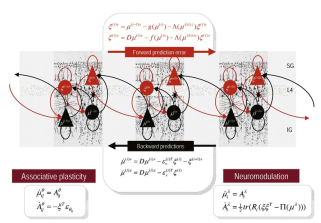

<link href="/css/asamarkdown.css" rel="stylesheet">

$$
\newcommand{\bs}[1]{\boldsymbol{#1}}
\newcommand{\mb}[1]{\mathbf{#1}}
\newcommand{\Brc}[1]{\left(#1\right)}
\newcommand{\BRc}[1]{\left[#1\right]}
\newcommand{\Rank}{\text{rank}\;}
% \newcommand{\Hat}[1]{\widehat{#1}}
\newcommand{\Prj}[1]{\mb{#1}\Brc{\mb{#1}^{\top}\mb{#1}}^{-1}\mb{#1}^{\top}}
\newcommand{\RegP}[2]{\Brc{\mb{#1}^{\top}\mb{#1}}^{-1}\mb{#1}^{\top}\mb{#2}}
\newcommand{\NSQ}[1]{\left|\mb{#1}\right|^2}
\newcommand{\Norm}[1]{\left|#1\right|}
\newcommand{\IP}[2]{\left({#1}\cdot{#2}\right)}
% \newcommand{\Bar}[1]{\overline{\;#1\;}}
$$

<a href='mailto:educ0233@komazawa-u.ac.jp'>Shin Aasakawa</a>, all rights reserved. 
Date: 26/Jun/2026 
Appache 2.0 license  

* [課題提出用フォルダ](https://drive.google.com/drive/u/6/folders/1edft9w-qdHxJJnZ8XE2tEbyBu_nHtUa4){:target="_blank"}

### 実習ファイル

* [フィラデルフィア絵画命名検査課題 PNT を転移学習 ](https://colab.research.google.com/github/komazawa-deep-learning/komazawa-deep-learning.github.io/blob/master/2021notebooks/2021_0618pnt_transfer_learning.ipynb){:target="_blank"}
* [フィラデルフィア絵画命名検査課題 PNT を転移学習 ](https://colab.research.google.com/github/ShinAsakawa/ShinAsakawa.github.io/blob/master/2023notebooks/2020_0720tlpa_sala_resnet18.ipynb){:target="_blank"}
* [転移学習による Stroop 効果のデモ ](https://colab.research.google.com/github/komazawa-deep-learning/komazawa-deep-learning.github.io/blob/master/2023notebooks/2023_1123Stroop_model.ipynb){:target="_blank"}

* [AlexNet による Karapetian+(2023) データの転移学習 ](https://colab.research.google.com/github/komazawa-deep-learning/komazawa-deep-learning.github.io/blob/master/2024notebooks/2024_1122Karapetian_AlexNet_transfer_learning.ipynb){:target="_blank"}

- [DETR を用いた領域切り出し  ](https://colab.research.google.com/github/komazawa-deep-learning/komazawa-deep-learning.github.io/blob/master/2022notebooks/2022_0625DETR_demo.ipynb)

* [CAM 実習 ](https://colab.research.google.com/github/komazawa-deep-learning/komazawa-deep-learning.github.io/blob/master/2021notebooks/2021_0618CAM_demo.ipynb){:target="_blank"}
- [gradCAM ](https://colab.research.google.com/github/komazawa-deep-learning/komazawa-deep-learning.github.io/blob/master/2023notebooks/2023_1020gradCAM.ipynb){:target="_blank"}

### 実習ファイル

* [CNN の第一畳み込み層の視覚化 ](https://colab.research.google.com/github/komazawa-deep-learning/komazawa-deep-learning.github.io/blob/master/2021notebooks/2021_1029Visualization_the_visual_features_on_CNN_ipynb.ipynb){:target="_blank"}
* [DOG 等エッジ検出と opencv を用いた Haar 特徴による顔領域の検出 従来手法実習 ](https://colab.research.google.com/github/komazawa-deep-learning/komazawa-deep-learning.github.io/blob/master/2021notebooks/2021_0528edge_and_face_detection_algorithm_not_cnn.ipynb){:target="_blank"}
* [OpenCV を用いた HOG と SIFT のデモ ](https://colab.research.google.com/github/komazawa-deep-learning/komazawa-deep-learning.github.io/blob/master/2026notebooks/2026HOG_SIFT_demo.ipynb){:target="_blank"}

* [ニューラルネットワークモデルの定義 ](https://colab.research.google.com/github/komazawa-deep-learning/komazawa-deep-learning.github.io/blob/master/2022notebooks/2022_1028komazawa_neural_networks_primer.ipynb){:target="_blank"}
* [3 層パーセプトロンと確率的勾配降下法のデモ ](https://colab.research.google.com/github/ShinAsakawa/2015corona/blob/master/2021notebooks/2021_0521mlp_Adam_SGD.ipynb){:target="_blank"}
<!-- - [EfficientNet のパラメータ実習 ](https://colab.research.google.com/drive/1QpKBHsBR5yvEOz2M-pKCUpliDh1XXplS){:target="_blank"} -->

<!-- - [Karapetian+(2023) データを用いた ResNet, LeNet 実習 ](https://colab.research.google.com/github/komazawa-deep-learning/komazawa-deep-learning.github.io/blob/master/2024notebooks/2024_1129ResNet_LeNet_with_Karapetian2023.ipynb){:target="_blank"}
* [AlexNet による Karapetian+(2023) データの転移学習 ](https://colab.research.google.com/github/komazawa-deep-learning/komazawa-deep-learning.github.io/blob/master/2024notebooks/2024_1122Karapetian_AlexNet_transfer_learning.ipynb){:target="_blank"} -->

<!-- * [ソフトマックス関数解題 ](https://colab.research.google.com/github/ShinAsakawa/ShinAsakawa.github.io/blob/master/2022notebooks/2022_1107softmax.ipynb){:target="_blank"}
また，ソフトマックス関数は，エネルギー関数とみなすことも可能である。

- [LeNet PyTorch ](https://colab.research.google.com/github/komazawa-deep-learning/komazawa-deep-learning.github.io/blob/master/notebooks/2021_0528LeNet_pytorch.ipynb){:target="_blank"}
* [畳み込みニューラルネットワークの事前訓練済モデルによる中間表現の可視化 ](https://colab.research.google.com/github/komazawa-deep-learning/komazawa-deep-learning.github.io/blob/master/2022notebooks/2022_1024CNN_layer_visualization.ipynb){:target="_blank"}

* [ニューラルネットワークモデルの定義 ](https://colab.research.google.com/github/komazawa-deep-learning/komazawa-deep-learning.github.io/blob/master/2022notebooks/2022_1028komazawa_neural_networks_primer.ipynb){:target="_blank"}
* [画像認識 PyTorch の基礎編 AlexNet ](https://colab.research.google.com/github/komazawa-deep-learning/komazawa-deep-learning.github.io/blob/master/notebooks/2020_0515komazawa_step_by_step_CNN_Pytorch.ipynb){:target="_blank"}
* [ステップ・バイ・ステップで画像認識の基礎 ](https://colab.research.google.com/github/komazawa-deep-learning/komazawa-deep-learning.github.io/blob/master/notebooks/2020_0515komazawa_step_by_step_CNN_Pytorch.ipynb){:target="_blank"} -->

## キーワード

転移学習 transfer learning，領域適応 domain adaptation，微調整 fine-tuning，蒸留 (knowledge) distillation

* 領域切り出し segmentation
  1. 意味的切り出し semantic segmentation
  1. 対象切り出し instance segmentation
  1. パノプティック切り出し panoptic segmentation
  2. 特徴点抽出 keypoint detection

## 画像切り出し

1. 物体位置
3. 物体認識 object recognition
2. 意味的切り出し semantic segmentation
4. 対象切り出し instance segmentation
5. 特徴点抽出 keypoint
6. パノプティック切り出し

 
Dang and Ha (2017) より

<!-- # 転移学習

 

 -->

### 残差ネット (ResNet, He et. al, 2015)

 
He (2015) より

### Fast R-CNN と Faster R-CNN (2014)

- R-CNN によって，位置 where 情報と 物体 what 情報 とを多層畳み込みニューラルネットワークで表現する試みが，発展。実時間で物体の切り出しと認識とが行えるようになった。
[Faster R-CNN](https://arxiv.org/pdf/1506.01497.pdf){:target="_blank"}, 
[YOLO](https://arxiv.org/pdf/1506.02640.pdf){:target="_blank"}, 
[SSD](https://arxiv.org/pdf/1512.02325.pdf){:target="_blank"},

 
左: Fast R-CNN の模式図。
右: Faster RCNN の領域提案ネットワーク

<!-- ### 意味的切り分け (セマンティックセグメンテーション) と 実体切り分け (インスタンスセグメンテーション)

- 完全畳み込みネットワーク (Fully Convolutional Network:FCN) と呼ばれるセマンティックセグメンテーションを実現するネットワーク
- FCN とは文字通り全ての層が畳込み層であるモデル

 
Long (2017) FCN

- 通常のCNN は，出力層のユニット数が識別すべきカテゴリー数であった。一方 FCN では入力画像の画素数だけ出力層が必要になる。
- すなわち各画素がそれぞれどのカテゴリーに属するのかを出力する必要があるため出力層には，縦画素数 $\times$ 横画素数 $\times$ カテゴリー数の出力ニューロンが用意される。
- 図 では，識別すべきカテゴリー数 が 20 であったたま，どのカテゴリーにも属さない，すなわち背景を指示するもう1 つのカテゴリーを加えた計 21 カテゴリーの分類を行うことになる。

- CNN では畳込演算によって畳込みのカーネル幅(受容野) だけ近傍の入力刺激を加えて計算することになるため，上位層では下位層に比べて受容野が大きくなることの影響で画像サイズは小さく(あるいは粗く) なってしまう
- このため，最終出力層に入力層と同じ解像度の画素数を得るためには，畳込みと反対方向の解像度を細かくする工夫が必要となる。
- これを解決する一つの方法がアンサンプリング(unsampling) と呼ばれる方法

### 意味的切り分け (セマンティックセグメンテーション)

* 意味的切り分け (セマンティックセグメンテーション) とは画像中の各画素をあるクラスに分類する画像解析課題のこと。
* 我々人間が常に行っていることと同じで，見ているものを画像と見なすと，画像の各画素がどのクラスに属しているかがわかる。
* 意味的切り出し (セマンティック・セグメンテーション semantic segmentation) はコンピュータでこれを実現するための技術である。

* セグメンテーションには他にもいくつかの種類がある。
詳しくは [こちら](https://www.learnopencv.com/image-segmentation/) 参照。
ここではセマンティック・セグメンテーションに焦点を当てる。

* 例えば次のような画像があるとする。

 
<small> Source: Pexels </small>

そして上記の画像を意味的に分割した画像は以下のようになる。

 

このように画像中の各画素はそれぞれのクラスに分類される。
これがセマンティック・セグメンテーションの最も簡単な説明である。
-->

### 姿勢検出 key point detection

<video controls src="https://learnopencv.com/wp-content/uploads/2022/10/yolov7-vs-mediapipe-dance.mp4" muted="false" style="width:77%"></video> 
  
<video controls src="https://learnopencv.com/wp-content/uploads/2022/10/yolov7-gpu-vs-mediapipe-difficult-pose.mp4" muted="true" style="width:77%"></video>
<!-- <video controls src="https://learnopencv.com/wp-content/uploads/2022/10/yolov7-256-vs-960p-yoga-1.mp4" muted="false"></video> -->

from `https://learnopencv.com/yolov7-pose-vs-mediapipe-in-human-pose-estimation/`

# 視覚における注意と CAM

## 転移学習 transfer learning

**転移学習** transfer learning は機械学習分野のみならず，ロボット工学や実応用の分野でも応用が進められている。
シミュレーションと現実との間隙をどのように埋めるのかという大きな問題に関連する。
一方で，転移学習と **ファインチューニング** や **領域適応** domain adaptation の区別がなされる。

転移学習とは 課題 A を用いて訓練したモデルに対して，別の課題 B に適用することを指す。
DNN では転移学習は頻用される。
イメージネットで画像分類を学習したネットワークに対して，例えば顔認識を学習させるような場合である。

PyTorch のチュートリアルなどでは，学習済のネットワークに対して，最終層 (全結合層) を入れ替えて別の課題を訓練することを転移学習と呼ぶ。
このとき，最終直下層と出力層との結合を学習させ，その他の下位層の結合は固定し，訓練しない。
一方で，下位層まで含めて全結合を訓練させる場合を，**微調整 (fine tuning ファインチューニング)** と呼び，区別している。

 
左: ハードパラメータ共有: 転移学習,  右: ソフトパラメータ共有: ファインチューニング

 

## 経路仮説と残差ネット

* 腹側経路 ventral pathways ("what" 経路)
* 背側経路 dorsan pathways ("where" 経路)

* 下左: 物体弁別課題と下側頭回損傷。
* 下右: 目印課題と頭頂葉損傷。
Ungerleider&Mishkin1982 より。

左: 言語の機能解剖学的枠組み。Hickok&Poeppel2000 より

右: 脳の側面図に示したモデル構成要素の一般的な場所。
モデル内のある機能に関連する皮質領域は，その機能に特化しているという仮説ではない。
調音に基づく音声符号を支援すると考えられる前頭葉領域の定義は，物品の命名と調音リハーサル処理の機能画像研究にお
ける活性化領域の一般的な分布から得られる (例えば Awh+1996, Hickok+2003, Indefrey&Levelt)。
帯状の領域 (上側頭溝) は，音素レベルの表現を支援すると思われる領域。

## ResNet におけるスキップ結合

 
 

#### R-CNN

<!--

 -->

## ViT Dosovitskiy+(2020)
[AN IMAGE IS WORTH 16X16 WORDS: TRANSFORMERS FOR IMAGE RECOGNITION AT SCALE](https://arxiv.org/abs/2010.11929/){:target="_blank"}

# 1. 経路仮説と残差ネット

* 腹側経路 ventral pathways ("what" 経路)
* 背側経路 dorsan pathways ("where" 経路)

 
Ungerleider and Mishkin (1982) より

 
Behnke (2003) より

> 同様の 2 経路による処理は 聴覚 (Romanski et al., 1999) や 触覚(Reed et al., 2005)でも発見されている。

発展的な話題としては，このような 2 種類の処理経路は，処理される情報の種類の問題ではないくて，機能に関与した区別であるとの仮説もある。

* 腹側経路は物体に関する情報の知覚 (知覚のための視覚) 
* 背側経路は行動を導くための情報処理 (行動のための視覚) 

さらに，背側経路は 背外側経路 (dorsolateral) と背中側経路 (dorsomedial) に細分化できることが示唆されている（Binkofski and Buxbaum, 2013, Grafton, 2010, Rizzolatti and Matelli, 2003)。

* 背外側側経路 前頭頂内溝（aIPS）と前頭前皮質の腹側部分（PMv）, 古典的に到達運動の計画に寄与 （Davare ら, 2015; Davare ら, 2012; Vesia and Crawford,2012）
* 背中側経路は V6A と内側頭頂内溝 を介して背側前頭前皮質（PMd）へ. 把持に関連する情報を統合する（Davare ら, 2007; Davare ら,2010; Tunik ら, 2005）

最近では、これら 2 つの 副回路が 行動によって要求されるオンライン制御の程度に応じて相互作用することも発見されている (Grol et al., 2007, Verhagen et al., 2013)。

### 二段階モデル

 
Girshick (2013) より

## 残差ネット (ResNet, He et. al, 2015)

 
 
He (2015) より

## Fast R-CNN と Faster R-CNN (2014)

 
Fast R-CNN

### 意味的切り分け (セマンティックセグメンテーション) と 実体切り分け (インスタンスセグメンテーション)

- 完全畳み込みネットワーク (Fully Convolutional Network:FCN) と呼ばれるセマンティックセグメンテーションを実現するネットワーク
- FCN とは文字通り全ての層が畳込み層であるモデル

 
Long (2017) FCN

- 通常のCNN は，出力層のユニット数が識別すべきカテゴリー数であった。一方 FCN では入力画像の画素数だけ出力層が必要になる。
- すなわち各画素がそれぞれどのカテゴリーに属するのかを出力する必要があるため出力層には，縦画素数 $\times$ 横画素数 $\times$ カテゴリー数の出力ニューロンが用意される。
- 図 では，識別すべきカテゴリー数 が 20 であったたま，どのカテゴリーにも属さない，すなわち背景を指示するもう1 つのカテゴリーを加えた計 21 カテゴリーの分類を行うことになる。

- CNN では畳込演算によって畳込みのカーネル幅(受容野) だけ近傍の入力刺激を加えて計算することになるため，上位層では下位層に比べて受容野が大きくなることの影響で画像サイズは小さく(あるいは粗く) なってしまう
- このため，最終出力層に入力層と同じ解像度の画素数を得るためには，畳込みと反対方向の解像度を細かくする工夫が必要となる。
- これを解決する一つの方法がアンサンプリング(unsampling) と呼ばれる方法

### 意味的切り分け (セマンティックセグメンテーション)

* 意味的切り分け (セマンティックセグメンテーション) とは画像中の各画素をあるクラスに分類する画像解析課題のこと。
* 我々人間が常に行っていることと同じで，見ているものを画像と見なすと，画像の各画素がどのクラスに属しているかがわかる。
* 意味的切り出し (セマンティック・セグメンテーション semantic segmentation) はコンピュータでこれを実現するための技術である。

* セグメンテーションには他にもいくつかの種類がある。
詳しくは [こちら](https://www.learnopencv.com/image-segmentation/) 参照。
ここではセマンティック・セグメンテーションに焦点を当てる。

## セグメンテーションの応用
### 1. 自動運転

 
<small> Source: CityScapes Dataset </small>

  

自律走行ではカメラから送られてくる画像を意味的に分割し，画像内の各画素をクラスに分類する。
これによりコンピュータは周囲に何があるのかを理解し，それに応じて自動車が行動できるようになる。

### 2. 顔セグメンテーション

 
<small> Source: https://github.com/massimomauro/FASSEG-repository/blob/master/papers/multiclass_face_segmentation_ICIP2015.pdf </small>

顔セグメンテーションは，唇や目など，顔の各部分をカテゴリーに分類するために使用されます。
この技術は性別の推定，年齢推定，顔の表情分析，感情分析など，様々な目的で使用される。

### 3. 室内物体セグメンテーション

 
<small> Source: http://buildingparser.stanford.edu/dataset.html </small>

AR (拡張現実) や VR (仮想現実) などで用いられる。
AR は屋内全体をセグメントして，椅子やテーブル，人，壁，障害物などがどこにあるのかを把握するために必要な応用である。

### 4. ジオ・ランド・センシング

 
<small> Source: https://www.sciencedirect.com/science/article/pii/S0924271616305305 </small>

ジオ・ランド・センシングは衛星画像の各画素をカテゴリに分類し，各領域の土地被覆を追跡する方法である。
例えば，ある地域で森林破壊が進んでいるとすれば，適切な対策を講じることができる。
<!-- Geo Land Sensing is a way of categorizing each pixel in satellite images into a category such that we can track the land cover of each area. 
So, say in some area there is a heavy deforestation taking place then appropriate measures can be taken. -->

## U-Net 

画像分割の SOTA (State of the arts)

 
Ronnenberger et. al (2015) Fig. 1 より

<!--   -->
<!--    -->

## 背骨 （バックボーン）ネットワーク と 周辺ネット

<!-- detectron2 の実習をしてみましょう。 -->

<iframe width="800" height="600" src="https://www.youtube.com/embed/pW6nZXeWlGM" frameborder="0" allow="accelerometer; autoplay; encrypted-media; gyroscope; picture-in-picture" allowfullscreen>
<!-- <iframe width="600" height="300" src="https://www.youtube.com/embed/pW6nZXeWlGM" frameborder="0" allow="accelerometer; autoplay; encrypted-media; gyroscope; picture-in-picture" allowfullscreen> -->
</iframe> 
Realtime Multi-Person 2D Human Pose Estimation using Part Affinity Fields, CVPR 2017 Oral

---

<iframe width="800" height="600" src="https://www.youtube.com/embed/PCBTZh41Ris" frameborder="0" allow="accelerometer; autoplay; encrypted-media; gyroscope; picture-in-picture" allowfullscreen>
<!-- <iframe width="800" height="600" src="https://www.youtube.com/embed/PCBTZh41Ris" frameborder="0" allow="accelerometer; autoplay; encrypted-media; gyroscope; picture-in-picture" allowfullscreen> -->
</iframe> 
論文: <https://arxiv.org/pdf/1808.07371.pdf> 
プロジェクトサイト: <https://carolineec.github.io/everybody_dance_now/>

---

 

図 2. 意味性認知症患者における意味課題の成績低下例。
この図は意味性認知症 (SD) における障害のクロスモーダルな性質と，特定情報に対する一般情報の相対的な保存を示す。
a. 健常対照者と軽度，中等度，重度の SD(72) 患者の 4 群における絵のカテゴリー化課題での目標刺激と妨害刺激の識別の正確さ。
参加者は，カテゴリーラベルとカラー写真を見て，その写真がラベルと一致しているかどうかを問われた。
ラベルは一般的なもの （例えば動物)，基本レベル （例えば犬)，具体的なもの (例えばラブラドール) のいずれかであった。
b. 縦断的に評価された 1 人の SD 患者の絵画命名反応(68)。+ は正しい反応を表す。
c. 2 つの認識課題における刺激と成績の例 (対照群，軽度および重度SD患者)。
最初の課題では，参加者は 2 つの項目のうちどちらの色が正しいかを判断した。
軽度の SD 患者は，対象がカテゴリーに典型的な色である場合 (例えば，緑のセロリ) には良い成績を示したが，対象が珍しい色である場合 (例えばオレンジ色のかぼちゃ) には悪い成績を示した。
より重度の SD 患者の判断は，いずれの条件でも偶然 (50％) より優れていなかった(80)。
2 番目の課題では，参加者は 2 枚の絵のうちどちらが本物の動物を描いているかを判断した。
ここでは，軽度の SD 患者も重度の SD 患者も，比較的原型的な特徴をもつ標的 (たとえば，多くの動物と同様に小さな耳をもつサル) に対しては，正常レベルの成功を収めた。
しかし，正しい選択肢に通常とは異なる特徴がある場合 (たとえば耳が非常に大きいゾウ)，軽度の SD 患者は障害を受け，重度のSD患者は偶然水準で得点した (70)。
d. SD 患者が作成した遅延模写絵画 (71)。
患者に模型の絵を見せ，それを取り除いてから 10 秒間の遅延の後，この絵を記憶から再現するよう求めた。
目や尻尾など，多くの動物に共通する性質は，遅延描画でも保持されていた。
ラクダのコブやアザラシのヒレなど，他の動物と区別するための特殊な性質は，しばしば省略された。
また，アヒルの 4 本足やカエルの尻尾のように，ある動物に共通する性質が誤って付け加えられることもあった。

<!-- Figure 2 | Examples of impaired performance on semantic tasks in patients with semantic dementia. 
This figure illustrates the cross-modal nature of the impairment and the preservation of general relative to specific information in semantic dementia (SD). 
a. Accuracy at discriminating targets from distractors in a picture-categorization task for four groups of participants: healthy controls and patients with mild, moderate and severe SD(72). 
Participants viewed a category label followed by a colour photograph and were asked whether the picture matched the label. 
Labels were either general (for example, ‘animal’), basic-level (for example, ‘dog’) or specific (for example, ‘Labrador’). 
b | Picture naming responses for one SD patient who was assessed longitudinally(68). 
+ denotes a correct response. 
c | Examples of stimuli and performance (for controls, mild and severe SD patients) on two recognition tasks. 
In the first task, participants judged which of two items was coloured correctly. 
Patients with milder SD performed well when the targets had a category-typical colour (for example, the green celery) but poorly when the items had an unusual colour (for example, the orange pumpkin). 
The judgements of patients with more severe SD were no better than chance (50%) in either condition(80). 
In the second task, participants judged which of two drawings depicted a real animal. 
Here, both the patients with mild SD and the patients with severe SD achieved normal levels of success for targets with relatively prototypical features (for example, the monkey which, like most animals, has small ears). 
For stimulus pairs in which the correct choice had unusual features (for example, the elephant, which has very large ears), the patients with mild SD were impaired and the patients with severe SD scored at chance levels70. 
d | Delayed-copy drawings produced by SD patients(71). 
The patients were shown a model picture which was then removed and, after a 10-second delay, they were asked to reproduce this picture from memory. 
Properties that are common to most animals, such as eyes and a tail, were preserved in the delayed drawings. 
Unusual properties that distinguish one animal from others — for example, the hump on the camel and the flippers on the seal — were frequently omitted. Some common properties were also incorrectly added to animals that lack them (for example, the four legs on the delayed drawing of the duck and the tail on the delayed drawing of the frog).  -->

