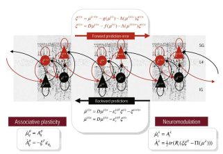

<link href="/css/asamarkdown.css" rel="stylesheet">

$$
\newcommand{\bs}[1]{\boldsymbol{#1}}
\newcommand{\mb}[1]{\mathbf{#1}}
\newcommand{\Brc}[1]{\left(#1\right)}
\newcommand{\BRc}[1]{\left[#1\right]}
\newcommand{\Rank}{\text{rank}\;}
\newcommand{\Hat}[1]{\widehat{#1}}
\newcommand{\Prj}[1]{\mb{#1}\Brc{\mb{#1}^{\top}\mb{#1}}^{-1}\mb{#1}^{\top}}
\newcommand{\RegP}[2]{\Brc{\mb{#1}^{\top}\mb{#1}}^{-1}\mb{#1}^{\top}\mb{#2}}
\newcommand{\NSQ}[1]{\left|\mb{#1}\right|^2}
\newcommand{\Norm}[1]{\left|#1\right|}
\newcommand{\IP}[2]{\left({#1}\cdot{#2}\right)}
\newcommand{\Bar}[1]{\overline{\;#1\;}}
$$

<a href='mailto:educ0233@komazawa-u.ac.jp'>Shin Aasakawa</a>, all rights reserved. 
Date: 03/Jul./2026 
Appache 2.0 license  

* [WebClass 授業アンケート ](https://webclass.komazawa-u.ac.jp/webclass/ip_mods.php/plugin/survey/my-surveys-view/surveys/collector/2bcc9507b1f75062a21a763c5492a70f/organization/2607402/answer){:target="_blank"}
* [課題提出用フォルダ](https://drive.google.com/drive/u/6/folders/1bps03QxtHOhhCJyD0AumsSRtHWxRfbAj){:target="_blank"}

### 実習ファイル

* [CAM 実習 ](https://colab.research.google.com/github/komazawa-deep-learning/komazawa-deep-learning.github.io/blob/master/2021notebooks/2021_0618CAM_demo.ipynb){:target="_blank"}
* [gradCAM ](https://colab.research.google.com/github/komazawa-deep-learning/komazawa-deep-learning.github.io/blob/master/2023notebooks/2023_1020gradCAM.ipynb){:target="_blank"}
* [ソフトマックス関数解題 ](https://colab.research.google.com/github/ShinAsakawa/ShinAsakawa.github.io/blob/master/2022notebooks/2022_1107softmax.ipynb){:target="_blank"}

* [フィラデルフィア絵画命名検査課題 PNT を転移学習 ](https://colab.research.google.com/github/komazawa-deep-learning/komazawa-deep-learning.github.io/blob/master/2021notebooks/2021_0618pnt_transfer_learning.ipynb){:target="_blank"}
* [TLPA & SALA の絵画命名検査課題を 転移学習 ](https://colab.research.google.com/github/ShinAsakawa/ShinAsakawa.github.io/blob/master/2023notebooks/2020_0720tlpa_sala_resnet18.ipynb){:target="_blank"}
* [転移学習による Stroop 効果のデモ ](https://colab.research.google.com/github/komazawa-deep-learning/komazawa-deep-learning.github.io/blob/master/2023notebooks/2023_1123Stroop_model.ipynb){:target="_blank"}
<!-- * [AlexNet による Karapetian+(2023) データの転移学習 ](https://colab.research.google.com/github/komazawa-deep-learning/komazawa-deep-learning.github.io/blob/master/2024notebooks/2024_1122Karapetian_AlexNet_transfer_learning.ipynb){:target="_blank"} -->

<!-- * [ソフトマックス関数解題 ](https://colab.research.google.com/github/ShinAsakawa/ShinAsakawa.github.io/blob/master/2022notebooks/2022_1107softmax.ipynb){:target="_blank"}
また，ソフトマックス関数は，エネルギー関数とみなすことも可能である。

- [LeNet PyTorch ](https://colab.research.google.com/github/komazawa-deep-learning/komazawa-deep-learning.github.io/blob/master/notebooks/2021_0528LeNet_pytorch.ipynb){:target="_blank"}
* [畳み込みニューラルネットワークの事前訓練済モデルによる中間表現の可視化 ](https://colab.research.google.com/github/komazawa-deep-learning/komazawa-deep-learning.github.io/blob/master/2022notebooks/2022_1024CNN_layer_visualization.ipynb){:target="_blank"}

* [ニューラルネットワークモデルの定義 ](https://colab.research.google.com/github/komazawa-deep-learning/komazawa-deep-learning.github.io/blob/master/2022notebooks/2022_1028komazawa_neural_networks_primer.ipynb){:target="_blank"}
* [画像認識 PyTorch の基礎編 AlexNet ](https://colab.research.google.com/github/komazawa-deep-learning/komazawa-deep-learning.github.io/blob/master/notebooks/2020_0515komazawa_step_by_step_CNN_Pytorch.ipynb){:target="_blank"}
* [ステップ・バイ・ステップで画像認識の基礎 ](https://colab.research.google.com/github/komazawa-deep-learning/komazawa-deep-learning.github.io/blob/master/notebooks/2020_0515komazawa_step_by_step_CNN_Pytorch.ipynb){:target="_blank"} -->

### イメージネットコンテスト，アレックスネットの出力にみる問題点

	
	
	

	アレックスネットの結果: 画像のすぐ下の英単語は正解ラベルを表す。Krizensky et. al (2012) Fig. 4 より。
	ピンク色は正解ラベルの確率を表す。ブルーは不正解ラベル判断確率を表している。
	チェリーが正解であるが，画像を見る限り，第一回答候補のダルマチアンを正解だと考えても問題は無いと考えられる。

## 視覚野と視覚モデルとの対応関係

<!---->
<!--  -->

出典: Yamins+2016, Fig.1<!--，Fig. 2-->

## U-Net

画像分割の SOTA (State of the arts)

 
 
Ronnenberger et. al (2015) Fig. 1 より

<!--   -->
<!--    -->

## 背骨 （バックボーン）ネットワーク と 周辺ネット

## 転移学習 transfer learning

**転移学習** transfer learning は機械学習分野のみならず，ロボット工学や実応用の分野でも応用が進められている。
シミュレーションと現実との間隙をどのように埋めるのかという大きな問題に関連する。
一方で，転移学習と **ファインチューニング** や **領域適応** domain adaptation の区別がなされる。

転移学習とは 課題 A を用いて訓練したモデルに対して，別の課題 B に適用することを指す。
DNN では転移学習は頻用される。
イメージネットで画像分類を学習したネットワークに対して，例えば顔認識を学習させるような場合である。

PyTorch のチュートリアルなどでは，学習済のネットワークに対して，最終層 (全結合層) を入れ替えて別の課題を訓練することを転移学習と呼ぶ。
このとき，最終直下層と出力層との結合を学習させ，その他の下位層の結合は固定し，訓練しない。
一方で，下位層まで含めて全結合を訓練させる場合を，**微調整 (fine tuning ファインチューニング)** と呼び，区別している。

 
左: ハードパラメータ共有: 転移学習,  右: ソフトパラメータ共有: ファインチューニング

 

# 3. 転移学習の定義

* 転移学習には，領域 (domain) と課題  (task) という概念がある。
* 領域は，特徴空間 $\mathcal{X}$ と特徴空間上の周辺確率分布 $P(X)$ からなり，$X = {x_{1}, \cdots, x_{n}} \in \mathcal{X}$ である。
* 文書分類課題では $\mathcal{X}$ は全ての文書表現の空間，$x_{i}$ はある文書に対応するベクトル，$X$ は学習に用いた文書サンプルなどとなる。
* 課題 $\mathcal{D} = {\mathcal{X},P(X)}$ は，ラベル空間 $\mathcal{Y}$ と条件付き確率分布 $P(Y\vert X)$ からなり，$x_{i}\in X$, $y_{i}\in Y$ の組からなる学習データを用いて学習される。

<!-- Given a domain, $\mathcal{D} = \left\{\mathcal{X},P(X)\right\}$, a task $\mathcal{T}$ consists of a label space $\mathcal{Y}$ and a conditional probability distribution $P(Y\vert X)$ that is typically learned from the training data consisting of pairs $x_{i}\in X$ and $y_{i}\in \mathcal{Y}$.
In our document classification example, $\mathcal{Y}$ is the set of all labels, i.e. *True*, *False* and $y_i$ is either *True* or *False*.-->

ソース領域 $\mathcal{D}_ {S}$ とそれに対応するソース課題 $\mathcal{T}_ {S}$，およびターゲット領域 $\mathcal{D}_ {T}$ とターゲット課題 $\mathcal{T}_ {T}$ が与えられたとき，
ソース領域 $\mathcal{D}_ {S}$ とターゲット課題 $\mathcal{T}_ {S}$ は，ターゲット課題とターゲット領域 $\mathcal{T}_ {T}$ に対応するソース課題とターゲット課題の両方を含む。
ここで，転移学習の目的は $\mathcal{D}_ {T}$ の条件付き確率分布 $P(Y_{T}\vert X_{T})$ を学習することである。
ここで $\mathcal{D}_ {S}$ と $\mathcal{T}_ {S}$ から得られる情報は $\mathcal{D}_ {S}\neq\mathcal{D}_ {T}$ または $\mathcal{T}_ {S}\neq \mathcal{T}_ {T}$ の場合である。
多くの場合，ラベル付けされた対象例は，ラベル付けされた元例より指数関数的に少ない限られた数しか利用できないと仮定する。
<!-- Given a source domain $\mathcal{D}_ {S}$, a corresponding source task $\mathcal{T}_ {S}$, as well as a target domain $\mathcal{D}_ {T}$ and a target task $\mathcal{T}_ {T}$, the objective of transfer learning now is to enable us to learn the target conditional probability distribution $P(Y_{T}\vert X_{T})$ in $\mathcal{D}_ {T}$ with the information gained from $\mathcal{D}_ {S}$ and $\mathcal{T}_ {S}$ where $\mathcal{D}_ {S}\neq \mathcal{D}_ {T}$ or $\mathcal{T}_ {S} \neq \mathcal{T}_ {T}$.
In most cases, a limited number of labeled target examples, which is exponentially smaller than the number of labeled source examples are assumed to be available. -->

<!-- 領域 $\mathcal{D}$ と課題 $\mathcal{T}$ は共にタプルとして定義されるため，これらの不等式は 4 つの転移学習シナリオを生じさせ，以下で議論する。 -->

1. $\mathcal{X}_ {S}\neq\mathcal{X}_ {T}$.
例えば，文書が 2 つの異なる言語で書かれているなど，ソース領域とターゲット領域の特徴空間が異なる場合。
自然言語処理の文脈では，一般に異言語間適応と呼ばれる。
<!-- The feature spaces of the source and target domain are different, e.g. the documents are written in two different languages.
In the context of natural language processing, this is generally referred to as cross-lingual adaptation. -->
2. $P(X_{S})\neq P(X_{T})$.
原文領域と訳文領域の周辺確率分布が異なる場合，例えば，異なる話題について議論している文書がある場合，原文領域と訳文領域の周辺確率分布は異なる。
このようなシナリオは一般にドメイン適応と呼ばれる。
<!-- The marginal probability distributions of source and target domain are different, e.g. the documents discuss different topics.
This scenario is generally known as domain adaptation. -->
3. $\mathcal{Y}_ {S}\neq\mathcal{Y}_ {T}$.
2 つの課題のラベル空間が異なる場合。例えば，ターゲット課題では文書に異なるラベルを割り当てる必要がある。
実際には 2 つの異なる課題が異なるラベル空間を持ちながら，全く同じ条件付き確率分布を持つことは極めて稀であるため，これは通常 4 で発生する。
<!-- The label spaces between the two tasks are different, e.g. documents need to be assigned different labels in the target task.
In practice, this scenario usually occurs with scenario 4, as it is extremely rare for two different tasks to have different label spaces, but exactly the same conditional probability distributions. -->
4. $P(Y_{S}\vert X_{S})\neq P(Y_{T}\vert X_{T})$.
原文と訳文の条件付き確率分布が異なる，例えば，原文と訳文がクラスに関してアンバランスである場合。
このようなシナリオは実際にはよくあることである<!-- ，オーバーサンプリング，アンダーサンプリング，あるいは SMOTE [7] などのアプローチが広く使われている。 -->

## 心理学的注意

 

左: Treisman1988 Fig.1，特徴統合理論の概念図。ボトムアップ注意
中: Wolfe1994 Fig.2 ガイド付き探索 バージョン 2 モデル。トップダウン注意
右: Itti and Koch (1998) Fig. 1 計算モデルの実装例

## ニューラルネットワーク的注意

### CAM

 
CAM の概念図 Zhou (2016) Fig. 2 を改変

   

 
Grad-CAM の結果。Selvaraj (2016) Fig. 5 より。左: 元画像。央: ボクサー犬と判断した場合のヒートマップ。右:トラ猫と判断した場合のヒートマップ

# 注意とソフトマックス関数，CAM

前回は，自然画像分類のために訓練した畳み込みニューラルネットワークの結合係数を視覚化すると，特徴地図が現れることを示した。

<!-- 今回は，この特徴地図を顕著性地図と考えて，ボトムアップによる注意を考える。 -->

# 注意の研究史 (1) 両耳分離聴 dichotomous listening 

 

<!-- {style="width:74%"} 
{style="width:74%"} -->

# 注意の研究史 (2) 離断脳 split brain

<!-- {style="width:69%"} -->

# 注意の研究史 (3) 注意のエンゲージメント，ディスエンゲージメント

- ポズナー(1980) , ポズナーとコーエン(1984) <!--復帰抑制 (IOR: Inhibition of return)-->

# 注意の研究史 (4) 特徴統合理論 FIT

<!-- {style="width:43%"} -->

# 注意の研究史 (5) 特徴統合理論 検索非対称性

<!--{style="width:39%"}-->

# 注意の研究史 (6) スポットライトメタファー

- サーチライト(クリック, 1984)，
- スポットライト(ラバージ, 1985)，
- ズームレンズ(エリクセン, 1986)，

# 注意の研究史 (7) Guided Search 2.0 

- 最初のトップダウン注意モデル

 

The architecture of the guided search 2.0. Modified from (1994)Wolfe Guided Search2, Fig. 2

<!--- **bottom-up** and **top-down** processes-->

# 注意の研究史 (8) 計算モデル

- コッホ Koch と ウルマン Ullman (1985) 勝者専有 Winner-take-all 回路

<!-- {style="width:49%"} -->

初期のボトムアップ注意理論とモデル。 
(a) Treisman&Gelade(1980) の特徴統合理論は、複数の特徴地図と、位置地図を走査し、現在注目している位置に特徴を収集・結合する注目の焦点を仮定(Treisman & Souther(1985) )
(b) Koch&Ullman(1985) は、すべての特徴地図からボトムアップ入力を受け取る顕著性地図の概念を導入した。この地図では、勝者占有回路 (WTA: winner-take-all) ネットワークが最も顕著な位置を選択し、その後の処理を行う。 
(c) Milanese+(1994) は、最も初期の計算モデルの一つを提供した。彼らは Koch&Ullman の枠組みの多くの要素を取り入れ、警告下位システム（動きに基づく顕著性地図）やトップダウン下位システム（以前に認識された物体の記憶に基づいて顕著性地図を調整できる）などの新しい成分を追加した。  
(d) Itti+(1998) は、Koch&Ullman の理論に基づき、マルチスケール特徴地図、顕著性地図、勝者占有、そして復帰抑制を含む、純粋にボトムアップで課題非依存的モデルの完全な計算実装を提案した。 
(e) Itti+ のモデルの重要な要素の一つは、注意関心演算子 (attention interest operator)（$N(\cdot)$ と表記）を明確に定義することである。これにより、各特徴地図が最終的な顕著性地図に寄与する重みは、特徴地図の混雑度に依存する。これは、ある位置が他のすべての位置よりも著しく目立つ特徴地図（図示した方位地図の場合のように）は、空間内の特定の位置を次の注目点として明確に支持するため、顕著性に大きく寄与するはずであるという考えを具体化している。対照的に、多くの場所で同等の反応が引き起こされる特徴地図（示されている強度地図など）は、次にどの場所を見るべきかを明確に示さないため、あまり寄与しないはずである。

<!-- Early bottom-up attention theories and models.  
(a) Feature integration theory of Treisman&Gelade(1980) posits several feature maps, and a focus of attention that scans a map of locations and collects and binds features at the currently attended location. (from Treisman&Souther(1985)). 
(b) Koch & Ullman (1985) introduced the concept of a saliency map receiving bottom-up inputs from all feature maps, where a winner-take-all (WTA) network selects the most salient location for further processing.  
(c) Milanese+(1994) provided one of the earliest computational models. They included many elements of the Koch&Ullman framework, and added new components, such as an alerting subsystem (motion-based saliency map) and a top-down subsystem (which could modulate the saliency map based on memories of previously recognized objects).  
(d) Itti+(1998) proposed a complete computational implementation of a purely bottom-up and task-independent model based on Koch & Ullman's theory, including multiscale feature maps, saliency map, winner-take-all, and inhibition of return.  
(e) One of the key elements of Itti et al.'s model is to clearly de ne an attention interest operator, here denoted N(.), whereby the weight by which each feature map contributes to the final saliency map depends on how busy the feature map is. This embodies the idea that feature maps where one location signi cantly stands out from all others (as is the case in the orientation map shown) should strongly contribute to salience because they clearly vote for a particular location in space as the next focus of attention. In contrast, feature maps where many locations elicit comparable responses (e.g., intensity map shown) should not strongly contribute because they provide no clear indication of which location should be looked at next. -->

# 注意の研究史 (9)

(a) 背側および腹側の定位ネットワーク（Corbetta&Shulman(2002) より引用）。背側注意ネットワーク（薄緑）は、前頭眼野（FEF）と頭頂間溝/上頭頂葉（IPS/SPL, intraparietal sulcus/superior parietal lobe）から構成される。腹側注意ネットワーク（緑）は、側頭頭頂接合部（TPJ:Temporo-Parietal Junction）と腹側前頭皮質（VFC:Ventral Frontal Cortex）の領域から構成される。 
(b) 実行制御系の 2 つのネットワーク。丸で囲まれた領域は、Posner&Petersen(1990) による実行制御系の元の構成要素を示す。残りの領域は、従来の帯状回-弁蓋部系（黒）の精緻化と前頭頭頂系（黄色）の追加によるもの。Dosenbach+(2007) を改変。 
Frontoparietal control system: moment-to-moment task 前頭頭頂葉制御系：瞬間的課題 
Cingulo-opercular system: task set maintenance 帯状回-蓋蓋部系：課題セットの維持 
precuneus: 楔前部 
(c) 別々の制御系を反映した安静時相関。図は脳の 3 方面からの見え方（左：背側方向から、中央：側方向から、右：正中方向から）を示す。これらの分離可能な安静時ネットワークは、図 a と b に示されている機能に基づく区別と一致している。背側注意（緑）、腹側注意（緑）、帯状回-弁蓋部（黒）、前頭頭頂部（黄） Power+(2011) を改変。

<!-- (a) The dorsal and ventral orienting networks (after Corbetta & Shulman 2002). The dorsal attention network (light green) consists of frontal eye fields (FEF) and the intraparietal sulcus/superior parietal lobe (IPS/SPL). The ventral attention network (teal ) consists of regions in the temporoparietal junction (TPJ) and the ventral frontal cortex (VFC).

(b) Two networks of the executive control system. The circled region indicates the original member of the executive control system from Posner & Petersen (1990). The remaining regions come from the elaboration of the original cingulo-opercular system (black) and the addition of the frontoparietal system (yellow) (adapted from Dosenbach+2007). 

(c) Resting-state correlation reflecting separate control systems. The figure illustrates three views of the brain (left, dorsal view; middle, tilted lateral view; right, medial view). These separable resting networks are consistent with the distinctions based on functional criteria exhibited in panels a and b: dorsal attention ( green), ventral attention (teal), cingulo-opercular (black), frontoparietal ( yellow) (adapted from Power et al. 2011).  -->

ピーターセンとポズナーのレビュー(2012版) 

<!--
    - {style="width:29%"}  
    - {style="width:49%"} -->
<!-- - -->

- 木村，米谷，平山 レビュー(2013) データセット，オープンソースデモの整備
- [Oxford handbook of attention (2014)](https://www.oxfordhandbooks.com/view/10.1093/oxfordhb/9780199675111.001.0001/oxfordhb-9780199675111)

Figure 3: Survey of bottom-up and top-down computational models, classi ed according to 13 factors. Factors in order are: Bottom-up ($f_1$), Top-down ($f_2$), Spatial (-)/Spatio-temporal(+) ($f_3$), Static ($f_4$), Dynamic ($f_5$), Synthetic ($f_6$) and Natural ($f_7$) stimuli, Task-type ($f_8$), Space-based(+)/Object-based(-) ($f_9$), Features ($f_{10}$), Model type ($f_{11}$), Measures ($f_{12}$), and Used dataset ($f_{13}$). In Task type ($f_8$) column: free-viewing (f); target search (s); interactive (i). In Features (f10) column: CIO: color, intensity and orientation saliency; CIOFM: CIO plus flicker and motion saliency; $M^{\star}=$motion saliency, static saliency, camera motion, object (face) and aural saliency (Speech-music); $LM^{\star}=$ contrast sensitivity, perceptual decomposition, visual masking and center-surround interactions; $\text{Liu}^{\star}=$ center-surround histogram, multi-scale contrast and color spatial-distribution; $R^{\star}=$ luminance, contrast, luminance-bandpass, contrast-bandpass; $\text{SM}^{\star}=$ orientation and motion; $J^{\star}=$ CIO, horizontal line, face, people detector, gist, etc; $S^{\star}=$ color matching, depth and lines; :) = face. In Model type ($f_{11}$) column, R means that a model is based RL. In Measures ($f_{12}$) column: $K^{\star}=$ used Wilcoxon-Mann-Whitney test (The probability that a random chosen target patch receives higher saliency than a randomly chosen negative one); DR means that models have used a measure of detection/classi cation rate to determine how successful was a model. PR stands for Precision-Recall. In dataset (f13) column: Self data means that authors gathered their own data. For a detailed de nition of these factors please refer to Borji&Itti(2012PAMI).

Figure 4: Example images (first row), human eye movement heatmaps (second row), and saliency maps from 26 computational models. The three vertical dashed lines separate the three datasets used (Bruce&Tsotsos, Kootstra&Schomacker, and Judd+). Black rectangles indicate the model originally associated with a given image dataset. Please see Borji+(2012 TIP) for additional details.

- [DeepGaze II](https://arxiv.org/abs/1610.01563)

注意制御の模式図。ボトムアップ型、つまり外向的な注意の方向付けにおいては、選択性は頭頂葉皮質から前頭葉皮質へと前方に流れ込んだ。一方、トップダウン型、つまり内向的な注意の方向付けにおいては、選択性は前頭葉皮質から流れ込んだ。これらの結果は、トップダウンとボトムアップの両方の影響を伴う注意のモデルを支持するものであり、行動のトップダウン方向付けは前頭葉皮質に由来することを示唆している。
(Buschman&Miller(2007) Fig. S1)
<!-- Schematic of Control of Attention. During bottom-up, external direction of attention, selectivity flowed forward from parietal cortex into frontal cortex. In contrast, when attention was directed in a top-down, internal, manner selectivity flowed from the frontal cortex. These results support models of attention with both top-down and bottomup influences, and suggests that top-down direction of behavior originates in the frontal cortex. -->

近年のより複雑なトップダウンモデルの例。 
(a) Akamine+(2012) のモデル。動的ベイジアンネットワークを用いて、ボトムアップの顕著性の影響と、トップダウンの能動／受動状態の影響を空間と時間にわたって組み合わせている。このモデルではトップダウンの状態（能動 vs. 受動）は非常に単純であるが、提案された数学的枠組みは、より複雑なトップダウンの影響にも容易に拡張できる。 
(b) Borji+(2012 AAAI) の DBN アプローチを 2 つのタイムスライスに展開したグラフィカル表現。$X_t$ は現在のサッカード位置、$Y_t$ は現在注目している物体、$F^{i}_{t}$ は現在のシーンにおける物体 $i$ を記述する関数。すべての変数は離散的である。また、注目されている物体の確率の時系列プロットと、タグ付けされた物体と視線の動きが重ねられたサンプルフレームも表示している。 
(c) DBN モデルによる予測されたサッカード地図のサンプル（b に表示）。赤い円は観察者の眼の位置を示し、各地図のピーク位置（青い四角）が重ねられている。距離が短いほど予測精度が高いことを示している。左上から右下の画像は、プレイヤーが顧客に食べ物や飲み物を提供しなければならないホットドッグブッシュゲームのサンプルフレーム。MEP はゲームプレイ中のすべてのフレームの平均目の位置を表す。G は画像中央の単純なガウス地図である。BU は Itti モデルのボトムアップ顕著性地図。REG(1) は、前に注目した物体を現在注目している物体と移動位置に写像する回帰モデル。REG(2) は REG(1) に似ているが、入力ベクトルは、前に注目した物体が追加され、シーンで利用可能な物体で構成される。SVM(1) と SVM(1) は REG(1) と REG(2) に対応する、SVM 分類器を使用する。Mean BU は、ゲームコース全体でどの領域が顕著であるかを示す平均 BU 地図。同様に、DBN(1) と DBN(2) は REG(1) と REG(2) に対応し、DBN(1) ではネットワークスライスは 1 つのノードのみで構成される。 DBN(2) では、各ネットワークスライスは、以前注目していた物体と、シーン内の以前の物体の情報で構成され、最終的に Rand はホワイトノイズランダムつづになる。
<!-- Examples of recent more complex top-down models.  
(a) Model of Akamine et al. (2012) which combines bottom-up saliency in uences and top-down active/passive state in uences over space and time using a dynamic Bayesian network. Although the top-down state is quite simple in this model (active vs. passive), the proposed mathematical framework could easily extend to more complex top-down influences. 
(b) Graphical representation of the DBNs approach of Borji et al. (2012 AAAI) unrolled over two timeslices. $X_t$ is the current saccade position, $Y_t$ is the currently attended object, and $F^{i}_{t}$ is the function that describe object $i$ at the current scene. All variables are discrete. It also shows a time series plot of probability of objects being attended and a sample frame with tagged objects and eye  xation overlaid.  
(c) Sample predicted saccade maps of the DBN model (shown in b). Each red circle indicates the observers eye position superimposed with each maps peak location (blue squares). Smaller distance indicates better prediction. Images from top-left to bottom-right are: a sample frame from the hot-dog bush game where the player has to serve customers food and drink, MEP stands for the mean eye position over all frames during the game play, G is just a trivial Gaussian map at the image center, BU is the bottom-up saliency map of the Itti model, REG(1) is a regression model which maps the previous attended object to the current attended object and  xation location, REG(2) is similar to REG(1) but the input vector consists of the available objects at the scene augmented with the previously attended object, SVM(1) and SVM(1) correspond to REG(1) and REG(2) but using an SVM classifier, Mean BU is the average BU map showing which regions are salient throughout the game course, Similarly DBN(1) and DBN(2) correspond to REG(1) and REG(2) meaning that in DBN(1) network slice consists of just one node for previously attended object while in DBN(2) each network slice consists f the previously attended object as well information of the previous objects in the scene, and  nally Rand is a white noise random map. -->

空間変調を伴うトップダウンモデル。 
(a) Ehinger+(2009) のモデル。人物を見つけるという課題を与えられた場合、注意地図は 3 つのガイダンスソースから情報を得る。(1) 大まかなシーン構造に基づいて、与えられたシーン内で人物がどこに現れる可能性があるか（例えば、歩道に現れる可能性があるか）に関する空間事前情報を提供する空間地図。(2) 目的のターゲットの特徴に類似した視覚的特徴が画像内で観測される場所を示す地図。 (3) ボトムアップの顕著性地図。 
(b) 複合ソースモデルは、3 つの成分モデルを単独で使用した場合よりも優れた性能を示し、有意に優れている。また、経験的文脈オラクル（人間が特定のシーンにおける人間の出現場所を手動で示すモデル）よりも優れた性能を示す。 
(c) 運転などの複雑で自然な課題に従事している際の人間の視線行動からトップダウンの事前確率を学習するモデル（Peters&Itti(2007)）。課題依存の学習成分は、訓練フェーズ中に、異なる粗いシーンの種類と観察された眼球運動との間の関連付けを構築する（例：運転者は道路が左折すると左を見る傾向がある）。検査中は、類似のシーンへの露出によってトップダウンの顕著性地図が生成され、これが標準的なボトムアップの顕著性地図と組み合わされて、注意を誘導する最終的な（BU*TD）優先度地図が生成される。  
(d) (c) のモデルをドライビングビデオゲームに適用した結果の例。青い菱形は各地図のピーク位置を表し、オレンジ色の円は人間のドライバーの現在の目の位置を表す。ここでは、ボトムアップ（BU）顕著性地図では主人公が最も興味深いシーン要素であるとみなされているが、トップダウン（TD）地図によってより正確に予測されたように、ドライバーは道路の曲がり角と地平線を見ている。 
Peters & Itti (2007) より。
<!-- Top-down models that involve spatial modulation.  
(a) Model of Ehinger+(2009) where an attention map is informed by three guidance sources, given the task of  nding people: (1) a spatial map that, based on the coarse scene structure, provides a spatial prior on where humans might appear in the given scene (e.g., they might appear on sidewalks); (2) A map that indicates where visual features in the image that resemble the features of the desired targets are observed; (3) a bottom-up saliency map.  
(b) The combined-source model performs best and signi cantly better than any of the three component models taken alone, and also performs better than an empirical context oracle (where a set of humans manually indicated where humans might appear in the given scenes).  
(c) A model that learns top-down priors from human gaze behavior while engaged in complex naturalistic tasks, such as driving (Peters&Itti(2007)). A task-dependent learner component builds, during a training phase, associations between distinct coarse types of scenes and observed eye movements (e.g., drivers tend to look to the left when the road turns left). During testing, exposure to similar scenes gives rise to a top-down salience map, which is combined with a standard bottom-up salience map to give rise to the  nal (BU*TD) priority map that guides attention.  
(d) Example results from the model of (c) applied to a driving video game. Blue diamonds represent the peak location in each map and orange circles represent the current eye position of the human driver. Here the bottom-up (BU) salience map considers that the main character is the most interesting scene element, but, as more correctly predicted by the top-down (TD) map, the driver is looking into the road's turn and on the horizon line.  
From Peters & Itti (2007). -->

特徴ゲインを調整するトップダウンモデル。 
(a) Wolfe(1994) の誘導探索理論は、ボトムアップ特徴地図はトップダウン司令によって重み付けおよび調整可能であると予測した。 
(b) ターゲット物体 ($P(\theta|T)$) とディストラクタ ($P(\theta|D)$) の両方の特徴値 $\theta$ の期待分布に関するトップダウンの知識に基づいて、各特徴地図の重みを最適に計算する計算フレームワーク。各特徴のゲインは、これらの分布が与えられた場合の、ターゲット対ディストラクタの期待信号対雑音比に反比例して設定される (Navalpakkam&Itti(2006;2007))。 
(c) 画像の例 (上段)、重み付けされていない単純な顕著性地図 (中段)、およびサンプル訓練画像から収集された特徴分布に基づく最適バイアス付き顕著性地図 (下段)。これらの例では、純粋なボトムアップモデルによれば、関心対象物体は最も顕著ではなかったが、ターゲットとディストラクタの特徴分布から計算されたトップダウン ゲインを使用してモデルにバイアスをかけると、最も顕著になる (Navalpakkam&Itti2006)。
<!-- Top-down models that modulate feature gains.  
(a) The Guided Search theory of Wolfe (1994) predicted that bottom-up feature maps can be weighted and modulated by top-down commands.  
(b) Computational framework to optimally compute the weight of each feature map, given top-down knowledge of the expected distribution of feature values $\theta$ for both target objects ($P(\theta|T)$) and distractors ($P(\theta|D)$). The gain of each feature is set inversely proportionally to the expected target-to-distractor signal-to-noise ratio given these distributions (Navalpakkam&Itti(2006;2007)).  
(c) Examples of images (top row), naive un-weighted saliency maps (middle row), and optimally-biased saliency maps based on feature distributions gathered from sample training images (bottom row). Although the object of interest was not the most salient according to a purely bottom-up model in these examples, it becomes the most salient once the model is biased using top-down gains computed from the target and distractor feature distributions (Navalpakkam&Itti2006). -->

 

空間バイアス、特徴バイアス、そしてより複雑な意味論的トップダウンモデルを探求するための実験的動機。 
(a) 人間のドライバーが時速50マイルで開けた道路を3回走行した際の、異なる道路位置への注視の割合（各パネルに1回ずつ。点は1未満の非ゼロの割合を示す）。3回の繰り返し（上から下のパネル）を通して、注視が地平線の左側に密集し始めたことがわかる（Mourant & Rockwell, 1970より）。これは、トップダウンモデルが、タスクが注意の配置において空間バイアスをどのように誘発するかを時間の経過とともに学習する動機となる。 
(b) サルが様々な妨害刺激の中から手がかりとなる標的を探した際の前頭眼野（FEF）における神経活動記録から、標的を見つけるためにサルが行ったサッカード運動の回数は、最初のサッカード運動開始時（50ms）付近の標的位置における神経活動と負の相関関係にあることが明らかになった（散布図は、1つの記録部位から得られた1試行あたり1つの点と、負の傾きを示す線形回帰の例を示している。ヒストグラムは、全記録部位における傾きの分布を示しており、有意な傾きは黒、その他はすべて灰色で示されている）。これは、トップダウンモデルが探索標的の特定の特徴に対するバイアスを利用して、注意をより早く標的へと誘導しようと試みる可能性を示唆している（Zhou & Desimone, 2011より）。 
(c) クリケットの打者の眼球運動記録から、彼らの眼球運動は「ボールが放たれた瞬間を監視し、地面に落ちると予想される場所へ予測的なサッカード運動を行い、ボールがバウンドするのを待ち、バウンド後100～200msの間その軌道を追う」ことが明らかになった(Land & McLeod, 2000)。これは、このより複雑なシナリオにおける人間の視線行動を完全に理解するには、物理​​学、重力、バウンドなどに関するある程度の知識が必要である可能性を示唆している。 
(d) サンドイッチを作る際の眼球運動記録は、課題に必要な一連のステップが展開される間、明らかに次に必要なアイテムに向けられており、探索や探索はほとんど行われていない(Land & Hayhoe, 2001)。したがって、このようなより複雑なシナリオに対処するには、シーン内のオブジェクトの認識と記憶もトップダウンモデルに必要となる可能性が高い。
<!-- Experimental motivation to explore spatial biases, feature biases, and more complex semantic top-down models. 
(a) Percentage of fixations onto different road locations while human drivers drove at 50 miles/hour on an open road three times (once each panel; dots indicate non-zero percentages smaller than 1). We can see that over the three repetitions (top to bottom panels), eye fixations started clustering more tightly around the left side of the horizon line (from Mourant & Rockwell, 1970). This motivates top-down models to learn over time how a task may induce some spatial biases in the deployment of attention. 
(b) Neural recordings in the frontal eye fields (FEF) as monkeys searched from a cued target among various distractors reveals that the number of saccades the animal made to find the target is negatively correlated with neural firing at the target location around ( 50ms) the onset of the first saccade (scatter plot shows examples, one dot per trial, from one recording site, and the negatively-sloped linear regression; histogram shows distributions of slopes over all recording sites, with the significant ones in black and all others in gray). This suggests that top-down models can also exploit biasing for specific features of a search target to attempt to guide attention faster towards the target (from Zhou & Desimone, 2011). 
(c) Eye movement recordings of cricket batsmen revealed that their \eye movements monitor the moment when the ball is released, make a predictive saccade to the place where they expect it to hit the ground, wait for it to bounce, and follow its trajectory for 100-200 ms after the bounce" (Land & McLeod, 2000). This suggests that some knowledge
of physics, gravity, bouncing, etc. may be necessary to fully understand human gaze behavior in this more complex scenario. 
(d) Eye movement recordings while making a sandwich are clearly aimed towards the next required item during the unfolding of the successive steps required by the task, with very little searching or exploration (Land & Hayhoe, 2001). Thus, recognition and memorization of objects in the scene is also likely to be required of top-down models to tackle such more complex scenario. -->

