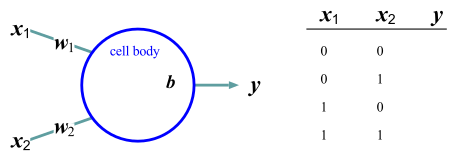
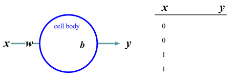

<link href="/css/asamarkdown.css" rel="stylesheet">

$$
\newcommand{\bs}[1]{\boldsymbol{#1}}
\newcommand{\mb}[1]{\mathbf{#1}}
\newcommand{\Brc}[1]{\left(#1\right)}
\newcommand{\BRc}[1]{\left[#1\right]}
\newcommand{\Rank}{\text{rank}\;}
\newcommand{\Hat}[1]{\widehat{#1}}
\newcommand{\Prj}[1]{\mb{#1}\Brc{\mb{#1}^{\top}\mb{#1}}^{-1}\mb{#1}^{\top}}
\newcommand{\RegP}[2]{\Brc{\mb{#1}^{\top}\mb{#1}}^{-1}\mb{#1}^{\top}\mb{#2}}
\newcommand{\NSQ}[1]{\left|\mb{#1}\right|^2}
\newcommand{\Norm}[1]{\left|#1\right|}
\newcommand{\IP}[2]{\left({#1}\cdot{#2}\right)}
\newcommand{\Bar}[1]{\overline{\;#1\;}}
$$

<a href='mailto:educ0233@komazawa-u.ac.jp'>Shin Aasakawa</a>, all rights reserved. 
Date: 09/Oct./2026 
Appache 2.0 license  

* [課題提出用フォルダ](https://drive.google.com/drive/u/7/folders/1GGnO8neW6VczhRI_7QzYcehT21TTqoNG){:target="_blank"}

### 実習ファイル

* [百人一首 上の句→下の句 ](https://colab.research.google.com/github/komazawa-deep-learning/komazawa-deep-learning.github.io/blob/master/2026notebooks/2026_1002chihaya_Transformer_LSTM_SRN_comparison.ipynb){:target="_blank"}
* [オリベッティ顔データを用いた LSTM と SRN 実習 ](https://colab.research.google.com/github/komazawa-deep-learning/komazawa-deep-learning.github.io/blob/master/2025notebooks/2025_1017olivetti_face_LSTM_SRN.ipynb){:target="_blank}
* [足し算モデル ](https://colab.research.google.com/github/komazawa-deep-learning/komazawa-deep-learning.github.io/blob/master/2026notebooks/2026_1002addition_rnn_pytorch.ipynb){:target="_blank"}
* [加算型注意 (Bahdanau) と 内積型注意 (Loung) ](https://colab.research.google.com/github/komazawa-deep-learning/komazawa-deep-learning.github.io/blob/master/2025notebooks/2025_1017Enc_Dec_models_with_attention.ipynb){:target="_blank"}
<!--* [Attention is all you need ](https://colab.research.google.com/github/komazawa-deep-learning/komazawa-deep-learning.github.io/blob/master/2021notebooks/2021_1022The_Annotated_%22Attention_is_All_You_Need%22.ipynb){:target="_blank"} -->
<!-- - [書画のデモ ](https://colab.research.google.com/github/komazawa-deep-learning/komazawa-deep-learning.github.io/blob/master/notebooks/2020_0619sketch_RNN.ipynb){:target="_blank"} -->

---

### 復習 ニューラルネットワーク

 

左: ニューロンの模式図，wikipedia より。
右: ニューロンの模式図に対応するニューラルネットワーク表記。

ニューロンは，多入力 (multi inputs)，一出力 (single output) と見做しうる。
各入力 $x_i$ に対して，対応するシナプス結合強度 $w_i$ を乗じて，総てを足し合わせる ($\sum$)。
さらにバイアス項 $b$ を加えた後，活性化関数 (activation function) を用いて変換した値が出力 $y$ となる。

実際のニューロンを抽象化したニューラルネットワークモデルでは，ニューロンを丸で表し，軸索を矢印で表すことが行われる。
実際のニューロン電位変化とニューラルネットワークとの対応関係を模式的に表現した図が下図である。
活性化関数とは，例えば任意の時間範囲内でのスパイク頻度を表したり，スパイク頻度の割合を表したりすると解釈できる。

左: 従来の人工ニューラルネットワークの処理要素の性質と，右: 生物学的にリアルな Dynamic Synapse ニューラルネット>ワークの処理要素の性質。
Berger+2001, Fig. 3(b)

一つのニューロンを丸で描き，ニューロンの群を長方形で表現する。
ニューロン群は層 layer と呼ばれる。

## ヒューベル (Hubel) と ウィーゼル (Wiesel) による視覚野の生理学研究

左:Hubel と Wiesel(1959, 1962, 1968) の実験の模式図 
右:Hubel と Wiesel の実験結果 (Hubel & Wiesel, 1968) の Fig.2. 7をトレーシングしたもの

入力ニューロンの信号 $x_i$ を変数とみなせば，一つのニューロンは，線形回帰，すなわち重回帰分析を行っていると考えることができる:

$$
y =\sum_{i=1}^{N}w_ix_i + b\tag{重回帰分析の定義式}
$$

上式は，重回帰分析の定義式でもある。
加えて，上式の出力に非線形変換を施すこと考える。
例えば，$y\in[0,1]$ なる変換を行うロジスティックシグモイド関数 $f(x)=\left[1+exp(-x)\right]^{-1}$ を行えば，ロジスティック回帰分析となる:

$$\begin{aligned}
y &= \sigma\left(\sum_{i=1}^{N}w_ix_i+b\right)\\
\sigma\left(x\right) &= \frac{1}{1+e^{-x}}\\
\end{aligned}\tag{ロジスティック回帰の定義式}$$

最初期のニューラルネットワークモデル，たとえばパーセプトロンや ADALINE は，単層のニューラルネットワークモデルとみなすことができる。
すなわち，1950 年代のニューラルネットワークモデルは，ロジスティック回帰と同じと言っても過言ではない。

1980 年代になると，上記の非線形変換を 2 回繰り返す，3 層のニューラルネットワークが提案された。
これには，一般化デルタ則，現在では，**誤差逆伝播法 back-propagation** と呼ぶ学習アルゴリズム，すなわち，最適化計算手法が提案されたため，3 層のニューラルネットワークが可能となった。

誤差逆伝播法は，3 層のみならず，多層ニューラルネットワークにも適用可能である。

$$
y = \prod_{\ell=1}^{N}\sigma\left(\sum_{i\in\mathcal{I}_{\ell}}w_{\ell,i}x_{\ell-1,i}+b_{\ell}\right)
$$

1980 年代当時は，計算機の能力や記憶容量の制限などの理由により，ニューラルネットワーク研究は下火になる。

実際に，多層ニューラルネットワークでは，**勾配消失問題 gradient vanishing problems**，**勾配爆発問題 gradient exploding problems** や **信用割当問題 credit asignment promblems** が指摘され，実用的な解を得ることが難しいとされてきた。

  * 勾配消失問題とは，誤差逆伝播を多層に渡って繰り返すと，層を経るたびに，学習に必要な微分の値 (勾配) が 0 に近づく (消失) することを指す
  * 勾配爆発問題とは，誤差逆伝播法を，再帰的な結合を持つ層内，層間での繰り返した場合，再帰結合層内，相関，での学習に必要な微分の値 (勾配) が，再帰的な処理のために指数関数的に増大 (爆発) することを指す。
  * 信用割当問題とは，多層に渡る全結合層 (fully connected layers) においては，すべてのニューロンが意思決定に関与することになるため，多層ニューラルネットワークの識別に，どの入力特徴が関与するのかが，不明，あるいは曖昧になることを指す。

上述のような問題を解決する努力が積年に渡って継続し，今日のような流行が齎された。
これら努力の中には，以下のような技法が挙げられる:

* **畳み込みニューラルネットワーク** (CNN: Convolutional Neural Networks)，
* **確率的勾配降下法** (SDG: Stochastic Gradient Decent methods)，
* **整流線形化ユニット** (ReLU: Rectified Linear Unit)，**LSTM** (Long Short-Term Memory modeling) や Transfomer で採用されている，**ゲート機構** (gating mechanisms)，あるいは，**注意機構** (attention mechanisms)，
* **残差ネット** (ResNet) や **U-Net** で用いられている **スキップ結合** (skip-connections)
* **自然勾配法** (Natural Gradient methods) や **Adam** などの **最適化手法 (optimization techniques)**

### 多層ニューラルネットワーク

時間 $t$ における入力信号は $x_i(t)$ は $i$ 番目のシナプスの興奮伝達の時間 $t$ 付近での平均ととらえることができる。
すると、最高頻度の出力を 1, 最低(興奮無し)を 0 と規格化できると考えて $0\le f(\mu) \le1$ とする。
入出力関係は $f$ を用いて

$$ z = f(\mu) = f\left(\sum w_ix_i(t)-h\right)\tag{4} $$

のように表現される。
このモデルは、ニューロン集団の平均活動率ととらえることもできる。

良く用いられる出力関数 $f$ の形としては、$\mu = \sum w_ix_i -h$ として、

$$ f(\mu) = \frac{1}{1+e^{-\mu}},\tag{5} $$

や

$$ f(\mu) = \tanh(\mu)\tag{6}, $$

ただし $\mu = \sum w_{i}x_{i} -h$ などが使われることが多い。
(5) 式および (6) 式は、入力信号の重みつき荷重和 $\mu$ としてニューロンの活動が定まることを示している。
後述するバックプロパゲーション則で必要となるので、$\mu$ の微小な変化がニューロンの活動どのような影響を与えるか調べるために (5) 式 および (6) 式 を $\mu$ で微分することを考える。

$$ f(x) = \frac{1}{1+e^{-x}}, $$

を $x$ について微分すると

$$ \frac{df}{dx} = f(x)\left(1- f(x)\right) $$

$$ f(x) = \tanh{x} = \frac{e^{x}-e^{-x}}{e^{x}+e^{-x}} $$

を $x$ について微分すると

$$ \frac{df}{dx} =
1 - \tanh^2x = 1 - \left(f(x)\right)^2 $$

$\tanh$ は双曲線関数である。

以降では表記を簡単にするために線形数学の表記、すなわちベクトルと行列による表記方法を導入する。
$n$ 個の入力信号の組 $\left(x_1, x_2, \cdots, x_n\right)$ をまとめて $\mathbf{x}$ のようにボールド体で表す。本章では一貫してベクトル表記には小文字のボールド体を，行列には大文字のボールド体を用いることにする。
例えば $n$ 個の入力信号の組 $(x_1, x_2, \cdots, x_n)=\mathbf{x}$ に対して，同数の結合荷重 $\left(w_1, w_2, \cdots, w_n\right)=\mathbf{w}$ が存在するので，加算記号 $\sum$ を使って表現していた任意のニューロンへの全入力 $\mu=\sum w_{i}x_{i}$ はベクトルの内積を用いて $\mu=(\mathbf{w}\cdot\mathbf{x})$ と表現される。

なお，横一行のベクトルを行ベクトル，縦一列のベクトルを列ベクトルと呼ぶことがある。
ここでは行ベクトルと混乱しないように，必要に応じて列ベクトルを表現する際には $\{x_1, x_2, \cdots, x_n\}^{\top}=\mathbf{x}$ とベクトルの肩に $\top$ を使って表現することもある。

そして，これらをベクトル表現や行列表現で表せば，表記も簡単になり，行列の演算法則を活用することもできる。
そのため，ニューラルネットワークに関する文献でも行列表現が用いられることが多い。

図のような単純な 2 層の回路を例に説明する。

 
ネットワークの行列表現

わかりやすいように図と対応させながら，対応する行列表現とシグマ記号による表記を併記するので，よく理解した上で先に読み進んでいただきたい。
なお，どうしても行列表現にはなじめないという読者は，行列表現の箇所だけをとばして読んでもある程度はわかるよう記述するつもりである。

それでは，まず図 4 のような単純な 2 層のネットワークを例に説明しよう。
図には、３つの入力素子 (ユニットと呼ばれることもある)
と ２ つの出力素子の活性値（ニューロンの膜電位に相当する）

$x_{1}, x_{2}, x_{3}$ と $y_{1}, y_{2}$，および入力素子と出力素子の結合強度を表す $w_{11}, w_{12}, \cdots, w_{32}$ が示されている。
これらの記号をベクトル $\mathbf{x}$, $\mathbf{y}$ と行列 $\mathbf{w}$ を使って表すと $\mathbf{y}=\mathbf{Wx}$ となる。

図\ref{fig:matrix-notation.eps}の場合、ベクトルと行列の各要素を書き下せば、
$$
\left(\begin{array}{l}y_{1}\\
y_2\\
\end{array}\right)
=\left(
\begin{array}{lll}
w_{11}&w_{12}&w_{13}\\
w_{21}&w_{22}&w_{23}
\end{array}
\right)
\left(
\begin{array}{l}
x_1\\
x_2\\
x_3\\
\end{array}
\right)
$$
のようになる。　　

行列の積は、左側の行列の $i$ 行目の各要素と右側の行列（ベクトルは１列の行列でもある）の $i$ 列目の各要素とを掛け合わせて合計することなので、以下のような、加算記号を用いた表記と同じである。

$$
\begin{array}{lllll}
y_1 &=& w_{11}x_1 + w_{12}x_2 + w_{13}x_3 &=&\sum_i w_{1i} x_i\\
y_2 &=& w_{21}x_1 + w_{22}x_2 + w_{23}x_3 &=&\sum_i w_{2i} x_i\\
\end{array}
$$

これを、$m$ 個の入力ユニットと $n$ 個の出力ユニットの場合に一般化すれば、
以下のようになる。

単純な 2 層のネットワークを考える。
$i$ 番目の出力層の各ニューロンの膜電位 $y_i,(i=1,2,\cdots,n)$ をまとめて $\mathbf{y}$ とベクトル表現し、同様に入力層も $\mathbf{x}$ とする。
ニューロン $x_{j}$ から ニューロン $y_{i}$ へのシナプス結合強度を $w_{ij}$ と表現すれば、入力層から出力層への関係は

$$
\left(\begin{array}{l}
y_1 \\ y_2 \\ \vdots \\ y_n \end{array}\right)  =
\left(\begin{array}{llll}
w_{11} & w_{12} & \cdots & w_{1m} \\
w_{21} & w_{22} & \cdots & w_{2m} \\
\vdots &        & \ddots & \vdots \\
w_{n1} & w_{n2} & \cdots & w_{nm}
\end{array}\right)
\left(\begin{array}{l}
x_1 \\ x_2 \\ \vdots \\ x_m \end{array}\right) \\
\mathbf{y} = \mathbf{Wx}
$$

と表現できる。
しきい値の扱いについては、常に 1 を出力する仮想的なニューロン $x_0=1$ を考えて $W$ に組み込むことも可能である。

実際の出力は $\mathbf{y}$ の各要素に対して

$$
f(y)=\frac{1}{1+e^{-y}}, 
$$

のような非線型変換を施す。

階層型のネットワークにとっては上式，非線型変換が本質的な役割を果たす。
なぜならば、こうした非線形変換がなされない場合には、ネットワークの構造が何層になったとしても、この単純なシナプス結合強度を表す行列を $$\mathbf{W}_{i},i=1,\ldots,p$$ としたとき、$$\mathbf{W}=\prod_{i=1}^{p}\mathbf{W}_{i}$$ と置くことによって本質的には 1 層のネットワークと等価になるからである。

$$
\mathbf{y} = \mathbf{W}_{p}\mathbf{W}_{p-1}\cdots\mathbf{W}_{1}\mathbf{y}=\left(\prod_{i=1}^p\mathbf{W}_{i}\right)\mathbf{y}. 
$$

<!--  

  -->

<!-- 
## パーセプトロンの学習

$$
\mathbf{w}\leftarrow\mathbf{w}+\left(y-\hat{y}\right)\mathbf{x}
$$

パーセプトロン perceptron は 3 層の階層型ネットワークでそれぞれ S(sensory layer), A(associative layer), R(response layer) と呼ぶ。
$S\rightarrow A \rightarrow R$ のうち パーセプトロンの本質的な部分は $A\rightarrow R$ の間の学習にある。

入力パターンに $P^+$ と $P^-$ とがある。
パーセプトロンは $P^+$ が入力されたとき $1$, $P^-$ のとき $0$ を出力する機械である。
出力層 ($R$) の $i$ 番目のニューロンへの入力(膜電位の変化) $u_i$ は

$$\tag{eq1}
u_{i} = \sum_{j} w_{ij}x_{j} - \theta_{i} = \left(w\right)_{i}\cdot\left(x\right)_{i}-\theta_{i}.
$$

ここで中間層 ($A$) の $j$ 番目のニューロンの出力 $y_i$ とこのニューロンとの結合係数を $w_{ij}$，しきい値を $\theta_i$ とした。
このニューロンの出力$y_i$(活動電位、スパイク)は、

$$
y_i = \lceil u_i\rceil
\qquad\left\{
\begin{array}{ll}
 1 & \mbox{if $u_i \ge 0$,}\\
 0 & \mbox{otherwize}
\end{array} \right.
$$

$$
y=sign\left(\sum_{i=1}^Nw_ix_i+b\right)
$$

と表される。

式 (\label{eq1}) の意味を理解するために以下の図を参照

Minsky and Papert はパーセプトロンのベクトル表示について悲観的な考え方を持っているようですが、ここでは理解のしやすさを優先します。

$$
\mathbf{w}\rightarrow\mathbf{w}+\left(y-\hat{y}\right)\mathbf{x}
$$

## 論理回路の設計

基本的な論理回路と簡単な記憶回路を神経回路網で構成する方法を考えてみます。
シリコンウェハ上に構成される論理回路をニューロン素子でも実現できることを示し以下に引用したウィーナーの言葉を裏付ける根拠を示すことにします。

## AND (論理積)回路

2 入力 1 出力の回路において、2 つの入力が共に真であるときのみ真を出力し、
そうでなければ偽となる論理演算である論理積 (AND) を考えます。
論理積は引数を 2 つとる演算であり、
出力を $y$ とすれば $y = f(x_1, x_2)$ のように書くことができます。
$x_1$, $x_2$ ともに 1 または 0 の値をとるものとすれば、
$y$ が 1 であるためには $x_1 = 1$ かつ $x_2 = 1$ でなければなりません

|y  |$x_1$ |$x_2$|
|:--|:-----|:-----|
|0  |   0  |  0|
| 0 |    0 |  1|
| 0 |    1 |   0|
| 1 |    1 |   1|

## OR (論理和)回路

<!-- 

{#fig:formal_proto1 style="width:69%"}

 -->

<!-- ## NOT (否定)回路

<!-- 

{#fig:formal_one style="width:69%"}

 

-->

## 排他的論理和 (XOR) 回路

<!-- 

{#fig:xor style="width:49%"}

{#fig:xor-graph style="width:29%"}

 -->

### PDP book (1986) chapter 8 Figure 2

<!--

{#fig:1986PDP_Fig2 style="width:39%"}

 -->

---

#### 内部表象

<!-- 

{#fig:1986PDP_Fig2 style="width:39%"}

 -->

おそらく人類史上初，哲学的な意味ではなく内部表象が計算可能になった

---

#### 排他的論理和の別解

<!-- 

{#fig:xor-w-direct style="width:49%"}

-->

|$A$|$B$|$\neg{A}$|$\neg B$|$A\mapsto B$|$B\mapsto A$|$\neg B\mapsto \neg A$|
|:--:|:--:|:------:|:------:|:----------:|:----------:|:-------------------:|
|1  | 1 | 0 | 0 | 1 | 1 | 1 |
|1  | 0 | 0 | 1 | 0 | 1 | 0 |
|0  | 1 | 1 | 0 | 1 | 0 | 1 |
|0  | 0 | 1 | 1 | 1 | 1 | 1 |

## 簡単な記憶回路 フリップフラップ回路

AND 素子と NOT 素子とを繋いで簡単な記憶回路を作ることができる

図で各素子は $1$ か $0$ かを値として取りうる **形式ニューロン** だとする。
今、入力 $x$ と入力 $y$ とが共に $1$ であれば $A=1$, $B=0$ あるいは $A=0$, $B=1$ のときだけこの回路は安定である。

ここで $x=0$, $y=1$ とすると $A=0$, $B=1$ の状態になり、 $x=1$, $y=0$ とすると $A=1$, $B=0$ の状態になる。
しかも、この状態は $x=y=1$ に入力を戻しても保存される。
これは $1$ ビットの記憶回路でありフリップフラップ回路 (flip-flop circuit) と呼ばれる。

このことは AND と NOT を実現できる神経回路素子があれば記憶回路を作ることができることを示している。
しかも工学的に実現されている回路と完全に等価である。
フリップフロップ回路を何個かまとめてレジスタ (register) と呼ぶ。
市販されている PC の CPU の性能を指して 64 ビットマシンと呼ぶのは、このレジスタの大きさ(記憶装置への基本的な入出力単位の基本でもある)による。

一般にコンピュータの速度はこのフリップフラップ回路が安定するまでの時間に依存します。
なぜなら、コンピュータの基本動作は原理的に、上述のフリップフラップ回路が安定するのを待って、次の命令をレジスタに読み込むことの繰り返しだからである。

## Mitchell と Just の研究

 
Mitchell et al (2008) Fig. 1 を改変

 
 
<!--  
  -->

図 4: 選択された深層学習モデル層による，様々な脳領域のペアリング精度。
言語理解の中心とされる脳の左側部分，特に左側頭部 (L = left, R = right) が高い精度で予測されている
。
<!-- Figure 4: Pairwise accuracy of various brain regions from some selected deep neural network model layers. The left part of the brain which is considered central to language understanding is predicted with higher accuracy, especially left temporal region (L = left, R = right).-->

### 長=短期記憶 (LSTM: Long Short-Term Memory)

**長=短期記憶** (Long Short-Term Memory: LSTM, henceforth) はシュミットフーバー (Shumithuber, J.) 一派により提案された長距離依存解消のためのニューラルネットワークモデル。
長距離依存を解消するためには，ある内容を保持し続けて必要に応じてその内容を表出する必要がある。
このことを実現するために，ニューロンへの入力に門 (gate) を置くことが提案された。
下図に長=短期記憶モデルの概念図を示す。

 

LSTM from [@2016Asakawa_AIdict]

上図の LSTM は一つのニューロンに該当します。このニューロンには 3 つのゲート(gate, 門) が付いている。
3 つのゲートは以下の名前で呼ばれる。

1. 入力ゲート input gate
2. 出力ゲート output gate
3. 忘却ゲート forget gate

入力ゲートと出力ゲートが閉じていれば，セルの内容(これまでは中間層の状態と呼んできました)が保持されることになる。
出力ゲートが開いている場合には，セル内容が出力される。一方出力ゲートが閉じていればそのセル内容は出力されない。このように入力ゲートと出力ゲートはセル内容の入出力に関与する。
忘却ゲートはセル内容の保持に関与する。忘却ゲートが開いていれば一時刻前のセル内容が保持されることを意味する。反対に忘却ゲートが閉じていれば一時刻前のセル内容は破棄される。
全セルの忘却ゲートが全閉ならば通常の多層ニューラルネットワークであることと同義である。
すなわち記憶内容を保持しないことを意味する。
SRN でフィードバック信号が存在しない場合に相当する。セルへの入力は，以下のように

1. 下層からの信号，
2. 上層からの信号, すなわち Jordan ネットの帰還信号
3. 自分自身の内容，すなわち Elman ネットの帰還信号

が用いられる。これら入力信号が

1. 入力信号そのもの
2. 入力ゲートの開閉制御用信号
3. 出力ゲートの開閉制御用信号
4. 忘却ゲートの開閉制御用信号

という 4 種類に用いられる。従って LSTM のパラメータ数は SRN に比べて 4 倍となる。

LSTM に限らず一般のニューラルネットワークの出力には非線形関数が用いられる。代表的な非線形出力関数としては，以下のような関数が挙げられる。

1. シグモイド関数[^sigmoid]: $f(x)=\left[1+e^{-x}\right]^{-1}$
2. ハイパーボリックタンジェント関数:  $f(x)=\left(e^{x}-e^{-x}\right)/\left(e^{x}+e^{-x}\right)$
3. 整流線形ユニット関数: $f(x)=\max\left(0,x\right)$

[^sigmoid]: 1980 年代に用いられたシグモイド関数が用いられることはほとんどなくなりました。理由は収束が遅いからです[@1999LeCun]

この中で，セルの出力関数として 2. のハイパーボリックタンジェント関数が，ゲートの出力関数にはシグモイド関数が使われます。その理由はハイパーボリックタンジェント関数の方が収束が早いこと，シグモイド関数は値域が $[0,1]$ であるためゲートの開閉に直接対応しているからです。

- Le Cun, Y. Bottou, L., Orr, G. B, Muller K-R. (1988) Efficient BackProp, in Orr, G. and Muller, K. (Eds.) Neural Networks: tricks and trade, Springer.

<!--
The LSTM (left figure) can be described as the input signals $\mathbf{x}_t$ at
time $t$, the output signals $\mathbf{o}_t$, the forget gate $\mathbf{f}_t$, and
the output signal $\mathbf{y}_t$, the memory cell $\mathbf{c}_t$, then we can get
the following:
$i_{t}=\sigma\left(W_{xi}x_{t}+W_{hi}y_{t-1}+b_{i}\right)$,  
$f_{t}=\sigma\left(W_{xf}x_{t}+W_{hf}y_{t-1}+b_{f}\right)$,  
$o_{t}=\sigma\left(W_{xo}x_{t}+W_{ho}y_{t-1}+b_{o}\right)$,   
$g_{t}=\phi\left(W_{xc}x_{t}+W_{hc}y_{t-1}+b_{c}\right)$, 
$c_{t}=f_{t}\odot c_{t-1} + i_{t}\odot g_{t}$, 
$h_{t}=o_{t}\odot\phi\left(c_{t}\right)$ <!--\label{eq:LSTM}
where
$\sigma\left(x\right)=\displaystyle\frac{1}{1+\mbox{exp}\left(-x\right)}$ (logistic function)
%% =1/2\left(\phi\Brc{x}+1\right)$,
$\phi\left(x\right)=\displaystyle\frac{\mbox{exp}\left(x\right)-\mbox{exp}\left(-x\right)}{\mbox{exp}\left(x\right)+\mbox{exp}\left(-x\right)}$ (hyper tangent)
%% $=2\sigma\left(x\right)-1$
and $\odot$ menas Hadamard (element--wise) product.
-->

### LSTM におけるゲートの生理学的対応物 <!--Physiological correlates of gates in LSTM-->

以下の画像は <http://kybele.psych.cornell.edu/~edelman/Psych-2140/week-2-2.html> よりの引用。
ウミウシのエラ引っ込め反応時に，ニューロンへの入力信号ではなく，入力信号を修飾する結合が存在する。下図参照。

<!--

 

-->

<!-- sea slug, ウミウシ。Mollush 軟体動物，-->

 
 

アメフラシ (Aplysia) のエラ引っ込め反応(a.k.a. 防御反応)の模式図[^seaslang]

[^seaslang]: from <http://kybele.psych.cornell.edu/~edelman/Psych-2140/week-2-2.html> の 222ページより 
画像はそれぞれ http://kybele.psych.cornell.edu/~edelman/Psych-2140/shunting-inhibition.jpg http://kybele.psych.cornell.edu/~edelman/Psych-2140/C87-fig2.25.jpg http://kybele.psych.cornell.edu/~edelman/Psych-2140/C87-fig2.24.jpg 

また古くは PDP のバイブルにもシグマパイユニット ($\sigma\pi$ units) として既述が見られます。各ユニットを掛け算 ($\pi$) してから足し算 ($\sum$) するのでこのように命名されたのでしょう。

 
From [@PDPbook] chaper 7

### エンコーダ・デコーダモデル 符号化器・復号化器モデル (Encoder-Decoder models, a.k.a. Seq2seq models)

Sutskever+2014 Fig. 1, 翻訳モデル `seq2seq` の概念図

`eos` は文末を表す。
中央の `eos` の前がソース言語であり，中央の `eos` の後はターゲット言語の言語モデルである SRN の中間層への入
力として用いる。

注意すべきは，ソース言語の文終了時の中間層状態のみをターゲット言語の最初の中間層の入力に用いることであり，そ
れ以外の時刻ではソース言語とターゲット言語は関係がない。
逆に言えば最終時刻の中間層状態がソース文の情報全てを含んでいるとみなしうる。
この点を改善することを目指すことが 2014 年以降盛んに行われてきた。
顕著な例が後述する **双方向 RNN**，**LSTM** 採用したり，**注意** 機構を導入することであった。

From Sutskever+2014, Fig. 2

### 自然言語系の注意

左: Bahdanau+2014,
中: Luong+2015, Fig. 2,
右: Luong+2015, Fig. 3

### 画像と言語との融合へ向けて

2014 年に提案されたニューラル画像脚注付けのモデルを下図に示す。

<!--

 
[@2015Karpathy_FeiFei_caption]

-->

 
[@2014Vinyals_Bengio_Show_and_Tell]

<!--

 

-->

画像に対して注意を付加した脚注付けモデルの出力例を下図に示す。

<!--

 
[@2015Xu_Bengio_NIC_attention]

-->
各画像対は右が入力画像であり，左はその入力画像の脚注付けである単語を出力している際にどこに注意しているのかを白色で表している。

 
[@2015Xu_Bengio_NIC_attention]

 
 
[@2015Xu_Bengio_NIC_attention]

 
 
<!--   -->

Glimpse Sensor: Glimpse の座標と入力画像が与えられると Glimpse Sensor は $l_{t-1}$ を中心とし、複数の解像度パッチを含む **網膜様** 表現 $\rho\left(x_t,l_{t-1}\right)$ を抽出する。

* B. **Glimpse Network**: 位置 $\left(l_{t-1}\right)$ と入力画像 $\left(x_t\right)$ が与えられると、Glimpse Sensor を用いて網膜表現 $\rho\left(x_t,l_{t-1}\right)$ を抽出する。網膜表現と Glimpse の位置は、それぞれ $\theta_g^{0}$ と $\theta_g^{1}$ でパラメータ化された独立した線形層を用いて隠れ空間に写像される。線形層は平行化素子を用いており、その後に別の線形層 $\theta_2^{2}$ が続き、両成分からの情報を結合する。 glimpse ネットワーク $f_{g}\left(\dot;\left[\theta_g^0,\theta_g^1,\theta_g^2\right]\right)$ は、glimpse 表現 $g_t$ を生成する注意ネットワークのための、学習可能な帯域幅制限センサを定義する。
* C. **モデルアーキテクチャ**: 全体として、モデルは RNN である。モデルの核心ネットワーク $f_h\left(\cdot;\theta_h\right)$ は、glimpse 表現 $g_t$ を入力として受け取り、前のタイムステップ $h_{t-1}$ における内部表現と組み合わせることで、モデルの新しい内部状態 $h_t$ を生成する。位置ネットワーク$f_l\left(\cdot;\theta_a\right)$ とアクションネットワーク $f_a\left(\cdot;\theta_a\right)$ は、モデルの内部状態 $h_t$ を用いて、それぞれ $l_t$ における次の注目位置と、$l_t$ におけるアクション/分類を生成する。この基本的なRNN反復処理は、可変ステップ数だけ繰り返される。[@2014Mnih_RNN_attention]

<!-- Glimpse Sensor: Given the coordinates of the glimpse and an input image, the sensor extracts a __retina-like__ representation $\rho\left(x_t,l_{t-1}\right)$ centered at $l_{t-1}$ that contains multiple resolution patches. 

* B. **Glimpse Network**: Given the location $\left(l_{t-1}\right)$ and input image $\left(x_t\right)$, uses the glimpse sensor to extract retina representation $\rho\left(x_t,l_{t-1}\right)$.  The retina representation and glimpse location is then mapped into a hidden space using independent linear layers parameterized by $\theta_g^{0}$ and $\theta_g^{1}$ respectively using rectified units followed by another linear layer $\theta_2^{2}$ to combine the information from both components. The glimpse network $f_{g}\left(\dot;\left[\theta_g^0,\theta_g^1,\theta_g^2\right]\right)$ defines a trainable bandwidth limited sensor for the attention network producing the glimpse representation $g_t$. 
* C. **Model Architecture**: Overall, the model is an RNN. The core network of the model $f_h\left(\cdot;\theta_h\right)$ takes the glimpse representation $g_t$ as input and combining with the internal representation at previous time step $h_{t-1}$, produces the new internal state of the model $h_t$. The location network $f_l\left(\cdot;\theta_a\right)$ and the action network $f_a\left(\cdot;\theta_a\right)$ use the internal state $h_t$ of the model to produce the next location to attend to $l_t$ and the action/classification at respectively. This basic RNN iteration is repeated for a variable number of steps.[@2014Mnih_RNN_attention] -->

<!--
#  World Models

 
[@2018Ha_WorldModels] Fig.1

 
A World Model, from Scott McCloud’s Understanding Comics. (McCloud, 1993; E, 2012)

Jay Wright Forrester, the father of system dynamics,
described a mental model as:\\
    \begin{quote}
      The image of the world around us, which we carry in our
      head, is just a model. Nobody in his head imagines all
      the world, government or country. He has only selected
      concepts, and relationships between them, and uses those
      to represent the real system. \citep{1971Forrester}
    \end{quote}

-->

<!--
 

LSTM の概念 (Shumithuber ら 2015)を改変

-->

<!--

 
\cite{2010Mikolov2010}

 
Mikolov Extension

 
Boden's BPTT

-->

<!--
- モチベーション
- ニューラルネットワーク言語モデル
- 訓練アルゴリズム
  - リカレントニューラルネットワーク
  - クラス
  - エントロピー最大化言語モデル

### モチベーション

### モチベーション (2) チューリングテスト
- チューリングテストは原理的に言語モデルの問題とみなすことが可能
- 会話の履歴が与えられた時，良い言語モデルは正しい応答に高い確率を与える

- 例:
  - $P\left(\mathbf{ox{月曜日}\vert \mathbf{ox{今日は何曜日ですか？}}} = ?$\\
  - $P\left(\mathbf{ox{赤}\vert \mathbf{ox{バラは何色？}}} = ?$\\

言語モデルの問題と考えれば以下の文のような問題と等価とみなせる:\\
$P\left(\mathbf{ox{赤}\vert {\mathbf{ox{バラの色は}}}=?$

### モチベーション(3) n-グラム言語モデル

- どうすれば「良い言語モデル」を創れるか？
- 伝統的解: n-グラム言語モデル: $P\left{w\vert h}=\displaystyle\frac{C\left{h,w\right}}{C\left(h\right)}$
-->

# 1. NLP の主要課題

<!-- (所要目安：30秒)-->

<!-- 前半のブロックに入ります。ここから3枚は、自然言語処理にどんなタスクがあるかを俯瞰します。 -->
<!-- 単なる用語の羅列として聞くのではなく、「入力と出力の形式が何か」という軸で聞いてください。この軸は、後で評価指標の話（分類は正解率、翻訳・要約は BLEU/ROUGE）に直結します。 -->
<!-- ここで整理しておくと、後の話が楽になります。  -->

---

## NLP とは何か

- 自然言語処理（Natural Language Processing）：人間の言語をコンピュータで扱う技術分野
- 「言語を理解する」ではなく、「言語を入力として何らかの出力を返す」課題群として捉える
- 課題ごとに入力と出力の形式が異なる
- 本講義群を通じて、認知課題は一貫して「入力→処理→出力」の枠組みでモデル化する

入力・処理・出力の枠組み

<!-- (所要目安：3〜4分)-->

<!-- まず自然言語処理とは何か、定義から入ります。「人間の言語をコンピュータで扱う技術分野」ですが、これだけでは漠然としています。
ここで強調したいのは、「言語を理解する」という捉え方をいったん脇に置く、という点です。NLPの課題は、「言語を入力として、何らかの出力を返す」課題群として捉えるほうが、技術的には扱いやすい。
（ここで問いかけ）：「機械翻訳ができれば、その機械は言語を理解していると言えるでしょうか？」— 少し間を置いて反応を見る。正解を求める問いではなく、「理解」という言葉が実は曖昧であることに気づいてもらうための問いです。
この「理解」を巡る問題は、後期後半（第 20 回の LLM の限界、ハルシネーション）でもう一度扱います。今日はいったん保留にして、工学的に扱いやすい定義（入力→出力）で進めます。
（図 7 を提示）：この入力→処理→出力という枠組みは、今日だけでなく、この授業群全体を通じて繰り返し使う型です。
認知課題を扱うときも、この3段階で整理すると見通しが良くなります。今日の例で言えば、入力が「文章」、処理が「ニューラルネットワーク」、出力が「ラベルや文」に対応します。
課題ごとに、この入力と出力の形式が変わります。次のスライドから、代表的な4つのタスクを、入力と出力の形式に注目しながら見ていきます。  -->

---

## 主要課題 1: 分類

- 入力：文や文書　→　出力：カテゴリラベル
- 例：スパム判定、感情分析（ポジティブ／ネガティブ）、トピック分類
- 出力が離散的で固定集合であることが特徴

<!-- (所要目安：2分) -->

<!-- 最初のタスクは分類です。入力が文や文書、出力がカテゴリラベル。先ほどの入力→処理→出力の型に当てはめると、出力側が「あらかじめ決まった選択肢の中から1つを選ぶ」という形になります。
具体例を 3 つ挙げます。スパム判定（スパムか否かの2択）、感情分析（ポジティブ/ネガティブ、場合によっては中立を含む3択）、トピック分類（政治・スポーツ・経済…といった複数のカテゴリ）。
ここで覚えておいてほしいのは「出力が離散的で固定集合である」という性質です。これは後で評価の話をするときに効いてきます。正解が有限個の選択肢から一意に決まるので、「当たったか外れたか」を機械的に判定できる。これが分類タスクの評価のしやすさにつながります。次のタスクと比較すると、この性質のありがたみが分かります。 -->

### GLUE leaderboard

- [GLUE leaderboard](https://gluebenchmark.com/leaderboard)
- [SuperGlue leaderboard](https://super.gluebenchmark.com/leaderboard)

##### GLUE 下位課題

- CoLA: 入力文が英語として正しいか否かを判定
- SST-2: スタンフォード大による映画レビューの極性判断
- MRPC: マイクロソフトの言い換えコーパス。2文 が等しいか否かを判定
- STS-B: ニュースの見出し文の類似度を5段階で評定
- QQP: 2 つの質問文の意味が等価かを判定
- MNLI: 2 入力文が意味的に含意，矛盾，中立を判定
- QNLI: Q and A
- RTE: MNLI に似た 2 つの入力文の含意を判定
- WNI: ウィノグラッド会話チャレンジ

### JGLUE

* [JGLUE](https://github.com/yahoojapan/JGLUE/tree/main){:target="_blank"}
* [JGLUE の課題ガイドライン](https://github.com/yahoojapan/JGLUE/blob/main/task_guidelines.md){:target="_blank"}

* [Amazon Reviews Multi (Japanese) テストセット](https://huggingface.co/datasets/SetFit/amazon_reviews_multi_ja/viewer/default/test){:target="_blank"}
* [JCoLA Out-of-Domain Validation Set](https://github.com/osekilab/JCoLA/blob/main/data/jcola-v1.0/out_of_domain_valid-v1.0.tsv){:target="_blank"}

## 主要課題 2: 翻訳

- 入力：ある言語の文　→　出力：別の言語の文
- 系列 to 系列（sequence-to-sequence）の代表例
- 出力の長さが入力と一致しない点が分類と根本的に異なる

<!-- (所要目安：2〜3分) -->
<!-- 2 つ目は翻訳です。ここで話が変わります。入力はある言語の文、出力は別の言語の文。分類との違いに気づいてください——出力はもう「選択肢の中から選ぶ」ものではありません。文そのものを新しく作り出す必要があります。
（問いかけ）：「日本語の 1 文を英語に訳すとき、出力の英文の長さは、何によって決まるでしょうか？」——入力の長さで決まるわけではない、という点に気づいてもらう。「今日は雨です」は 3 語程度ですが、英訳は "It is raining today" のように語数が変わり得る。
この「入力の長さと出力の長さが一致しない」という性質が、翻訳を含む系列to系列（sequence-to-sequence）タスク全般の技術的な難しさの出発点です。この後、第 18 回でエンコーダ・デコーダモデルを扱いますが、そこで解決しようとしている問題がまさにこれです。今日は「そういう問題がある」ということだけ頭に入れておいてください。 -->

## 主要課題 3: 要約

- 入力：長い文書　→　出力：短い文書
- 抽出型要約（原文から重要な文を抜き出す）と生成型要約（新たに文を作る）の2方式
- 「何を残すか」の判断基準が評価を難しくする

<!-- (所要目安：2分) -->
<!-- 3 つ目は要約です。入力が長い文書、出力が短い文書。翻訳と同じく系列to系列型ですが、翻訳と違うのは「情報を落とす」ことが目的そのものだという点です。
要約には 2 つの方式があります。抽出型——原文の中から重要な文をそのまま抜き出して並べる方式。生成型——原文の内容を踏まえて、新しい文を作り出す方式。ChatGPTのような大規模言語モデルがやっているのは基本的に後者です。
（問いかけ）：「良い要約とは何でしょうか？短ければ短いほど良いのでしょうか？」——「何を残すべきかは、目的や読み手によって変わる」という点に気づいてもらう。この「正解が一意に決まらない」という性質が、次のブロック（評価の考え方）で改めて問題になります。ここでは「要約は評価が難しいタスクの代表格だ」ということだけ印象づけておいてください。 -->

## 主要課題 4: その他の代表課題

- 質問応答（QA）：質問文 → 回答
- 固有表現抽出（NER）：文中の人名・地名・組織名等を同定
- 構文解析：文の構造（係り受け）を同定
- 後期後半で扱う RAG・LLM は、これらの課題を統一的な枠組みで扱おうとする試み

<!-- (所要目安：1〜2分、次章への橋渡し) -->
<!-- 最後に、代表的な他のタスクを 3 つだけ簡単に触れておきます。質問応答——質問文を入力し、回答を出力する。固有表現抽出——文中の人名や地名、組織名を同定する。構文解析——文の構造、単語同士の係り受け関係を同定する。それぞれ深入りはしません。
ここで大事なのは最後の一文です。後期後半で扱うRAGやLLMは、実はここまで見てきた個別のタスク（分類、翻訳、要約、質問応答…）を、バラバラに専用モデルを作るのではなく、ひとつの大きなモデルで統一的に扱おうとする試みです。今日見た「タスクごとに入出力の形式が違う」という区別は、後半になるとむしろ「LLM がこの区別をどう乗り越えているか」を理解するための土台になります。
このタスクの整理を踏まえて、次は「では、これらのタスクをどう評価するか」という話に移ります。 -->

 
From [@2019Liu_mt-dnn] Fig. 1

# 2. 課題評価の考え方

<!-- (所要目安：30秒) -->

<!-- 先ほど4つのタスクを見ました。次に、それぞれをどう評価するかという話に移ります。
実はこの評価の話、単なる技術的な後日談ではありません。後期後半で扱うハルシネーション問題（LLMがもっともらしい嘘をつく現象）は、根本的には「評価が難しい」という今日の話とつながっています。そのつもりで聞いてください。 -->

## なぜ評価が問題になるのか

- 分類タスクは「正解」が明確 → 評価しやすい
- 翻訳・要約タスクは「正解」が一意に決まらない → 評価が本質的に難しい
- 同じ内容でも表現は無数にあり得る

<!-- (所要目安：2分) -->
<!-- 分類タスクは「正解」が明確です。スパムかスパムでないか、白黒はっきりしている。だから評価しやすい。
一方、翻訳や要約は「正解」が一意に決まりません。（問いかけ）：「『今日は雨です』を英訳してください、と言われたら、正しい訳は1つだけでしょうか？」——"It is raining today" でも "It's raining today" でも、あるいは "Rain today" でも、間違いとは言い切れない。同じ内容でも表現は無数にあり得る。
この「唯一の正解がない」という性質が、これから話す評価指標の話全体を難しくしています。分類の評価と、翻訳・要約の評価は、根本的に別物だと思って聞いてください。 -->

## 評価指標 1: 分類課題

- 正解率（Accuracy）：全体に対する正答の割合
- 適合率（Precision）／再現率（Recall）／F値（F1スコア）
- クラスの不均衡がある場合、正解率だけでは評価を誤る

<!-- 
 -->

| |  「単語」と反応  |   「非単語」と反応|
|:---:|:---:|:---:|
| 実在語  |  TP（正答） 96.2%  |  FN（見逃し）3.8%|
| 非単語  | FP（誤警報） 11.6%  | TN（正棄却）88.4%|

  JALEX (Mochizuki & Ohta, 2025, JALEX: Japanese version of lexical decision database, DOI:10.3389/flang.2024.1506509)  語彙判断課題の 4 セル
<!-- 
 -->

<!-- (所要目安：2〜3分) -->
<!-- 分類タスクの評価から始めます。最も単純なのは正解率——全体のうち正しく分類できた割合です。
ただし正解率だけでは不十分な場合があります。（問いかけ）：「1000件中999件が『スパムでない』メールだとして、すべて『スパムでない』と答えるだけのモデルを作ったら、正解率は何%になるでしょうか？」——99.9%になる、しかしこのモデルはスパムを1件も検出できていない、無意味なモデルです。
ここで適合率（Precision）・再現率（Recall）・F値（F1スコア）という指標が出てきます。細かい数式はここでは深追いしませんが、「クラスの不均衡があるときは、正解率だけでは評価を誤る」という結論だけは持ち帰ってください。この問題は、心理学の実験デザインで言えば、基準率（base rate）の問題と同じ構造です。 -->

## 評価指標 2: 翻訳・要約課題

- BLEU（翻訳）：機械出力と参照訳のn-gram一致度
- ROUGE（要約）：機械出力と参照要約の語の重なり
- いずれも「表層的な一致」を測るものであり、意味の一致を直接測ってはいない

<!-- (所要目安：2分) -->
<!-- 翻訳・要約は「正解」が一意でないので、別のアプローチが必要になります。BLEU（翻訳）、ROUGE（要約）という指標が広く使われています。
どちらも基本的な考え方は同じです——機械が出した文と、人間が作った「模範解答」の文を比べて、単語や語のまとまり（n-gram）がどれだけ重なっているかを数える。
これは正解率のような厳密な一致ではなく、「表層的などれだけ似ているか」の指標だという点を意識してください。次のスライドで、この「表層的」という言葉の意味が問題になります。 -->

## 評価の限界と課題

- 自動評価指標と人間の判断が一致しない場合が多い
- 「流暢だが不正確」な出力を自動指標は見抜きにくい
- 後期後半で扱うハルシネーション問題も、この評価の難しさと表裏一体

<!-- (所要目安：2分、次章への橋渡し) -->
<!-- BLEU や ROUGE には大きな弱点があります。自動評価指標と人間の判断が一致しないことが多いのです。
（問いかけ）：「文法的に完璧で、読んでいて違和感のない文章。でも、書かれている内容が事実と違う。これを BLEU や ROUGE は見抜けるでしょうか？」——見抜けません。これらの指標は「表現が似ているか」を測るのであって、「内容が正しいか」を測るものではないからです。
この「流暢だが不正確」という問題、実は後期後半（第20回）で扱う LLM のハルシネーション（幻覚）問題と直結しています。もっともらしい文章を生成しているのに、中身が事実と違う——これはまさに、今日話した評価の限界そのものです。今の時点では答えを出さず、「評価が難しい」という感覚だけ持ち帰ってください。
このタスクと評価の整理を踏まえて、後半は「では、どうやって単語の意味そのものをコンピュータに扱わせるか」という話に入ります。 -->

