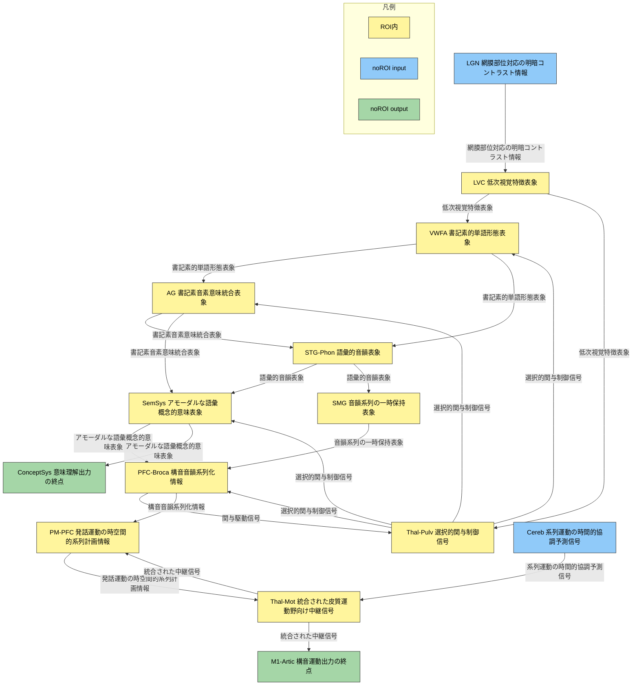

<link href="/css/asamarkdown.css" rel="stylesheet">

<a href='mailto:educ0233@komazawa-u.ac.jp'>Shin Aasakawa</a>, all rights reserved. 
Date: 18/Nov/2026 
Appache 2.0 license 

$$
\newcommand{\of}[1]{\left(#1\right)}
\newcommand{\Of}[1]{\left[#1\right]}
\newcommand{\KL}[2]{\operatorname{KL}\left(\left.{#1}\right\|{#2}\right)}
\newcommand{\given}[1]{\left|{#1}\right.}
\newcommand{\mb}[1]{\mathbf{#1}}
$$

* [オリベッティ顔データベースを用いた機械学習と畳み込みニューラルネットワーク ](https://colab.research.google.com/github/komazawa-deep-learning/komazawa-deep-learning.github.io/blob/master/2026notebooks/2026_0914olivetti_face_classification_demo.ipynb){:target="_blank"}

左: Glaser+(2019) Fig.2, 右: Kriegeskorte+(2008) Fig.3

機械学習の 4 つ役割
1. 工学問題の解として
2. 予測変数の特定と改善
3. 単純モデルの評価とベンチマーク
4. 脳のモデルとして 

  

　　　　　　<hspace style="width:33%"></hspace>

左 Kriegeskorte+(2008) 図 3. 異なる表現を関連付けるハブとしての表現非類似性行列<!-- FIGURE 3. The representational dissimilarity matrix as a hub that relates different representations. --> 

A: システム神経科学は，3つの主要な研究分野，行動実験，脳活動実験，計算モデリングを関連付けるのに苦労してきた。
これまでは，これらの分野は主に 2 つのレベルで相互に作用してきた。 
(1) 言語理論のレベルでの相互作用。すなわち，個別の分析から導き出された結論を比較することによる相互作用。
このレベルは不可欠であるが，定量的ではない。 
(2) 特性関数のレベルで相互作用，例えば，心理測定関数と神経測定関数との比較。
この種の分野間の接触は同様に不可欠であり，定量的なものである。
しかし，特性関数は通常，少数のデータ点しか含まないため，そのインタフェースは情報的に豊かではない。
ここで示されている RDM は 4 つの条件のみに基づいているため，($(4^2-4)/2=$) 6 つのパラメータしか得られないことに注意。
しかし，パラメータの数は条件の数の 2 乗に比例して増えるため，RDM は異なる表現を関連付けるための情報豊富なインターフェースを提供できる。
例えば，ここで取り上げている 96 画像の実験では，行列のパラメータ数は $(96^{2}−96)/2=4,560$ となる。
<!-- **A**: Systems neuroscience has struggled to relate its three major branches of research: behavioral experimentation, brain-activity experimentation, and computational modeling.
So far these branches have interacted largely on two levels:
(1) They have interacted on the level of verbal theory, i.e., by comparing conclusions drawn from separate analyses.
This level is essential, but it is not quantitative.
(2) They have interacted at the level characteristic functions, e.g., by comparing psychometric and neurometric functions.
This form of bringing the branches in touch is equally essential and can be quantitative.
However, characteristic functions typically contain only a small number of data points, so the interface is not informationally rich. Note that the RDM shown is based on only four conditions, yielding only (42−4)/2=6 parameters.
However, since the number of parameters grows as the square of the number of conditions, the RDM can provide an informationally rich interface for relating different representations.
Consider for example the 96-image experiment we discuss, where the matrix has (962−96)/2=4,560 parameters. --> 

B: RDM が提供する量的インタフェースを介して，どのような異なる表現が関連付けられるかをより詳細に説明している。
ここでは，確立可能なモダリティ内での関係を説明するために，fMRI の例を任意に選択した。
これらの関係は，いずれも確立が困難であることに注意 (灰色の双方向矢印)。
<!-- **B**: This panel illustrates in greater detail what different representations can be related via the quantitative interface provided by the RDM.
We arbitrarily chose the example of fMRI to illustrate the within-modality relationships that can be established.
Note that all these relationships are difficult to establish otherwise (gray double arrows). -->

右: Bahg+(2020) 図 1. 心，脳，行動をつなぐフレームワーク 
実験情報と構造情報が脳機能の生成モデルの構造を規定する。生成モデルは，反応時間，血中酸素濃度依存反応，脳波活動など，利用可能なすべての顕在変数を共同で説明するために使用される。本論文では，潜在ガウス過程を用いて顕在変数を連結し，モデルをデータに適合させることにより，最も妥当な連結関数が現れるようにする

## 色の凡例

- 黄色（roiIn）: ROI内のUC（`LVC`, `VWFA`, `Thal-Pulv`, `AG`, `STG-Phon`, `SemSys`, `SMG`, `PFC-Broca`, `PM-PFC`, `Thal-Mot`）
- 青色（noRoiInput）: ROI外からの入力UC（`LGN`, `Cereb`）
- 緑色（noRoiOutput）: ROI外への出力UC（`M1-Artic`, `ConceptSys`）

