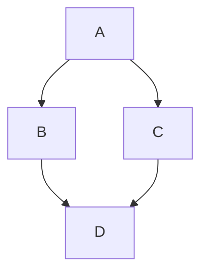
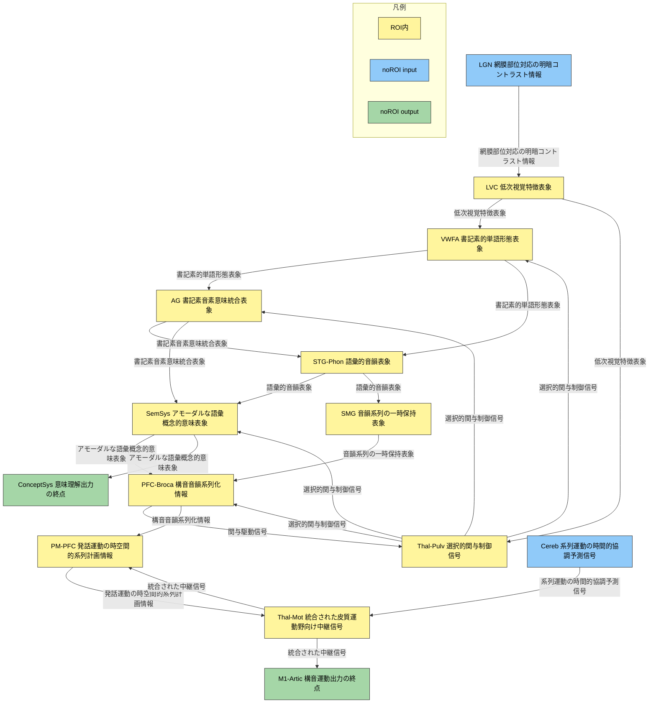

<link href="/css/asamarkdown.css" rel="stylesheet">

<a href='mailto:educ0233@komazawa-u.ac.jp'>Shin Aasakawa</a>, all rights reserved. 
Date: 18/Nov/2026 
Appache 2.0 license 

$$
\newcommand{\of}[1]{\left(#1\right)}
\newcommand{\Of}[1]{\left[#1\right]}
\newcommand{\KL}[2]{\operatorname{KL}\left(\left.{#1}\right\|{#2}\right)}
\newcommand{\given}[1]{\left|{#1}\right.}
\newcommand{\mb}[1]{\mathbf{#1}}
$$

* [オリベッティ顔データベースを用いた機械学習と畳み込みニューラルネットワーク ](https://colab.research.google.com/github/komazawa-deep-learning/komazawa-deep-learning.github.io/blob/master/2026notebooks/2026_0914olivetti_face_classification_demo.ipynb){:target="_blank"}

## 色の凡例

- 黄色（roiIn）: ROI内のUC（`LVC`, `VWFA`, `Thal-Pulv`, `AG`, `STG-Phon`, `SemSys`, `SMG`, `PFC-Broca`, `PM-PFC`, `Thal-Mot`）
- 青色（noRoiInput）: ROI外からの入力UC（`LGN`, `Cereb`）
- 緑色（noRoiOutput）: ROI外への出力UC（`M1-Artic`, `ConceptSys`）

