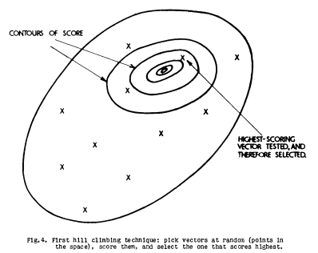
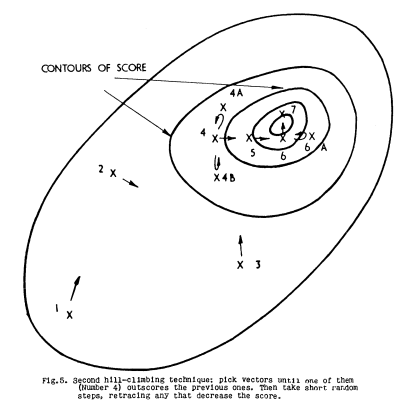
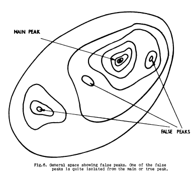
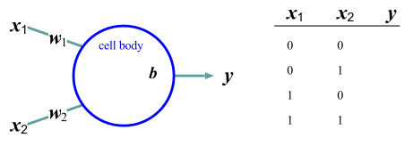
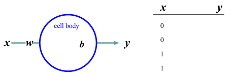

<link href="/css/asamarkdown.css" rel="stylesheet">

<a href='mailto:educ0233@komazawa-u.ac.jp'>Shin Aasakawa</a>, all rights reserved. 
Date: 29/May/2026 
Appache 2.0 license  

* [課題提出用フォルダ](https://drive.google.com/drive/u/6/folders/1vS14tpO2G0G-GllCGntRyFWaJQp8ANyw){:target="_blank"}
* [実習ファイル ](https://colab.research.google.com/github/komazawa-deep-learning/komazawa-deep-learning.github.io/blob/master/2026notebooks/2026ai_lect07.ipynb){:target="_blank"}

## デモ

- [グーグルによるニューラルネットワークの遊び場 (プレイグランド)](https://project-ccap.github.io/tensorflow-playground/){:target="_blank"}

---

* [Yahoo ニュースより 阿部監督18歳長女の手紙全文　「深く反省」　報道内容の一部否定「父とは仲直り」　警察に通報“予想外”](https://news.yahoo.co.jp/articles/2810646be3d11e12ea5603f3d03eb52d1118de34){:target="_blank"}
<!--chatGPT はあくまで道具である。道具に責任はない。最新のテクノロジーがいち早く使いこなした方が圧倒的に有利になる，という事実は指摘すべき。-->

## 07 回：ニューラルネットワーク導入

### 考え方，背景，キーワード

* 構成論的アプローチ vs 分析的アプローチ （人工知能と心理学との関係）
* 神は細部に宿る God is in the detail. あるいは 悪魔は細部に宿る (The devil is in the detail)
* [炭素排他主義 (Carbon chauvinism)](https://en.wikipedia.org/wiki/Carbon_chauvinism)
    * 炭素排他主義（Carbon Chauvinism）とは，知られている限り、炭素の化学的および熱力学的特性は、生物に使用される分子を形成する上で、他のすべての元素よりもはるかに優れていることから，地球外を含む全ての生命体の化学過程は，炭素（有機化合物）から構築されなければならないという仮定を軽蔑するための造語。
    * 人工知能は理論上，基礎となる物質が生物学的でないことから，感覚や知性を持ち得ないという考えを批判するためにも 炭素排他主義という言葉が使われる。

<!-- 古典〜表現学習へ，局所受容野のモデリング

パーセプトロン、（必要なら）パンデモニアムの位置づけ、誤差逆伝播の直観、表現学習への橋渡し。
準備学習：ニューラルネットワークが“特徴量設計”をどう置き換えるかを説明（60分）。

視覚情報処理とニューラルネットワークの基礎

内容: Hubel & Wieselの特徴検出、パーセプトロン、誤差逆伝播法の直観。
初期視覚、Hubel & Wiesel、HOG/SIFT、ガウシアン／ラプラシアンピラミッド。CNNへつながる設計思想。 -->

### 本日の目標

* パーセプトロンが「線形分類＋しきい値」だと説明できる
* 多層化がなぜ必要か（線形分離の限界）を説明できる
* 誤差逆伝播は「損失を減らすための重み更新」だと直観で説明できる
* 局所受容野＝“局所的な入力だけ見る”制約が、視覚にもCNNにも合理的だと説明できる
* 「特徴量設計」→「表現学習」の置換が言える

<!-- 第7回（ニューラルネットワーク導入：古典〜表現学習へ／局所受容野のモデリング）講義資料案（スライド構成＋話す要点）
※第4回と同じ粒度。「局所受容野→畳み込み→CNN」へ自然につながるように設計。Hubel & Wieselを“生理の話”で終わらせず、「なぜ局所結合が合理的か」というモデリングの話に落とします。 -->

<!-- 話す要点 -->
「特徴量を人間が設計する (feature engineering)」発想から、「ネットワークが特徴を学ぶ (representation learning)」発想へ。
<!-- 局所受容野（receptive field）がこの切替の核心。 -->

⸻

### 復習：機械学習の 2 つの流儀

* 流儀A：特徴量を人間が設計（HOG/SIFTなど）→分類器（SVM等）
* 流儀B：特徴も分類も学習（ニューラルネットワーク）

<!-- 話す要点
第5〜6回までのMLは概ねA。今日はBに入る。 -->

⸻

### 視覚モデルの歴史

人間の視覚処理のモデリングは，Hubel&Wiesel にさかのぼることができる。 
Hubel&Wiesel では，視覚野 V1 の単純な細胞の応答特性はエッジの特徴検出として形式化され，複雑な細胞の特性は視野上で空間的に繰り返される一連の操作として概念化された（Hubel&Wiesel1962，translationaly invariant 並進不変）。
この計算原理は，コンピュータビジョンに霊長類の視覚系の特性を取り入れる試みとして Neocognitron（Fukushima1980）に取り入れられた。
さらに HMAX モデルファミリー（Riesenhuber&Poggio1999, Serre+2007）にも影響を与えた。
これらは，今日の特徴検出器とプーリング演算子を交互に用いた物体認識の深層学習モデルとして用いられれている。
(ただし，画像切り分けでは，プーリングを除外する傾向にある。)
AlexNet (Russakovsky+2015) 以前は，ネットワークをどのように組み込むか，あるいは他の方法で訓練するか，明確ではなかった（Olshausen&Field1996, Lowe1999, Torralba&Oliva2003）。
深層ニューラルネットワークを訓練する少なくとも 1 つの方法が示された 。同時に，このような不変
ImageNet 画像認識コンテストで優勝したモデルでは，視覚野 V4 と IT のニューロンの応答を圧倒的によくモデル化した内部「神経」表現を生成することが実証された（Yamins+2013, Cadieu+2014, Yamins+2014）。
ヒトの fMRI や MEG といった，より高度な実験レベルでの説明力の向上が確認された（Khaligh-Razavi&Kriegeskorte2014, Güçlü&van Gerven2015, Cichy+2016）。
<!-- Modeling human visual processing traces back at least to Hubel and Wiesel where response properties of simple cells in visual area V1 were formalized as feature detection of edges and properties of complex cells were conceptualized as a set of operations that were spatially repeated over the visual field (Hubel&Wiesel1962, i.e., translationally invariant).
These computational principles inspired the first models of object recognition, most notably, the Neocognitron (Fukushima1980) and the HMAX model family (Riesenhuber&Poggio1999; Serre+2007), where feature detectors and pooling operators were used in turns to build deep hierarchical models of object recognition.
However, such models lacked robust feature representations as it was not clear at the time how to either build in or otherwise train these networks to learn their spatially-repeated operations from input statistics – particularly for areas beyond visual area V1 (Olshausen&Field1996, Lowe1999, Torralba&Oliva2003).
These issues were first addressed by the AlexNet ANN (Krizhevsky+2012) in that it demonstrated at least one way to train a deep neural network for a large-scale invariant object recognition task (Russakovsky+2015).
Concurrently, deep networks optimized for such invariant object recognition tasks were demonstrated to produce internal "neural" representations that were by far the best models of the responses of neurons in non-human primate visual areas V4 and IT (Yamins+2013, Cadieu+2014, Yamins+2014).
Later work in humans confirmed these gains in explanatory power at the courser experimental level of fMRI and MEG (Khaligh-Razavi&Kriegeskorte2014; Güçlü&van_Gerven2015, Cichy+2016), with detailed measures of behavioral response patterns in both humans and non-human primates (e.g., Rajalingham+2015, Kubilius+2016, Rajalingham+2018), and with non-human primate neural spiking measures from the cortical area V1 (Cadena+2017). -->

### ブレイクモア と クーパー Blackmore and Cooper (1970)

<iframe width="1024" height="768" src="https://www.youtube.com/embed/QzkMo45pcUo" frameborder="0" allow="accelerometer; autoplay; encrypted-media; gyroscope; picture-in-picture" allowfullscreen></iframe>
<!-- <iframe width="450" height="300" src="https://www.youtube.com/embed/QzkMo45pcUo" frameborder="0" allow="accelerometer; autoplay; encrypted-media; gyroscope; picture-in-picture" allowfullscreen></iframe> -->
<!--<iframe width="845" height="676" src="https://www.youtube.com/embed/QzkMo45pcUo" frameborder="0"
 allow="ac
celerometer; autoplay; encrypted-media; gyroscope; picture-in-picture" allowfullscreen></iframe>-->
 
source:` https://youtu.be/QzkMo45pcUo`

<iframe width="1024" height="768" src="https://www.youtube.com/embed/RSNofraG8ZE" frameborder="0" allow="accelerometer; autoplay; encrypted-media; gyroscope; picture-in-picture" allowfullscreen></iframe> 
<!-- <iframe width="450" height="300" src="https://www.youtube.com/embed/RSNofraG8ZE" frameborder="0" allow="accelerometer; autoplay; encrypted-media; gyroscope; picture-in-picture" allowfullscreen></iframe>  -->
source: https://youtu.be/RSNofraG8ZE

### 心理学的対応

#### セルフリッジ (Selfridge) のパンデモニウム (pandemonium) モデル

 
セルフリッジ (1958) ``Mechanisation of Thought Processes'' より

<!--  
セルフリッジ (1958) ``Mechanisation of Thought Processes'' より -->

<!-- 

 
 
 
セルフリッジ (1958) ``Mechanisation of Thought Processes'' より

 -->

Lindsey&Norma(1977) Human Information Processing より。Fig. 7-2, 7-7

### 大細胞系と小細胞系の区別と視覚経験の成立

>

スライド4　パーセプトロン（最小のニューラルネット）

* 入力 $x$ → 重み付き和 $z=w^\top x+b$ → 活性化 → 出力
* 二値分類の最小形

話す要点
第4回のロジスティック回帰との関係：実はほぼ同型（活性化関数が違うだけ）。

## パーセプトロン perceptrons

現代の機械学習の種は AI の黎明期にはすでに蒔かれていた。
Frank Rosenblatt のパーセプトロン (1961) は，単層の **重み勾配降下法** を使って，例からの入力を分類することを学習した。

++++
 
<!--   -->
左: フランク・ローゼンブラット (Frank Rosenblatt)。
右: パーセプトロンの模式図 ミンスキーとパパート「パーセプトロン」より
<!--   -->

**コネクショニスト connectionist** の研究コミュニティが，確率的な二値ニューロンの多層ネットワークの学習アルゴリズムを発明し(Ackley+1985)，決定論的な実数値ニューロンの **誤差逆伝播法 (バックプロパゲーション)** アルゴリズムを再発見してニューラルネットワークに適用するまで (Rumelhart+1986)，さらに 24 年かかった。
当時は，視覚や音声のような難しい問題の学習を進めるのに，どれだけのコンピュータパワーが必要なのかが分かっていなかった。
それから 30 年以上が経ち，今ではどれだけのコンピューティングパワーが必要なのかが分かっている。
この計算資源の進化により，**大規模言語モデル LLM (Large Language Model)** が構築され，近年の話題 chatGPT などにつながっている。
<!-- 驚いたのは，人間の知能の宝庫といわれる言語が，これほどまでに進歩したことである。 -->
<!--The seeds of modern machine learning were already being sown at the dawn of AI.
Frank Rosenblatt’s perceptron (1961) learned to categorize inputs from examples using gradient descent on a single layer of weights.
It would take another 24 years before the connectionist research community invented a learning algorithm for multilayer networks of stochastic binary neurons (Ackley+1985) and rediscovered the backpropagation algorithm for deterministic, real-valued neurons and applied them to neural networks (Rumelhart+1986).
What was not known back then was how much computer power it would take to make progress with learning on difficult problems like vision and speech.
A third of a century later, we now know how much computing power is needed.
The surprise was how much progress has been made with language, thought to be the crown jewel of human intelligence.-->

<!-- ### バイアス，(偏り，偏見，一般論，常識)
従来の AI で論理的推論を重視したのも見当違いだった。
数学者が習得している論理的なステップの系列をエミュレートする方法を学ぶには，多くの訓練が必要だ。
抽象的な推論課題に関する明示的な訓練がなければ，人間は身近な環境でより効果的に論理的な結論に達することができ，LLM でも同じバイアスが観察されている [Dasgupta+2022](https://arXiv.org/abs/2207.07051/)。
TD-ギャモンや AlphaGo が示した創造性は，深層学習皮質モデルだけで生じたものではなく，手続き学習の一種である強化学習と連動していた。
強化学習は，報酬予測誤差を表す神経調節物質であるドーパミンによって，我々の大脳基底核で実施される (図 5参照)。
我々はドーパミンの信号に意識的にアクセスすることはできないが，モチベーションに強力な影響を与え，すべての依存性薬物はドーパミンの活性を操作することで機能する(Sejnowski2019)。
<!-- The emphasis on logical reasoning in traditional AI was also misguided.
Learning how to emulate sequences of logical steps, which mathematicians have mastered, requires a lot of training.Without explicit training on abstract reasoning tasks, humans can more effectively reach logical conclusions in familiar settings, and the same bias has been observed in LLMs (Dasgupta+2022).
The creativity that TD-Gammon and AlphaGo exhibited did not arise from the deep learning cortical model alone, but in conjunction with reinforcement learning, a form of procedural learning.
Reinforcement learning is implemented in our basal ganglia by dopamine, a neuromodulator that represents reward prediction error (see Figure 5).
We do not have conscious access to dopamine signals, but they have a powerful impact on our motivation, and all addictive drugs work by manipulating dopamine activity (Sejnowski2019). -->

# ニューロンのモデル

ニューロンが振動数符号化法のみを利用している --- すなわちニューラルネットワークにおけるすべての情報はニューロンの発火頻度によって伝達される --- ことを仮定する。
すなわち，このニューロンに到達する信号を単位時間あたりで等しく貢献するものと考える。
このような記述の仕方は integrate--and--fire (積分発火) モデルと呼ばれる。

一つのニューロンの振る舞いは，n 個のニューロンから入力を受け取って出力を計算する多入力，1 出力の情報処理素子である (下図 1)。

$n$ 個の入力信号を $x_1, x_2, \cdots, x_n$ とし、$i$ 番目の軸索に信号が与えられたとき、この信号 1 単位によって変化する膜電位の量をシナプス荷重(または結合荷重, 結合強度とも呼ばれる) といい $w_i$ と表記する。
抑制性のシナプス結合については $w_i < 0$, 興奮性の結合については $w_i > 0$ である。
このニューロンのしきい値を $h$, 膜電位の変化を $u$, 出力信号を $z$ とする。

 
<!--  
 -->
ニューロンの模式図 wikipedia より

<!-- 

 
<!--  
形式ニューロン

 -->

 

図 形式ニューロン

出力信号 $z$ は次式で表される:

$$ z=f(\mu)=f\left(\sum_{i=1}^{n}w_{i}x_{i}-h\right).\tag{1} $$

$f(\mu)$ は出力関数であり、$0\le f(\mu)\le1$ の連続量を許す場合や、0 または 1 の値しかとらない場合などがある。
連想記憶などを扱うときなどは $-1\le f(\mu)\le 1$ とする場合もある。

- 上図で，$f$ がなければ，$z=\sum wx - h$ となり，回帰と同じである。
- すなわちニューラルネットワークのもっとも簡単な形は，統計学の用語では，**回帰 regression** である。
- 統計学においては，回帰，この場合，線形回帰になる，にかかわる変数 $x_{i}$
- 回帰の中を複雑にしていくことで，データに適合させようとする努力が，データサイエンスであり，機械学習であり，ニューラルネットワークであると言える。

## マッカロック・ピッツの形式ニューロン

信号入力の荷重和
$$ \mu = \sum_{i=1}^{n}w_{i}x_{i},\tag{2} $$
に対して、出力 $z$ は $u$ がしきい値 $h$ を越えたときに $1$, そうでなければ 0 を出力するモデルのことをマッカロックとピッツの形式ニューロン (formal neuron) と呼ぶ。
マッカロック・ピッツの形式ニューロンは神経細胞の振る舞いを記述するもっとも古く、単純な神経細胞のモデルであるが、現在でも用いられることがある。

$$
z = \left\{ \begin{array}{ll}
 1, & \mbox{$u > 0$ のとき} \\
 0, & \mbox{それ以外}
 \end{array}\right.
$$

とすればマッカロック・ピッツのモデルは次式で表すことができる

$$ z=\mathbb{1}\left(\sum_{i=1}^nw_ix_i -h\right)\tag{3} $$

式中の $\mathbb{1}$ は数字ではなく 上式で表される関数の意味である。
このモデルは、単一ニューロンのモデルとしてではなく、ひとまとまりのニューロン群の動作を示すモデルとしても用いることがある。

# ニューラルネットワークって何？

ニューラルネットワーク (神経回路網 neural networks) とは，神経細胞 (ニューロン) の結合 (ネットワーク) のことです。

クイズのようなダジャレのような話ですが，ANN, BNN, CNN, DNN という省略形で呼ばれています。

* ANN: 人工ニューラルネットワーク
* BNN: 生物学的ニューラルネットワーク
* CNN: 畳み込みニューラルネットワーク。アメリカ合衆国のケーブルテレビの名称でもある。
* DNN: ディープニューラルネットワーク

広義には ニューロンを基本計算単位とした情報処理モデルであると言えます。
**計算** という言葉は，算術演算を意味しません。脳の働き，さまざまな心の作用はすべて 計算である との立場です。
すなわち，我々の知的活動，心的状態は，ニューロンを基本構成単位とする ネットワーク働きとして説明されるという、心，あるいは 脳を理解するためのパラダイム一般をニューラルネットワーク，
あるいは，心 （精神） の計算理論と呼びます。

現在までのところ，ニューラルネットワーク研究では，脳の血流 （とその異常，障害），神経伝達物質の代謝 (とその異常，障害) ，と言った側面にまで
及んでいるわけではありません。

神経細胞は，人間を含む動物が持っていますが，人工ニューラルネットワーク (ANN) では，コンピュータ上で，ニューロンの働きを模倣することにより，複雑な課題を解くことを目指し，
場合によっては，人間以上の性能を示すまでになっています。

ANN は 生物学的ニューラルネットワーク (BNN) にヒントを得て作成されました。
ですが，現在の ANN は BNN に比べて極端な単純化を行った並列情報処理モデルです。

たとえば，スパイキングモデルは計算機科学の分野では重要な位置を占めています。
スパイキングモデルでは 樹状突起による計算や 各ニューロン内の他のプロセス（Gallistel & King, 2011) あるいは，異なるタイプのニューロンからの関与を考慮しているとは言えません。

通常 ANN では ニューロンの空間構造は プログラミング可能な形で抽象化されています。
ニューロンのスパイク出力はスパイク率のような実数としてモデル化されています。
<!--このレートは、静的な非線形性を介して入力される活性化の加重和としてモデル化されます。-->
このように単純化されているにもかかわらず，ニューラルネットワークは脳の情報処理を理解するための最も重要な方法の 1 つとなっています。

おそらく，この方法が主流になると予想しています。

実際のニューロンの活動を調べる 神経科学 と 人間の 知的活動を 材料とする 認知科学 との橋渡しをする 理論モデルとして 中心的な役割を果たすことになると予想します。

逆にこれ以外の方法で，心の理解がありえるのだろうか？

### 多入力一出力という単純化

$$
y=sign\left(\sum_{i=1}^{N}w_ix_i+b\right)
$$

<!-- ## パーセプトロンの学習 -->

<!-- $$
\mathbf{w}\leftarrow\mathbf{w}+\left(y-\hat{y}\right)\mathbf{x}
$$ -->

<!-- パーセプトロン perceptron は 3 層の階層型ネットワークでそれぞれ S(sensory layer), A(associative layer), R(response layer) と呼ぶ。
$S\rightarrow A \rightarrow R$ のうち パーセプトロンの本質的な部分は $A\rightarrow R$ の間の学習にある。

入力パターンに $P^+$ と $P^-$ とがある。
パーセプトロンは $P^+$ が入力されたとき $1$, $P^-$ のとき $0$ を出力する機械である。
出力層 ($R$) の $i$ 番目のニューロンへの入力(膜電位の変化) $u_i$ は

$$\tag{eq1}
u_{i} = \sum_{j} w_{ij}x_{j} - \theta_{i} = \left(w\right)_{i}\cdot\left(x\right)_{i}-\theta_{i}.
$$

ここで中間層 ($A$) の $j$ 番目のニューロンの出力 $y_i$ とこのニューロンとの結合係数を $w_{ij}$，しきい値を $\theta_i$ とした。
このニューロンの出力$y_i$(活動電位、スパイク)は、

$$
y_i = \lceil u_i\rceil
\qquad\left\{
\begin{array}{ll}
 1 & \mbox{if $u_i \ge 0$,}\\
 0 & \mbox{otherwize}
\end{array} \right.
$$

$$
y=sign\left(\sum_{i=1}^Nw_ix_i+b\right)
$$

と表される。

式 (\label{eq1}) の意味を理解するために以下の図を参照

Minsky and Papert はパーセプトロンのベクトル表示について悲観的な考え方を持っているようですが、ここでは理解のしやすさを優先します。

$$
\mathbf{w}\rightarrow\mathbf{w}+\left(y-\hat{y}\right)\mathbf{x}
$$ -->

## 論理回路の設計

基本的な論理回路と簡単な記憶回路を神経回路網で構成する方法を考えてみます。
シリコンウェハ上に構成される論理回路をニューロン素子でも実現できることを示し以下に引用したウィーナーの言葉を裏付ける根拠を示すことにします。

## AND (論理積)回路

2 入力 1 出力の回路において、2 つの入力が共に真であるときのみ真を出力し、
そうでなければ偽となる論理演算である論理積 (AND) を考えます。
論理積は引数を 2 つとる演算であり、
出力を $y$ とすれば $y = f(x_1, x_2)$ のように書くことができます。
$x_1$, $x_2$ ともに 1 または 0 の値をとるものとすれば、
$y$ が 1 であるためには $x_1 = 1$ かつ $x_2 = 1$ でなければなりません

|y  |$x_1$ |$x_2$|
|:--|:-----|:-----|
|0  |   0  |  0|
| 0 |    0 |  1|
| 0 |    1 |   0|
| 1 |    1 |   1|

## OR (論理和)回路

<!-- 

{#fig:formal_proto1 style="width:69%"}

 -->

## NOT (否定)回路

<!-- 

{#fig:formal_one style="width:69%"}

 -->

## 排他的論理和 (XOR) 回路

<!-- 

{#fig:xor style="width:49%"}

{#fig:xor-graph style="width:29%"}

 -->

### PDP book (1986) chapter 8 Figure 2

<!--

{#fig:1986PDP_Fig2 style="width:39%"}

 -->

---

#### 内部表象

<!-- 

{#fig:1986PDP_Fig2 style="width:39%"}

 -->

おそらく人類史上初，哲学的な意味ではなく内部表象が計算可能になった

---

#### 排他的論理和の別解

<!-- 

{#fig:xor-w-direct style="width:49%"}

-->

|$A$|$B$|$\neg{A}$|$\neg B$|$A\mapsto B$|$B\mapsto A$|$\neg B\mapsto \neg A$|
|:--:|:--:|:------:|:------:|:----------:|:----------:|:-------------------:|
|1  | 1 | 0 | 0 | 1 | 1 | 1 |
|1  | 0 | 0 | 1 | 0 | 1 | 0 |
|0  | 1 | 1 | 0 | 1 | 0 | 1 |
|0  | 0 | 1 | 1 | 1 | 1 | 1 |

## 簡単な記憶回路 フリップフラップ回路

AND 素子と NOT 素子とを繋いで簡単な記憶回路を作ることができる

図で各素子は $1$ か $0$ かを値として取りうる **形式ニューロン** だとする。
今、入力 $x$ と入力 $y$ とが共に $1$ であれば $A=1$, $B=0$ あるいは $A=0$, $B=1$ のときだけこの回路は安定である。

ここで $x=0$, $y=1$ とすると $A=0$, $B=1$ の状態になり、 $x=1$, $y=0$ とすると $A=1$, $B=0$ の状態になる。
しかも、この状態は $x=y=1$ に入力を戻しても保存される。
これは $1$ ビットの記憶回路でありフリップフラップ回路 (flip-flop circuit) と呼ばれる。

このことは AND と NOT を実現できる神経回路素子があれば記憶回路を作ることができることを示している。
しかも工学的に実現されている回路と完全に等価である。
フリップフロップ回路を何個かまとめてレジスタ (register) と呼ぶ。
市販されている PC の CPU の性能を指して 64 ビットマシンと呼ぶのは、このレジスタの大きさ(記憶装置への基本的な入出力単位の基本でもある)による。

一般にコンピュータの速度はこのフリップフラップ回路が安定するまでの時間に依存します。
なぜなら、コンピュータの基本動作は原理的に、上述のフリップフラップ回路が安定するのを待って、次の命令をレジスタに読み込むことの繰り返しだからである。

⸻

### <!--スライド5--->　ロジスティック回帰との対応（橋渡し）

* ロジスティック回帰：$\sigma(w^\top x+b)$
* パーセプトロン：$\text{step}(w^\top x+b)$（または ReLU 等へ）
* どちらも「重みで境界を作る」

<!-- 話す要点
“ニューラルネットは別物”という誤解を潰す。連続性を示す。 -->

⸻

スライド6　線形モデルの限界：XOR問題

* 単層では線形分離できない例（XOR）
* 直観：境界が1本の直線（平面）しか作れない

図の提案
XORの点配置（2D）と直線で分けられない図

⸻

スライド7　多層化の意味：表現を作り直す

* 隠れ層は「入力の表現を変換」する
* 変換後の空間で線形分離できるようにする
* ここから「表現学習」という言葉が出てくる

話す要点
“層＝特徴抽出器”という直観を植える。後のCNNに直結。

⸻

スライド8　活性化関数は何のため？

* もし活性化が線形だけなら、層を重ねても結局線形
* 非線形が入ることで表現の形が豊かになる
* 代表例：ReLU（直観でOK）

話す要点
数学で深入りしない。必要性だけ。

⸻

スライド9　学習とは何か（第4回の再利用）

* 損失関数を定める（分類なら交差エントロピー等）
* その損失を下げるように重みを更新する（最適化）

話す要点
第4回の「損失＋勾配降下」が、NNでも同じ骨格で働くと繰り返す。

⸻

スライド10　誤差逆伝播の直観（Backpropの本質）

* 出力の誤差を、層をさかのぼって各重みに“責任分配”する
* 各重みは「自分が誤差にどれだけ寄与したか」に応じて更新される
* 結果：損失が減る方向に全体が調整される

図の提案
入力→隠れ→出力の矢印と、誤差が逆向きに流れる矢印

話す要点
導関数の式は出さない。責任分配というメタファで十分。

⸻

スライド11　過学習と正則化（NNでも同じ）

* パラメータが多いほど訓練に合わせすぎる
* 対策：L2、ドロップアウト（予告）、早期終了、データ拡張（予告）
* 「汎化」が目的

話す要点
CNN回で再登場する対策の予告を打っておく。

⸻

スライド12　視覚：Hubel & Wiesel（生理の事実）

* 単純型細胞：特定方向のエッジに反応
* 複雑型細胞：位置ずれに頑健（不変性の兆し）
* 視覚は“局所”の情報から積み上げている

話す要点
ここは短く、次の「局所受容野モデル化」への動機付けに徹する。

⸻

スライド13　局所受容野（Receptive Field）とは

* あるニューロンが参照する入力の範囲（局所パッチ）
* 全体を見るのではなく、一部だけ見る制約
* なぜ合理的か
    * 近くの画素は相関が強い
    * エッジなどの特徴は局所で定義される
    * パラメータ数を抑えられる（過学習しにくい）

話す要点
「生理学の用語」ではなく「モデリング上の制約」として説明。

⸻

スライド14　局所受容野を“モデル化”すると何が起きるか

* 全結合：画像全体×ニューロン → パラメータ爆発
* 局所結合：小さなパッチだけを見る → 現実的
* これはCNNの発想そのもの

話す要点
ここで「局所結合＝畳み込みの前段階」として伏線を張る。

⸻

スライド15　重み共有への導入（畳み込みの一歩手前）

* 同じ種類の特徴（例：縦エッジ）は画像のどこでも出る
* ならば「場所ごとに別々の重み」を持つのは無駄
* 同じフィルタをスライドさせる＝重み共有

話す要点
これが畳み込み演算そのもの。次回以降（CNN回）で式として出せばよい。

⸻

スライド16　古典特徴（HOG/SIFT）との関係

* HOG/SIFT：局所勾配を人手で定義し、集約する
* CNN：局所フィルタ自体をデータから学習する
* 共通点：局所性＋集約（プーリング的発想）
* 違い：特徴量設計を“学習”が置換する

話す要点
「古典は古い」で終わらせない。CNNの必然性として接続。

⸻

スライド17　パンデモニウム（必要なら：短く）

* “特徴検出器の集合”の比喩として理解
* 現代的には「複数のフィルタ（特徴）が並列に働く」と言い換えられる

話す要点
入れるなら1枚で終わり。詳説すると散る。

⸻

スライド18　まとめ：今日の1枚

* ロジスティック回帰 ≒ パーセプトロン（確率化/閾値化の違い）
* 多層化＋非線形 → 表現学習
* 学習＝損失を下げる（最適化）／Backpropは責任分配
* 視覚では局所受容野が合理的 → 局所結合＋重み共有 → CNNへ

⸻

（任意）スライド19　ミニ演習（5分）
問い：画像の各画素を全部結合して分類するのが不利な理由を2つ挙げよ。
（期待回答：パラメータ爆発、局所相関を無視、過学習、位置不変性が弱い等）

⸻

準備学習（シラバスに沿う簡潔指示案：60分）

* 「ニューラルネットワークが“特徴量設計”をどう置き換えるか」を、HOG/SIFT（人手特徴）との対比で200〜300字で説明せよ。

⸻

備考（この回の落とし穴回避）

* Hubel & Wieselを“雑学”にしない。局所受容野＝モデリング制約、まで落とす。
* Backpropを数式で説明しようとしない。責任分配の直観で十分。
* CNNの式（畳み込み）はこの回では出しすぎない。第10回で本格化すればよい。

2026-05-29 07:00 JST
